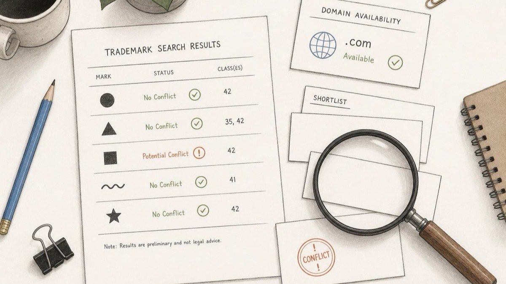
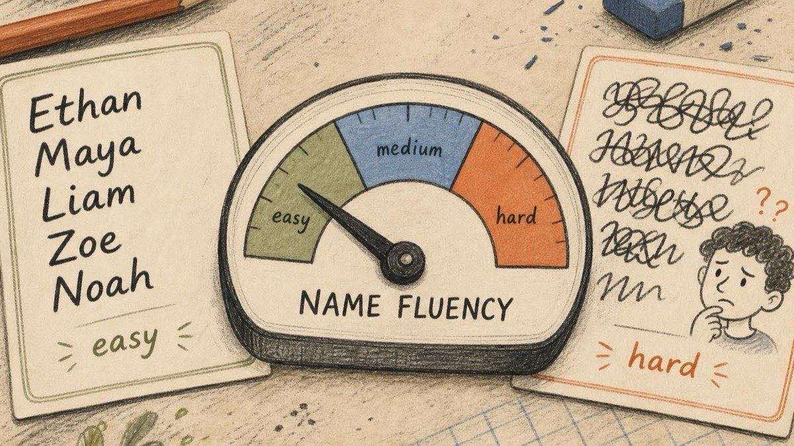
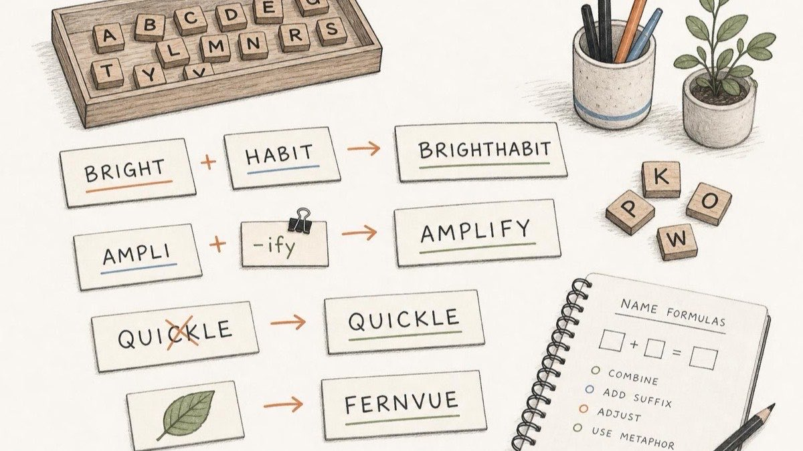
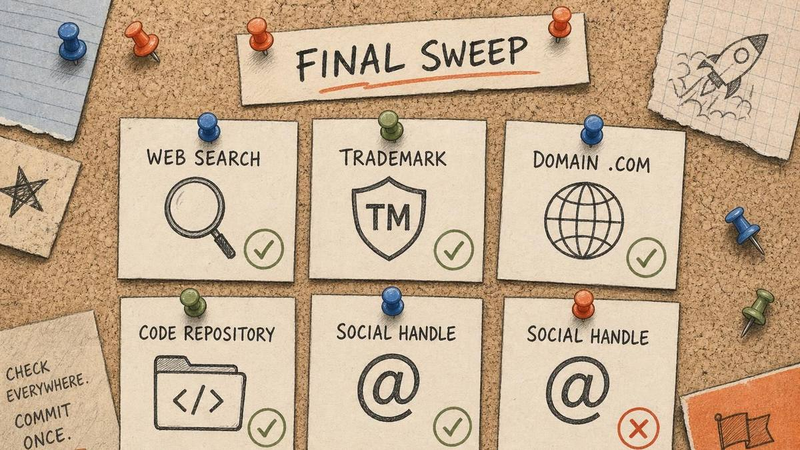

命名，是大多数创始人在最初就会犯错的第一个产品决策。

它看起来像是一个做一次就算了的支线任务，但现实是：名称是整个项目生命周期中唯一无处不在的资产——域名、Logo、应用图标、GitHub 组织、每一张发票、每一次在聚会上被问到"你在做什么？"、每一次有人在听过一次之后凭记忆尝试拼写它。你会说它、写它数以万计次。一个好名字会带来复利效应；一个坏名字则会在每一个这样的时刻悄悄征税。

本指南是一本选名实战手册。它将研究成果中关于人类如何处理名称的真实结论，与你在真正拥有一个名称之前必须通过的法律和技术核查融为一体——并以唯一能凌驾于所有规则之上的那条规则作为收尾。

## 一个名字有两项使命

剥去浪漫色彩，一个名字必须恰好做到两件事：

1. **可拥有** — 法律上可防御、技术上可获取，这样它才能真正成为*你的*。
2. **易于营销** — 易于说、易于拼写、易于记住、易于传播，让名字为你做营销，让他人无需费力就能传递它。

大多数命名建议只优化了第二点。那些跳过第一点的创始人推出了漂亮的名字，在其上构建了品牌，然后收到律师函，或者发现 `.com` 被某人持有，对方开价五位数。先解决约束条件，核查成本远低于修复成本。

## 第一部分 — 清查名称（法律与技术约束）

### 在你的品类中保持唯一性

真正重要的法律测试并不是"这个名字在地球上某处是否已被使用"，而是**混淆可能性**：一个普通买家在你的品类中看到你的商标时，是否会合理地认为它来自其他人。美国审查员和法院会权衡一系列因素——最重要的是商标在声音、外观和含义上的相似度，以及商品或服务的关联程度——这些因素统称为 [DuPont 因素](https://www.uspto.gov/page/about-trademark-infringement)。两个相同的名字可以在不相关的品类中共存（Dove 香皂与 Dove 巧克力）；而*相似*的名字在*同一*品类中则是问题，即使它们并不完全相同。

因此，对任何候选名称需要问的问题是具体而明确的：**在我的赛道上，是否已有与此相近的名字在运营？**

### 做真正重要的搜索

在爱上一个名字之前，在这些地方花二十分钟：

- **普通网络搜索。** 如果首页已经被一家做相邻业务的公司占据，就停下来。你将永远与他们争夺关注度。
- **[商标](/zh-CN/glossary/trademark/)数据库。** 在 [USPTO 商标检索系统](https://www.uspto.gov/trademarks/search)搜索美国，在 [EUIPO 数据库](https://www.euipo.europa.eu/en/trade-marks/before-applying)搜索欧盟，在 [WIPO 全球品牌数据库](https://branddb.wipo.int/)进行国际扫描。你不是在做律师级别的清查——你是在免费捕捉那些显而易见的冲突。
- **域名。** `.com` 仍然是大多数项目可信度的基石。在 [Namefi](https://namefi.io) 上，你可以查看可用性，了解**一个 `.com` 被注册了多长时间**（自 2009 年以来持续持有的名字与上个月刚注册的名字传递着截然不同的信号），以及**该名字已跨越多少个[顶级域名](/zh-CN/glossary/tld/)**被注册。一个在 30 个扩展名上都被占用的名字属于竞争领域；一个几乎在所有地方都空闲的名字则是开放的路。将这种分布作为快速判断"这个词有多拥挤"的指标。
- **账号名。** 检查 [GitHub](https://github.com) 组织，以及 X、Reddit、LinkedIn 和你的用户实际所在的平台。在全网保持一致的账号名（"账号统一性"）对早期项目来说价值出乎意料地高——而且遵循先到先得原则。

如果一个候选名称通过了品类、商标扫描、可用域名和账号这几关，它就赢得了从工艺层面接受评判的资格。

## 第二部分 — 让它易于说出口（研究数据显示了什么）

这里的科学研究异常清晰，且所有结论都指向同一方向：**大脑奖励轻松感。**

心理学家称之为[**处理流畅性**](https://people.uncw.edu/tothj/Extra-Credit-Papers/Oppenheimer-The%20Secret%20Life%20of%20Fluency-TICS-2008.pdf)——我们会无意识地偏好那些易于感知和发音的事物，并将这种好感转移到事物本身。这种效应强到足以影响金钱流向。在《美国国家科学院院刊》发表的一项研究中，Adam Alter 和 Daniel Oppenheimer 发现，[名称和股票代码更易发音的新上市公司在上市初期的表现优于发音更难的公司](https://www.ncbi.nlm.nih.gov/pmc/articles/PMC1482615/)——比如"BAL"这样的代码仅仅因为比"BDL"更流畅就胜过了后者。

不仅仅是股票。在["名字发音效应"](https://ppw.kuleuven.be/okp/_pdf/Laham2012TNPEW.pdf)（Laham、Koval & Alter，2012）中，发音更容易的名字获得了更正面的评价——在真实世界数据中，发音容易的名字更受政治选举青睐，在律所层级中晋升更快。发音的流畅性会悄悄地将判断推向你的有利方向。

*声音本身*也携带含义。在["声音创意"](https://pages.stern.nyu.edu/~gmenon/A%20Sound%20Idea.pdf)（Yorkston & Menon，2004）中，消费者认为使用柔和圆润元音命名的虚构冰淇淋品牌（"Frosh"）比同一产品的另一个名字（"Frish"）更顺滑绵密。我们在思考之前就会自动从语音中推断属性。尖锐的高元音（*i*）传递小、快、轻的感觉；宽广圆润的元音（*o、a*）传递大、顺滑、厚重的感觉。选择与你想要的感觉相匹配的声音。

甚至说出一个名字时的*口腔动作*也会产生影响。在七项实验中，Topolinski 及其同事发现，人们更喜欢辅音从口腔前部向后部移动的名字（一种向内"吞咽"的动作），而非从后到前的名字——这将好感度和支付意愿提升了[大约 4–13%](https://pmc.ncbi.nlm.nih.gov/articles/PMC4429570/)。你不会刻意去设计这一点，但当两个最终候选感觉同样好时，把每个都慢慢说出来，注意哪个你的嘴更喜欢。

所有这些研究的实践转化是一份简短的清单。一个强大的名字应该：

- **易于理解** — 它暗示了你在做什么，或者承载着符合该品类的文化内涵。
- **易于记住** — 足够独特，以便在一次接触后就能留下印象。
- **易于拼写** — 听到的人无需问"怎么拼"就能写出来。
- **易于发音** — 不犹豫，不在团队内部引发两派争论。
- **简短** — 简短的名字在以上每一点上都更轻松。简洁是前提条件，而不是一条独立的规则。

### 今天就能做的三项测试

- **广播测试。** 大声说出这个名字一次，就像通过嘈杂的电话线一样。听者不需要看拼写就能听懂吗？
- **星巴克测试。** 想象在嘈杂咖啡馆中把名字告诉一位忙碌的咖啡师。他们第一次就能写对吗？
- **走廊测试。** 把名字写在纸上，给五个人看三秒钟，然后收起来。一分钟后问：那是什么，你觉得它是做什么的？如果他们无法复述，这个名字还不够有粘性。

## 第三部分 — 生成强候选名称

命名不是等待灵感降临，而是一个有已知公式的生成过程。用以下方法广泛头脑风暴，然后再用第一和第二部分的标准筛选：

- **复合词** — 融合两个真实词：*Face + book*、*Micro + soft*、*Snow + flake*。
- **前缀与后缀** — 附加 `-ly`、`-ify`、`-io`、`-ai`、`-hq`：*Spotify*、*Shopify*、*Calendly*。
- **创意拼写** — 改变一个熟悉词的拼写以使域名可注册：*Flickr*、*Tumblr*、*Lyft*，以及 *Google* 本身（来自"googol"）。
- **隐喻** — 借用一个你想要的特质所属的具体事物：*Apple*、*Amazon*、*Nike*、*Stripe*。
- **创始人与致敬名** — 你自己的名字，或对某个对项目有意义的人物、地点或神话的致敬。在某些领域（法律、金融、时尚），惯例承载着可信度。
- **AI 生成器** — Namelix 和 Looka 等工具非常适合打破空白页僵局；将它们的输出视为原矿，而非成品。

持续生成直到你有 15–20 个不反感的候选。头脑风暴的目标是数量；判断在之后进行。

## 第四部分 — 优先选择你能在脑海中"看见"的名字

这里有一个被低估的决胜因素：**这个名字是否能唤起一个具体的形象？**

具体名词比抽象词更容易记住——这是记忆研究中重复最多的发现之一——而且它们从第一天起就给你的设计师一个 Logo 方向。*Apple* 有一个苹果。*Amazon* 有一条河（方便的是，还有一个箭头）。*Shopify* 有一个购物袋。*Twitter* 有一只小鸟。可以唤起形象的名字给了名字进入记忆的第二个通道（即使词语一时想不起来，你也能通过图片回忆），以及现成的视觉识别系统。

这正是第二部分的声音象征性与本节的形象感相遇之处：一个*听起来*像其所代表的事物，又*看起来*像某个东西的名字，在同时发挥双重作用。如果两个最终候选势均力敌，选那个你能画出来的。

## 第五部分 — 进行跨文化测试（文化与负面联想）

如果你的项目有任何机会跨越国界——而在互联网上这几乎总是如此——你的名字需要在其他语言中也能成立。

方法很简单：**把每个最终候选大声念给说那些语言的母语者听，询问它是否有任何尴尬、粗鲁或不幸的含义。** 这就是本地化测试，它能发现英语耳朵永远听不到的问题。

不过，关于那个著名的警示故事要谨慎：最常被引用的那个是假的。关于雪佛兰 **Nova** 在拉丁美洲销售失败（因为 *"no va"* 意为"不能走"）的故事是一个[都市传说——*nova* 和 *no va* 的重音和发音不同，这款车实际上卖得很好](https://www.snopes.com/fact-check/chevrolet-nova-name-spanish/#:~:text=pronounced)。不要在神话上建立你的命名哲学。

*真实*的案例知名度较低，但更有启示性。三菱在讲西班牙语的市场以 [**Montero** 的名称销售其 Pajero SUV，因为"pajero"在西班牙语中是粗俗俚语](https://en.wikipedia.org/wiki/Mitsubishi_Pajero#:~:text=Montero)。教训依然成立：在发布前检查，而不是在盒子印好之后。与母语者进行两分钟的对话，是你能买到的最便宜的保险。

## 第六部分 — 发布前的全面检索

一旦你有了最终候选，在向 Logo 投入任何一分钱之前，按以下顺序进行一次综合排查：

1. **网络搜索** — 首页是否没有竞争对手？
2. **商标** — 在 [USPTO](https://www.uspto.gov/trademarks/search)、[EUIPO](https://www.euipo.europa.eu/en/trade-marks/before-applying) 和 [WIPO 全球品牌数据库](https://branddb.wipo.int/) 检索你的品类。
3. **域名** — `.com` 是否可用或可购买？在 [Namefi](https://namefi.io) 上，检查 **`.com` 注册年龄**和**已注册的顶级域名数量**，以衡量该名称的竞争程度。
4. **GitHub** — 组织/账号是否空闲？（对任何面向开发者的项目至关重要。）
5. **社交账号** — X、Reddit、LinkedIn、Instagram、YouTube——对你的受众重要的平台，最好全部匹配。
6. **应用商店**（如果你会发布应用）。

任何单一的红旗都不一定是致命的，但整体模式告诉你这个名字将承载多少阻力。一个在各处都通畅的名字是一份礼物；一个在六项中有五项存在冲突的名字则是一个警告。

## 凌驾于所有规则之上的那条规则

这里的每条规则都是可以打破的，而最好的名字往往确实打破了某一条。*Google* 是一个拼错的数学术语，不符合"易于拼写"的要求。*Häagen-Dazs* 是虚构的伪丹麦语，毫无实际意义。*Xerox* 以一个难以定位的 X 开头。它们之所以成功，是因为创始人相信它们，并凭意志力将它们变成了人们熟悉的名字。

所以最后这条规则凌驾于其他所有规则之上：**你，这位创始人，必须热爱它。** 你将在融资路演中捍卫这个名字，重复它一万次，在最艰难的日子里与它相伴。如果一个名字通过了约束核查、读起来顺畅、经受住了跨文化测试——*并且*让你在说出它时会微微振奋——那就是它。信念，是将一串字母变成品牌的力量。

做完该做的检查，然后信任那个你停不下来说的名字。

## Namefi 如何帮助你

命名和拥有，是同一个决策的两面。[Namefi](https://namefi.io) 专为"我真的能拥有这个名字吗？"这一面而生：检查 `.com` 和替代顶级域名的可用性，查看**一个名字已被注册多长时间**以及**它跨越了多少个扩展名**（你判断竞争程度还是开放程度的信号），探索品牌化域名，并在找到心仪的名字后——安全地持有、甚至将所有权[代币化](/zh-CN/glossary/tokenize/)，让你品牌背后的资产可被验证地属于你。选一个你热爱的名字；确保它是一个你能持有的名字。

## 参考资料与延伸阅读

以下所有链接均可公开访问（无需登录或付费墙）。对于学术论文，我们链接至开放获取的全文，而非收费期刊页面。

- USPTO — [关于商标侵权（混淆可能性与 DuPont 因素）](https://www.uspto.gov/page/about-trademark-infringement) · Nolo — [混淆可能性解释](https://www.nolo.com/legal-encyclopedia/likelihood-confusion-how-do-you-determine-trademark-infringing.html)
- 商标检索工具 — [USPTO](https://www.uspto.gov/trademarks/search) · [EUIPO](https://www.euipo.europa.eu/en/trade-marks/before-applying) · [WIPO 全球品牌数据库](https://branddb.wipo.int/) · [TMview（全球）](https://www.tmdn.org/tmview/)
- Alter, A. L., & Oppenheimer, D. M. (2006). [通过处理流畅性预测短期股价波动](https://www.ncbi.nlm.nih.gov/pmc/articles/PMC1482615/)（开放获取全文）. *PNAS*, 103(24).
- Oppenheimer, D. M. (2008). [流畅性的秘密生命](https://people.uncw.edu/tothj/Extra-Credit-Papers/Oppenheimer-The%20Secret%20Life%20of%20Fluency-TICS-2008.pdf)（PDF）. *Trends in Cognitive Sciences*, 12(6).
- Laham, S. M., Koval, P., & Alter, A. L. (2012). [名字发音效应：为什么人们更喜欢史密斯先生而非科霍恩先生](https://ppw.kuleuven.be/okp/_pdf/Laham2012TNPEW.pdf)（全文 PDF）. *Journal of Experimental Social Psychology*, 48(3). 通俗版 [NYU Stern 摘要](https://www.stern.nyu.edu/experience-stern/faculty-research/adam-alter-names-study).
- Yorkston, E., & Menon, G. (2004). [声音创意：品牌名称的语音效应对消费者判断的影响](https://pages.stern.nyu.edu/~gmenon/A%20Sound%20Idea.pdf)（全文 PDF）. *Journal of Consumer Research*, 31(1).
- Topolinski, S., Zürn, M., & Schneider, I. K. (2015). [品牌命名中的内外之道：品牌名称的发音效应](https://pmc.ncbi.nlm.nih.gov/articles/PMC4429570/)（开放获取）. *Frontiers in Psychology*, 6.
- Snopes — [雪佛兰 Nova 在讲西班牙语的国家真的卖不出去吗？](https://www.snopes.com/fact-check/chevrolet-nova-name-spanish/)（辟谣）
- Wikipedia — [三菱 Pajero / Montero 命名](https://en.wikipedia.org/wiki/Mitsubishi_Pajero)（一次真实的本地化改名）
