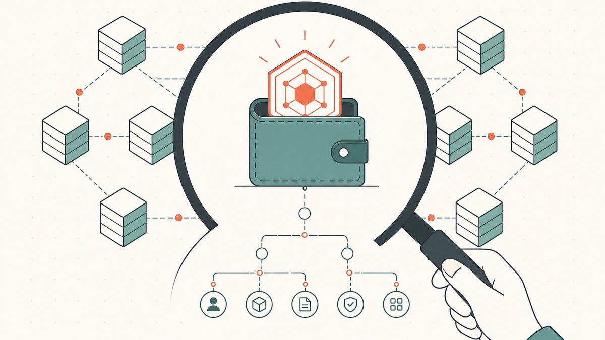
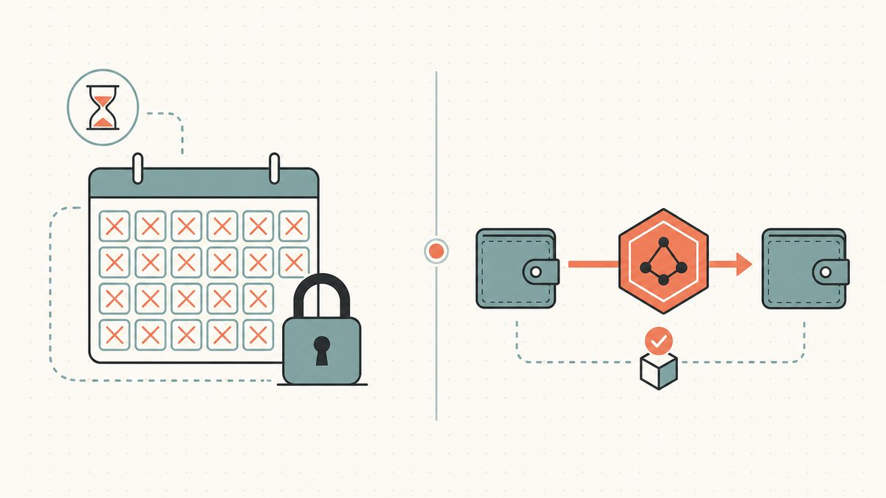
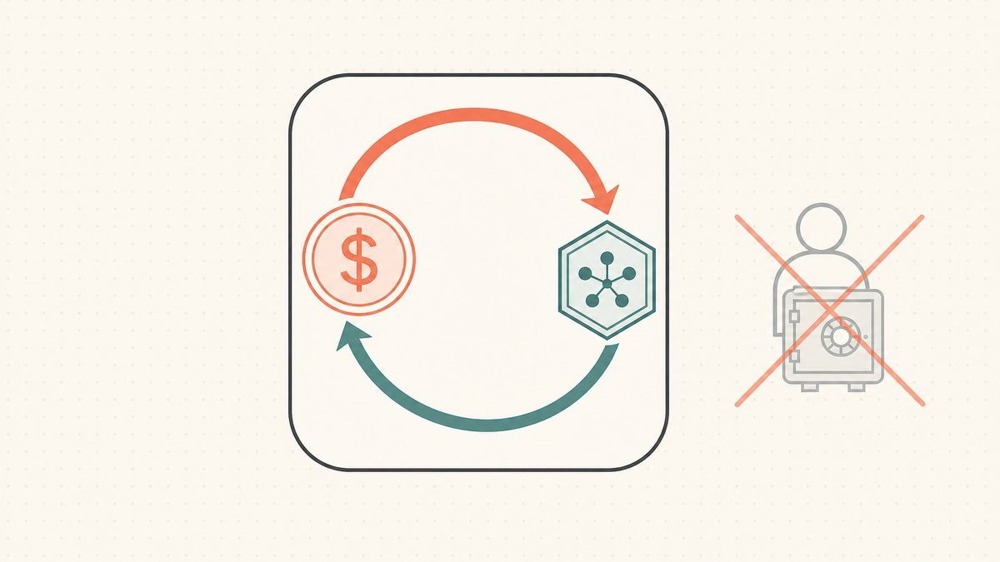

[域名翻转](/zh-CN/blog/domain-flipping/)的大部分工作其实跟域名本身无关。你要选品、估价、保护它，再找到买家——然后你撞上了没人喜欢的那一步：真正把资产转移过去并拿到钱，同时让双方都不吃亏。这个结算环节缓慢、手动，建立在陌生人之间的信任之上。代币化正是改写它的那股力量。

把域名搬上链不会让一个差名字变好，也不会让一个好名字变便宜。它改变的是交易的*机制*——你如何验证自己买的东西、如何持有它、它如何转移，以及钱如何清算。本文沿着一次翻转生命周期中代币化真正改变工作方式的四个节点展开：获取、保管、转移和转售。如果你对底层概念还不熟悉，先从[什么是代币化域名](/zh-CN/blog/what-are-tokenized-domains/)读起；如果你想要更深入的交易者攻略，本集群的支柱文章是[链上域名翻转](/zh-CN/blog/onchain-domain-flipping/)。

## 首先，这里的"链上"到底指什么

精确很重要，因为三种不同的东西常被混为一谈地叫作"区块链域名"，而它们并不是同一种资产。

像 `vitalik.eth` 这样的 [ENS（以太坊域名服务）](/zh-CN/glossary/ens/)名称，以及像 `brand.crypto` 这样的 [Unstoppable 风格](/zh-CN/blog/ens-vs-unstoppable-vs-tokenized-dns/)名称，完全活在链上，处于 [ICANN](/zh-CN/blog/what-are-tokenized-domains/) 根之外。没有解析器或桥接，它们在普通浏览器里无法解析。相比之下，**代币化域名**是一个真实的 ICANN 域名——一个在任何浏览器里都能用的 `.com`、`.xyz` 或 `.io`——它的所有权*同时*以一枚代币（通常是一枚 [NFT（非同质化代币）](/zh-CN/glossary/nft/)）的形式表示在你的[钱包](/zh-CN/glossary/wallet/)里。[DNS](/zh-CN/glossary/dns/) 记录与链上代币保持同步，因此名称照常解析，而所有权变成了钱包原生的。这些类别之间的区别在[代币化域名 vs Web3 域名](/zh-CN/blog/tokenized-domain-vs-web3-domain/)中有详细说明，而整篇文章都建立在这个区分之上：当我们说翻转发生了改变，我们指的是翻转那些恰好带有一层链上所有权的*真实*域名——而不是交易一个平行的命名空间。

支撑这一切的代币标准是 [ERC-721（NFT 标准）](/zh-CN/glossary/erc-721/)，这是以太坊的接口，按照最初的规范，它[允许在智能合约内实现 NFT 的标准 API](https://eips.ethereum.org/EIPS/eip-721#:~:text=allows%20for%20the%20implementation%20of%20a%20standard%20API%20for%20NFTs%20within%20smart%20contracts)。那个"标准 API"是整个故事里默默无闻的英雄：因为代币化域名说的是与任何其他 NFT 相同的接口，每一个已经能处理 NFT 的钱包、市场和[智能合约](/zh-CN/glossary/smart-contract/)都能处理你的域名，无需任何定制集成。

## 获取：买一个你真能验证的名字

在注册商二级市场里，验证你要买的东西是件苦差事。你只能信任一个市场上的挂单、一条可能被隐私保护遮挡的 WHOIS 记录，以及卖家口头承诺自己确实掌控这个名字并会交出它。直到几天后一笔[跨注册商转移](/zh-CN/blog/how-tokenized-marketplaces-replace-escrow/)清算完成，你才真正知道自己拥有了它。

在链上，所有权是公开的事实。域名的 NFT 存在于一个任何人都能读取的地址；发行它的[智能合约](/zh-CN/glossary/smart-contract/)是可审计的；转移历史就明明白白地摆在区块浏览器上。在你花一分钱之前，你就能确认究竟是哪个钱包持有这个名字、由哪个合约治理它，以及它是否被转移过或被包裹进任何异常的东西里。这对尽职调查是一次实打实的升级——这种来源核查在传统二级市场里，你根本无法自己完成。当你试图给一个尚未取得保管权的资产定价时，这一点最为重要，而链上来源记录是支撑一个站得住脚的价格数字的又一项输入。

诚实的告诫是：验证*代币*很容易，但你仍然必须验证*底层的名字*。一个代币化的 `.com` 的价值取决于它所映射的那个 DNS 域名，所以续费状态、[ICANN](/zh-CN/glossary/icann/) 政策风险敞口和商标风险，并不会因为产权凭证在链上就消失。代币化让所有权变得清晰可读；它并不能让一个名字在法律上变得可以翻转。

## 保管：自己持有资产

这就是后面一切都由此衍生的结构性转变。在传统模式下，你并不真正持有域名——你持有的是注册商的一个*账户*，由注册商替你持有域名。那就是[托管所有权](/zh-CN/glossary/custodial-ownership/)：如果账户被锁定、被暂停或丢失，无论你付了多少钱，名字也随之没了。

代币化域名待在你自己的钱包里。你持有私钥；你持有资产。这正是让加密资产可携带的那套自我保管模式，被应用到了一个名字上——而它是把双刃剑，这一点翻转者往往低估。自我保管移除了注册商这个单点故障，却把*你自己*变成了那个单点故障。丢了私钥，没有客服热线能帮你重置密码。

对于任何持有有意义价值的投资组合的人来说，这是把钱包安全当作一项核心翻转技能、而非事后补救的理由。[多重签名钱包](/zh-CN/glossary/multi-sig/)——移动一项资产需要不止一把私钥——是这里的标准工具，不过正如我们在[多签钱包真的能提升安全性吗](/zh-CN/blog/do-multisig-wallets-actually-improve-security/)中所讲，它是一种权衡，而非万能的护盾。而且因为自我保管意味着恢复要靠你自己，在灾难降临之前了解各种选项是不容商量的：关于一把私钥丢失后究竟还能做什么，参见[钱包丢失后如何找回代币化域名](/zh-CN/blog/recovering-a-tokenized-domain-after-wallet-loss/)。

## 转移：几分钟，而非一周

这正是与注册商世界对比最鲜明的地方，也是一次翻转中绝大部分摩擦真正存在的地方。

用旧办法在所有者之间转移域名，受制于内置了实打实等待期的转移政策。当你注册一个 gTLD 域名或把它转到新注册商时，ICANN 规则会把它锁住：在某些所有权变更发生后，注册商必须施加一个锁定，该锁定将[阻止在六十（60）天内向另一家注册商进行任何转移](https://support.dnsimple.com/articles/icann-60-day-lock-registrant-change/#:~:text=any%20transfer%20to%20another%20registrar%20for%20sixty%20%2860%29%20days)。即便是一次正常的注册商间转移，也要靠授权码、邮件确认和一个长达数日的清算窗口。这些都不是恶意的；它们的存在是为了对抗劫持。但它们是摩擦，而摩擦会扼杀那些依赖速度的翻转。

一次链上转移就是一笔交易。代币从一个钱包移动到另一个钱包，并在一个区块里确认；平台让 DNS 一侧的记录保持同步，所以名字从不停止解析。ENS 对它自己的名称也表达了同样的意思——用户可以与注册表交互来转移一个名字，[就像处理任何其他 ERC721 代币一样](https://docs.ens.domains/registry/eth#:~:text=just%20like%20with%20any%20other%20ERC721%20token)——而代币化的 ICANN 域名继承了完全相同的属性。对翻转者来说，"转移就是一笔交易"意味着一笔交易可以在达成一致的同一时段内成交，而不是买卖双方守着一笔注册商转移盯上一个星期。

## 转售：原子结算取代第三方担保

代币化在翻转上改变的最大一件事，是钱如何清算。

任何域名交易中典型的僵局都是信任先后问题：卖家在收到钱之前不愿转移，买家在拿到名字之前不愿付款。传统的解决办法是[第三方担保（Escrow）](/zh-CN/glossary/escrow/)——一个中立的第三方持有资金，等转移清算后再放款，并为弥合这道鸿沟收取一笔费用（通常是百分之几）。它管用，但它慢，而且每笔交易都要花钱。

在链上，这道鸿沟可以被机械地闭合。付款和资产转移通过一次[原子传输](/zh-CN/glossary/atomic-transfer/)在同一笔交易里发生：要么买家的资金*和*域名 NFT 都移动，要么什么都不移动。不存在任何一方暴露在风险中的窗口，所以也就没有什么需要第三方担保代理去弥合的了。我们在[代币化市场如何取代第三方担保](/zh-CN/blog/how-tokenized-marketplaces-replace-escrow/)中详述了完整机制，但对翻转者来说，要点很简单：你从每笔交易中移除了一项费用、一段延迟和一个交易对手方。

因为代币化域名是一枚标准 NFT，它也能在已经存在的基础设施上挂单。你可以在通用市场上[以 NFT 形式出售它](/zh-CN/blog/selling-domains-as-nfts/)——OpenSea 就是显而易见的例子，它成长为[最大的 NFT 市场之一](https://en.wikipedia.org/wiki/OpenSea#:~:text=one%20of%20the%20largest%20NFT%20marketplaces)——同时也能在域名原生的场所挂单。在挂单之前，这些场所之间的取舍值得研究；[链上域名市场对比](/zh-CN/blog/onchain-domain-marketplaces-compared/)就是做这件事的地方。实际的结果是更大的[流动性](/zh-CN/glossary/domain-trading/)面：一项资产，可在多处挂单，无需中间人即可结算。

## 可编程的所有权：没有传统对应物的那部分

上面的每一点在注册商世界都有一个对应物，代币化只是让它更快或更便宜。最后这一点没有。

因为域名是一项[智能合约](/zh-CN/glossary/smart-contract/)资产，所有权变得可编程。一个名字可以被用作贷款的抵押品、通过一场规则由代码强制执行的链上拍卖出售、在多个持有者之间[碎片化](/zh-CN/glossary/domain-trading/)，或按自动执行的条款出租。这些模式在传统二级市场里一个都不存在——在那里，域名只是注册商数据库里的一条记录，只能被买、被卖或指向某处。对于一个想超越简单的低买高卖交易的翻转者来说，可编程性打开了融资与结构化的选项，而这些选项过去只有那些请得起律师、付得起定制合约的人才能用得上。

这也是采纳曲线上最早期的那部分，所以把这些奇异的用例当作正在涌现而非成熟的来对待。可靠的、今天就能用的胜利是前四项：可验证的获取、自我保管、快速转移和无需第三方担保的结算。

## 哪些没有改变

值得直白地谈谈局限，因为代币化有时被过度吹捧。翻转中难的部分依然难。你仍然得选到值得买的名字、诚实地估价、避开商标陷阱，而最重要的是——找到买家。一个没人想要的代币化名字，跟一个没人想要的注册商持有的名字一样卖不出去；那笔轰动一时的 `Voice.com` 交易以[3000 万美元](https://www.sidn.nl/en/news-and-blogs/voice-com-sold-for-usd-30-million#:~:text=blockchain%20provider%20Block.one%20paid%2030%20million%20US%20dollars%20for%20the%20domain%20name%20voice.com)成交，关乎的是对这个名字的需求，而不是它在哪条轨道上结算。代币化不会制造需求。它移除的是那些需求本已支撑的交易中的摩擦。

如果你已经拥有一个 `.com`，并想亲身感受其中的差别，最干净的上手方式是把一个你掌控的名字代币化，并通过新轨道跑完一次出售——分步操作见[如何代币化你的 .com](/zh-CN/blog/how-to-tokenize-your-com/)，而在挑选去哪里做时，参见[如何选择域名代币化平台](/zh-CN/blog/choosing-a-domain-tokenization-platform/)。像 [Namefi](https://namefi.io) 这样的平台在全程让 DNS 层保持完全可用，所以名字作为域名照常运行，与此同时你获得了上面所述的链上机制。

## 友情免责声明（请读我！）

> 我们不是律师、会计师、理财顾问或医生，**本文中的任何内容都不构成法律、金融、税务、会计、医疗或任何其他类型的专业建议。** 我们写这些文章是为了教育自己，也是为方便我们的客户。这里的信息可能已经过时、因地区而异，或者干脆就是错的。我们也会犯错。

> 对于任何重要决定，**请咨询一位真正的专业人士（说真的！）**。或者如果那不是你的风格，那就问问朋友、问问 Twitter、问问 Reddit、问问 AI，或者问问算命先生。一句话：**DOYR——做你自己的研究（Do Your Own Research）**。让我们一起学习，享受乐趣。

## 来源与延伸阅读

- 以太坊改进提案 — [EIP-721：非同质化代币标准（NFT 的标准 API）](https://eips.ethereum.org/EIPS/eip-721#:~:text=allows%20for%20the%20implementation%20of%20a%20standard%20API%20for%20NFTs%20within%20smart%20contracts)
- ENS 文档 — [.eth 注册商（像任何其他 ERC721 代币一样转移名字；注册费用）](https://docs.ens.domains/registry/eth#:~:text=just%20like%20with%20any%20other%20ERC721%20token)
- DNSimple — [变更注册人后的 ICANN 60 天锁定（转移锁定政策）](https://support.dnsimple.com/articles/icann-60-day-lock-registrant-change/#:~:text=any%20transfer%20to%20another%20registrar%20for%20sixty%20%2860%29%20days)
- 维基百科 — [OpenSea（最大的 NFT 市场之一）](https://en.wikipedia.org/wiki/OpenSea#:~:text=one%20of%20the%20largest%20NFT%20marketplaces)
- SIDN — [Voice.com 以 3000 万美元售出（Block.one，2019）](https://www.sidn.nl/en/news-and-blogs/voice-com-sold-for-usd-30-million#:~:text=blockchain%20provider%20Block.one%20paid%2030%20million%20US%20dollars%20for%20the%20domain%20name%20voice.com)
