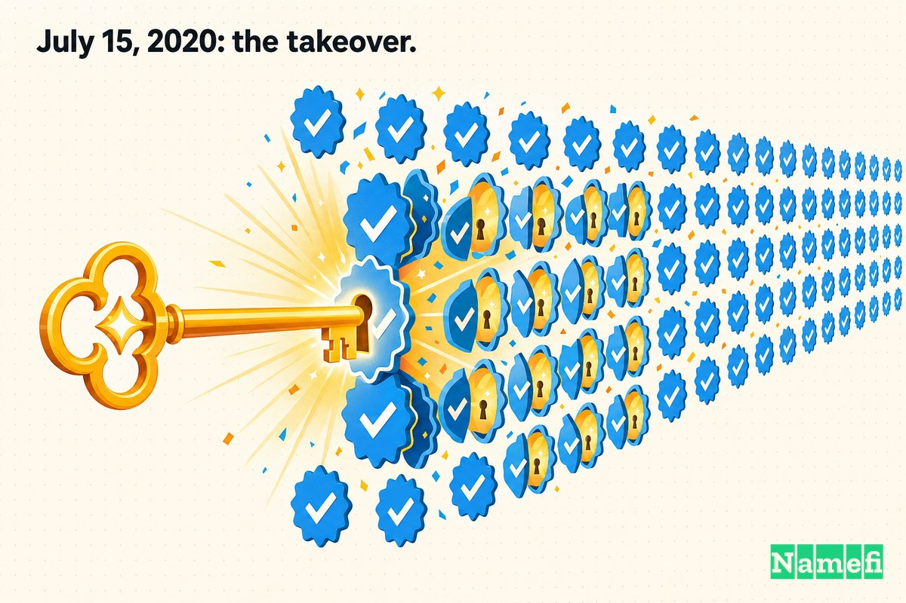
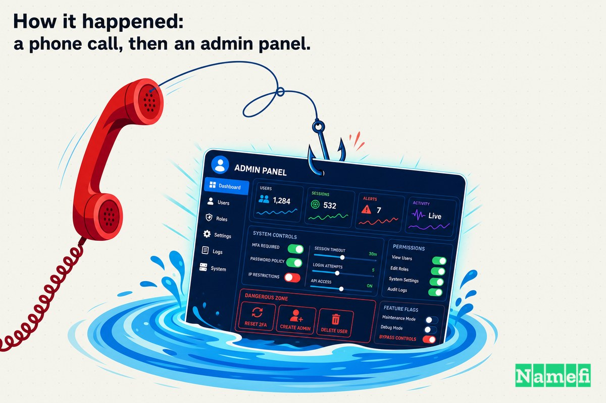
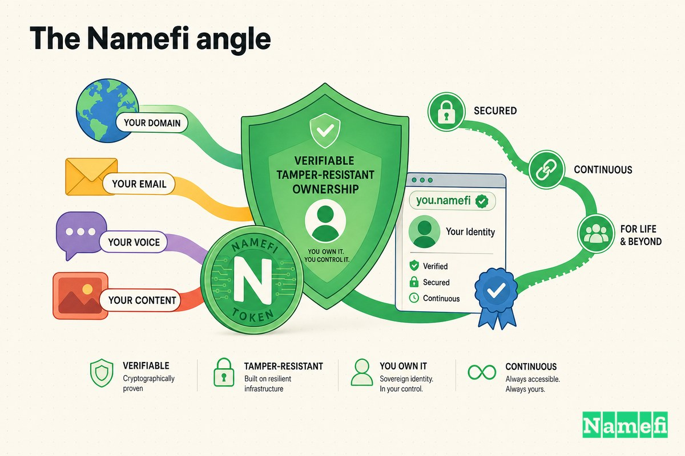

在某个星期三的下午，有几个小时里，互联网上最受信任的声音都开始说同一件事：把比特币发给我，我会双倍奉还。

巴拉克·奥巴马说了这话。乔·拜登说了这话。埃隆·马斯克说了这话。比尔·盖茨、杰夫·贝索斯、坎耶·韦斯特、苹果、Uber——那些拥有蓝色认证标志、经过身份验证、数亿人早已习惯信赖的账户——都发布了几乎一字不差的同一条低级加密货币骗局。这些人中没有一个人亲手敲下一个字。是他们的*账户*发的，因为掌控账户密钥的是另外一个人。

这是**域名紧急事件 EP03**。前两集讲的是名字——谁拥有它，谁能夺走它。这一集讲的是同一个问题换了一件外衣。一个Twitter用户名、一枚认证徽章、一个域名：每一个都是一种身份主张，而我们其余的人都默默信以为真。2020年7月15日，攻击者证明了夺取这种主张所需的代价是多么微小——不是靠恶意软件或零日漏洞，而是靠一通电话。

## 用户名中蕴含的信任

认证账户是一种信任捷径。当 `@BarackObama` 发推时，你不会重新验证那是否真的是他本人；用户名加上认证徽章*本身就是*验证。这种捷径价值极高——却也极为脆弱，因为所有的信任都积累在账户上，而对账户的控制权却可能完全处于另一个地方。

这与域名的结构如出一辙。`whitehouse.gov` 之所以受到信任，不是因为每位访客都会检查证书链，而是因为这个名字本身就承载着权威。控制这个名字——在[注册商](/zh-CN/glossary/registrar/)、在[DNS](/zh-CN/glossary/dns/)、在管理面板——你就立刻继承了人们倾注其中的所有信任，无论这个名字曾经是否属于你。

2020年Twitter黑客事件是我们所见过的最清晰的案例，展示了*信任*与*控制*之间的这道鸿沟。纽约金融监管机构对此进行了调查，因为受害者中包含受监管的加密货币公司。该机构直言不讳地指出：这次攻击是"[一个警示性案例，说明即便是不那么老练的网络罪犯也能造成极大的破坏](https://www.dfs.ny.gov/Twitter_Report#:~:text=The%20Twitter%20Hack%20is%20a%20cautionary%20tale%20about%20the%20extraordinary%20damage%20that%20can%20be%20caused%20even%20by%20unsophisticated%20cybercriminals)"。

## 2020年7月15日：劫持经过

事件发生得很快，而且是在光天化日之下。根据维基百科的重建记录，"[2020年7月15日，20:00至22:00 UTC之间，130个知名度极高的Twitter账户遭到入侵](https://en.wikipedia.org/wiki/2020_Twitter_account_hijacking#:~:text=On%20July%2015%2C%202020%2C%20between%2020%3A00%20and%2022%3A00%20UTC%2C%20130%20high%2Dprofile%20Twitter%20accounts%20were%20compromised)"。

纽约金融服务局（DFS）报告详细描述了事件的来龙去脉。攻击者首先拿加密货币账户热身："[黑客首先操控了与知名加密货币公司及个人相关的Twitter账户](https://www.dfs.ny.gov/Twitter_Report#:~:text=The%20Hackers%20first%20manipulated%20Twitter%20accounts%20connected%20to%20well%2Dknown%20cryptocurrency%20companies%20and%20individuals)"，在私信和推文中植入比特币[钱包](/zh-CN/glossary/wallet/)地址。随后他们升级了攻击："[黑客随后大幅提高了赌注，将目标锁定在拥有数百万粉丝的Twitter认证账户](https://www.dfs.ny.gov/Twitter_Report#:~:text=The%20Hackers%20then%20raised%20the%20stakes%20significantly%20and%20targeted%20verified%20Twitter%20accounts%20with%20millions%20of%20followers)"。

遭受攻击的账户名单，读起来就像平台上最受信任账户的宾客名录。维基百科指出，"[疑似遭入侵的账户包括巴拉克·奥巴马、乔·拜登、比尔·盖茨、杰夫·贝索斯等知名人士，以及苹果、Uber和Cash App等公司](https://en.wikipedia.org/wiki/2020_Twitter_account_hijacking#:~:text=well%2Dknown%20individuals%20such%20as%20Barack%20Obama%2C%20Joe%20Biden%2C%20Bill%20Gates%2C%20Jeff%20Bezos)"的账户。

诈骗信息内容一模一样，简单得令人瞠目结舌。来自苹果账户的消息，据维基百科记录如下："[我们正在回馈社区。我们支持比特币，也相信你也应该支持！所有发送到我们地址的比特币都将双倍返还！](https://en.wikipedia.org/wiki/2020_Twitter_account_hijacking#:~:text=We%20are%20giving%20back%20to%20our%20community.%20We%20support%20Bitcoin%20and%20believe%20you%20should%20too!%20All%20Bitcoin%20sent%20to%20our%20addresses%20will%20be%20sent%20back%20to%20you%2C%20doubled!)" 同样的话，同时通过全球数十个最具公信力的"嘴巴"反复传播。

并非所有被入侵的账户都被用于发推。在130个受波及的账户中，监管机构发现"[总体而言，Twitter黑客事件期间共有130个Twitter用户账户遭到入侵。其中，45个账户被用来发送推文](https://www.dfs.ny.gov/Twitter_Report#:~:text=Overall%2C%20130%20Twitter%20user%20accounts%20were%20compromised%20during%20the%20Twitter%20Hack.%20Of%20those%2C%2045%20accounts%20were%20used%20to%20send%20tweets)"。45个扩音器已然绰绰有余。

## 实际损失

从纯金额来看，这次的收获并不大。DFS报告指出，"[黑客通过Twitter黑客事件窃取了约11.8万美元的比特币](https://www.dfs.ny.gov/Twitter_Report#:~:text=The%20Hackers%20stole%20approximately%20%24118%2C000%20worth%20of%20bitcoin%20through%20the%20Twitter%20Hack)"。维基百科还指出，一个诈骗钱包"[在诈骗信息被删除之前共收到超过320笔存款，价值逾11万美元](https://en.wikipedia.org/wiki/2020_Twitter_account_hijacking#:~:text=received%20over%20320%20deposits%20with%20a%20value%20of%20over%20US%24110%2C000%20before%20the%20scam%20messages%20were%20removed)"。对于一次如此规模的安全漏洞而言，11.8万美元几乎算是小得令人尴尬。

但这个数字严重低估了真正的损失。那个下午真正倒塌的，是*认证用户名作为信任信号的公信力*。有两个小时里，蓝色认证标志什么都证明不了。平台整个身份体系——让你相信一条推文来自其署名者的那个机制——被证明可以同时被一个少年操控。Twitter的应对方式说明了一切：它临时冻结了许多认证账户的发推权限。阻止受信任账户撒谎的唯一办法，就是让它们沉默。

这才是身份劫持的真实代价。钱只是个注脚。损害在于"这个账户=这个人"不再成立，所有依赖这个等式的下游用户都因此暴露在风险之中。

## 事件经过：一通电话，然后是管理面板

事件中并没有利用任何漏洞。DFS报告明确指出："[Twitter黑客事件没有涉及网络攻击中常见的任何高技术或复杂手段——没有恶意软件、没有漏洞利用、也没有后门](https://www.dfs.ny.gov/Twitter_Report#:~:text=The%20Twitter%20Hack%20did%20not%20involve%20any%20of%20the%20high%2Dtech%20or%20sophisticated%20techniques%20often%20used%20in%20cyberattacks%20%E2%80%93%20no%20malware%2C%20no%20exploits%2C%20and%20no%20backdoors)"。取而代之的是："[黑客使用的是更接近传统诈骗犯的基本手段：打电话冒充Twitter信息技术部门的人员](https://www.dfs.ny.gov/Twitter_Report#:~:text=The%20Hackers%20used%20basic%20techniques%20more%20akin%20to%20those%20of%20a%20traditional%20scam%20artist%3A%20phone%20calls%20where%20they%20pretended%20to%20be%20from%20Twitter%E2%80%99s%20Information%20Technology%20department)"。

这就是**语音钓鱼（vishing）**——即语音版[网络钓鱼](/zh-CN/glossary/phishing/)。攻击者"[致电多名Twitter员工，声称自己是Twitter IT部门帮助台的工作人员](https://www.dfs.ny.gov/Twitter_Report#:~:text=called%20several%20Twitter%20employees%20and%20claimed%20to%20be%20calling%20from%20the%20Help%20Desk%20in%20Twitter%E2%80%99s%20IT%20department)"，并"[声称是在回应员工反映的Twitter虚拟私人网络问题](https://www.dfs.ny.gov/Twitter_Report#:~:text=claimed%20they%20were%20responding%20to%20a%20reported%20problem%20the%20employee%20was%20having%20with%20Twitter%E2%80%99s%20Virtual%20Private%20Network)"。Twitter自己后来将其描述为一次"[电话鱼叉式网络钓鱼攻击](https://krebsonsecurity.com/2020/07/three-charged-in-july-15-twitter-compromise/#:~:text=phone%20spear%20phishing%20attack)"，依赖的是"[对特定员工进行大规模、有组织的误导，并利用人性弱点](https://krebsonsecurity.com/2020/07/three-charged-in-july-15-twitter-compromise/#:~:text=a%20significant%20and%20concerted%20attempt%20to%20mislead%20certain%20employees%20and%20exploit%20human%20vulnerabilities)"。

让人信服的是情报收集，而非技术能力。正如安全记者布莱恩·克雷布斯所记录的，攻击者依靠人物资料数据——从LinkedIn和此前数据泄露事件中获取的姓名、职务和个人详情——来听起来像真正的同事。一旦某位员工相信了来电者，就会交出凭证，而凭证打开了通往"战利品"的大门：Twitter的内部账户管理工具。

那个工具才是整个故事的核心。克雷布斯报道称，"[在Twitter的管理员工具中，显然可以更新任意Twitter用户的电子邮件地址](https://krebsonsecurity.com/2020/07/whos-behind-wednesdays-epic-twitter-hack/#:~:text=within%20Twitter%E2%80%99s%20admin%20tools%2C%20apparently%20you%20can%20update%20the%20email%20address%20of%20any%20Twitter%20user)"——修改邮箱，触发密码重置，账户连同认证徽章就全部到手了。DFS报告指出了使一名员工被攻破就足以酿成灾难的结构性缺陷："[Twitter确实限制了内部工具的访问权限，但仍有超过1000名Twitter员工可以访问这些工具](https://www.dfs.ny.gov/Twitter_Report#:~:text=Twitter%20did%20limit%20access%20to%20the%20internal%20tools%2C%20but%20over%201%2C000%20Twitter%20employees%20still%20had%20access%20to%20them)"。超过一千人握有平台上每一个身份的万能钥匙，而公司连首席信息安全官都没有来把关——Twitter "[自2019年12月起就没有首席信息安全官（CISO），距Twitter黑客事件已过去七个月](https://www.dfs.ny.gov/Twitter_Report#:~:text=had%20not%20had%20a%20chief%20information%20security%20officer%20(%E2%80%9CCISO%E2%80%9D)%20since%20December%202019%2C%20seven%20months%20before%20the%20Twitter%20Hack)"。

这一切背后还隐藏着一个黑市。在名人诈骗骗局发出之前，这个团伙正忙着出售被盗的简短"OG"用户名。克雷布斯指出，在奥巴马/拜登/马斯克/盖茨的大规模攻击之前，"[几个极为抢手的短字符Twitter账户名已经易手](https://krebsonsecurity.com/2020/07/whos-behind-wednesdays-epic-twitter-hack/#:~:text=several%20highly%20desirable%20short%2Dcharacter%20Twitter%20account%20names%20changed%20hands)"，因为在那个圈子里，"[短字符用户名象征着地位和财富](https://krebsonsecurity.com/2020/07/twitter-hacking-for-profit-and-the-lols/#:~:text=short%2Dcharacter%20profile%20names%20confer%20a%20measure%20of%20status%20and%20wealth)"，并且"[转售时往往能卖出数千美元](https://krebsonsecurity.com/2020/07/twitter-hacking-for-profit-and-the-lols/#:~:text=can%20often%20fetch%20thousands%20of%20dollars%20when%20resold)"。稀缺名字，被盗后在论坛上倒手——这种模式，任何域名投资者都会立刻认出来。

## 事后追踪与逮捕

案件的瓦解速度几乎与黑客攻击本身一样快。两周内，检察官开始行动。克雷布斯报道了起诉内容："[英国博格诺里吉斯19岁的梅森·'Chaewon'·谢泼德在加利福尼亚州被以密谋实施电信欺诈、洗钱和未经授权访问计算机等罪名起诉](https://krebsonsecurity.com/2020/07/three-charged-in-july-15-twitter-compromise/#:~:text=Mason%20%E2%80%9CChaewon%E2%80%9D%20Sheppard%2C%20a%2019%2Dyear%2Dold%20from%20Bognor%20Regis%2C%20U.K.%2C%20also%20was%20charged%20in%20California%20with%20conspiracy%20to%20commit%20wire%20fraud%2C%20money%20laundering%20and%20unauthorized%20access%20to%20a%20computer)"，以及"[佛罗里达州奥兰多22岁的尼玛·'Rolex'·法泽利在北加州被以协助故意访问受保护计算机罪名提起刑事诉讼](https://krebsonsecurity.com/2020/07/three-charged-in-july-15-twitter-compromise/#:~:text=Nima%20%E2%80%9CRolex%E2%80%9D%20Fazeli%2C%20a%2022%2Dyear%2Dold%20from%20Orlando%2C%20Fla.%2C%20was%20charged%20in%20a%20criminal%20complaint%20in%20Northern%20California%20with%20aiding%20and%20abetting%20intentional%20access%20to%20a%20protected%20computer)"。

而所谓的主谋年纪更小。"[佛罗里达州坦帕的17岁少年格雷厄姆·克拉克也是7月15日Twitter黑客事件的被告之一](https://krebsonsecurity.com/2020/07/three-charged-in-july-15-twitter-compromise/#:~:text=17%2Dyear%2Dold%20Graham%20Clark%20of%20Tampa%2C%20Fla.%20was%20among%20those%20charged%20in%20the%20July%2015%20Twitter%20hack)"，由于是未成年人，他由佛罗里达州检察长而非联邦法院提起诉讼。他"[被控30项重罪，包括有组织欺诈和通讯欺诈](https://krebsonsecurity.com/2020/07/three-charged-in-july-15-twitter-compromise/#:~:text=was%20hit%20with%2030%20felony%20charges%2C%20including%20organized%20fraud%2C%20communications%20fraud)"。

次年三月，克拉克认罪。CyberScoop报道称，他"[承认策划了一场骗局，通过接管多位公众人物的Twitter账户盗取逾11.7万美元](https://cyberscoop.com/twitter-hack-guilty-plea-graham-ivan-clark/#:~:text=admitted%20to%20being%20behind%20a%20scheme%20that%20saw%20him%20steal%20more%20than%20%24117%2C000%20by%20taking%20over%20the%20Twitter%20accounts%20of%20numerous%20public%20figures)"。公共广播电台WUSF报道了判决结果："[在少年管教设施服刑三年，随后缓刑三年](https://www.wusf.org/courts-law/2021-03-16/tampa-twitter-hacker-sentenced-to-three-years-in-prison-three-years-probation#:~:text=three%20years%20in%20a%20juvenile%20facility%20to%20be%20followed%20by%20three%20years%20of%20probation)"，报道还指出这是"[该州青少年罪犯法允许的最高刑罚](https://www.wusf.org/courts-law/2021-03-16/tampa-twitter-hacker-sentenced-to-three-years-in-prison-three-years-probation#:~:text=the%20maximum%20allowed%20under%20the%20state%E2%80%99s%20youthful%20offender%20law)"。

此后还出现了第四名涉案人员。维基百科记载："[2023年4月，23岁的英国公民约瑟夫·詹姆斯·奥康纳，网络昵称PlugwalkJoe，从西班牙引渡至纽约接受起诉](https://en.wikipedia.org/wiki/2020_Twitter_account_hijacking#:~:text=In%20April%202023%2C%2023%2Dyear%2Dold%20Joseph%20James%20O%E2%80%99Connor%2C%20a%20British%20citizen%20with%20the%20online%20handle%20PlugwalkJoe%2C%20was%20extradited%20from%20Spain)"，后被判处联邦监狱五年徒刑。

## 这一事件对控制网络身份的启示

剥去名人光环和加密货币的外衣，2020年Twitter黑客事件是一堂关于*拥有*身份与*控制*身份之间差异的纯粹课程。从中可以提炼出几条原则：

1. **信任积累在名字上；控制权藏在后台办公室里。** 数亿人信任 `@BarackObama`。但所有这些信任都保护不了这个账户，因为账户的控制权暴露在一个超过一千名员工都能访问的内部管理面板上。无论谁的名字挂在前台，控制后台的人才是掌控身份的人。

2. **最薄弱的环节几乎从来不是密码学。** 没有漏洞、没有恶意软件、没有后门——只有一通令人信服的电话。身份系统在人性和流程层面失守的频率，远高于在数学层面出问题的频率。一把完美的锁，如果任何一名乐于助人的员工在被要求时就会打开，那就不算是锁。

3. **单点完全控制即单点完全故障。** 一个可复用的内部工具能修改*任意*账户的邮箱，意味着一名员工被攻破就等于全平台被攻陷。集中化、可逆转、不透明的控制权，才是真正的漏洞所在。

4. **稀缺的名字就是攻击目标。** 劫持总统账户的同一伙人，也悄悄地把短"OG"用户名卖了个好价钱。有价值的名字会吸引盗窃，而名字的价值正是让对其控制权的觊觎变得有利可图的原因。

5. **恢复不应依赖平台的善意。** 当受信任的账户开始说谎，Twitter唯一能做的就是冻结它们。身份所有者没有任何独立的方式来证明"这真的是我"或夺回控制权——他们完全依赖于一个中心化运营商的内部工具和善意。

## Namefi 的视角

域名是一种网络身份，与Twitter认证用户名所面临的信任与控制之间的鸿沟完全相同——而且通常拥有同样不透明的后台管理。对于大多数域名而言，"所有权"存在于一个注册商账户中，依靠密码和客服团队来守护。一通令人信服的电话、一次被社会工程学攻破的客服代表、一次通过内部面板推送的邮箱修改——2020年Twitter事件的剧本几乎可以一一对应注册商账户劫持。世界对你的域名倾注的信任，并不能保护它，如果对该域名的控制权就藏在一个可以被人说服接受任何请求的客服台后面。

[Namefi](https://namefi.io) 的存在正是为了弥合这一差距。其核心理念是：域名的控制权应该是*可验证且归所有者持有的*，而不是存在于别人管理工具中的一个设置项。通过将[域名所有权](/zh-CN/glossary/domain-ownership/)表示为一种代币化的链上资产，同时保持与DNS的兼容性，Namefi让"谁控制这个名字？"这个问题能够通过密码学来回答，而不是由承压下的客服代理来判断。没有任何一个内部面板能让一千名员工默默地重新分配你的名字；控制权的证明存在于所有者手中，转让是可审计的而非随意进行的。

2020年Twitter黑客事件之所以得逞，是因为身份与控制权已经悄然分离——名字显示的是一件事，而隐藏的管理工具却决定着另一件事。对于任何依赖一个名字的人来说，这一事件的教训是：让控制权像名字所承载的信任一样清晰可见，并且牢牢掌握在所有者手中。用户名、认证徽章、域名：每一个都只有其背后的后台足够安全时才是安全的。Namefi 的赌注是：后台应该是一个你自己控制的可验证账本，而不是一条可以被别人骗着接听的电话热线。

## 来源与延伸阅读

- 纽约金融服务局 — [Twitter调查报告](https://www.dfs.ny.gov/Twitter_Report)
- 维基百科 — [2020年Twitter账户劫持事件](https://en.wikipedia.org/wiki/2020_Twitter_account_hijacking)
- Krebs on Security — [谁是周三史诗级Twitter黑客事件幕后黑手？](https://krebsonsecurity.com/2020/07/whos-behind-wednesdays-epic-twitter-hack/)
- Krebs on Security — [为盈利和娱乐而入侵Twitter](https://krebsonsecurity.com/2020/07/twitter-hacking-for-profit-and-the-lols/)
- Krebs on Security — [7月15日Twitter入侵事件三人被控](https://krebsonsecurity.com/2020/07/three-charged-in-july-15-twitter-compromise/)
- CyberScoop — [Twitter黑客认罪，被判3年](https://cyberscoop.com/twitter-hack-guilty-plea-graham-ivan-clark/)
- WUSF — [坦帕Twitter黑客被判处三年监禁、三年缓刑](https://www.wusf.org/courts-law/2021-03-16/tampa-twitter-hacker-sentenced-to-three-years-in-prison-three-years-probation)
- 美国司法部 — [三人因涉嫌参与Twitter黑客事件被起诉](https://www.justice.gov/usao-ndca/pr/three-individuals-charged-alleged-roles-twitter-hack)
- ABC新闻 — [17岁时因入侵Twitter认罪的佛罗里达男子被判3年](https://abcnews.go.com/Politics/florida-man-pleaded-guilty-hacking-twitter-17-year/story?id=76513232)
