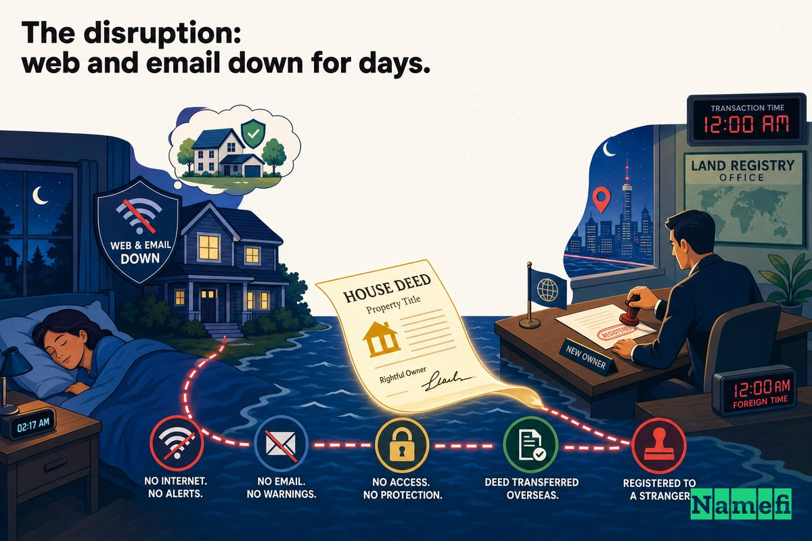
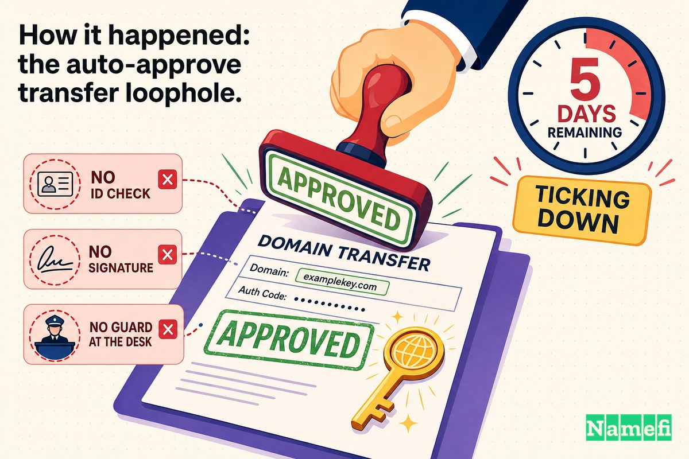

超过十五年来，美国最古老的商业互联网服务提供商之一只有一个地址：**panix.com**。然而，2005 年 1 月的一个漫长假日周末，有人把它偷走了。

不是通过入侵服务器，也不是猜到了密码。他们填写了一份转移申请表，用盗刷的信用卡付款，然后静待一条刚刚出台的 [ICANN](/zh-CN/glossary/icann/) 规则发挥作用。数小时之内，panix.com 的所有权被转移到一家澳大利亚公司，其 DNS 指向英国某服务商，电子邮件则被改道至加拿大——而真正运营 Panix 的人们，在毫无预警的情况下，就这样度过了周六夜晚。

这是一个故事：行政文书流程——而非技术漏洞——如何劫持了纽约最古老的 ISP，以及事后的补救工作又如何重新书写了管控域名转移的规则。

## 一家命运系于单一域名的先驱 ISP

Panix——公共访问网络公司（Public Access Networks Corporation）——绝非无名小卒。成立于 1989 年，据维基百科记载，它是[继 The World 和 NetCom 之后全球第三家最古老的 ISP](https://en.wikipedia.org/wiki/Panix_(ISP)#:~:text=third%2Doldest%20ISP%20in%20the%20world%20after%20The%20World%20and%20NetCom)。它是纽约市早期商业互联网的标志性存在：Shell 账户、电子邮件、网络托管，以及数以千计纽约市民赖以上网的拨号与宽带连接。

和当时乃至今日几乎所有互联网企业一样，Panix 的身份*就是*它的域名。客户的邮箱地址以 `@panix.com` 结尾，网络服务器响应 `www.panix.com`。整个公司——品牌、可达性、让客户邮件真正送达的那根纽带——全都悬挂在与这一个名字相绑定的 DNS 记录上。一旦失去对该名字的控制，失去的不是营销资产，而是企业的神经系统。

这正是发生的一切。

## 2005 年 1 月：这场欺诈性转移

法律记录对事发日期有精确描述。正如律师事务所 Davis Wright Tremaine 当时所总结的，[2005 年 1 月 14 日（星期五），一起引人注目的劫持事件发生了：属于纽约同名互联网服务提供商的域名"panix.com"在未经授权的情况下被转移给了第三方](https://www.dwt.com/insights/2005/01/guarding-against-domain-name-hijacking#:~:text=On%20Friday%2C%20Jan.%2014%2C%202005%2C%20a%20high%2Dprofile%20hijacking%20occurred)。

在那个周末的凌晨，后果已然显现。《The Register》在事件发展过程中的一篇报道，用一句话描述了这场重定向，读来至今像一幅劫案示意图：[panix.com 的所有权被移交给了澳大利亚一家公司，实际 DNS 记录被移交给了英国一家公司，panix.com 的邮件则被重定向至加拿大另一家公司](https://www.theregister.com/2005/01/17/panix_domain_hijack/#:~:text=The%20ownership%20of%20panix.com%20was%20moved%20to%20a%20company%20in%20Australia)。

Slashdot 于 1 月 16 日将这一消息传播至更广泛的技术社区，言辞直白：[纽约最古老的商业互联网服务提供商 Panix，其域名"panix.com"被不知名人士劫持](https://it.slashdot.org/story/05/01/16/0027213/new-yorks-oldest-isp-gets-domain-jacked)。

从 Panix 的角度来看，最令人痛心的细节是那份沉默。[这家成立于 1989 年、纽约最古老的商业 ISP 表示，它和其注册商均未收到任何有关拟议变更的通知](https://www.theregister.com/2005/01/17/panix_domain_hijack/#:~:text=neither%20it%20nor%20its%20registrar%20received%20any%20notification%20of%20the%20proposed%20changes)。对合法所有人而言，这次转移在完成之前完全是无声无息的。

## 破坏：网页和电子邮件中断数日

被劫持的域名并不会像开关一样干净利落地切断——它是一场缓慢而难看的衰退，而最严重的损害在于邮件。

当你控制了一个域名的 [DNS](/zh-CN/glossary/dns/)，就控制了其电子邮件的投递方向。通过将 panix.com 的邮件记录重新指向，劫持者将自己变成了一整家 ISP 客户群的"邮局"。入站邮件——账单、密码重置、商业往来、私人信件——不再送达 Panix，而是流向了攻击者控制的服务器。《InfoWorld》在事后报道中指出，此次劫持[使部分 Panix 客户两天内无法访问电子邮件](https://www.infoworld.com/article/2211412/australian-company-takes-blame-for-panix-domain-hijack.html)，其中一些客户在那个周末可能损失了一百封甚至更多邮件。

劫持期间被错误路由的邮件不仅仅是被延迟了，其中大部分已永久丢失——被退回、丢弃，或被一台本不该收到它们的服务器悄悄吞噬。对于一家客户以"我的邮件有没有收到"来衡量服务价值的提供商而言，数日的邮件错误投递几乎是最糟糕的故障情形。

而客户们无能为力。问题不在 Panix 的服务器上，那些服务器运行正常。问题在于域名系统的全球路由表——澳大利亚的一家[注册商](/zh-CN/glossary/registrar/)根据欺诈性请求告诉了全世界：panix.com 现在属于另一个人。

## 事件经过：自动批准转移的漏洞

正是这一点，使 Panix 事件成为具有里程碑意义的案例，而不仅仅是又一个糟糕的周末：没有人侵入系统。整个系统按照设计正常运作。设计本身就是漏洞。

这一机制贯穿了一条中间商链条。Panix 的域名注册在华盛顿州温哥华的注册商 **Dotster**。欺诈性转移通过英国转售商 **Fibranet Services Ltd.** 的账户发起，后者将申请提交给了澳大利亚大型注册商 **Melbourne IT**。正如《InfoWorld》所报道的，[Melbourne IT 有限公司的失误，使得使用盗刷信用卡的欺诈者得以控制 Panix.com](https://www.infoworld.com/article/2211412/australian-company-takes-blame-for-panix-domain-hijack.html)——用于转移的账户[是欺诈性的，以盗刷信用卡建立](https://www.infoworld.com/article/2211412/australian-company-takes-blame-for-panix-domain-hijack.html)。

但信用卡欺诈只是开通了账户，真正让域名转移成功的是一项政策。ICANN 推出了一项新的注册商间转移流程，该流程仅在数周前的 2004 年 11 月生效，其核心原则是*默认批准*。正如《The Register》所解释的，根据新框架，[这些于去年 11 月生效的规则意味着：注册商间转移申请在五天后自动批准，除非域名所有人提出反对](https://www.theregister.com/2005/01/19/panix_hijack_more/#:~:text=automatically%20approved%20after%20five%20days%20unless%20countermanded%20by%20the%20domain%20owner)。

请再读一遍，因为这就是整个故事的核心。沉默意味着*同意*。如果合法所有人什么都不做——比如因为根本没有收到通知——转移就会自动完成。Davis Wright Tremaine 从法律角度描述了同样的陷阱：新规则[可以说使欺诈性转移更容易实现，因为根据规则，除非所有人在五天内提出反对，否则域名将被自动转移](https://www.dwt.com/insights/2005/01/guarding-against-domain-name-hijacking#:~:text=automatically%20transferred%20unless%20the%20owner%20countermands%20the%20transfer%20request%20within%20five%20days)。

将各项失误叠加起来，画面令人触目惊心。*接收方*注册商（Melbourne IT，通过 Fibranet）接受了一个以盗刷信用卡为后盾的申请，并在事后承认[未能对申请进行适当核实](https://www.dwt.com/insights/2005/01/guarding-against-domain-name-hijacking#:~:text=failed%20to%20properly%20verify%20the%20request)。*转出方*注册商（Dotster）和合法所有人（Panix）没有收到有效通知，因此也从未提出反对。而政策的默认值——除非有人反对，否则批准——将这种无人反对的状态转变成了一次完成的盗窃。没有防火墙被突破，文书流程本身就是攻击手段。

## 恢复，以及由此引发的政策改革

恢复工作一旦有人介入，就进展神速——而这本身就是一种控诉，因为它证明这次转移根本就不应该被批准。

到了周日，[Panix 已从澳大利亚域名托管/注册公司 Melbourne IT 处取回了 Panix.com 域名，被盗域名此前停放在那里](https://www.theregister.com/2005/01/17/panix_domain_hijack/#:~:text=Panix%20had%20recovered%20its%20Panix.com%20domain)，并将其重新指向 Dotster 的正确归宿。[注册局](/zh-CN/glossary/registry/)层面的修复几乎是即时的，但全球范围内的清理并非如此，因为 DNS 不会按命令遗忘。正如《The Register》所记录的，[根服务器](/zh-CN/glossary/root-zone/)的更新很快完成，但 DNS 的分布式特性意味着需要长达 24 小时，世界各地缓存过期之后，所有用户才能看到真正的 panix.com。

Melbourne IT 值得称道的是，它没有回避。两天后《The Register》报道称，[一家澳大利亚域名注册商承认了其在上周末域名劫持事件中的责任](https://www.theregister.com/2005/01/19/panix_hijack_more/#:~:text=An%20Australian%20domain%20registrar%20has%20admitted%20to%20its%20part)，追溯了转移流程中未执行的核实步骤，并承诺漏洞已被堵上。

但更重要的影响是结构性的。Panix 成为随后围绕转移安全问题展开的更广泛反思中的教科书案例。ICANN 安全与稳定顾问委员会于 2005 年发布报告[《域名劫持：事件、威胁、风险与补救措施》](https://itp.cdn.icann.org/en/files/security-and-stability-advisory-committee-ssac-reports/hijacking-report-12-07-2005-en.pdf)，专门审视这类失败——注册商在未确认申请人是否确为[注册人](/zh-CN/glossary/registrant/)的情况下接受转移申请。强化系统的持久性修复措施，可以直接追溯到这类事件：

- **默认启用注册商锁定。** 设置了 `clientTransferProhibited` 状态的域名，在合法持有人解除锁定之前，根本无法被转移。曾经模糊的可选功能，对许多注册商而言成为了默认状态——一道自动批准规则无法绕过的刹车。
- **[授权码](/zh-CN/glossary/auth-code/)（EPP 转移码）。** 现代[通用顶级域名](/zh-CN/glossary/gtld/)（gTLD）转移要求提供一个秘密授权码，该码由*转出方*注册商仅向经核实的注册人释放，从而使接收方注册商无法仅凭文书将域名转走。
- **经过记录的 [ICANN 转移政策](https://www.icann.org/en/contracted-parties/accredited-registrars/resources/domain-name-transfers/policy)** 对确认义务提出了更严格要求，并建立了紧急联系渠道，用于快速撤销此类欺诈性转移。

Panix 劫持事件本身并未单独催生这些机制，但它成为所有人在论证这些机制必要性时所援引的案例。

## 这个事件关于转移锁定和身份验证的教训

剥去日期和注册商名称，Panix 留下了几条历久弥新的教训。

1. **默认允许是一种安全决策，而且通常是错误的决策。** 2005 年最危险的设计选择，是将*沉默视为同意*。一项在所有人无所作为时就能完成的转移，预设了所有人始终在监视、始终可联络。在假日周末，两者都不成立。
2. **身份验证必须由让渡资产的一方执行，而非接收方。** 接收方注册商想要这笔生意，有一切动机说"是"。真正的安全只有在*转出方*注册商需要向经核实的持有人释放授权码时才能实现——将验证置于资产真正所在的位置。
3. **开启锁定。** `clientTransferProhibited` 是域名所有人对抗此类攻击最廉价、最有效的保护，且分文不费。已锁定的域名，无论文书多么逼真，都无法被悄悄转移。锁定你的重要域名，并保持锁定状态。
4. **你的域名是你的单点故障。** Panix 的服务器从未受到攻击，然而这家公司实际上处于下线状态。当注册表中的一条记录可以重定向你全部的网页和邮件服务时，那条记录理应比你的服务器获得更多的保护。
5. **关注转移通知。** 五天的反对窗口，只能保护那些真正收到——并阅读了——转移通知的所有人。过时的注册人邮箱、无人监控的管理联系方式，或是一个假日周末，都会让安全阀悄然失效。

## Namefi 视角

Panix 劫持事件，其本质是一个*权威性*问题。"谁有权转移这个域名？"这一问题，是由一条转售商链条和一个默认批准计时器来回答的，而非任何强有力的、可验证的所有权证明。一张盗刷的信用卡加上五天的沉默，就足以让系统相信，另一半球的陌生人代表了纽约的一家 ISP。

[Namefi](https://namefi.io) 从相反的前提出发：对域名的控制应当是可证明的，而非假定的。通过将[域名所有权](/zh-CN/glossary/domain-ownership/)表示为与 DNS 兼容的代币化链上资产，"谁持有这个名字"的问题变得可以通过密码学手段验证和审计——这是一条无法被接受了错误文书的注册商悄悄覆写的记录。转移只有在持有人的密钥授权时才会发生，而不是在一个无人值守的五日计时器到期时完成。默认状态是*拒绝*，而同意必须经过证明，而非仅仅是未被反对。

1989 年 Panix 成立时，这一切还不存在——2005 年劫持发生时也没有。但它指向的，正是那个周末教给整个行业的教训：域名太重要，不能以沉默来管治。所有权应该是随时可以证明的东西——而不是某个陌生人仅仅因为你在漫长周末没有查看收件箱就能夺走的东西。

## 来源与延伸阅读

- The Register — [Panix 从域名劫持中恢复](https://www.theregister.com/2005/01/17/panix_domain_hijack/)
- The Register — [Panix.com 劫持事件：澳大利亚公司承担责任](https://www.theregister.com/2005/01/19/panix_hijack_more/)
- Davis Wright Tremaine — [防范域名劫持](https://www.dwt.com/insights/2005/01/guarding-against-domain-name-hijacking)
- InfoWorld — [澳大利亚公司为 Panix 域名劫持事件承担责任](https://www.infoworld.com/article/2211412/australian-company-takes-blame-for-panix-domain-hijack.html)
- Slashdot — [纽约最古老的 ISP 遭遇域名劫持](https://it.slashdot.org/story/05/01/16/0027213/new-yorks-oldest-isp-gets-domain-jacked)
- Wikipedia — [Panix (ISP)](https://en.wikipedia.org/wiki/Panix_(ISP))
- Wikipedia — [域名劫持](https://en.wikipedia.org/wiki/Domain_hijacking)
- ICANN SSAC — [域名劫持：事件、威胁、风险与补救措施（2005）](https://itp.cdn.icann.org/en/files/security-and-stability-advisory-committee-ssac-reports/hijacking-report-12-07-2005-en.pdf)
- ICANN — [转移政策](https://www.icann.org/en/contracted-parties/accredited-registrars/resources/domain-name-transfers/policy)
- NANOG 邮件列表存档 — [关于 panix.com 转移事件及 ICANN 补救措施的讨论](https://diswww.mit.edu/charon/nanog/77162)
