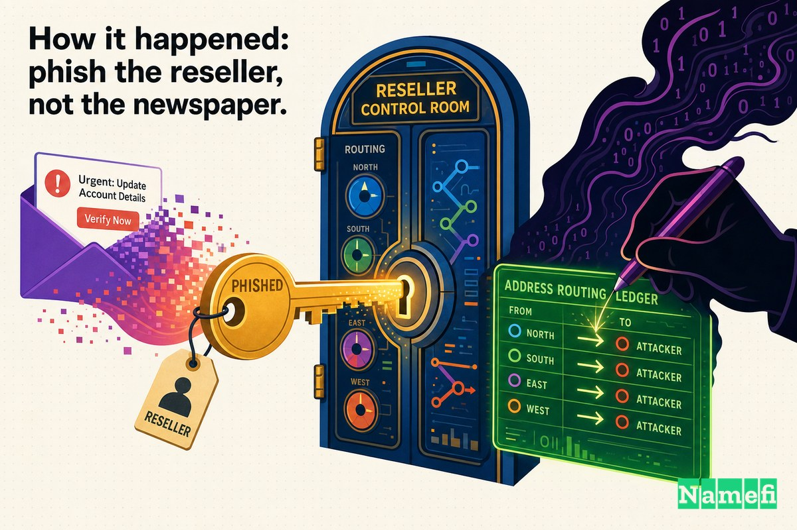

对于一家报纸来说，域名就是它的"前门"。当你输入 `nytimes.com` 时，你正在信任一条无形的链条——域名注册表、[注册商](/zh-CN/glossary/registrar/)，有时还有注册商旗下的[经销商](/zh-CN/glossary/reseller/)——将你引向真正的编辑部，而不是其他地方。在正常的日子里，你永远不会去想这条链条。但在2013年8月27日，它断裂了，数百万读者走到*《纽约时报》*的"前门"，却发现它已被换成了别人的。

那个"别人"就是**叙利亚电子军**（SEA）——一个亲阿萨德的黑客组织，2013年持续攻击西方各大媒体机构。这一次，他们没有篡改任何一篇文章，也没有入侵内容管理系统，而是深入了一个层次——进入决定域名指向何处的**DNS记录**——在数小时内，他们掌控了这个全球访问量最高的新闻网站之一的地址。

## 域名是前门，而这扇门的锁你并不掌控

当*《纽约时报》*这样的公司注册一个域名时，"谁拥有它、它指向哪里"的权威记录存储在注册表（对于 `.com` 而言，就是Verisign），并通过**注册商**进行管理。大型注册商还会通过**经销商**进行销售——这些规模较小的公司转售域名服务，并持有自己的注册商系统登录凭据。

这种分层架构很便捷，但也构成了一条信任链——最薄弱的环节决定整体的安全水平。如果攻击者能以该链条中*任何一方*的身份完成认证——[注册人](/zh-CN/glossary/registrant/)、注册商工作人员或经销商——注册商系统就会按设计将其视为合法所有者。墨尔本IT的首席执行官用一句令人警醒的话概括了这一故障模式：["他们是从前门进来的，"](https://www.theregister.com/2013/08/27/twitter_ny_times_in_domain_hijack/#:~:text=They%20came%20in%20through%20the%20front%20door)他对美联社如是说。只要拥有有效的用户名和密码，系统就会假定你是授权所有者。这就是问题的全部症结所在。

## 2013年8月27日：nytimes.com 指向了别处

周二下午晚些时候，读者们开始无法访问《时报》网站。ABC新闻报道称，[《纽约时报》网站"对部分用户无法访问"，](https://abcnews.com/Technology/york-times-website-suspects-malicious-hack/story?id=20087043#:~:text=gone%20dark%20for%20some%20users)该报随后确认，在其域名注册商遭受攻击后，[网站"周二下午无法供读者访问"。](https://abcnews.com/Technology/york-times-website-suspects-malicious-hack/story?id=20087043#:~:text=unavailable%20to%20readers%20on%20Tuesday%20afternoon)这并非短暂的故障。据《基督教科学箴言报》报道，[访客"周二在浏览器上看到空白页面长达数小时"，](https://www.csmonitor.com/USA/2013/0827/New-York-Times-hacked-Syrian-Electronic-Army-takes-credit#:~:text=greeted%20with%20blank%20browser%20screens%20for%20several%20hours)更糟糕的是，这[已是"本月第二次"](https://abcnews.com/Technology/york-times-website-suspects-malicious-hack/story?id=20087043#:~:text=second%20time%20this%20month)网站出现宕机。

事件的真相是：这是一次发生在注册商层面的**DNS劫持**。攻击者进入了将 `nytimes.com` 转换为IP地址的记录，并将其篡改。根据维基百科对该事件的描述，[`NYTimes.com` "的DNS被重定向到一个显示'Hacked by SEA'字样的页面"。](https://en.wikipedia.org/wiki/Syrian_Electronic_Army#:~:text=had%20its%20DNS%20redirected%20to%20a%20page%20that%20displayed%20the%20message)这扇"前门"已被挂到了另一个门口。

《时报》并非那个账户下的唯一目标。实时跟进报道的TechCrunch发现，["《纽约时报》和Twitter的域名服务器似乎均通过注册商墨尔本IT进行注册，"](https://techcrunch.com/2013/08/27/syrian-electronic-army-apparently-hacks-dns-records-of-twitter-new-york-times-through-registrar-melboune-it/#:~:text=name%20servers%20appear%20to%20have%20been%20registered%20through%20the%20registrar%20Melbourne%20IT)而[`twimg.com` 域名——"用于承载Twitter图片和头像"——也显示出指向疑似SEA所有服务器的变更。](https://techcrunch.com/2013/08/27/syrian-electronic-army-apparently-hacks-dns-records-of-twitter-new-york-times-through-registrar-melboune-it/#:~:text=which%20serves%20up%20Twitter%20images%20and%20avatars)Twitter主站基本完好，但其图片和头像域名出现了波动——一些用户短暂看到图片加载失败。

## 影响：数小时的"黑暗"，以及一个你无法信任的重定向

对于一家新闻机构而言，劫持事件的代价不仅仅是流量损失，更是信任的损耗。在宕机期间，所有访问 `nytimes.com` 的用户都被攻击者所掌控的路由引导。《时报》首席信息官马克·弗朗斯（Mark Frons）告知员工，此次中断["是叙利亚电子军或某个竭力伪装成他们的人发动的恶意外部攻击的结果"，](https://www.csmonitor.com/USA/2013/0827/New-York-Times-hacked-Syrian-Electronic-Army-takes-credit#:~:text=was%20the%20result%20of%20a%20malicious%20external%20attack)并警告员工在域名脱离报社掌控期间谨慎使用电子邮件。

请思考一下，被劫持的DNS记录究竟能带来什么危害。攻击者控制了域名解析的目标，这意味着他们可以展示一个篡改页面（正如他们所做的那样），但同样可以轻松搭建一个逼真的伪造登录页面、窃取凭据，或拦截流量。篡改页面是显而易见、喧嚣张扬的；而一次*悄无声息*的DNS劫持则危险得多——同一个漏洞可以两者兼而有之。《赫芬顿邮报》英国版的域名也牵涉其中，进一步印证了这是一次注册商账户泄露事件，而非针对某一家编辑部的一时恶作剧。

## 事件经过：钓鱼攻击经销商，而非报纸本身

以下这一点值得深思：SEA从未需要入侵*《纽约时报》*本身。他们从未触碰报社的服务器或内容管理系统。他们攻击的是注册商*下方*的链条。

入侵的切入点是一封发送给墨尔本IT一家美国经销商的**鱼叉式钓鱼邮件**。据The Next Web报道，[墨尔本IT"确认SEA使用钓鱼手段获取了登录凭据"——](http://thenextweb.com/news/this-is-how-the-syrian-electronic-army-hacked-the-new-york-times-and-twitter#:~:text=used%20phishing%20tactics%20to%20get%20hold%20of%20the%20log)经销商员工被骗交出了他们的电子邮件凭据，攻击者随后从这些邮箱中挖掘出注册商的登录信息。此后便一切顺理成章：["墨尔本IT一家经销商的凭据（用户名和密码）被用于访问墨尔本IT系统上的经销商账户，"](https://techcrunch.com/2013/08/27/syrian-electronic-army-apparently-hacks-dns-records-of-twitter-new-york-times-through-registrar-melboune-it/#:~:text=credentials%20of%20a%20Melbourne%20IT%20reseller)进入后，[攻击者"修改了多个域名的DNS记录……包括《时报》的域名。"](https://www.itnews.com.au/news/melbourne-it-compromise-redirects-ny-times-huffpo-readers-354935#:~:text=changed%20the%20DNS%20records%20of%20several%20domain%20names)

TechCrunch的描述同样直白：["该经销商账户下多个域名的DNS记录遭到更改——包括 `nytimes.com`。"](https://techcrunch.com/2013/08/27/syrian-electronic-army-apparently-hacks-dns-records-of-twitter-new-york-times-through-registrar-melboune-it/#:~:text=DNS%20records%20of%20several%20domain%20names%20on%20that%20reseller%20account%20were%20changed)

这种不对称性正是注册商链条攻击极具吸引力之处。《时报》可以将自身基础设施的防护做到极致，但这无济于事——因为存在漏洞的账户属于一家第三方经销商，与编辑部相距数个环节之遥。对一家小公司几名员工实施鱼叉式钓鱼攻击，便足以重定向一份拥有数百万读者的报纸。

## 事后响应与影响

一旦墨尔本IT弄清楚发生了什么，修复过程便相当直接——这也说明，*只要你掌控注册商*，这类攻击是可以逆转的。该公司恢复了正确设置：[将已更改的DNS记录还原，并将其"锁定"以防止进一步篡改。](https://www.itnews.com.au/news/melbourne-it-compromise-redirects-ny-times-huffpo-readers-354935#:~:text=reverted%20the%20altered%20DNS%20records)它更改了被入侵经销商账户的密码，并调取日志追溯入侵路径。《时报》在周三清晨恢复了服务。

但整个事件中最具启示意义的细节，在于*损害为何止步于此*。同一经销商账户下的一些域名根本未受影响——因为它们的所有者启用了更强的保护措施。墨尔本IT自己的表述是：[对于"关键任务域名，我们建议域名所有者充分利用各域名注册表（包括 .com）提供的额外注册表锁定功能——此次遭到攻击的经销商账户下，部分域名已启用这些锁定功能，因此未受影响。"](https://www.theregister.com/2013/08/27/twitter_ny_times_in_domain_hijack/#:~:text=For%20mission%20critical%20names%20we%20recommend%20that%20domain%20name%20owners%20take%20advantage%20of%20additional%20registry%20lock)

注册表锁定将域名置于一种特定状态（在[WHOIS](/zh-CN/glossary/whois/)中可以看到类似 `serverUpdateProhibited` 的标志），注册表将拒绝任何更改请求，除非遵循更为严格的带外流程。正如当时域名行业观察人士所指出的那样，Twitter的记录恰好携带了此类[Verisign锁定状态。](https://domainnamewire.com/2013/08/27/melbourneit-the-weak-link-as-twitter-and-ny-times-domain-names-compromised/#:~:text=serverUpdateProhibited)一个被钓鱼窃取的经销商密码，不足以突破注册表锁定——而这一项配置选择，正是"宕机数小时"与"从未受影响"之间的分水岭。

## 从注册商/经销商链条和注册表锁定中汲取的教训

2013年8月27日的劫持事件是一个近乎完美的教学案例，因为故障链条上的每一个环节都清晰可见。

1. **你的域名安全水平，取决于能够修改它的账户中最薄弱的那一个。** 这包括注册商的工作人员以及其旗下的任何经销商——这些都不在你的直接掌控之中。《时报》自身的服务器没有任何过失；漏洞出在距编辑部数个环节之外的地方。
2. **钓鱼攻击能绕过防火墙。** 没有使用任何高深的漏洞利用手段。一封发给少数经销商员工的伪造邮件，便获得了注册商系统视为完全授权的凭据。["他们是从前门进来的。"](https://www.theregister.com/2013/08/27/twitter_ny_times_in_domain_hijack/#:~:text=They%20came%20in%20through%20the%20front%20door)
3. **注册表锁定是真正发挥作用的那道防线。** 那些启用了[额外注册表锁定功能](https://www.theregister.com/2013/08/27/twitter_ny_times_in_domain_hijack/#:~:text=additional%20registry%20lock%20features)的域名"因此未受影响"。对于任何关键任务域名，注册表锁定（加上注册商锁定和注册商账户的双因素认证）不是可选的加固措施，而是基本配置。
4. **DNS变更威力强大、立竿见影。** 对域名服务器或A记录进行一次篡改，便能即时将整个品牌重定向。一个被入侵账户的爆炸半径，覆盖它能触达的所有域名。
5. **监控你自己的记录。** WHOIS和DNS监控能在数分钟内标记出未经授权的更改。越早发现异常的域名服务器变更，宕机的影响就越小。

## Namefi 的视角

SEA劫持事件，从本质上来说是一个**权威性**问题。注册商的系统无法区分真正的所有者和持有钓鱼密码的人，因此它按照设计接受了变更。所有奏效的防御手段——注册表锁定、带外确认、细致监控——实际上都是在提高*证明*变更请求确实来自所有者的门槛。

[Namefi](https://namefi.io) 正是从这一核心前提出发：域名的所有权和控制权应当是**可验证且防篡改的**，而不是一个在经销商收件箱中漂移的、可复用的密码。通过将[域名所有权](/zh-CN/glossary/domain-ownership/)表示为一种与DNS完全兼容的[链上](/zh-CN/glossary/on-chain/)、可密码学验证的资产，Namefi让"谁有权更改这个域名"成为一个有着可靠、可审计答案的问题，而非隐性地信任任何一个成功登录的人。控制权的变更成为显式的、签名的操作，与所有者绑定——更接近于一把你自己掌握钥匙的注册表锁，而非一扇任何持有正确密码的人都能打开的前门。

一家报纸的域名是它的前门。2013年8月27日的教训是：即便是最坚固的门锁，也抵挡不住数幢楼之外的陌生人被骗交出一把钥匙的复制品。解决之道，是让所有权本身变得可证明——让"从前门进来"永远不再是陌生人能够说出口的话。

## 参考来源与延伸阅读

- The Register — [New York Times, Twitter domain hijackers 'came in through front door'](https://www.theregister.com/2013/08/27/twitter_ny_times_in_domain_hijack/)
- TechCrunch — [Syrian Electronic Army Apparently Hacks DNS Records Of Twitter, NYT Through Registrar Melbourne IT](https://techcrunch.com/2013/08/27/syrian-electronic-army-apparently-hacks-dns-records-of-twitter-new-york-times-through-registrar-melboune-it/)
- ABC News — [New York Times Website Hacked, Syrian Electronic Army Appears to Take Credit](https://abcnews.com/Technology/york-times-website-suspects-malicious-hack/story?id=20087043)
- Christian Science Monitor — [New York Times hacked, Syrian Electronic Army takes credit](https://www.csmonitor.com/USA/2013/0827/New-York-Times-hacked-Syrian-Electronic-Army-takes-credit)
- iTnews — [Melbourne IT compromise redirects NY Times, HuffPo readers](https://www.itnews.com.au/news/melbourne-it-compromise-redirects-ny-times-huffpo-readers-354935)
- The Next Web — [Here's How the New York Times and Twitter Got Hacked](http://thenextweb.com/news/this-is-how-the-syrian-electronic-army-hacked-the-new-york-times-and-twitter)
- Domain Name Wire — [Melbourne IT the weak link as Twitter and NY Times domain names compromised](https://domainnamewire.com/2013/08/27/melbourneit-the-weak-link-as-twitter-and-ny-times-domain-names-compromised/)
- Wikipedia — [Syrian Electronic Army](https://en.wikipedia.org/wiki/Syrian_Electronic_Army)
- NBC News — [Syrian group hacks Twitter, New York Times](https://www.nbcnews.com/id/wbna52864470)
- Al Jazeera — [Syria hackers target New York Times website](https://www.aljazeera.com/news/2013/8/28/syria-hackers-target-new-york-times-website)
