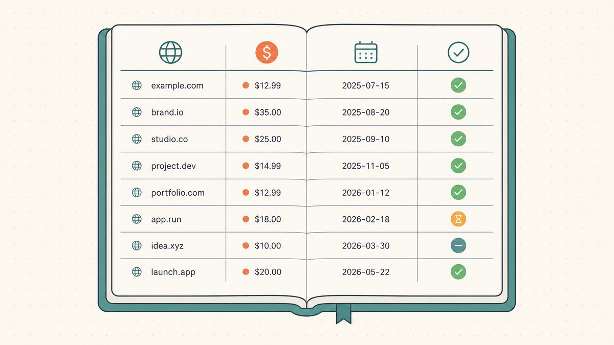
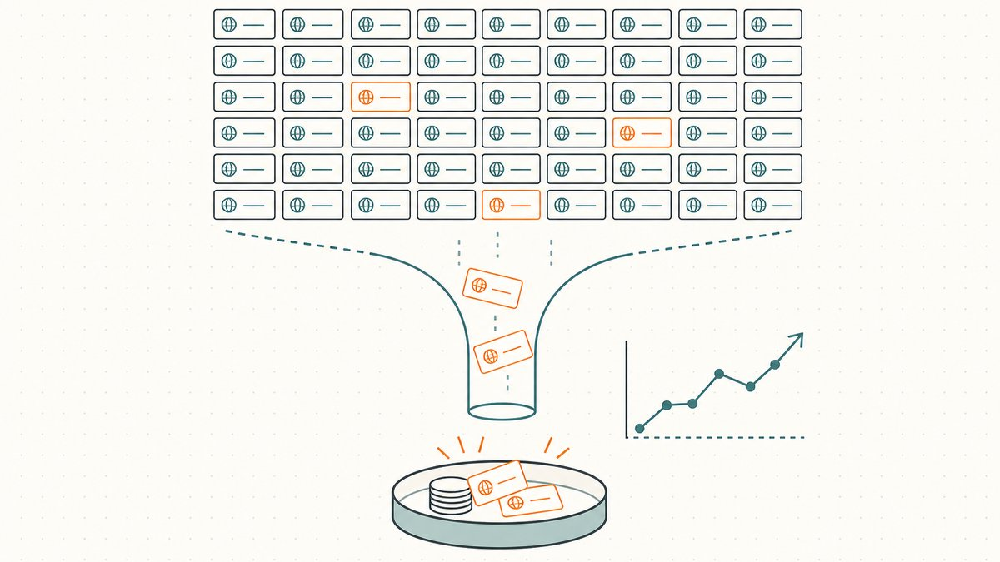
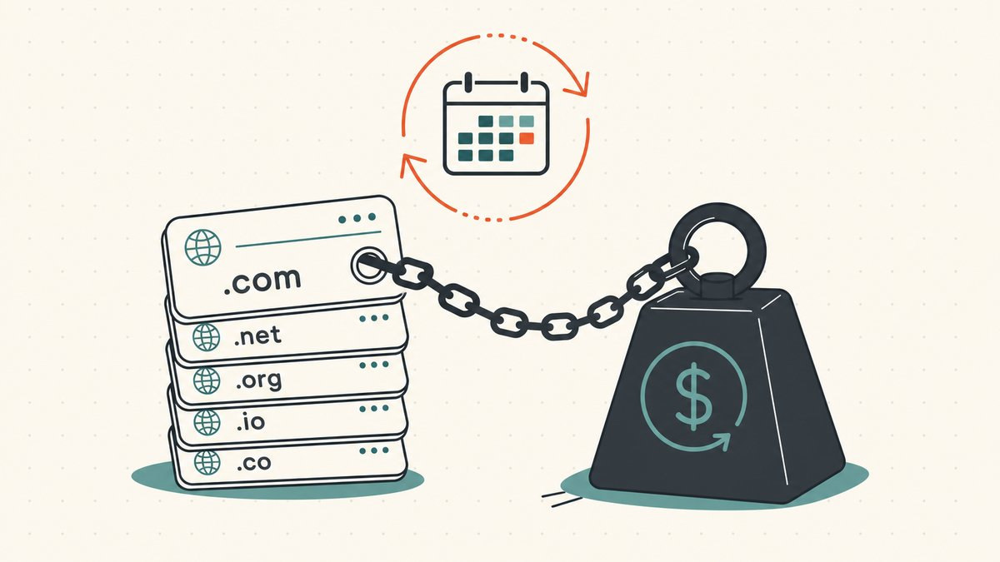

前十个域名感觉像一批收藏品。你还记得每一个买来的原因、付出的价格，以及大致期望卖出的数字。然而大约到了第一百个域名，这种记忆就开始失效。你再也无法在脑海中装下整个[域名投资组合](/zh/glossary/domain-portfolio/)，续期邮件一批批涌来却认不出是哪些名字，你开始为那些已经忘记自己买过的域名付续期费。到了这个时候，域名翻转就不再是一系列精明的买卖，而变成了库存管理。

本文正是关于这个转变的。靠直觉驱动的域名投资组合会悄无声息地亏钱；像企业一样经营的域名投资组合则清楚自己的数字并据此行动。我们将介绍区分这两者的四大核心纪律：追踪持仓、关注[售出率](/zh/glossary/sell-through-rate/)、控制续期拖累，以及在亏钱的域名蚕食利润之前主动清仓。这是我们关于[域名翻转](/zh/blog/domain-flipping/)系列指南的管理支柱。

## 为什么投资组合需要一套系统

先搞清楚投资组合的本质。你是[域名交易](/zh/glossary/domain-trading/)二级市场的库存持有者——维基百科将其定义为[互联网域名的二次转售市场，有意获取已注册域名的一方会在其中出价或协商价格](https://en.wikipedia.org/wiki/Domain_aftermarket#:~:text=is%20the%20secondary%20resale%20market%20for%20Internet%20domain%20names)。你持有的每一个域名都是一个带着持续成本的小赌注，整本账的算法只有在少数赢家能覆盖其余所有域名的持有成本时才成立。

这个结构对无序管理毫无容忍度。股票投资组合每秒都会自动重新定价；域名投资组合则静静沉默，直到续期账单到来或买家发来邮件——中间这段时间，你持有什么、花了多少、是否还值得续期，完全靠你自己掌握。翻转亏损最常见的方式并非一次糟糕的买入，而是数百个"还行"的域名在自动续期中年复一年地烧钱。系统，是把一堆域名名字重新变成一组可执行决策的唯一方式。

## 全面追踪：投资组合台账

优化之前，你必须先能看清。把域名作为业务经营的基础是一个单一的事实来源——起步阶段用电子表格就够了——每行一个域名，配上后续做决策所需的字段。最低限度应追踪：

- **域名及其[注册商](/zh/glossary/registrar/)。** 哪个账户持有这个域名，在你需要转移或出售时至关重要。
- **购入日期和成本基准。** 你实际支付的金额，无论是手工注册费还是[二级市场](/zh/glossary/aftermarket/)购入价。这是衡量最终利润的基准数字，也是会计师会要求的数字。
- **续期日期和年度续期费用。** 周期性账单。这一列能防止意外扣费，也是整个预算的基础。
- **要价及已收到的报价。** 你的挂牌价，以及真实需求信号——有没有人真正出过价。
- **状态。** 挂牌中、停放中、谈判中，或标记为放弃。状态能把台账变成一张待办清单。

成本基准和续期这两列不只是日常运营卫生；它们是业务税务处理的原始素材——持有期限和成本基准决定了域名最终售出时你需要缴纳多少税。我们在[域名投资者的税务与会计](/zh/blog/taxes-and-accounting-for-domain-investors/)中有更深入的介绍。注册商这一列也很有价值：当买家想查看一个域名时，[WHOIS](/zh/glossary/whois/) 记录、联系邮箱和 [DNS](/zh/glossary/dns/) 都处于最新状态的投资组合，看起来像一笔资产；联系方式失效、域名服务器异常的，看起来像一个风险，而风险卖不出好价钱。

## 售出率：唯一能说实话的数字

如果只追踪一个绩效指标，那就追踪**售出率**——一年内投资组合中实际售出的比例。其余一切（域名有多聪明、定价有多高）都是主观评判。售出率是告诉你这个投资组合是一门生意还是一个附带订阅费的爱好的那个数字。

算法很简单。如果你持有 500 个域名，今年卖出了 10 个，那么你的售出率就是 2%。好不好完全取决于售价：10 笔成交，平均价格远超 500 个域名全部续期费用的总和，说明这是健康的运营；10 笔低价出售，几乎无法覆盖持有成本，则是缓慢流血。需要诚实面对的是：业内流传的那些数字只是经验法则，并非实测统计——手工注册投资组合的年售出率普遍被讨论在低个位数百分比，但你看到的任何具体数字（包括这个）都只是估算，不是事实，建议自行统计。你从自己台账中算出的真实售出率，比任何行业基准都更有价值。

两个改进让这个指标真正可操作。第一，关注趋势，不只是绝对值：年复一年下滑的售出率，在告诉你选品或定价出了问题，不管绝对数字是多少。第二，分段来看。`.com` 域名的售出率和一批投机性新 gTLD 域名会天差地别，混合统计只会掩盖信号。当你能看到投资组合的哪个细分板块真正在动，你就知道下一笔收购预算该放在哪里——以及哪里该停手。计算和改善这个数字的详细方法，请参阅[域名续期成本与售出率](/zh/blog/domain-renewal-costs-and-sell-through-rate/)。

## 续期拖累：对你产生复利效应的成本

售出率是这门生意的分子，续期拖累是分母，也是大多数新玩家最容易低估的成本，因为它是一次一小笔地到来的。域名不是买来的；是租来的。你按期限注册，必须持续付费才能保住它，而且即便是最长的承诺也有上限——根据维基百科，[gTLD 域名的最长注册期限为 10 年](https://en.wikipedia.org/wiki/Domain_name_registrar#:~:text=The%20maximum%20period%20of%20registration%20for%20a%20gTLD%20domain%20name%20is%2010%20years)。一些注册商宣传的更长期限，并不意味着你拥有更长的产权；维基百科指出，100 年套餐[由注册商每 10 年代替客户自行续期](https://en.wikipedia.org/wiki/Domain_name_registrar#:~:text=involve%20the%20registrar%20renewing%20the%20registration%20for%20their%20customer%20every%2010%20years)。账单永远不会消失，你只是提前预付了。

单个域名的成本看起来微不足道。维基百科显示，一个简单 [`.com`](/zh/tld/com/) 的[零售续期价格通常在每年约 9.70 美元至 35 美元之间](https://en.wikipedia.org/wiki/Domain_name_registrar#:~:text=the%20retail%20cost%20generally%20ranges%20from%20a%20low%20of%20about%20%249.70%20per%20year)。单个域名这是一笔可以忽略不计的小钱。但乘以几百个，再加上溢价后缀——一个 [`.io`](/zh/tld/io/) 或 [`.ai`](/zh/tld/ai/) 的域名投资组合，续期成本是普通 `.com` 的好几倍——年度总续期费用就会成为你这门生意中最大的一笔数字。一些[注册局](/zh/glossary/registry/)分级的"溢价"域名续期费用每年高达数百美元，能悄然把一个你当资产买来的域名，变成你每年付钱托管的负担。

管理续期拖累的纪律在于把它当作预算，而不是一系列惊喜。把年度续期总账单作为一个整体来了解。错开续期日期，避免全部集中在某个月集中爆发。对每个域名问这个真正重要的问题：预期售价在考虑变现可能性有多低、等待时间有多长之后，是否还能覆盖等待期间累积的续期费用？当诚实的答案是否定的，你持有的不是投资，而是在资助一个习惯。

## 清仓：决定放弃哪些域名

清仓是大多数投资组合失败的环节，因为放弃一个域名感觉像是承认错误，而且已经付出的续期费用让这件事更难开口。换个视角来看。你已经付出的续期费用，无论你保留还是放弃这个域名，都已经花出去了；唯一的问题是*下一次*续期是否值得付。一个卖不掉的域名，靠续期保住它并不是在保护资产——而是在补贴一个负债。

好消息是，注册生命周期本身提供了一个干净、省力的退出口：什么都不做，域名自己会离开。当你让一个域名到期，它不会立刻消失。根据维基百科对域名释放周期的描述，到期后域名进入赎回窗口，[时长因 TLD 而异，通常为 30 至 90 天](https://en.wikipedia.org/wiki/Domain_drop_catching#:~:text=usually%20around%2030%20to%2090%20days)，在此期间你仍可缴费找回——维基百科提到原持有人[可能需要支付一笔费用（通常约 100 美元）来重新激活](https://en.wikipedia.org/wiki/Domain_drop_catching#:~:text=may%20be%20required%20to%20pay%20a%20fee%20%28typically%20around%20US%24100%29%20to%20re%2Dactivate)。只有在赎回窗口结束，经过[5 天的待删除阶段](https://en.wikipedia.org/wiki/Domain_drop_catching#:~:text=pending%20delete%22%20phase%20of%205%20days)之后，域名才会[从 ICANN 数据库中删除](https://en.wikipedia.org/wiki/Domain_drop_catching#:~:text=will%20be%20dropped%20from%20the%20ICANN%20database)并重新释放回市场。这个[赎回期（RGP）](/zh/glossary/redemption-period/)是你的安全网：让域名到期后，如果改变主意，数周内仍可找回，所以清仓是一个低风险的决定，而不是不可逆的操作。

每年在大批续期到来之前做一次实用的清仓扫描：按续期日期对台账排序，对每个域名问三个问题。在你持有的这段时间里，它是否收到过哪怕一次报价或认真询盘？它是否仍然满足你对新收购域名的基本要求——简短、真实词汇、真实买家群体、可信的后缀？它的合理售价是否仍能覆盖累计持有成本？三个问题全部否定的域名，就该放弃，没有例外。放走你最弱的域名不是亏损；那是释放预算去续期和收购真正能卖出去的域名的方式。完整的决策框架——包括哪些哪怕沉寂一年也值得保留的域名——请参阅[何时放弃一个域名](/zh/blog/when-to-drop-a-domain/)。

## 融会贯通：投资组合的损益表

四大纪律连成一幅图景。台账告诉你持有什么、花了多少。售出率告诉你转化速度。续期拖累是持有的固定成本。清仓让这个成本持续指向有未来的域名。放在一起，它们把模糊的"感觉应该是赚的？"变成真实的损益表：销售收入，减去已售域名的成本基准，再减去所有域名的续期费用，就是这是不是一门生意。

这个框架还让你对规模保持清醒。投资组合翻倍，续期拖累立刻翻倍，而销售额只会延迟跟上，而且仅在新域名质量不差于旧有域名的前提下才成立。二级市场规模庞大——维基百科援引 NameBio 的数据：[2024 年共记录了 144,700 笔域名销售，总额达 1.85 亿美元](https://en.wikipedia.org/wiki/Domain_aftermarket#:~:text=According%20to%20NameBio%2C%20144%2C700%20domain%20name%20sales%20totaling%20US%24185%20million%20were%20recorded%20in%202024)——但这些钱流向的是那些对自己账本了如指掌、能够定价、挂牌、完成成交的持有者。

## Namefi 的角色

干净的台账和严格的清仓清单，解决了你*持有什么*和*是否该保留*的问题。但它们本身并不能让所有权的证明或转移变得更容易。当一个买家终于为你追踪的某个域名出现时，整个交易仍然面临那个老难题：卖家不愿先转移再收款，买家不愿先付款再受让，而一个六位数的域名停在某个注册商那里，它的可审计程度只依赖一条 WHOIS 记录和一个通过邮件发送的[授权码（EPP 码 / 转移码）](/zh/glossary/auth-code/)。

这正是 [Namefi](https://namefi.io) 所针对的层面。将真实 [ICANN](/zh/glossary/icann/) 域名[代币化](/zh/glossary/tokenize/)，使所有权可验证，并可作为链上资产转移，同时 DNS 保持连续，交割过程中域名解析不中断。对投资组合运营者而言，这意味着库存的控制权可以被证明而非仅凭断言，退出可以以更少的摩擦完成——这是把整本账当企业来经营的自然终点。

## 友情提示（请阅读！）

> 我们不是律师、会计师、金融顾问或医生，**本文任何内容均不构成法律、财务、税务、会计、医疗或任何其他专业建议。** 我们写这些文章是为了自我学习，也作为对客户的一种参考。文中信息可能已过时、有地域局限性，或者存在错误。我们也会犯错。
>
> 在做任何重要决策前，**请务必咨询真正的专业人士（认真的！）**。如果不是你的风格，可以问朋友、问 Twitter、问 Reddit、问 AI，或者问算命先生。总之：**DOYR——自己做研究（Do Your Own Research）**。一起学习，保持乐趣。

## 参考资料与延伸阅读

- Wikipedia — [Domain name registrar（gTLD 最长 10 年注册期；100 年套餐；零售 `.com` 续期价格区间）](https://en.wikipedia.org/wiki/Domain_name_registrar#:~:text=The%20maximum%20period%20of%20registration%20for%20a%20gTLD%20domain%20name%20is%2010%20years)
- Wikipedia — [Domain aftermarket（二级市场定义；NameBio 2024 年销售额）](https://en.wikipedia.org/wiki/Domain_aftermarket#:~:text=is%20the%20secondary%20resale%20market%20for%20Internet%20domain%20names)
- Wikipedia — [Domain drop catching（赎回宽限期约 30–90 天；约 100 美元重激活费；5 天待删除期）](https://en.wikipedia.org/wiki/Domain_drop_catching#:~:text=usually%20around%2030%20to%2090%20days)
