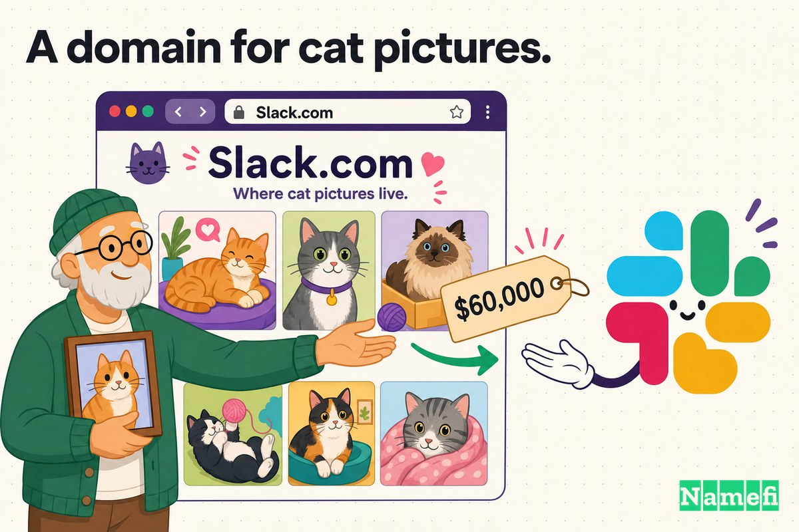
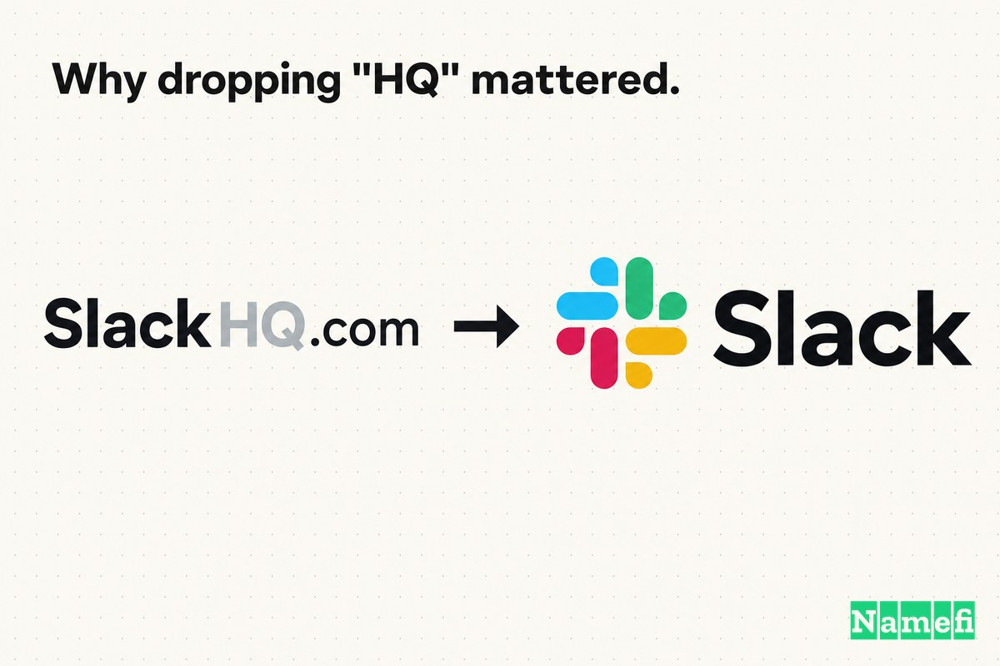
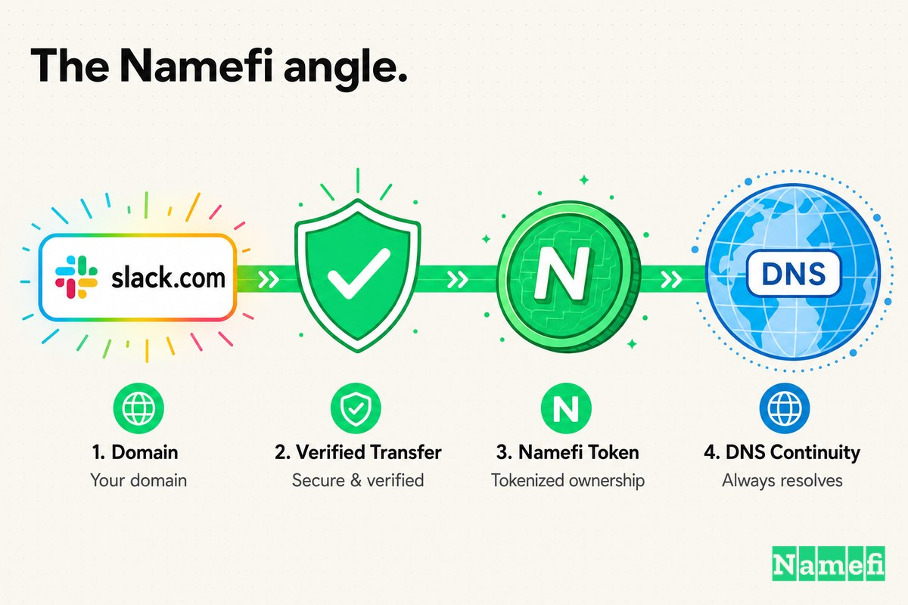

在 Slack 成为职场沟通动词之前，它有一个更长的网址：**SlackHQ.com**。

"HQ"并非品牌点缀，而是一个变通方案。当 Stewart Butterfield 的团队将内部聊天工具打磨成产品时，[精确匹配域名](/zh/glossary/exact-match-domain/) Slack.com 已经属于他人。Twitter 上的 @Slack 账号同样如此——早在多年前，[来自密歇根州霍兰的软件工程师](https://www.cnbc.com/2020/12/04/meet-matt-slack-who-owns-twitter-handle-slack-like-the-tech-company.html#:~:text=a%20software%20engineer%20from%20Holland%2C%20Michigan) Matt Slack 便已注册。一家想叫"Slack"的年轻公司，起初只能将就用"Slack 总部版"这个名字。

公司想要的名字和实际能用的名字之间的落差，是创业品牌中最常见、也最容易被低估的问题之一。产品已经叫 Slack，只是世界还无法通过 Slack.com 找到它。

这一局面很快被改变。Slack 悄然从原持有者手中买下了 **Slack.com**，创始人后来公开了价格：据报道为 **[$60,000](https://www.thedomains.com/2018/04/12/slack-com-was-purchased-for-60000/#:~:text=Communications%20app%20Slack%20paid%20%2460%2C000%20for%20the%20domain%20slack)**。网址上的"HQ"就此去除——尽管有一个耐人寻味的后续：**@SlackHQ** 这个社交账号从未被替换，沿用至今。

这是一个域名升级恰好如愿的故事，也是一个修饰词从未消失的故事。

## 2013 年：一个产品拥有自己无法得到的名字

Slack 最初并不是一款产品，而是一套基础设施。

它背后的公司是 Tiny Speck——Butterfield 在联合创办 Flickr 之后创立的工作室。Tiny Speck 的正式产品是一款名为 Glitch 的在线游戏，而 Slack [正是在 Glitch 开发期间，作为 Tiny Speck 的内部工具诞生的](https://www.frederick.ai/blog/stewart-butterfield-slack#:~:text=Slack%20had%20begun%20as%20an%20internal%20tool%20for%20Tiny%20Speck%20during%20the%20development%20of%20Glitch)。维基百科对此有相同记载：Slack [起源于 Stewart Butterfield 旗下公司 Tiny Speck 在开发 Glitch 过程中使用的内部通讯工具](https://en.wikipedia.org/wiki/Slack_%28software%29#:~:text=Slack%20originated%20as%20an%20internal%20communication%20tool%20used%20within%20Stewart%20Butterfield%27s%20company%20Tiny%20Speck%2C%20during%20its%20work%20on%20the%20development%20of%20Glitch)。

游戏最终没能成功。Glitch 停止运营后，团队意识到他们为自己打造的那套聊天工具才是真正有价值的东西。到 2013 年夏天，他们将其打磨成可发布的产品，正如 Butterfield 在发布回顾中所述，[于 2013 年 8 月宣布预览版上线](https://review.firstround.com/from-0-to-1b-slacks-founder-shares-their-epic-launch-strategy/#:~:text=announced%20their%20preview%20release%20in%20August%202013)。

产品早已定名为"Slack"，甚至有一个巧妙的首字母缩写——[Searchable Log of All Communication and Knowledge（所有通讯与知识的可搜索记录）](https://kottke.org/24/02/0043949-til-that-slack-is-an#:~:text=Searchable%20Log%20of%20All%20Communication%20and%20Knowledge)——尽管团队一直坦承，这个词先于缩写存在，缩写是后来附会的。正如一位早期员工所说：[我们费了一番周折，在会前会后闲扯的时候寻找"Slack"这个名字的替代方案](https://kottke.org/24/02/0043949-til-that-slack-is-an#:~:text=We%20undertook%20a%20roundabout%20search%20for%20alternatives%20to%20the%20name%20%E2%80%9CSlack%2C%E2%80%9D%20mostly%20while%20bullshitting%20before%20or%20after%20a%20meeting)。

品牌就这样定了下来，网址却还没有着落。产品带着一个修饰词上线——**SlackHQ.com**——因为那个单独的词已经被人占用了。

## 收购时刻：拿下那个单词本身

解决方案并非重新品牌化。产品无需改名，只需改地址——从 SlackHQ.com 改为 Slack.com。

要做到这一点，Slack 必须从现有持有者手中买下这个精确匹配域名。创始人后来在 Quora 上披露了价格，并经域名媒体广泛传播：通讯应用 [Slack 以 6 万美元购入该域名](https://www.thedomains.com/2018/04/12/slack-com-was-purchased-for-60000/#:~:text=Communications%20app%20Slack%20paid%20%2060%2C000%20for%20the%20domain%20slack)。这个数字颇为引人注目——不因为它大，而恰恰因为它小。一个精确匹配的五字母英文字典词 [.com](/zh/tld/com/) 域名，后来成为软件行业最知名品牌的基石，而 6 万美元在回望之下，简直像是特卖价。

联合创始人兼 CTO Cal Henderson 解释过为何这个词值得追求：[这是一个五字母域名，是一个我们真的能拿到的英语单词——没有比这更好的了](https://www.siliconrepublic.com/start-ups/slack-cal-henderson-interview#:~:text=It%27s%20a%20five-letter%20domain%20name%2C%20it%27s%20an%20English%20word%20that%20we%20could%20actually%20get%20%E2%80%93%20it%20doesn%27t%20get%20better%20than%20that)。这个名字的全部吸引力在于：它是一个真实存在的单词，一家真实的公司可以将其据为己有。横亘在 Slack 与 Slack.com 之间的，只有一个持有它的人。

## 卖家一侧：一个用来存猫咪照片的域名

大多数重磅域名故事都涉及一个不情愿的持有者、漫长的僵局和最终的妥协。Slack 的故事则更温和——也略带几分喜感。

原持有者并非囤积域名等待变现的投资人。Henderson 表示：[我们从一个用该域名搭建个人网站、存放猫咪照片的人那里买下了这个域名](https://www.siliconrepublic.com/start-ups/slack-cal-henderson-interview#:~:text=We%20bought%20the%20domain%20from%20a%20guy%20who%20had%20been%20using%20it%20as%20a%20personal%20website%20for%20pictures%20of%20his%20cats)。一个五字母英文单词——.com 中最珍贵的类型之一——竟默默充当着某位爱好者的相册。

这一细节解释了价格为何相对低廉。经营猫咪照片网站的卖家不会锚定数百万美元的估值；他没有任何商业计划押注于这个名字，也没有竞争买家哄抬价格，更没有理由把 6 万美元视为区区小数。与某些公司为撬开一个精确匹配域名而经历的长达十年、签满保密协议的对峙相比，Slack 拿下 Slack.com 的过程快速、友好、价廉。

这里的教训不是"域名很便宜"，而是：精确匹配域名的价格与它将来变得多值钱几乎没有关系，几乎完全取决于当你打来电话时恰好是谁在持有它。

## 那笔钱在当时的意义

把 6 万美元当成四舍五入的误差很容易。Slack 后来估值数十亿美元，并被 Salesforce 收购。站在那个结果来看，这笔域名费用几乎可以忽略不计。

但域名收购应当以决策时刻的不确定性来评判，而非从故事终点回望。

2013 年，Slack 是一个刚从*失败的游戏工作室*脱胎而出、只有几个月历史的产品。Tiny Speck 曾在 [2009 年获得 150 万美元天使融资](https://en.wikipedia.org/wiki/Slack_Technologies#:~:text=Tiny%20Speck%20received%20angel%20funding%20of%20%241.5%20million%20in%202009)，随后花了数年时间打造一款无法成功的游戏。团队实际上是在请投资人和自己相信：那个副产品才是正业。

在那个背景下，花 6 万美元买一个域名——而非招募工程师、采购服务器、延长现金跑道——是一个真实的资源分配决策。早期信号固然亮眼：预览版吸引了海量关注，Butterfield 在回顾中写道，[第一天就有 8,000 人报名；两周后这个数字增长到了 15,000](https://review.firstround.com/from-0-to-1b-slacks-founder-shares-their-epic-launch-strategy/#:~:text=On%20the%20first%20day%2C%208%2C000%20people%20did%20just%20that%3B%20and%20two%20weeks%20later%2C%20that%20number%20had%20grown%20to%2015%2C000)。但早期牵引力不等于确定性。购入 Slack.com 是一场赌注——赌这个名字终将重要到值得彻底拥有——而下注时，没有人知道结局。

## 去掉"HQ"为何举足轻重

SlackHQ.com 和 Slack.com 之差两个字母。从战略角度看，这是*一个属于某个品牌的地方*与*品牌本身*之间的距离。

**SlackHQ.com** 读起来像是产品背后那家公司的地址——总部、组织、团队。**Slack.com** 读起来像是产品本身、那个动词、那个你整天生活其中的东西。前者指向 Slack，后者本身就是 Slack。

| 之前 | 之后 |
| --- | --- |
| SlackHQ.com | Slack.com |
| 命名公司的"总部" | 命名产品本身 |
| 带有一个变通修饰词 | 只有这个单词，别无其他 |
| 暗示"原始名字已被占用" | 传达"这是权威所在" |
| 每次提及多两个字母 | 将品牌浓缩为一个词 |

这是域名升级中反复出现的规律：早期名字总在*解释*或*限定*；卓越的名字则在*占有*。"HQ"、"Motors"、"App"或"The"这类修饰词，在干净域名无法获得时是合理的过渡方案；但一旦公司足够壮大，那个词本身就应当成为目的地，修饰词便成了负担。

Slack 有幸很快纠正了这一点。正因为卖家好说话、价格低廉，这个修饰词还没来得及固化为品牌。大多数人认识这款产品时，它已经叫 Slack.com。

## 顺序：先有名字，再有地址

这里的操作顺序值得细细品味，因为它颠覆了通常的建议——"先锁定 .com 再发布"。

Slack 当时做不到。它的顺序是：

1. **先定名字** ——"Slack"，在工具还是 Tiny Speck 内部实验品时就已确定。
2. **产品以修饰词上线** —— [2013 年 8 月的预览版](https://review.firstround.com/from-0-to-1b-slacks-founder-shares-their-epic-launch-strategy/#:~:text=announced%20their%20preview%20release%20in%20August%202013)在 SlackHQ.com 上线，因为 Slack.com 已被占用。维基百科记录了同一时刻：[2013 年 8 月，Slack 向公众正式发布](https://en.wikipedia.org/wiki/Slack_%28software%29#:~:text=In%20August%202013%2C%20Slack%20was%20launched%20to%20the%20public)。
3. **收购精确匹配域名** —— Slack 以据报道 6 万美元的价格从猫咪照片网站主人手中买下 Slack.com，"HQ"从主网址上退出历史舞台。
4. **公司正式确立身份** —— 发布之后，[公司于 2014 年 8 月将自身更名为 Slack Technologies](https://en.wikipedia.org/wiki/Slack_Technologies#:~:text=the%20company%20renamed%20itself%20to%20Slack%20Technologies%20in%20August%202014)，彻底抛弃了 Tiny Speck 这个名字。

域名不必先于发布到位，但必须在名字定型之前到位。Slack 在还是年轻产品时就拿到了干净的网址，而不是等了十年之后用户已经记住了那个变通方案才行动。

## 域名成为操作系统的一部分——除了 @SlackHQ

高价域名的意义在于一件并不光鲜的事：重复出现。

一个核心域名会出现在公司无法完全掌控的每一个地方——电子邮件地址、媒体链接、应用商店、浏览器地址栏、搜索结果，以及每一次口口相传的推荐。每次重复，要么增加摩擦，要么消除摩擦。SlackHQ.com 要求所有人永远多打两个字母；Slack.com 什么都不要求。

但这里有一个让 Slack 案例独特的转折：域名升级*成功*了，社交账号却没能跟上。网址变成了 Slack.com，而官方社交账号依然是 **@SlackHQ**——因为裸账号 @Slack 已经并且至今仍属于 Matt Slack，他[于 2006 年 10 月以 @slack 身份加入 Twitter](https://www.cnbc.com/2020/12/04/meet-matt-slack-who-owns-twitter-handle-slack-like-the-tech-company.html#:~:text=Matt%20Slack%20joined%20Twitter%20as%20%40slack%20in%20October%2C%202006)。Tiny Speck 更名时，将所有人指向了它实际持有的账号，宣告：[Tiny Speck 已成历史。我们现在是 Slack Technologies, Inc.，请关注 @SlackHQ。再见！](https://en.wikipedia.org/wiki/Slack_Technologies#:~:text=Tiny%20Speck%20is%20no%20more.%20We%27re%20now%20Slack%20Technologies%2C%20Inc.%20See%20%40SlackHQ.%20Bye%21)

Slack 花钱从域名上去掉的那个"HQ"，至今仍挂在社交渠道上——以及 [GitHub 组织 github.com/slackhq](https://github.com/slackhq) 上。SlackHQ.com 本身也从未消失；公司仍持有它并悄悄做了跳转。（旧的 Slack 博客链接 `slackhq.com` 现在会 [301 重定向到 slack.com](https://slack.com/blog/slack-acquisition-connecting-employees)。）那个修饰词没有消亡，只是不再是前门了。

## 创始人应从案例 14 中学到什么

那个简单的结论——"发布前务必拥有精确匹配的 .com"——是错的，因为 Slack 当时根本做不到。更有价值的教训关乎修饰词和时机：

1. **修饰词是一个不错的过渡方案。** "HQ"让 Slack 在裸词被他人持有期间，依然能以真实名字发布。在 SlackHQ.com 上线并非失败，而是在不等待的情况下合理发货的方式。
2. **把裸名视为需要收购的资产，而非理所当然的权利。** 品牌已定，网址是一笔交易。Slack 为升级做了预算，主动找到持有者，而非绕开障碍另起炉灶。
3. **趁修饰词还易于去除时尽早行动。** 正因为 Slack 早早以友好价格买下了 Slack.com，"HQ"从未成为品牌的承重墙。变通方案存续越久，撤销的代价就越大、越混乱。
4. **接受某些修饰词将永远存在。** Slack 拿到了 Slack.com，却始终未能拿到 @Slack。不同平台各有占有者。拥有权威 .com 是最高杠杆的胜利；在每个社交渠道都做到匹配，则是一个可能永远无法完全实现的锦上添花。

域名升级并没有让 Slack 取胜。产品、时机、分发，以及那场近乎神奇的预览版发布，远比域名更重要。但 Slack.com 让这场胜利更容易被*键入*——而且几乎比任何人预期的都要便宜。

## Namefi 的视角

Slack 的故事，撇开猫咪照片的笑谈，本质上是一个转让问题。

战略判断从未有疑问——一款叫 Slack 的产品当然应该落地于 Slack.com。难点在于围绕这个资产的方方面面：找到持有它的个人、在没有公开可比案例的情况下商定价格、转移资金、完整交接控制权，以及在不中断线上产品的前提下将用户从旧地址引导至新地址。即便只花 6 万美元、即便遇到友善的卖家，*交易的机制本身*——证明谁拥有什么、安全地转移资产——才是域名升级真正容易卡壳的地方。

[Namefi](https://namefi.io) 的核心理念是：域名应该像[互联网原生资产](/zh/glossary/internet-native-asset/)一样运作。代币化所有权能够让域名控制权的验证、转让和集成进现代工作流变得更加便捷，同时与 DNS 保持兼容——将类似这笔交易中缓慢、高度依赖信任的环节（确认所有权、商定条款、转移资产）转化为更接近干净、可审计的交易。

Slack.com 在今天看来理所当然，是因为 Slack 变得无比巨大。但这个教训早在故事开头便已成立：当一个名字将要承载整个业务时，域名就不是装饰品。它是以变通方案上线与以本来面目上线之间的差距——而有时候，修正这一差距的代价，还不及一名工程师一年的薪水。

## 参考资料与延伸阅读

- The Domains — [Slack.com was purchased for $60,000](https://www.thedomains.com/2018/04/12/slack-com-was-purchased-for-60000/#:~:text=Communications%20app%20Slack%20paid%20%2460%2C000%20for%20the%20domain%20slack)
- Silicon Republic — [Slack co-founder Cal Henderson interview](https://www.siliconrepublic.com/start-ups/slack-cal-henderson-interview#:~:text=We%20bought%20the%20domain%20from%20a%20guy%20who%20had%20been%20using%20it%20as%20a%20personal%20website%20for%20pictures%20of%20his%20cats)
- Wikipedia — [Slack (software)](https://en.wikipedia.org/wiki/Slack_%28software%29#:~:text=Slack%20originated%20as%20an%20internal%20communication%20tool%20used%20within%20Stewart%20Butterfield%27s%20company%20Tiny%20Speck%2C%20during%20its%20work%20on%20the%20development%20of%20Glitch)
- Wikipedia — [Slack Technologies](https://en.wikipedia.org/wiki/Slack_Technologies#:~:text=Tiny%20Speck%20is%20no%20more.%20We%27re%20now%20Slack%20Technologies%2C%20Inc.%20See%20%40SlackHQ.%20Bye%21)
- First Round Review — [From 0 to $1B: Slack's Founder Shares Their Epic Launch Strategy](https://review.firstround.com/from-0-to-1b-slacks-founder-shares-their-epic-launch-strategy/#:~:text=announced%20their%20preview%20release%20in%20August%202013)
- Frederick AI — [Founder Story: Stewart Butterfield of Slack](https://www.frederick.ai/blog/stewart-butterfield-slack#:~:text=Slack%20had%20begun%20as%20an%20internal%20tool%20for%20Tiny%20Speck%20during%20the%20development%20of%20Glitch)
- Kottke — [TIL that Slack is an acronym](https://kottke.org/24/02/0043949-til-that-slack-is-an#:~:text=Searchable%20Log%20of%20All%20Communication%20and%20Knowledge)
- Mio — [The History of Slack & Its Impact on Business Communication](https://www.m.io/blog/history-of-slack#:~:text=Stewart%20called%20this%20tool%20Slack)
- CNBC Make It — [Meet Matt Slack, who owns the Twitter handle @Slack](https://www.cnbc.com/2020/12/04/meet-matt-slack-who-owns-twitter-handle-slack-like-the-tech-company.html#:~:text=relegated%20to%20a%20slightly%20less%20intuitive%20handle%2C%20%40SlackHQ)
- GitHub — [Slack's slackhq organization](https://github.com/slackhq)
- Slack — [old slackhq.com blog link now redirecting to slack.com](https://slack.com/blog/slack-acquisition-connecting-employees)
