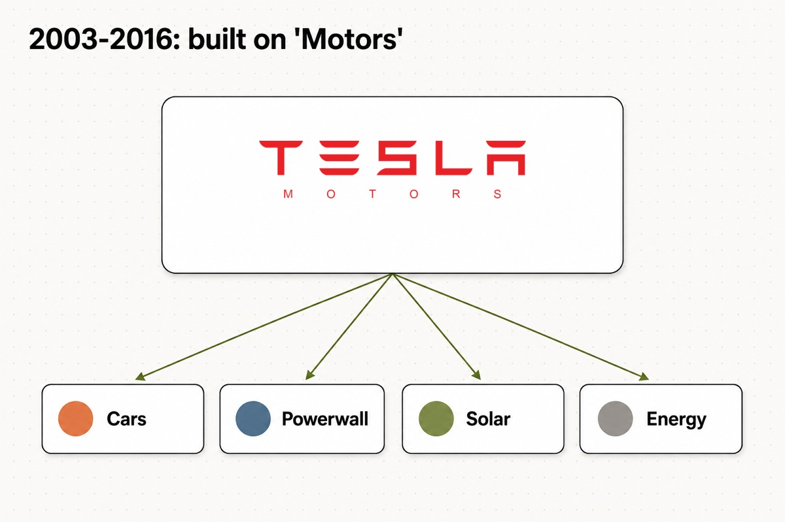
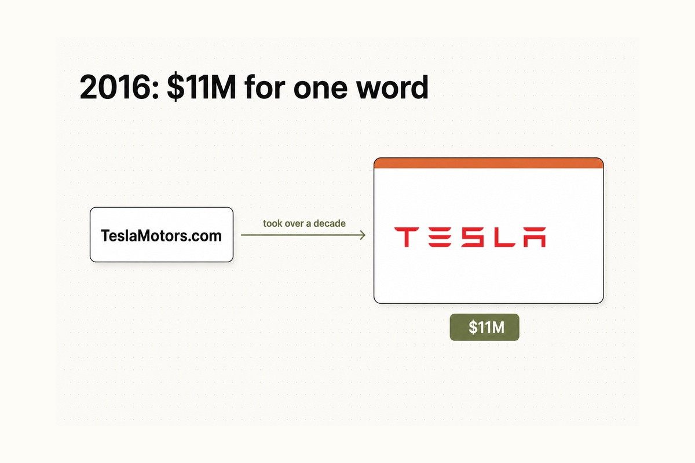
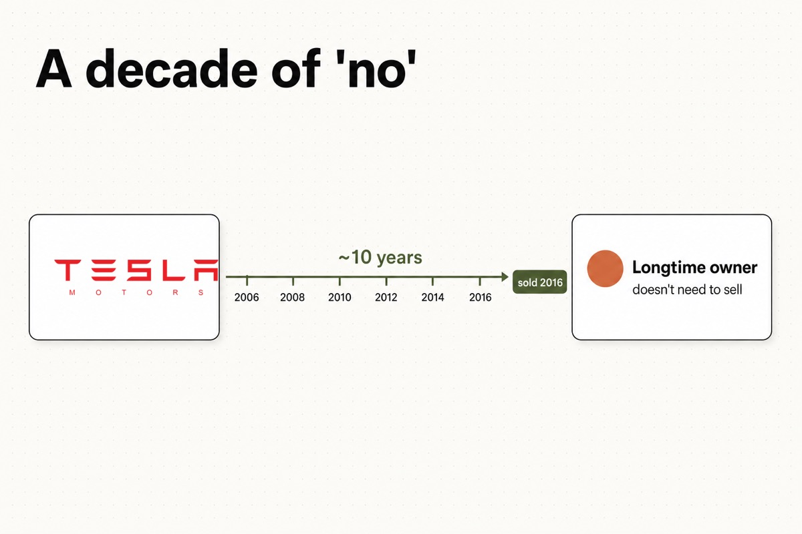
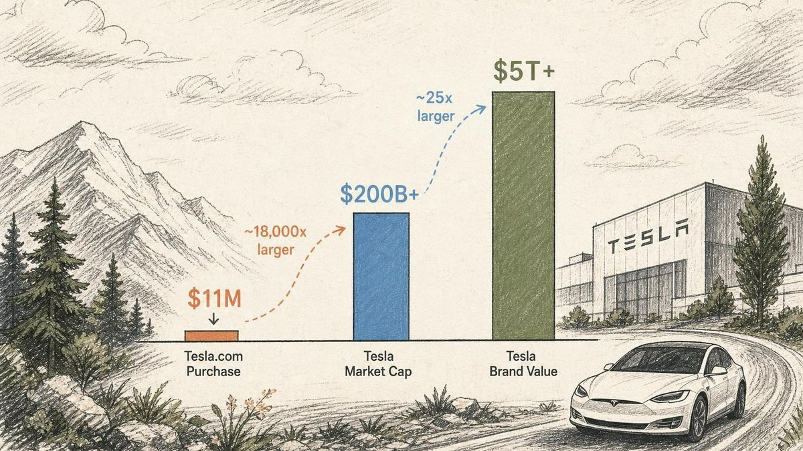
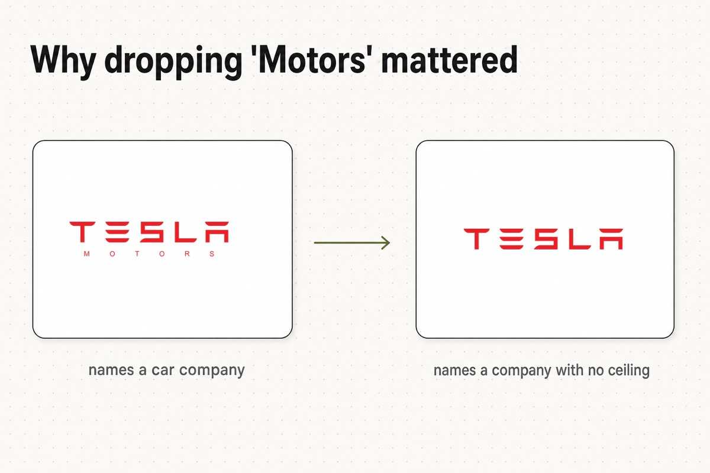
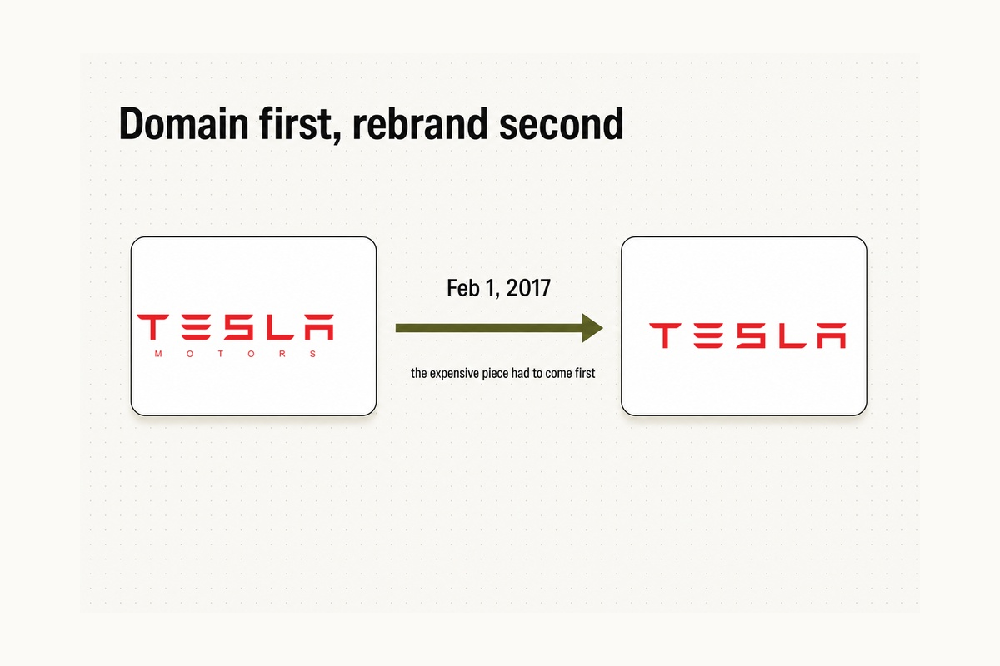
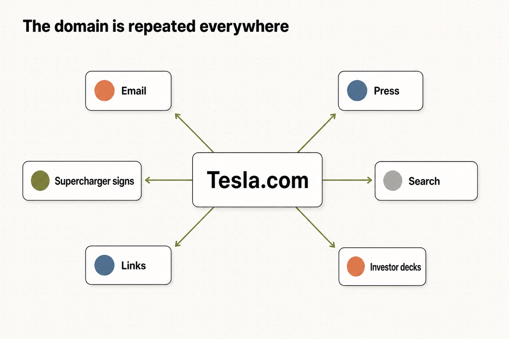
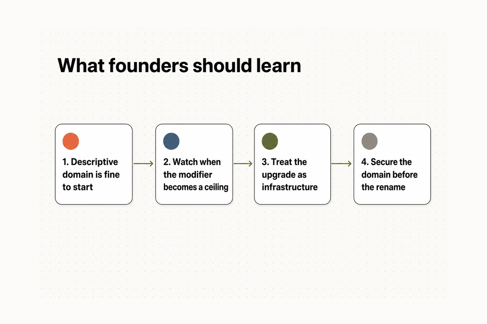
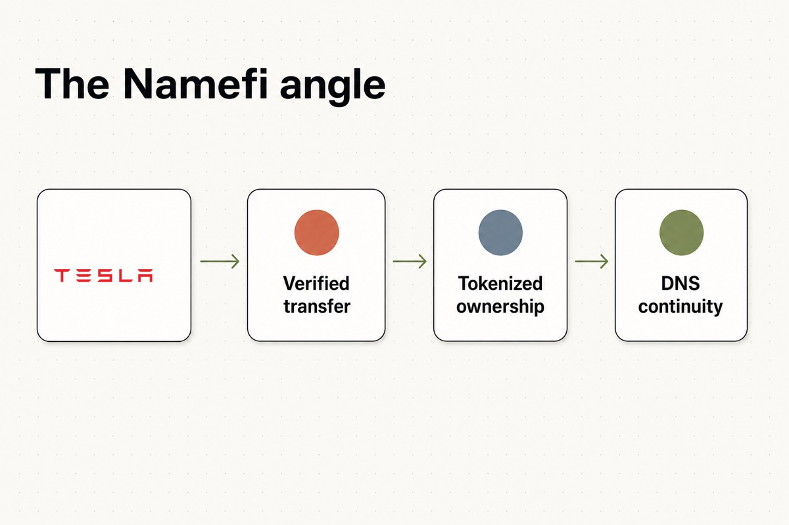

在最初的十三年里，这家在未来十年最具价值的汽车公司，一直使用着一个略显尴尬的网址：**TeslaMotors.com**。

这个名字很实在。2003 年公司成立时，它只生产汽车，别无其他。“Tesla Motors（特斯拉汽车）”准确描述了它的业务，而 TeslaMotors.com 也准确指明了在网上哪里可以找到它。多出来的那个词（Motors）发挥了实际作用：它告诉人们，这是一家以尼古拉·特斯拉（Nikola Tesla）命名的汽车制造商，而不是一家电池初创公司，不是电力公用事业公司，也不是互联网早期被其他“Tesla”占据的那个域名。

因为确实有其他人*一直*持有着 Tesla.com。这个完全匹配的域名属于硅谷工程师 Stuart Grossman，远在电动汽车公司存在之前，他就已经持有了这个域名，并且之前已经在与另一家名为 Tesla Industries 的公司的 [UDRP 争议中成功捍卫了它](https://electrek.co/2016/02/18/tesla-motors-domain-tesla-com/)。Tesla Motors 不能直接把名字要过来。它必须买下它，而所有者并不急于出售。

因此，在十多年的时间里，该公司在一个并不完全契合其品牌的域名上，打造了世界上最具辨识度的品牌之一。

这一情况在 2016 年 2 月发生了改变。Tesla 终于收购了 **Tesla.com** —— 2018 年，埃隆·马斯克（Elon Musk）透露了它的价格：**[1100 万美元](https://domaininvesting.com/elon-musk-on-what-it-took-to-acquire-tesla-com/)**，以及“惊人的努力”。

## 2003–2016：超越“Motors”的公司

一开始，“Motors（汽车/电机）”是一个特色，而不是缺陷。

一家新公司想让陌生人为一辆价值 10 万美元的电动跑车支付定金，就需要它所能得到的所有合法性背书。“Tesla Motors”听起来像一家汽车制造商，因为它本来就该如此。Roadster、Model S、Model X —— 多年来，向公众讲述的所有故事都与汽车有关，而 TeslaMotors.com 与这个故事逐字匹配。

但公司的野心不断扩张，逐渐超越了这个名字。到了 2010 年代中期，Tesla 已不再仅仅是一家汽车制造商。它正在发售 Powerwall 家用电池，建设电网级储能设备，并推动对 SolarCity 的收购以及推出其太阳能屋顶。这家曾用“Motors”来描述自己的公司，正在变成一家碰巧也生产世界上最著名汽车的能源公司。

在那一刻，“Motors”开始起到与 2003 年相反的作用。它不再增加可信度，反而增加了一层天花板。它将一家拥有行星级野心的公司局限在了一个单一的产品品类中。TeslaMotors.com 是第一阶段的正确域名，却是未来新阶段的错误域名。

## 2016：斥资 1100 万美元购买完全匹配域名

2016 年 2 月 12 日星期五，域名转移完成。Tesla 获得了 Tesla.com 的控制权，该名称开始重定向到公司网站。彭博社在标题中记录了这一时刻：[马斯克在等待十年后终获 Tesla.com 域名](https://www.bloomberg.com/news/articles/2016-02-19/tesla-s-musk-gets-tesla-com-domain-name-after-waiting-a-decade)。Green Car Reports 的措辞甚至更为直白：Tesla [经过大约 10 年的努力，终于将“Tesla.com”域名收入囊中](https://www.greencarreports.com/news/1102490_tesla-finally-gets-tesla-com-domain-could-name-change-follow)。

当时，价格被隐藏在保密协议之下，早期的估计从大几十万到数百万美元不等。真实的数字被保密了近三年。

然后，在 2018 年 12 月，马斯克在一条推文中亲自揭晓了答案：

> “买下 Tesla.com 花了十多年时间、1100 万美元以及惊人的努力。即使当我们只生产汽车时，我也不喜欢 teslamotors.com。”

这一句话包含了全部的经验教训。为单一词汇支付了 **1100 万美元**。[Smart Branding](https://smartbranding.com/teslamotors-com-upgrades-to-tesla-com/) 后来直白地总结了这一举措：“Tesla Motors 将其名称缩短为简单的 Tesla，同时公司将域名从 TeslaMotors.com 升级为完全匹配品牌的 Tesla.com。”

并且请注意马斯克在那条推文中所承认的：*即使公司当时只生产汽车*，他也不喜欢 teslamotors.com。这种描述性的域名对他来说从来都不具有权威性——它始终感觉像是公司最终必须替换掉的脚手架。

## 十年的“不”：卖方视角

耗时十年的原因是所有者并不需要出售。

Stuart Grossman 持有 Tesla.com 多年，挺过了至少一次所有权挑战，并且没有任何商业项目依赖于它。这是域名谈判中最难对付的对手：不是寻找快速套现的倒卖者，而是一个可以无限期地舒服地说“不”的长期持有者。对于一个并不急于获胜的人，你没有任何谈判筹码。

最终推动交易的不是压力，而是疲惫。Grossman 描述说，到最后，该域名带来的麻烦多于资产价值——在某段时期，[一波垃圾邮件使用 tesla.com 作为伪造的发送地址发散出去](https://jamesnames.com/2021/08/case-study-why-musk-acquired-tesla-com-for-11-million/)，这正是休眠的优质域名可能悄然带来的令人头疼的问题。正如他在 2016 年的一次采访中所说，他意识到自己永远不会把这个名字投入生产性使用，而且[它正成为一种负担](https://electrek.co/2016/02/18/tesla-motors-domain-tesla-com/)。

这就是大多数天价域名交易背后毫不光鲜的现实。买方有战略需求和类似截止日期的野心。卖方有时间。价格就是能弥合“我不一定非要卖”和“这终于值得我折腾了”之间差距的那个数字。对于 Tesla 来说，弥合这一差距花了 1100 万美元和近十年的时间。

## 当时这笔钱的意义大不相同

事后看来，很容易将这 1100 万美元称作是一个轻松的决定。Tesla 现在是世界上最具价值的公司之一，而 Tesla.com 则是其最安静、最持久的资产之一。相比之下，1100 万美元看起来就像是四舍五入的零头。

但这笔钱应当放在它被花掉的那个时刻去评判，而不是从故事的结局往回看。

在 2016 年初，Tesla 远非后来那个商业巨头。它是一家资金饥渴的公司，正处于一场巨大的赌局中：提高 Model X 产能，准备推出面向大众市场的 Model 3，建设超级工厂（Gigafactory），并准备收购 SolarCity。自由现金流是一项持续的压力。在那种背景下，将 1100 万美元花在一个*域名*上——而不是工厂、工具或电池供应上——这绝对是会让首席财务官提出质疑的一项支出。

只有当你将域名视为基础设施而不是装饰品时，这个决定才说得通。Tesla 准备让世界不再将其仅仅视为一家汽车公司。每一份新闻稿、每一个充电网络标志、每一个能源产品、每一份投资者简报，都将带有它的网址。花费 1100 万美元让这个地址成为品牌干净、完全匹配的版本，这是一场豪赌，赌的是这个名字将被重复数十亿次——而且每一次重复都应该落在 Tesla.com 上，而不是 TeslaMotors.com。

## 为什么去掉“Motors”很重要

TeslaMotors.com 和 Tesla.com 之间只有一个词的差距。但从战略上讲，这是一个产品和一个品类之间的区别。

**TeslaMotors.com** 描述了这家公司卖什么。**Tesla.com** 命名了这家公司*是*什么。前者是汽车业务的标签；后者则是一个足够大的容器，可以装下汽车、电池、太阳能、软件、能源以及未来出现的任何东西。

| 之前 | 之后 |
| --- | --- |
| TeslaMotors.com | Tesla.com |
| 命名一家汽车公司 | 命名一家没有天花板的公司 |
| 锚定单一产品品类 | 跨越汽车、能源和软件领域 |
| 听起来像一个部门 | 听起来像母公司 |
| 每次提及都增加一个多余的词 | 将品牌精简为一个词 |

这正是域名升级中反复出现的模式：早期的名字用于*解释*，伟大的名字用于*占有*。当一家公司仍然需要告诉你它是做什么的时候，描述性版本很有帮助。一旦公司足够大，名字本身就应该*代表*这个品类时，完全匹配的版本就会发挥作用。Tesla 通过砸钱完成了从前者到后者的转变。

## 2017：恰好在品牌重塑前到来的域名

有个细节让购买 Tesla.com 超越了单纯的虚荣心消费：域名*先*到位，随后企业进行了品牌重塑。

当 Tesla 在 2016 年收购该域名时，观察人士立即将其解读为一个信号。Green Car Reports 指出，收购这个更简短的名称[扫清了一个障碍，以防马斯克决定将“Tesla Motors”更名为简单的“Tesla”](https://www.greencarreports.com/news/1102490_tesla-finally-gets-tesla-com-domain-could-name-change-follow)。如果你打算永远叫 Tesla Motors，你是不可能为 Tesla.com 支付 1100 万美元的。

这个预测成真了。2017 年 2 月 1 日，[Tesla 正式将名称从 Tesla Motors, Inc. 更改为 Tesla, Inc。](https://techcrunch.com/2017/02/01/tesla-motors-inc-is-now-officially-tesla-inc/) 这背后的理由与域名的逻辑完全吻合：公司现在[不仅是一家汽车制造商，还是一家专注于能源创新的技术和设计公司](https://techcrunch.com/2017/02/01/tesla-motors-inc-is-now-officially-tesla-inc/)。

这里的顺序很重要。域名是第一个公开的、真金白银买下的放弃“Motors”的承诺。拥有 Tesla.com 让品牌重塑显得成本低廉且顺理成章，而不是尴尬和不彻底。想象一下另一种情况：宣布你现在是“Tesla, Inc.”，但你的网站仍然挂在 TeslaMotors.com 下。名称更改和域名必须同步推进，而昂贵且难以获取的部分——域名——必须首先得到保证。

## 域名成为了操作系统的一部分

优质域名无关乎虚荣与排场。它们关乎的是重复。

一家公司的核心域名会出现在营销团队永远无法直接控制的地方：

- 在电子邮件地址和员工签名中。
- 在新闻标题和分析师报告中。
- 在超级充电站标志、零售店和交付文件中。
- 在搜索结果和浏览器地址栏中。
- 在每一份投资者简报和每一次口口相传的推荐中。

每一次这样的重复，要么增加摩擦，要么消除摩擦。TeslaMotors.com 让每一次提及都稍微长了一点，稍微更受限于产品，稍微更像一家“汽车公司”。Tesla.com 让每一次提及都更短、更干净，并且不受品类限制。将这种优势放大到数百万客户、成百上千名员工的漫长岁月中，以及一个几乎每天都在新闻中被提及的品牌身上，这 1100 万美元看起来就不再像是一种奢侈品，而更像是一次对品牌发展阻力的永久性削减。

域名并没有建立 Tesla 的品牌。但一旦 Tesla.com 成为其专属网址，每一次对该名称未来的重复，都将在一个更干净的地基上产生复利。

## 创始人应该从案例二中学到什么

最简单的结论——“尽早购买完全匹配的 .com 域名”——是错误的。Tesla *不可能*及早购买 Tesla.com；所有者不卖。更有用的经验在于时机和对待它的方式：

1. **开始时使用描述性域名是完全可以的。** TeslaMotors.com 履行了它十三年的职责，并陪伴公司度过了历史上一些最重要的产品发布。像“Motors”、“App”或“HQ”这样的修饰词并不是失败；它是一个合理的起步跳板。
2. **注意修饰词变成天花板的那一刻。** 升级域名的信号无关美学。而是当你的名字开始描述一家比你正在成为的公司更小的企业时。对于 Tesla 来说，那就是超越汽车业务的转型点。
3. **将完全匹配域名视为基础设施。** 1100 万美元买到的是品牌清晰度、招聘信号、新闻的简洁性以及品牌重塑的跑道——而不仅仅是一个更好看的 URL。
4. **在更名之前搞定域名，而不是之后。** 这个缓慢、昂贵、受外部控制的资产必须首先被锁定。企业身份的变更可以在一个下午完成；而域名的获取可能需要十年。

域名升级并没有直接让 Tesla 赢得市场。产品、资本、时机和执行力要重要得多。但 Tesla.com 使得公司作为能源企业的重塑变得*名正言顺*——而且它必须在任何人能够使用它之前数年就被买下。

## Namefi 的视角

Tesla 的十年传奇，其核心是一个转移问题。

战略决策从来没有真正受到过怀疑——一家名为 Tesla 的公司当然应该拥有 Tesla.com。困难在于围绕这项资产的一切：找到一个不情愿的长期所有者能够接受的条款、在保密协议下进行谈判、在没有公开可比对象的情况下就价格达成一致、转移数百万美元、干净利落地移交控制权，以及在不中断实时网站或品牌的情况下完成这一切。十年的努力不是为了决定*是否*升级，而是为了安全地*执行*升级。

[Namefi](https://namefi.io) 的创立正是基于这样一个理念：域名应该像原生互联网资产一样运作。代币化所有权可以使域名控制权的验证、转移和集成到现代工作流中变得更加容易，同时保持与 DNS 的兼容性——将类似此类交易中最混乱的部分（证明谁拥有什么，并安全地转移它）转变为更接近于干净、可审计的交易。

因为 Tesla 现在变得如此庞大，所以 Tesla.com 现在看起来是顺理成章的必然结果。但经验教训远在这种规模出现之前就已形成：当一个名字将承载整个业务时，域名绝不是装饰品。它是品牌中值得等待十年——并支付 1100 万美元——去妥善解决的重要部分。

## 来源和进一步阅读

- Electrek — [Tesla Motors 收购优质域名 'Tesla.com'](https://electrek.co/2016/02/18/tesla-motors-domain-tesla-com/)
- 彭博社 (Bloomberg) — [马斯克苦等十年终获 Tesla.com 域名](https://www.bloomberg.com/news/articles/2016-02-19/tesla-s-musk-gets-tesla-com-domain-name-after-waiting-a-decade)
- Green Car Reports — [Tesla 终于得到 Tesla.com 域名；改名还会远吗？](https://www.greencarreports.com/news/1102490_tesla-finally-gets-tesla-com-domain-could-name-change-follow)
- DomainInvesting.com — [埃隆·马斯克谈收购 Tesla.com 的代价](https://domaininvesting.com/elon-musk-on-what-it-took-to-acquire-tesla-com/)
- Smart Branding — [TeslaMotors.com 升级为 Tesla.com](https://smartbranding.com/teslamotors-com-upgrades-to-tesla-com/)
- James Names — [案例研究：为什么马斯克斥资 1100 万美元收购 Tesla.com](https://jamesnames.com/2021/08/case-study-why-musk-acquired-tesla-com-for-11-million/)
- TechCrunch — [Tesla Motors, Inc. 正式更名为 Tesla, Inc.](https://techcrunch.com/2017/02/01/tesla-motors-inc-is-now-officially-tesla-inc/)