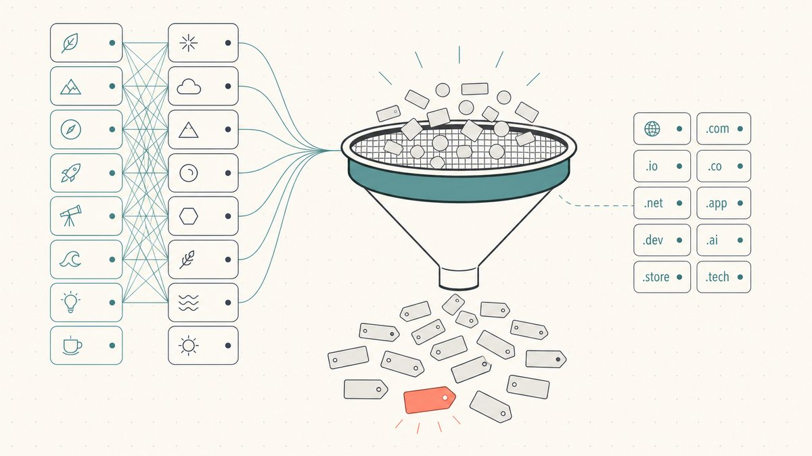
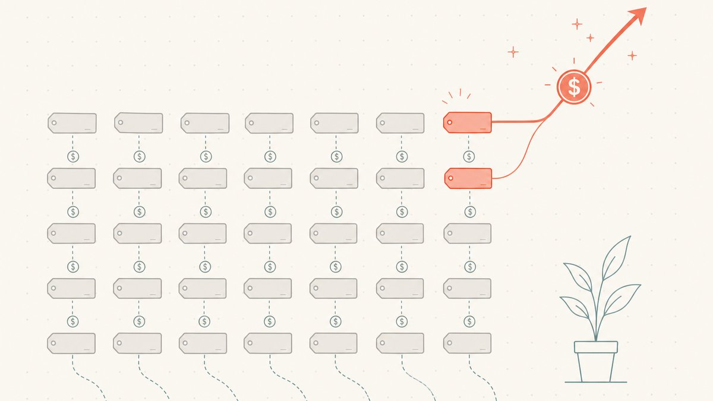
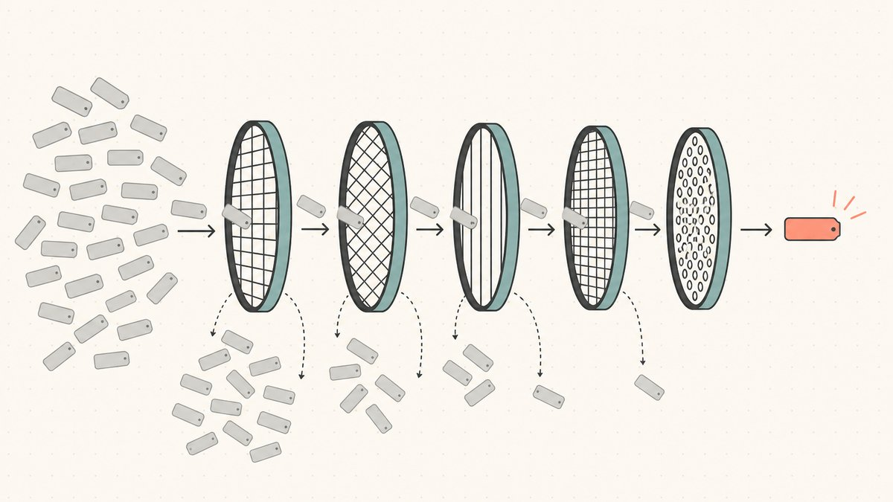

手动注册是进入域名转售领域成本最低的方式，也是最容易浪费钱的方式。您在注册商处输入一个名称，系统返回“可用”，您支付注册费，然后就拥有了一个从未有人想要过的全新域名。最后这部分就是陷阱。截至 2023 年底，已有 [3.598 亿个域名](https://en.wikipedia.org/wiki/Domain_name#:~:text=359.8%20million%20domain%20names%20had%20been%20registered) 被注册，而*未注册*的字符串组合实际上是无限的。一个域名可用，这几乎无法说明它是否值得拥有。通常，这恰恰意味着它不值得。

本指南将探讨那些仍然可用且值得注册的域名来自何处，揭示产生这些域名的模式，并提供筛选方法，帮助您区分真正的机会和那些只会年复一年续费却永远卖不出去的域名。这是更宏大的 [域名转售](/zh/blog/domain-flipping/) 技能中的一项，将 [如何寻找可转售的域名](/zh/blog/how-to-find-domains-to-flip/) 中更广泛的采购策略，聚焦到手动注册这一特定渠道。

## 什么是手动注册，以及为何它是风险最高的渠道

手动注册（业内简称“手注”）指的是直接从 [注册商](/zh/glossary/registrar/) 处以标准注册费注册一个全新的域名，而不是在 [二级市场](/zh/glossary/marketplace/) 购买现有域名或在域名删除期抢注。它之所以是入门点，是因为成本低廉：根据维基百科，一个普通的 `.com` 域名每年的费用 [从大约 $9.70 到 $35 不等](https://en.wikipedia.org/wiki/Domain_name_registrar#:~:text=the%20retail%20cost%20generally%20ranges%20from%20a%20low%20of%20about%20%249.70%20per%20year)，而且这个领域是域名空间的开放前沿——域名投机活动的字面定义就是 [为了投资而注册或收购通用互联网域名，意图在日后出售以获取利润](https://en.wikipedia.org/wiki/Domain_name_speculation#:~:text=registering%20or%20acquiring%20generic%20Internet%20domain%20names%20as%20an%20investment)。

但“便宜”和“容易”恰恰是大多数新手在这个渠道亏损的原因。一个在删除期 [拍卖](/zh/glossary/auction/) 中抢注到的域名带有一些信号——它至少曾被注册过一次，可能拥有建站历史或反向链接（请参阅 [过期域名与删除周期](/zh/blog/expired-domains-and-the-drop-cycle/)）。一个新手动注册的域名则不带任何信号。它从未被任何人需要过。您完全是在赌自己对未来需求的判断，而错误的判断只会给您本已每年都在花钱的域名组合增加一笔续费开销。

所以，坦白地说：手动注册不是“您可能卖掉的免费域名”。这是一场与无限供应的对赌，您需要提供全部的判断力。整个技巧的核心就在于判断力。

## 可用的宝藏域名到底来自哪里

您不可能通过输入单个字典词汇并期望好运来找到好的手动注册域名。每一个简洁的单单词 `.com` 域名在几十年前就已被注册。可用的域名存在于*组合词*和*较新的扩展名*中，有几条可靠的脉络可以挖掘。

**词汇表，系统化运作。** 专业的手动注册者不靠头脑风暴，他们靠生成。首先，在您了解的领域中，准备一个高价值核心术语的种子列表——例如在金融科技领域，可以是 *pay, bank, fund, ledger, vault, capital*——再准备一个修饰词列表——例如 *get, try, go, hq, app, labs, flow, stack*。以编程方式将它们组合（`getledger`, `vaultflow`, `payhq`）然后批量检查可用性。系统化运作的意义在于有纪律地进行批量操作：扫描数百种组合，只为找到那个听起来像真实产品名称且碰巧还可用的稀有域名。

**顶级域名（TLD）排列组合。** 同一个字符串在不同的 [扩展名](/en/glossary/tld/) 下是不同的资产。一个在 `.com` 上早已被注册的词，在 [`.io`](/zh/tld/io/)、[`.ai`](/zh/tld/ai/)、[`.co`](/en/tld/co/)、[`.app`](/zh/tld/app/) 或 [`.xyz`](/zh/tld/xyz/) 上通常还完全可用，并且对合适的买家来说，这些扩展名很有分量——`.ai` 适用于人工智能产品，`.io` 适用于开发者工具，`.xyz` 适用于 web3。这可以说是手动注册领域里最接近真正优势的方法，因为较新的扩展名在简短、品牌化的域名上仍有可用库存，而 `.com` 在多年前就已耗尽了这类资源。但问题在于流动性：大多数转售需求仍然集中在 `.com` 上，并且不同扩展名的用户画像差异巨大（请参阅 [为什么.io域名价格昂贵](/zh/blog/why-are-io-domains-expensive/) 和 [按注册量计算的cctld市场份额](/zh/blog/cctld-market-share-by-registration-volume/)）。只有当买家特别想要某个高级扩展名时，它才能成为顺风车。

**品牌化模式。** 手动注册域名的很大一部分价值在于自创的、可发音的词，而不是字典词汇——就像 *Stripe / Vimeo / Zillow* 这种形式：简短、自创、易于发音和拼写，而且因为它们不是现有词汇，所以没有原主人。有效的模式包括辅音-元音节奏、真实词汇后缀（`-ly`、`-ify`、`-ster`）、与词根结合的短前缀，以及两个短词融合成一个词（`Facebook`、`Salesforce`）。这些域名之所以能被找到，恰恰因为它们不与字典词汇竞争——您在创造新词，而新词尚未被注册。我们关于 [如何为您的项目命名](/zh/blog/how-to-name-your-project/) 的文章介绍了如何让一个自创名称深入人心。

**追随趋势的术语——快但风险高。** 当一项新技术爆发时，在那些显而易见的域名被抢注之前，会出现一个注册描述性域名的窗口期。风险在于，成千上万的人在同一时刻有着完全相同的想法，而且当热潮退去时，趋势性域名的价值会迅速下跌。把这些域名当作短期持有的彩票，而不是核心库存。

## 操作机制：可用性、宽限期和避免过度购买

在您开始点击“注册”之前，有两件实际的事情需要了解。

首先，*可用*和*有价值*是两码事。注册商的搜索工具会很乐意地为您推荐上百个可用域名；但推荐不等于认可。这个工具的目的是销售注册服务，而不是评估资产价值。

其次，系统内置了一个真实的冷静期机制。ICANN 监管的注册带有一个 [为期五天的添加宽限期（Add Grace Period）](https://en.wikipedia.org/wiki/Domain_tasting#:~:text=the%20five%2Dday%20Add%20Grace%20Period)，在此期间，正如维基百科所指出的，[如果取消注册，域名注册局必须全额退款](https://en.wikipedia.org/wiki/Domain_tasting#:~:text=a%20registration%20must%20be%20fully%20refunded%20by%20the%20domain%20name%20registry%20if%20cancelled)。这一机制曾被大规模滥用（即“域名品尝”），所以现在大多数注册商会限制或对取消注册收费——不要围绕这一点制定策略，并且在依赖它作为安全网之前，请先查阅您注册商的政策。

始终要关注持有成本。您持有的每个域名在售出或放弃之前，每年都有一笔续费账单——而且一个 gTLD 在再次续费前最多可以持有 [10年](https://en.wikipedia.org/wiki/Domain_name_registrar#:~:text=The%20maximum%20period%20of%20registration%20for%20a%20gTLD%20domain%20name%20is%2010%20years)。二十个冲动之下手动注册的域名，每个 12 美元，每年就是 240 美元的开销，而且是永久性的，而这些域名可能永远也卖不出去。克制是一种美德。

## 为什么大多数手动注册的域名永远卖不出去

这是那些“靠域名转售赚钱”的视频会跳过的部分。手动注册域名的默认结果是永远卖不出去。投机性手动注册域名组合的售出率很低——根据域名投资者的经验法则，年售出率通常在低个位数百分比，但这应被视为行业估计而非精确数据。这门生意只有作为投资组合才能成立：少数几个成功的销售必须覆盖绝大多数毫无进展的域名的续费成本。

那些最终失败的域名，其原因都是可预见的：

- **没人需要那个确切的字符串。** 您在键盘上自鸣得意的创意，很少能与买家的真实需求相匹配。域名必须解决一个问题，而不是取悦其注册人。
- **它只在书面上行得通。** 如果您不能口述这个域名让别人正确地输入，它的市场就会缩小到几乎为零。连字符、双字母和拼写错误是价值的陷阱。
- **扩展名没有转售需求。** 一个完美的字符串，如果用在一个没人购买的扩展名上，您将永远持有它。流动性是资产的一部分。
- **它是一个现有域名的劣质版本。** 如果买家的首选显然是 `.com` 域名，而您持有的是 `.net` 或一个变体，那您只是备胎，而不是首选交易对象。

## 战胜冲动购买的筛选法则

在手动注册任何域名之前，先用一个简短的门槛来筛选它。只要有一条不符，就果断放弃——注册费只是小钱，续费才是让您流血不止的开销。

1. **大声说两遍。** 把域名读给别人听，让他们拼写出来。如果他们做不到，或者加了连字符，或者问“这是一个词还是两个词”，那么这个域名就未能通过最重要的测试。易于口述是不可协商的。
2. **明确买家身份。** 大声完成这个句子：“那个愿意为这个域名支付四位数的人是一个 ______，他需要它是因为 ______。”如果您说不出一个可信的买家和一个具体的原因，那您拥有的只是一个直觉，而不是一项资产。
3. **检查明显的冲突。** 完全匹配的 `.com` 域名是否已经是一个活跃的业务？这个术语是否是别人的商标？注册一个通用词汇是投资；注册一个依赖于某个品牌的东西是网络抢注，一个 [UDRP](/zh/glossary/udrp/) 投诉可能会让您失去这个域名（可以从 [什么是 UDRP](/zh/blog/what-is-udrp/) 开始了解）。一次 [WHOIS](/en/glossary/whois/) 查询和商标搜索只需几分钟，却能避免灾难。
4. **将扩展名与需求匹配。** 这个字符串在这个*特定*的扩展名上真的有需求吗？还是您只是想用一个高级 TLD 来包装一个平庸的域名？`.ai` 救不了一个人工智能公司根本不会用的域名。
5. **根据实际售价评估续费成本。** 如果可能的售价是 200 美元，而域名每年花费 40 美元，那么只要它闲置两年，这笔账就不划算了。注册便宜不等于持有便宜。

能通过所有五个筛选条件的域名是罕见的，而这正是关键所在。手动注册的纪律不在于生成域名，而在于拒绝几乎所有的域名。在这个渠道上盈利的转售者，每说一次“是”之前，都说过一百次“不”。

## 注册之后：持有与出售

一个卖不掉的手动注册域名，不过是一项订阅服务。一旦一个域名通过了筛选门槛并为您所拥有，接下来的技能就是将它挂在买家会看的地方，合理定价，并保持耐心——这些内容在销售方指南中有涉及，例如 [如何出售您拥有的域名](/zh/blog/how-to-sell-a-domain-name-you-own/)。一旦您培养了价值判断的眼光，手动注册也是进入邻近渠道的绝佳入口：[域名预订和抢注](/zh/blog/domain-backorders-and-drop-catching/)、[赢得域名拍卖](/zh/blog/how-to-win-domain-auctions/)，以及关注域名删除周期，寻找那些手动注册永远无法产生的有历史的域名。

当一个手动注册的域名真的能卖出去时，交接环节是交易能否顺利完成或彻底失败的关键：卖方在收到付款前不愿转移，买方在转移前不愿付款。这种僵局正是 [第三方托管（escrow）](/zh/glossary/escrow/) 存在的意义（可参阅 [域名第三方托管解析](/zh/blog/domain-escrow-explained/)）。[Namefi](https://namefi.io) 更进一步：代币化的所有权使得对一个真实的 ICANN 域名的控制权更易于验证和转移，并且通过 DNS 连续性确保域名在交接过程中持续解析。对于手动注册的转售者来说，更少的交割摩擦意味着那个难得的成功案例更容易变现。

## 友情免责声明（请阅读！）

> 我们不是律师、会计师、财务顾问或医生，**本文中的任何内容均不构成法律、财务、税务、会计、医疗或任何其他形式的专业建议。** 我们撰写这些文章是为了自我学习，并为我们的客户提供便利。文中的信息可能已过时、具有地域特殊性或完全错误。我们也会犯错。
>
> 对于任何重要决定，**请咨询真正的专业人士（说真的！）**。或者如果那不是您的风格，可以问问朋友、Twitter、Reddit、AI 或通灵师。总之：**DOYR - Do Your Own Research（请自行研究）**。让我们一起学习，享受乐趣。

## 资料来源与延伸阅读

- Wikipedia — [Domain name (359.8 million domains registered as of December 31, 2023)](https://en.wikipedia.org/wiki/Domain_name#:~:text=359.8%20million%20domain%20names%20had%20been%20registered)
- Wikipedia — [Domain name speculation (definition of speculative registration)](https://en.wikipedia.org/wiki/Domain_name_speculation#:~:text=registering%20or%20acquiring%20generic%20Internet%20domain%20names%20as%20an%20investment)
- Wikipedia — [Domain name registrar (retail `.com` pricing; 10-year max gTLD term)](https://en.wikipedia.org/wiki/Domain_name_registrar#:~:text=the%20retail%20cost%20generally%20ranges%20from%20a%20low%20of%20about%20%249.70%20per%20year)
- Wikipedia — [Domain tasting (the five-day Add Grace Period and refund rule)](https://en.wikipedia.org/wiki/Domain_tasting#:~:text=the%20five%2Dday%20Add%20Grace%20Period)