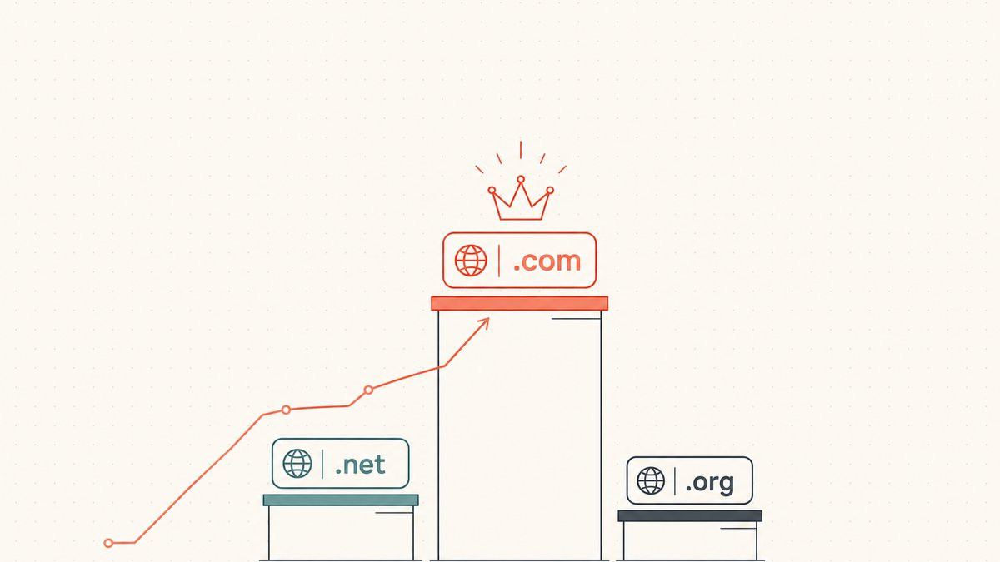
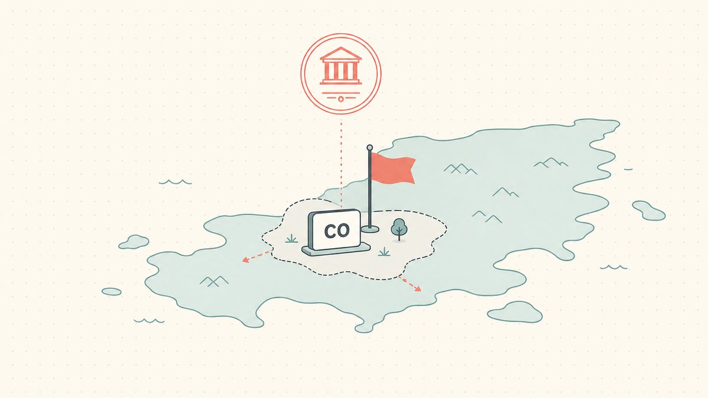

把一串好字母放到三种不同后缀下分别定价，你会得到三个截然不同的数字，有时甚至相差一个数量级。词没变，变的只是点号后面那部分。对域名翻转者来说，后缀绝不是估值收尾时随手补上的细节。它是决定一个域名值多少钱、以及它有多容易卖出去的最大单一杠杆之一。

本文拆解[顶级域名（TLD）](/zh/glossary/tld/)是如何驱动价值的：为什么 `.com` 至今仍稳居顶端、能拿到溢价；`.io`、`.ai`、`.co` 各自的真正定位；以及每一个国家代码后缀里都内嵌着的政策与地缘政治风险。本文是我们[域名翻转](/zh/blog/domain-flipping/)系列的一部分，也是估值支柱文章[如何为域名估值](/zh/blog/how-to-value-a-domain-name/)的姊妹篇。如果你对"什么是 TLD"还很陌生，可以先从[什么是顶级域名（TLD）](/zh/blog/what-is-a-tld/)读起。

## .com 的溢价是真实存在的，而且它是一种"默认税"

先从那个所有其他后缀都要拿来对标的后缀说起。`.com` 据维基百科[是 *commercial*（商业）的缩写](https://en.wikipedia.org/wiki/.com#:~:text=it%20is%20short%20for%20commercial)，并且[已经发展成最大的顶级域名](https://en.wikipedia.org/wiki/.com#:~:text=It%20has%20grown%20into%20the%20largest%20top%2Dlevel%20domain)，截至 2025 年第四季度已注册名称达 [1.61 亿](https://en.wikipedia.org/wiki/.com#:~:text=161%20Million)。没有任何其他后缀能与之接近。

正是这种规模，让同一个词的 `.com` 版本比放在别的 TLD 上要值钱得多。`.com` 是人们不假思索就会敲进去的后缀，是顾客在依稀记得某个品牌时默认补上的后缀，是你永远不必在电话里逐字拼出、也不必在广告牌上特意标注的后缀。其他每一个后缀都背着一笔小小的、持续不断的成本：拥有者必须不停地*纠正*这个默认值。他们要在广告文案里写明"是 `.io`，不是 `.com`"；他们眼睁睁看着[直输流量](/zh/glossary/type-in-traffic/)流向那个自己并不拥有的 `.com`；他们要比自己希望的更频繁地回答"不对，是点-c-o"。买家为 `.com` 支付的溢价，正是用来买"永远不必再交这笔税"的价钱。对于绝大多数通用、易记、可以脱口而出的名称来说，这就是为什么 [`.com`](/zh/tld/com/) 版本是水位线的最高点，而其他一切都要相对于它打折成交。

溢价最宽的地方，恰恰是名称最面向大众市场的地方。一个靠口口相传立足的消费品牌需要 `.com`；一个被搞糊涂的顾客带来的损失是实打实的真金白银。而一个用户都泡在终端里的开发者工具，对此的在意程度就低得多。所以 `.com` 溢价的大小不是一个常数。它随着这个名称最终买家有多依赖人们凭记忆敲入它而水涨船高。

## .io、.ai、.co 各自的真正定位

溢价并不意味着其他后缀就便宜。它意味着这些后缀是靠不同的条件取胜的。最强势的非 `.com` 后缀，并不试图在"做万能默认值"这件事上打败 `.com`。它们靠的是把某个*细分领域*赢得如此彻底，以至于在那个领域内部，它们读起来就像是原生的。

**`.io` 是开发者的徽章。** 它本是英属印度洋领地的 ccTLD，但市场把它读作 I/O、输入/输出，整整一代 SaaS、开发者工具和基础设施公司把它当作"技术认真"的信号采用了下来。结果就形成了一个火热而高度压缩的命名空间，好的短名能卖到五位数、六位数美元——这与让优质 `.com` 变贵的是同一套机制，只不过被塞进了一个更小的池子里。我们在[为什么 .io 域名这么贵](/zh/blog/why-are-io-domains-expensive/)以及 [`.io` TLD 页面](/zh/tld/io/)里详细拆解了它的定价。

**`.ai` 是异军突起者。** 它[是安圭拉的互联网国家代码顶级域名（ccTLD）](https://en.wikipedia.org/wiki/.ai#:~:text=is%20the%20Internet%20country%20code%20top%2Dlevel%20domain%20%28ccTLD%29%20for%20Anguilla)，而 AI 热潮把这个弹丸领地的两个字母变成了市场上最抢手的后缀之一。这股需求强劲到足以体现在一国财政预算上：据维基百科，[2023 年，安圭拉政府从 .ai 域名注册费中收取了约 3200 万美元；这相当于该领地国内生产总值的 10% 以上](https://en.wikipedia.org/wiki/.ai#:~:text=In%202023%2C%20Anguilla%27s%20government%20made%20about%20US%2432%20million)。对域名翻转者而言，`.ai` 是当下需求曲线最陡的地方，这既意味着最好的上行空间，也意味着最多的泡沫。我们在 [.ai 与 .io 对决](/zh/blog/ai-vs-io-domain/)以及 [`.ai` TLD 页面](/zh/tld/ai/)里做了正面比较。

**`.co` 是与 `.com` 擦肩而过的那一个。** 它[是分配给哥伦比亚的互联网国家代码顶级域名（ccTLD）](https://en.wikipedia.org/wiki/.co#:~:text=is%20the%20Internet%20country%20code%20top%2Dlevel%20domain%20%28ccTLD%29%20assigned%20to%20Colombia)，被作为 `.com` 的更短替身在全球推广（"co" 即 company，公司），而且[世界上任何个人或实体都可以注册 .co 域名](https://en.wikipedia.org/wiki/.co#:~:text=Any%20individual%20or%20entity%20in%20the%20world%20can%20register%20a%20.co%20domain)。它读起来干净利落，可用的好名也远比 `.com` 多。问题恰恰出在它吸引人的同一点上：它和 `.com` 只差一个字母，所以直输流量和信任度都会朝着那个买家多半并不拥有的 `.com` 渗漏。它最终的定位，可参见 [`.co` TLD 页面](/zh/tld/co/)。

这三者背后是同一个规律：一个非 `.com` 后缀，最值钱的时候是它独占了一个 `.com` 无法主张的*使用场景*。`.io` 之于开发者，`.ai` 之于 AI 初创公司，[`.app`](/zh/tld/app/) 之于移动产品。而当一个后缀只是某个抢不到的 `.com` 的廉价替代品时，折扣就会很深，转售市场也很冷清。区分这两种情形所需要的眼力，与[决定域名价值的因素](/zh/blog/what-makes-a-domain-valuable/)里那套基本功是同一套；而这里还栖息着一门完整的子手艺：[域名创意拼接](/zh/blog/domain-hacks-explained/)，也就是让后缀*变成*单词的最后一个音节，比如 `instagr.am`（`.am` 是[亚美尼亚的互联网国家代码顶级域名（ccTLD）](https://en.wikipedia.org/wiki/.am#:~:text=is%20the%20internet%20country%20code%20top%2Dlevel%20domain%20%28ccTLD%29%20for%20Armenia)）。这个故事我们写在了 [instagr.am 案例研究](/zh/blog/from-instagr-am-to-instagram-com/)里。

## ccTLD 是别人的国家

接下来这部分，是大多数"创业最佳后缀"清单都跳过的，而它恰恰是把一个业余爱好者和一个真正能给这些域名定出价的人区分开来的关键。上面提到的那些后缀（`.io`、`.ai`、`.co`、`.am`）全都是**国家代码 TLD**。当你注册其中之一时，你租用的是一块主权领土的两个字母，而规则由那块领土来定。`.com` 受一套稳定、全球中立的框架治理。而一个 [ccTLD](/zh/glossary/cctld/) 听命于一个国家，国家会更改政策、限制注册，偶尔还会扣押名称。

这种风险最极端的版本，是 `.com` 根本无须背负的那种：国家代码本身都可能成为问题。这正是悬在 `.io` 头上的那桩未决之事。它的存在依赖于英属印度洋领地作为一个独立实体而存在，而正在发生变化的恰恰就是这一点。英国与毛里求斯已就移交查戈斯群岛主权达成协议，维基百科把域名层面的后果说得很直白：[移交之后，按照现行 IANA 规则，.io 域名可能必须被逐步淘汰，而这个过程至少需要 5 年](https://en.wikipedia.org/wiki/.io#:~:text=After%20the%20transfer%2C%20current%20IANA%20rules%20may%20require%20the%20.io%20domain%20to%20be%20phased%20out)。目前并没有任何东西被关停，时间表既长又不确定，现实的解读是"不确定"而非"紧急"。但这是一类 `.com` 身上根本不存在的风险，深思熟虑的买家如今会把这点小小的尾部风险计入价格。

ccTLD 风险还有一种更安静、更常见的味道：注册局可以在你脚下改变经济账。一个国家可以在续费时上调批发价（这在很大程度上正是 `.io` 的持有成本越来越高的原因），可以收紧注册资格，或者限制允许的内容。对持有一个域名组合的翻转者来说，这是一个实打实的账面科目，而不是脚注。教训不是"永远别碰 ccTLD"，而是*把这个国家算进价格里*：在你决定一个 ccTLD 名称值多少钱之前，先弄清楚这个[注册局](/zh/glossary/registry/)的政策、它在涨价方面的历史记录，以及那块领地有多稳定。

## 注册量不等于价值

刚入行的翻转者常常会抓住一条诱人的捷径：挑选注册量最大的后缀，理由是数量能反映需求。事实并非如此。最清楚的反面教材是 `.tk`，[托克劳的国家代码顶级域名（ccTLD）](https://en.wikipedia.org/wiki/.tk#:~:text=is%20the%20country%20code%20top%2Dlevel%20domain%20%28ccTLD%29%20for%20Tokelau)——一块只有几千人口的领地。由于在 Freenom 的免费注册模式下，[用户和小企业可以免费注册任意数量的域名](https://en.wikipedia.org/wiki/.tk#:~:text=Users%20and%20small%20businesses%20were%20able%20to%20register%20any%20number%20of%20domain%20names%20free%20of%20charge)，`.tk` 域名一度[以 31,311,498 个已注册域名位居全球第一](https://en.wikipedia.org/wiki/.tk#:~:text=The%20.tk%20domain%20ranked%20first%20worldwide%20with%2031%2C311%2C498%20registered%20domain%20names)——甚至超过了 `.cn`。然而 `.tk` 名称的转售价值几乎为零，整个区域还成了滥用行为的磁铁：据维基百科，[.tk 域名被用于"不良行为"（包括钓鱼和垃圾邮件等骗局）的概率是全球平均水平的两倍](https://en.wikipedia.org/wiki/.tk#:~:text=.tk%20domains%20were%20twice%20as%20likely%20as%20the%20global%20average%20to%20be%20used%20for%20%22unwanted%20behaviours%22)。当免费项目崩溃时，那个表面上的市场份额也随之蒸发。

要点是：注册*量*是一个营销信号，不是价值信号。真正值得追问的数字是续费率和使用率——也就是有多少名称能撑过一年，以及有多少名称真正解析到了某个真实的东西。我们在[按注册量排名的 ccTLD 市场份额](/zh/blog/cctld-market-share-by-registration-volume/)里深入剖析了它是如何扭曲排行榜的。对一个投资者来说，一个小而有门槛、维护良好的命名空间，每一次都胜过一个巨大的免费层命名空间。

## 估值时如何权衡后缀

把这些汇总成一份可用的清单。当后缀是估值里那个变量时，请追问：

1. **有没有一个完全匹配的 `.com`，又是谁拥有它？** `.com` 设定了天花板。如果买家能拿到 `.com`，你那个别的后缀的版本就要和它竞争，并打折成交。如果 `.com` 被一个不相干的第三方占着、拿不到，那么一个强势的替代后缀就更值钱，因为没有一个默认值可以把流量流走。
2. **这个后缀是否*独占*了买家的使用场景？** 卖给开发者工具创始人的 `.io`，或卖给 AI 初创公司的 `.ai`，是在向原生需求出售。同一个名称放在错配的后缀上，就是一个打折的替代品。把后缀匹配到它读起来像是显而易见的选择、而不是退而求其次的地方。
3. **这个名称有多面向大众市场？** 最终买家越是依赖人们凭记忆敲入这个名称，`.com` 溢价就越重要，非 `.com` 后缀受到的惩罚也越大。一个为口口相传而生的名称想要 `.com`；一个面向"会复制粘贴 URL 的受众"的名称，则能承受更多的后缀风险。
4. **把这个国家算进价格里。** 对任何 ccTLD，都要把注册局的政策、续费价格走势和政治稳定性纳入考量。一个落在动荡或续费昂贵的 ccTLD 上的漂亮名称，背着一个 `.com` 永远不会有的折扣。
5. **无视注册量排行榜。** 不要因为一个后缀"体量巨大"就多花钱。要去问续费率和使用率。又大又便宜注册，往往*正是因为*它一文不值才大。

简短版本：词设定了一个名称*可能*值多少钱的下限；后缀则决定了市场实际愿意为其中多少买单，以及你能多容易找到愿意买单的人。后缀选错，再好的词也只能卖不出去地杵在那里。

## 这在市场顶端是什么样子

有一个经过核实的锚点让这种溢价变得具体。有公开披露记录的最高域名成交是 Voice.com，据维基百科的清单[于 2019 年以 30,000,000 美元成交](https://en.wikipedia.org/wiki/List_of_most_expensive_domain_names#:~:text=Voice.com)——一个 `.com`，被一位财力雄厚、就是需要一个常用词的默认版本、别的什么都不行的买家买下。这不是一个普通名称的可比案例。但它干净利落地说明了那条原则：在每一个层级，那个无须任何解释的后缀，就是能卖出最高数字的后缀；而其他每一个后缀，用价格的话来说，都是一段关于"为什么这个折扣值得"的论证。

## Namefi 的视角

一旦你决定了一个名称应该落在哪个后缀上，这桩交易的另一半就是把它干净利落地转移出去，而这正是后缀以一种很实际的方式再次发挥作用的地方。转移一个高价值名称，意味着要证明谁掌控着它，并在站点不至于断线的前提下把它交出去——而这套机制在不同注册局和国家代码之间各不相同。这种摩擦与任何高价值[域名交易](/zh/glossary/domain-trading/)背后的摩擦是同一种，而它在跨[注册商](/zh/glossary/registrar/)和跨 ccTLD 边界时尤为尖锐。

这正是 [Namefi](https://namefi.io) 旨在收窄的鸿沟。代币化的所有权让对一个真实 [ICANN](/zh/glossary/icann/) 域名的掌控更容易被验证和转移，并通过 [DNS](/zh/glossary/dns/) 连续性让名称在交接过程中持续解析。选对后缀是估值的判断；让那个名称的转移变得可审计，才是让你真正能凭这个判断去交易的东西。

## 友情免责声明（请读我！）

> 我们不是律师、会计师、理财顾问，也不是医生，**本文中的任何内容都不构成法律、财务、税务、会计、医疗或其他任何形式的专业建议。** 我们写这些文章是为了教育我们自己，也是为了方便我们的客户。这里的信息可能已经过时、只适用于特定地区，或者干脆就是错的。我们也会犯错。

> 对于任何重要决定，**请咨询一位真正的专业人士（说真的！）**。或者，如果那不合你的风格，那就问问朋友、问问 Twitter、问问 Reddit、问问 AI，或者问问算命先生。总之一句话：**DOYR——自己动手做研究（Do Your Own Research）**。让我们一起学习，玩得开心。

## 来源与延伸阅读

- 维基百科 — [.com](https://en.wikipedia.org/wiki/.com#:~:text=It%20has%20grown%20into%20the%20largest%20top%2Dlevel%20domain)（最大的 TLD；*commercial* 的缩写；截至 2025 年第四季度已注册 1.61 亿个）
- 维基百科 — [.io（英属印度洋领地；IANA 逐步淘汰至少需要 5 年）](https://en.wikipedia.org/wiki/.io#:~:text=After%20the%20transfer%2C%20current%20IANA%20rules%20may%20require%20the%20.io%20domain%20to%20be%20phased%20out)
- 维基百科 — [.ai（安圭拉；2023 年约 3200 万美元，占 GDP 的 10% 以上）](https://en.wikipedia.org/wiki/.ai#:~:text=In%202023%2C%20Anguilla%27s%20government%20made%20about%20US%2432%20million)
- 维基百科 — [.co（哥伦比亚；面向全球任何注册者开放）](https://en.wikipedia.org/wiki/.co#:~:text=Any%20individual%20or%20entity%20in%20the%20world%20can%20register%20a%20.co%20domain)
- 维基百科 — [.am（亚美尼亚）](https://en.wikipedia.org/wiki/.am#:~:text=is%20the%20internet%20country%20code%20top%2Dlevel%20domain)
- 维基百科 — [.tk（托克劳；免费注册，峰值 3130 万，钓鱼/滥用）](https://en.wikipedia.org/wiki/.tk#:~:text=The%20.tk%20domain%20ranked%20first%20worldwide%20with%2031%2C311%2C498%20registered%20domain%20names)
- 维基百科 — [最昂贵域名列表（Voice.com，3000 万美元，2019 年）](https://en.wikipedia.org/wiki/List_of_most_expensive_domain_names#:~:text=Voice.com)
