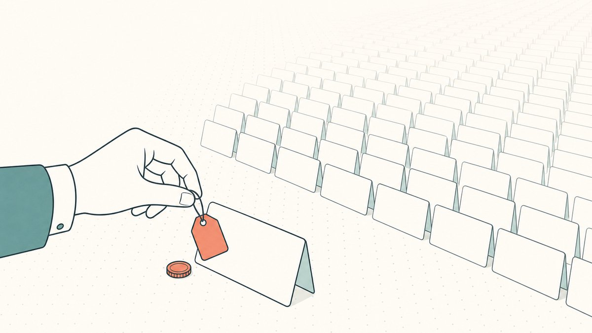
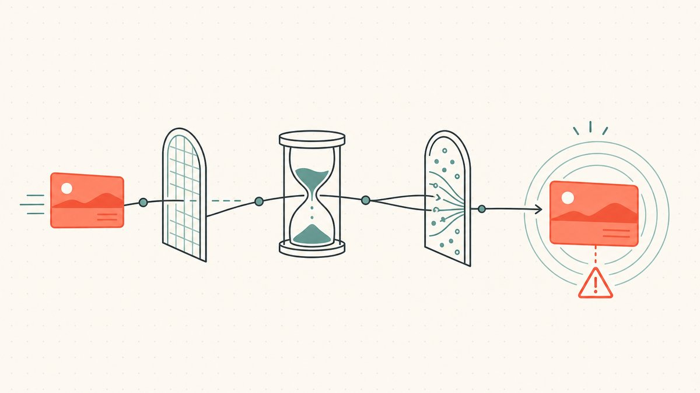

域名转售的一切都始于你购买的域名。即使你是出色的谈判专家和敏锐的评估师，但如果你采购的域名无人问津，这些技能也无用武之地。采购是这行里第一项真正的技能，也是大多数新手容易搞反的一点——他们总是先爱上一个域名，然后再去寻找买家。

将域名收入囊中的方式有四种，每种方式的价格标签和风险状况都截然不同。手动注册一个全新的域名只需支付注册费，但要与近乎无限的供应量竞争。[抢注](/zh/glossary/backorder/)一个即将过期的域名可能会带来现成的域名年龄或流量，但好的域名总是竞争激烈。拍卖会浮现出高质量的域名，但也会引发竞价战。而从[二级市场](/zh/glossary/aftermarket/)的其他持有者手中购买，则是以成熟资产的价格获得一项成熟资产。本指南将逐一介绍这四种渠道，并以贯穿始终的一项纪律收尾：学会拒绝。这是我们更全面的[域名转售指南](/zh/blog/domain-flipping/)中关于采购的核心支柱。

## 各供应渠道概览

域名市场分为两部分。正如维基百科所述，[域名投机的一级市场涵盖了以前从未被注册过的新注册域名](https://en.wikipedia.org/wiki/Domain_name_speculation#:~:text=The%20primary%20market%20for%20domain%20name%20speculation%20covers%20newly%20registered%20domain%20names%20that%20have%20not%20been%20registered%20before)——这就是手动注册。另一半是[域名二级市场](/zh/glossary/marketplace/)，维基百科将其定义为[互联网域名的二次转售市场，有意向的买方通过出价或谈判的方式，收购一个已被注册的域名](https://en.wikipedia.org/wiki/Domain_aftermarket#:~:text=is%20the%20secondary%20resale%20market%20for%20Internet%20domain%20names)——这涵盖了过期抢注、拍卖和直接收购。

大致按照从最便宜、风险最高到最昂贵、最安全排序，你的四个渠道分别是：手动注册、过期/掉落域名、拍卖和二级市场收购。价格越低，几乎总是意味着需要做更多的尽职调查，转售的机会也越渺茫；价格越高，通常意味着市场已经为你做了一些筛选，并将这些价值计入了价格中。

## 手动注册：成本最低，转售最难

手动注册指的是创造一个全新的名称，并在[注册商](/zh/glossary/registrar/)处以标准费用进行新注册。这是每个人的起点，因为入场成本极低——维基百科指出，截至 2023 年，一个简单的 `.com` 域名[零售成本通常在每年约 $9.70 到约 $35 之间](https://en.wikipedia.org/wiki/Domain_name_registrar#:~:text=the%20retail%20cost%20generally%20ranges%20from%20a%20low%20of%20about%20%249.70%20per%20year)。

这种低价恰恰是个陷阱。当任何人都能以一个三明治的价钱注册一个域名时，可用字符串的供应实际上是无限的，而那些至今仍未被注册的域名，未被注册是有原因的：那些显而易见、有价值的早已在多年前被抢占。手动注册就像一场游戏，你需要找到“仍然可用”和“有人愿意为此付费”之间的小小交集——通常是一个新颖的双词品牌域名、一个紧跟最新趋势的名称，或是在像 [`.app`](/zh/tld/app/) 或 [`.io`](/zh/tld/io/) 这样库存尚未被挑完的较新[后缀](/zh/tld/xyz/)中的强力组合。

这里的纪律在于计算[持有成本](/zh/glossary/holding-cost/)。你每持有一个手动注册的域名，每年都要支付续费，而你注册的大部分域名永远也卖不出去。只有当偶尔的销售收入能够轻松覆盖所有未售出域名的续费成本时，这个渠道才行得通。我们关于[手动注册可转售域名](/zh/blog/hand-registering-domains-to-flip/)的深度指南涵盖了战胜无限供应问题的模式，而[如何为你的项目命名](/zh/blog/how-to-name-your-project/)一文则提供了一个有用的视角，帮助你理解什么才真正具有品牌价值。

## 过期和掉落域名：购买域名年龄，继承潜在风险

当注册人停止续费时，域名并不会立即恢复为可注册状态。它首先会经历一个固定的宽限期生命周期，而理解这个时间线正是掌握该渠道的全部技巧所在。过期之后有一个赎回窗口——根据维基百科，[赎回宽限期……允许注册人在域名过期后的若干天内将其赎回](https://en.wikipedia.org/wiki/Domain_drop_catching#:~:text=The%20Redemption%20Grace%20Period)，这个期限[因顶级域名（TLD）而异，通常在 30 到 90 天左右](https://en.wikipedia.org/wiki/Domain_drop_catching#:~:text=varies%20by%20TLD%2C%20and%20is%20usually%20around%2030%20to%2090%20days)。只有在那之后，在为期 [5 天的“待删除”阶段结束时，该域名才会从 ICANN 数据库中被删除](https://en.wikipedia.org/wiki/Domain_drop_catching#:~:text=At%20the%20end%20of%20the%20%22pending%20delete%22%20phase%20of%205%20days%2C%20the%20domain%20will%20be%20dropped)，并再次变为可注册状态。

与手动注册相比，掉落域名的吸引力在于它可能自带历史：例如域名年龄、入站链接、残余的直接输入流量或已有的搜索权重。风险在于，你也会继承前任所有者的历史包袱——一个被垃圾邮件污染、卷入商标纠纷或带有你不想关联的链接的域名。尽职调查不是可选项。检查历史记录（[WHOIS](/zh/glossary/whois/) 记录和历史快照）、检查商标风险，并且绝不要想当然地认为“老”就等于“好”。一个因为有问题而被放弃的域名，可能会永远砸在你手里。我们在[过期域名与掉落周期](/zh/blog/expired-domains-and-the-drop-cycle/)一文中详细介绍了完整的生命周期和尽职调查清单。

## 拍卖：让市场为你定价

一些最好的域名永远不会悄无声息地掉落——它们会被拍卖，要么由注册商出售其即将到期的库存，要么在二级市场平台上进行。[拍卖](/zh/glossary/auction/)是一个为你完成了最智能筛选的渠道：平台已经筛选出有明显需求的域名，而竞价则实时揭示了市场认为它们值多少钱。

这种透明度也正是其成本所在。域名之所以会进入拍卖，其根本原因就是竞争——正如维基百科在谈到高需求掉落时指出的，[对于特别受欢迎的域名，通常会有多方等待其过期](https://en.wikipedia.org/wiki/Domain_drop_catching#:~:text=For%20particularly%20popular%20domain%20names%2C%20there%20are%20often%20multiple%20parties%20anticipating%20the%20expiration)。当多个买家想要同一个域名时，价格会不断攀升，直到只剩下意愿最强的那个。赢得拍卖的纪律在于，在出价前设定一个硬性上限，并在价格超过时果断放弃。在这个渠道中，最快的亏钱方式就是让“赢得拍卖”取代“赚取利润”成为你的目标。我们关于[如何赢得域名拍卖](/zh/blog/how-to-win-domain-auctions/)的攻略涵盖了竞价策略，而[域名预订与抢注](/zh/blog/domain-backorders-and-drop-catching/)则解释了如何在一个域名进入公开拍卖前参与竞争。

## 二级市场收购：为确定性支付零售价

第四个渠道是直接从当前持有者手中购买一个已经注册的域名。这是最安全也是最昂贵的途径，因为你是在收购一项已知的资产，没有生命周期中的赌博成分——这个域名是真实存在的，背景干净，并且你可以在支付一分钱之前对其进行全面检查。大部分此类交易通过市场平台进行；正如维基百科所指出的，[交易由 Afternic 和 Sedo 等二级市场平台促成](https://en.wikipedia.org/wiki/Domain_aftermarket#:~:text=Transactions%20are%20facilitated%20by%20aftermarket%20platforms%20such%20as%20Afternic%20and%20Sedo)，这些平台连接买卖双方并作为交易的中间人。

二级市场规模巨大且流动性强。根据一项被广泛引用的统计，[据 NameBio 报道，2024 年记录在案的域名销售共有 144,700 笔，总额达 US$185 million](https://en.wikipedia.org/wiki/Domain_aftermarket#:~:text=According%20to%20NameBio%2C%20144%2C700%20domain%20name%20sales%20totaling%20US%24185%20million%20were%20recorded%20in%202024)——而这还仅仅是公开披露的交易。转售你在二级市场购买的域名更加困难，恰恰是因为卖家已经获取了大部分的升值空间；你的利润必须来自于找到一个被其他投资者低估的域名，或者触及到卖家无法触及的最终用户。当交易达成时，通常通过中立的[托管](/zh/glossary/escrow/)流程来完成，这样任何一方都不必先行一步——我们在[域名托管详解](/zh/blog/domain-escrow-explained/)中解释了这一机制，以及在[如何出售你拥有的域名](/zh/blog/how-to-sell-a-domain-name-you-own/)中讲解了同一交易中卖方的操作。

## 战胜所有渠道的纪律：学会拒绝

这是任何采购渠道都无法为你做到的事。每个渠道都会很乐意卖给你一个域名，但没有一个会告诉你，是否真的会有人想要它。在采购中，唯一最有价值的习惯恰恰是那个不产生任何域名的习惯：对于那些不符合你筛选标准的域名，无论它们看起来多么巧妙或便宜，都要果断放弃。

几个筛选标准就能完成大部分工作。这个域名是否存在一个*真实的、可以指明的买家*，还是你只是在凭空想象？大声说出来时，它听起来像一个清晰的词语或品牌，还是需要专门解释拼写？这个后缀的流动性是否足够好，以至于买家真的会在这里寻找域名？预期的转售价格能否在覆盖你的收购成本加上多年的续费后，还有足够的利润空间？任何一个不符合这些标准的域名，都只是一张伪装起来的续费账单。在购买前大致了解一个域名的价值是这项技能的评估部分——这在[如何为域名估值](/zh/blog/how-to-value-a-domain-name/)中有详细介绍——而将这两者结合起来，正是区分专业采购和业余收藏的关键。

在所有筛选标准之上，还有一条边界：法律红线。手动注册或抢注一个依赖他人商标的域名不是转售，而是一种法律责任，并且可能根据 [UDRP](/zh/glossary/udrp/) 被从你手中夺走。采购通用词、描述性词和自创词域名；无论那些与品牌相关的域名掉落价格多么便宜，都不要碰。

## Namefi 的视角

采购决定了你买*什么*。每次转售的另一半工作，是在域名售出时干净利落地完成交割——证明你持有它，在交付过程中不让网站中断，并确保资金和资产能够同时易手。这种结算摩擦在优质采购所产生的高价值域名上表现得最为尖锐。这正是 [Namefi](https://namefi.io) 旨在缩小的差距：代币化的所有权使得对一个真实 [ICANN](/zh/glossary/icann/) 域名的控制权更易于验证和转移，并且具备 DNS 连续性，确保域名在交接过程中持续解析。做好采购，然后交易那些所有权可审计而非仅凭信任的域名。

## 友情提醒（请阅读！）

> 我们不是律师、会计师、财务顾问或医生，**本文中的任何内容均不构成法律、财务、税务、会计、医疗或任何其他形式的专业建议。**我们撰写这些文章是为了自我学习，并为我们的客户提供便利。文中的信息可能已过时、具有地域特异性或完全错误。我们也会犯错。
>
> 对于任何重要决策，**请咨询真正的专业人士（认真的！）**。或者如果这不符合你的风格，可以问问朋友、问问 Twitter、问问 Reddit、问问 AI 或问问通灵师。简而言之：**DOYR - Do Your Own Research（请自行研究）**。让我们一起学习，享受乐趣。

## 资料来源与延伸阅读

- 维基百科 — [域名投机（一级市场 = 新注册域名）](https://en.wikipedia.org/wiki/Domain_name_speculation#:~:text=The%20primary%20market%20for%20domain%20name%20speculation%20covers%20newly%20registered%20domain%20names%20that%20have%20not%20been%20registered%20before)
- 维基百科 — [域名二级市场（定义；Afternic 和 Sedo；NameBio 2024 年销售额）](https://en.wikipedia.org/wiki/Domain_aftermarket#:~:text=According%20to%20NameBio%2C%20144%2C700%20domain%20name%20sales%20totaling%20US%24185%20million%20were%20recorded%20in%202024)
- 维基百科 — [域名抢注（赎回宽限期 30-90 天；5 天待删除期；热门域名掉落的竞争）](https://en.wikipedia.org/wiki/Domain_drop_catching#:~:text=The%20Redemption%20Grace%20Period)
- 维基百科 — [域名注册商（.com 零售价约 $9.70/年起）](https://en.wikipedia.org/wiki/Domain_name_registrar#:~:text=the%20retail%20cost%20generally%20ranges%20from%20a%20low%20of%20about%20%249.70%20per%20year)
