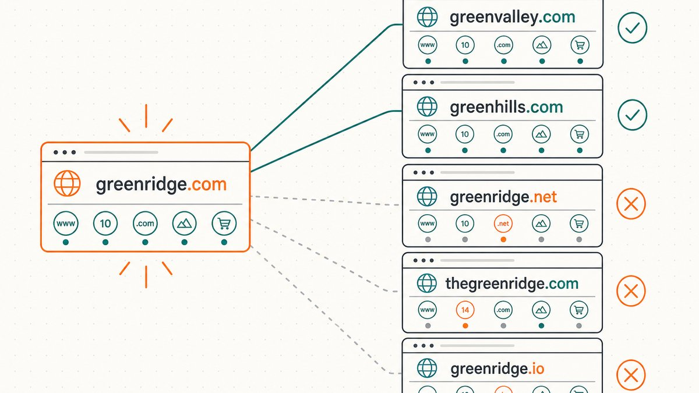
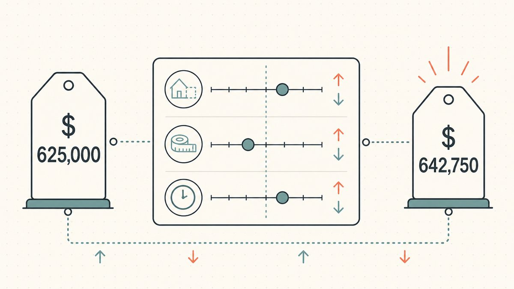
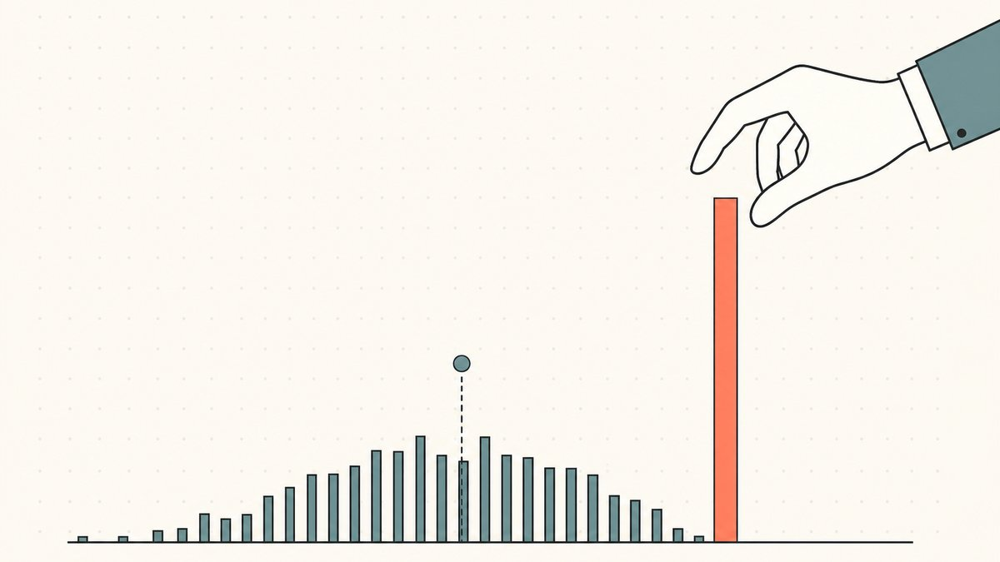

如果你问一位房地产估价师一栋房子值多少钱，他们不会凭空猜测。他们会调出附近类似房屋最近的成交价，然后在此基础上进行调整。域名评估的原理与此相同，而相当于“附近近期销售记录”的就是公开的过往域名销售记录：即可比案例（comps）。学会解读这些数据，你几乎可以为自己设定的任何价格进行辩护。而如果粗心大意地解读，你最终说服自己的价格，可能根本得不到市场的认可。

本指南是我们关于[如何评估域名价值](/zh/blog/how-to-value-a-domain-name/)的核心文章中承诺的深度解析，也是更广泛的[域名交易](/zh/blog/domain-flipping/)技能树中的一环。它涵盖了销售数据的来源、如何找到真正具有可比性的案例、如何针对总是存在的差异进行调整，以及比任何其他单一错误更能毁掉评估的“挑拣式选例”陷阱。

## 销售数据的来源

可比案例的原始材料是已披露的公开域名销售历史，而行业标准参考是 NameBio，一个可搜索的历史域名销售价格数据库。它是业内其他人士引用的来源。维基百科的域名二级市场概述就引用了它的头条市场数据：[根据 NameBio 的数据，2024 年共记录了 144,700 笔域名销售，总额达 1.85 亿美元](https://en.wikipedia.org/wiki/Domain_aftermarket#:~:text=According%20to%20NameBio%2C%20144%2C700%20domain%20name%20sales%20totaling%20US%24185%20million%20were%20recorded%20in%202024)。当你寻找可比案例时，你搜索的就是这个数据库：每年数以万计的已披露销售记录，可通过关键词、扩展名、长度、价格和日期进行搜索。这些记录来自已披露的交易市场和[注册商](/zh/glossary/registrar/)交易，这就是为什么公开数据库虽然庞大但永远不完整的原因。

关于这个数据库的两个事实影响了下文的一切。首先，它严重偏向于 `.com`。根据同一份概述，2024 年，[.com 域名的销售额占年度总美元交易额的 74.4%](https://en.wikipedia.org/wiki/Domain_aftermarket#:~:text=accounted%20for%2074.4%25%20of%20the%20year%27s%20total%20dollar%20volume)——因此，你会发现 `.com` 域名的可比案例数据密集且可靠，而转向其他[扩展名](/en/glossary/tld/)时，数据则会越来越稀疏。其次，市场每年都在变化：2024 年，尽管销售数量有所下降，但总美元交易额[相比 2023 年增长了 32.8%](https://en.wikipedia.org/wiki/Domain_aftermarket#:~:text=rose%20by%2032.8%25%20compared%20to%202023)。三年前的可比案例是在一个与今天不同的市场中达成的，这是你必须做出的调整。

自动评估工具也从这个相同的数据源中获取信息。例如，GoDaddy 的估值工具称其[算法使用专有的机器学习和真实的市场销售数据来估算域名价值，为您提供可比的域名销售案例](https://www.godaddy.com/resources/skills/godaddy-domain-name-value-appraisal-tool#:~:text=algorithm%20uses%20proprietary%20machine%20learning%20and%20real%20market%20sales%20data%20to%20estimate%20domain%20values)，这样你就能更有信心地定价。这个工具自动完成的，正是本指南教你手动操作的事情：提取可比销售案例并对其进行权衡。知道如何亲自解读可比案例，能让你对机器进行理性检验，而不是盲目相信它——我们在[域名评估工具比较](/zh/blog/domain-appraisal-tools-compared/)中对这些工具进行了比较。

## 怎样才算真正的可比销售案例

一个可比案例只有在它与你的域名真正*相似*时才有用。最常见的评估错误是，将任何包含你关键词的销售案例都视为你定价的证据。事实并非如此。一个真正的可比案例是在真正驱动价值的维度上与你的域名相匹配，而不仅仅是词语本身。

请按照这个清单逐项检查，从最严格的约束条件开始：

- **相同的扩展名。** 一个 `.com` 的销售案例绝不能作为[`.net`](/en/glossary/tld/) 或 `.co` 域名的可比案例。扩展名是影响价格的最大杠杆之一，混淆它们是自欺欺人的最快方式。如果你正在为 `.io` 定价，就找 `.io` 的可比案例；如果你为 `.xyz` 定价，就找 `.xyz` 的可比案例。我们在[顶级域名（TLD）如何影响域名价值](/zh/blog/how-tld-affects-domain-value/)中解释了为什么差距如此之大。
- **相同的长度级别。** 单个词的域名、简短的双词域名、三个或更多词的域名，以及带有数字或连字符的域名属于不同的资产类别。一个四字母的品牌域名对于一个十五个字符的三词短语域名几乎没有参考价值。
- **相同的关键词家族和商业意图。** 一个与交易相关的词（如`loans`、`insurance`、`casino`）的交易曲线与一个爱好类的词不同。要匹配词的*种类*，而不仅仅是主题。`puppies` 和 `mortgages` 都是常见的英语名词，但它们不能互为可比案例。
- **相同的买家类型。** 这是新手交易者会忽略的一点。同一个域名，卖给另一个投资者的批发价和卖给终端用户的零售价可能天差地别。一个经销商的可比案例告诉你应该*支付*多少钱；一个终端用户的可比案例告诉你可能*得到*多少钱。不要将它们平均——它们衡量的是两个不同的市场，这正是[终端用户与经销商域名定价](/zh/blog/end-user-vs-reseller-domain-pricing/)的核心要点。
- **近期性。** 一个来自热门年份的销售案例与一个来自平淡年份的定价不同。应更重地权衡近期的可比案例，并将几年前的案例视为方向性参考，而非决定性依据。

一个在所有五个方面都匹配的可比案例是黄金标准。一个匹配两项的案例是一个需要你进行大幅调整的起点。而一个只匹配一项——仅仅是关键词——的案例，几乎不能算作证据。

## 针对总是存在的差异进行调整

没有两个域名是完全相同的，所以每个可比案例都需要调整。这正是评估从查找变成一项技能的地方。原则说起来很简单：从可比案例的价格开始，然后根据你的域名与之不同的每个方面进行上调或下调。

**扩展名。** `.com` 是市场其他部分定价的基准。如果你的可比案例是 `.com` 而你的域名不是，那就向下调整——通常是大幅下调——因为相同的字符串在信任度较低的扩展名上价值更低。如果你幸运地拥有 `.com` 而你的可比案例是一个较弱的扩展名，那就向上调整。高端扩展名在其细分领域打破了这一规则：一个用于开发者工具的[`.io`](/zh/tld/io/)或一个用于 AI 初创公司的[`.ai`](/zh/tld/ai/)，其价格可能接近或超过一个通用的 `.com`，而二级市场已经注意到了这一点——2024 年 `.ai` 的美元交易额[增长了一倍多，上升了 107%](https://en.wikipedia.org/wiki/Domain_aftermarket#:~:text=more%20than%20doubled%2C%20rising%20107%25)。要根据扩展名的市场来定价，而不仅仅是扩展名本身。

**长度和结构。** 更短、更简洁的向上调整；更长、带连字符或数字的向下调整。如果你的可比案例是 `cars.com` 级别的，而你的域名是 `bestcars-online.com`，那么这个可比案例是你遥不可及的天花板，而不是地板。

**词语强度。** 一个真实、有搜索量、易于发音的词，相对于一个基于较弱词语的可比案例应向上调整，而相对于一个更强词语的案例则应向下调整。在这里要诚实。一个可比案例*包含*你的关键词，并不意味着它承载着同样的需求——`flowers` 和 `flowerz` 不是同一种资产，尽管一个简单的匹配可能会将它们配对。

**市场时机。** 如果你最强的可比案例来自一个更热门的年份，应根据今天的市场情况将其折价。如果市场此后升温，则向上微调。单年 32.8% 的波动提醒我们，“它当时卖了多少钱”和“它现在能卖多少钱”是两个不同的问题。

**附加价值。** 有些销售案例根本不能算作一个裸域名的可比案例，因为买家支付的是一个*业务*，而不是一个字符串。当 QuinStreet 在 2010 年以 [4970 万美元现金](https://www.globenewswire.com/news-release/2010/11/08/433738/12254/en/QuinStreet-Announces-Acquisition-of-CarInsurance-com-Inc.html#:~:text=for%20%2449.7%20million%20in%20cash)收购 `CarInsurance.com` 时，这个价格并非针对域名本身。Domain Name Wire 报道称，[其价值主要来自网站获得的自然流量以及这些流量如何转化为潜在客户](https://domainnamewire.com/2010/11/09/quinstreet-bought-carinsurance-com-for-the-organic-traffic/#:~:text=the%20value%20comes%20primarily%20from%20the%20organic%20traffic)。使用这样的销售案例来为一个停放的、没有流量的同类域名做比较，会将你的估价夸大数百万。在比较之前，请剔除附加价值，或者干脆不要使用这个销售案例。

## “挑拣式选例”陷阱

这是毁掉最多评估的一个错误，比其他所有错误加起来还多：你找到关键词家族中那一个天价的销售案例，以此为锚点，却忽略了它周围上百个普通的案例。这是行业中最容易掉入的陷阱，因为数据本身就在诱惑你这么做——最大的销售案例最出名，被引用最多，也最能带来情感上的满足感。

公开记录就是这样诱惑你的。维基百科的最昂贵域名列表只收录[价值 300 万美元或以上的销售](https://en.wikipedia.org/wiki/List_of_most_expensive_domain_names#:~:text=most%20expensive%20domain%20name%20sales%2C%20with%20values%20of%20%243%20million)，并且[仅限于纯域名和纯现金交易](https://en.wikipedia.org/wiki/List_of_most_expensive_domain_names#:~:text=limited%20to%20pure%20domain%20name%20and%20cash%2Donly%20sales)。那些头条数字——2019 年 [Voice.com](https://en.wikipedia.org/wiki/List_of_most_expensive_domain_names#:~:text=Voice.com) 的 3000 万美元，2010 年 [Sex.com](https://en.wikipedia.org/wiki/List_of_most_expensive_domain_names#:~:text=Sex.com) 的 1300 万美元，2001 年 [Hotels.com](https://en.wikipedia.org/wiki/List_of_most_expensive_domain_names#:~:text=Hotels.com) 的 1100 万美元——都是真实、经过验证的，但作为普通域名的可比案例却完全没有用。它们是单字、字典级的 `.com` 域名，卖给了有生存需求和雄厚财力的买家——这与 [TeslaMotors.com 到 Tesla.com 的品牌重塑](/zh/blog/from-teslamotors-com-to-tesla-com/)背后的动机相同，价格是由买家的需求决定的，而不是更广泛的市场。它们告诉你的是整个市场的上限，而不是你域名的价格。

解决方法是**根据分布定价，而不是峰值。** 当你提取可比案例时，要收集整个分布，而不仅仅是顶部。关注中位数和与你域名最相似的销售集群，并将高位异常值视为异常值——除非你的域名真的属于那个级别，否则就排除它。一个有用的习惯是：去掉你最高和最低的单个可比案例，然后用剩下的案例构建你的价格范围。如果你的可辩护价格完全依赖于一笔销售，那你就没有一个有可比案例支持的价格。你有的只是一个希望，而希望不是评估。

“挑拣式选例”也可能反向操作。一个与你谈判的买家会拿出*最低*的可比销售案例，并声称这就是市场价。同样的原则在两个方向上都能保护你：了解你的完整分布，明确指出你真正的可比案例，这样你就能在面对梦想家和压价者时捍卫你的价格。

## 一个快速实例

假设你持有 `BudgetTravel.io` 并想为它定价。错误的做法是找到 `Travel.com` 的著名销售案例然后开始做梦。正确的做法是运行清单检查。

从扩展名开始：你需要 `.io` 的可比案例，所以无论多么诱人，都要把 `.com` 的销售案例放在一边。设定长度和结构：`BudgetTravel` 是一个简洁、常见的双词短语，所以要更看重那些同样是简短、真实的双词域名的可比案例，而不是那些关键词堆砌或带连字符的。匹配关键词家族：旅游是一个有终端用户需求的真实商业类别，所以不要与爱好类词语的销售案例进行比较。检查买家类型：将批发的 `.io` 交易与任何终端用户的 `.io` 销售分开，并决定你估算的是哪种价格。然后根据时机进行调整，将较旧的可比案例向当前市场状况靠拢。

你最终得到的是一个*价格范围*，它锚定在一组真正相似的销售案例上，排除了异常值，并且每个剩余的可比案例都根据其与你域名的差异进行了调整。这个范围是一个你可以在谈判中捍卫的价格——而这正是评估的目的。当谈判变成交易时，下一个问题是安全地完成它；这是[托管服务](/zh/glossary/escrow/)的工作，也是我们在[域名托管服务详解](/zh/blog/domain-escrow-explained/)和[如何出售你拥有的域名](/zh/blog/how-to-sell-a-domain-name-you-own/)中介绍的工作流程。

## Namefi 的视角

解读可比案例告诉你一个域名值多少钱。交易的另一半是，在你们就价格达成一致后，如何证明域名确实干净利落地完成了交接。高价值的[域名交易](/zh/glossary/domain-trading/)总是卡在同一个信任鸿沟上：买家不想在控制资产前付款，而卖家不想在钱到账前放手。

这正是 [Namefi](https://namefi.io) 旨在弥合的鸿沟。将一个真实的 ICANN 域名代币化，使其所有权可审计、可转移，并保持 DNS 连续性，确保域名在交接过程中持续解析。可比案例给你一个可以捍卫的数字；一个干净、可验证的转移，则能将这个数字变成一笔成交的交易，而无需任何一方凭信念先行一步。

## 友情免责声明（请阅读！）

> 我们不是律师、会计师、财务顾问或医生，**本文中的任何内容均不构成法律、财务、税务、会计、医疗或任何其他类型的专业建议。** 我们撰写这些文章是为了自我教育，并为我们的客户提供便利。此处的信息可能已过时、具有地域特定性或完全错误。我们也会犯错。
>
> 对于任何重要决策，**请咨询真正的专业人士（说真的！）**。如果这不符合您的风格，可以问问朋友、Twitter、Reddit、AI 或通灵师。总之：**DOYR - Do Your Own Research**（自己做好研究）。让我们一起学习，享受过程。

## 来源和进一步阅读

- 维基百科 — [域名二级市场](https://en.wikipedia.org/wiki/Domain_aftermarket#:~:text=According%20to%20NameBio%2C%20144%2C700%20domain%20name%20sales%20totaling%20US%24185%20million%20were%20recorded%20in%202024) (NameBio 2024: 144,700 sales / US$185M; .com 74.4% of dollar volume; +32.8% YoY; .ai +107%)
- 维基百科 — [最昂贵域名列表](https://en.wikipedia.org/wiki/List_of_most_expensive_domain_names#:~:text=most%20expensive%20domain%20name%20sales%2C%20with%20values%20of%20%243%20million) (Voice.com $30M/2019, Sex.com $13M/2010, Hotels.com $11M/2001; $3M+ public, cash-only scope)
- GoDaddy — [域名价值与评估工具](https://www.godaddy.com/resources/skills/godaddy-domain-name-value-appraisal-tool#:~:text=algorithm%20uses%20proprietary%20machine%20learning%20and%20real%20market%20sales%20data%20to%20estimate%20domain%20values) (machine learning + real market sales data; provides comparable sales)
- GlobeNewswire — [QuinStreet 宣布收购 CarInsurance.com, Inc.](https://www.globenewswire.com/news-release/2010/11/08/433738/12254/en/QuinStreet-Announces-Acquisition-of-CarInsurance-com-Inc.html#:~:text=for%20%2449.7%20million%20in%20cash) ($49.7M cash, 2010)
- Domain Name Wire — [QuinStreet 收购 CarInsurance.com 是为了自然流量](https://domainnamewire.com/2010/11/09/quinstreet-bought-carinsurance-com-for-the-organic-traffic/#:~:text=the%20value%20comes%20primarily%20from%20the%20organic%20traffic)
