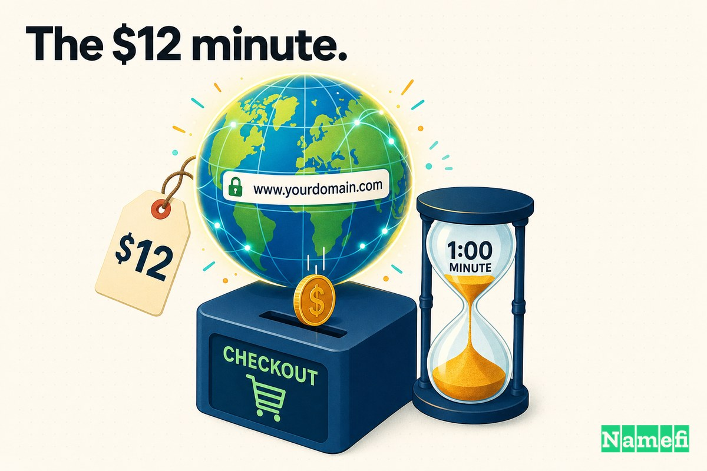
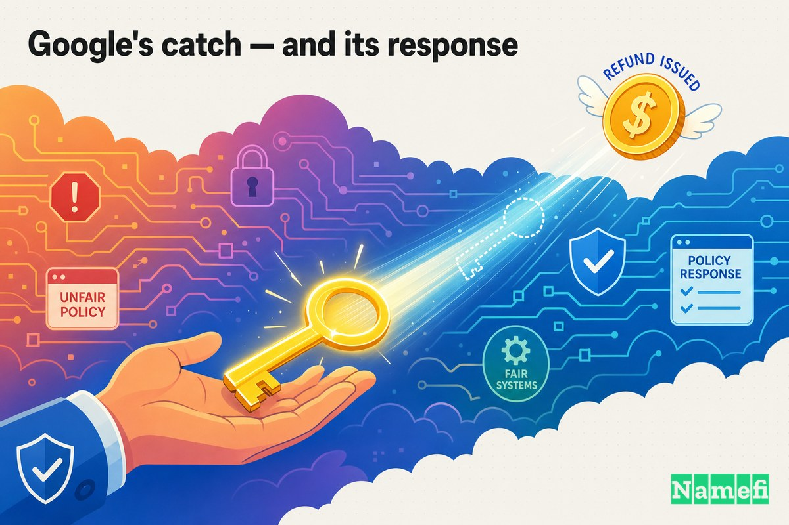
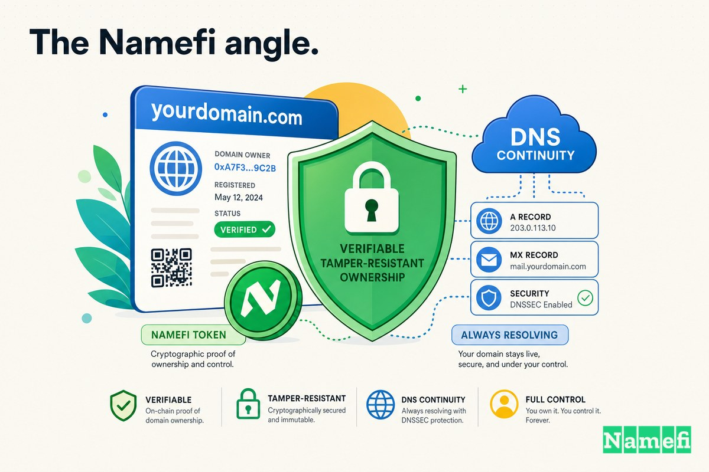

2015年9月29日夜间，有大约一分钟的时间，互联网上最有价值的地址并不属于谷歌。

它属于一位名叫 Sanmay Ved 的前谷歌员工——他刚刚以 **12美元** 买下了 **google.com**。

他没有入侵系统，没有利用缓冲区溢出漏洞，也没有对管理员实施网络钓鱼。他只是登录了谷歌自己的零售平台——Google Domains——输入了世界上最著名的域名，然后眼睁睁看着结账流程做了一件本不该发生的事：让他完成了付款。他的信用卡被扣款，订单顺利处理。在大约六十秒的时间里，google.com 的注册人记录变成了一位马萨诸塞州的研究生。

这是**域名浩劫**系列的一篇，专门记录域名安全公开失守的那些时刻。大多数案例讲的是被攻击者窃取的域名，而这篇不同——也更令人不安——因为这里没有任何攻击行为。地球上最重要的域名，以标准定价被卖给了第一个恰好将其放入购物车的人。

## google.com 平时是什么

google.com 的价值难以用语言形容，因为那个数字根本不是一个普通的数字。

Google.com 是地球上使用最广泛的搜索引擎的前门，是 Gmail、Maps、Ads、YouTube 账户流程的核心支柱，也是数十亿人的认证基础设施。Slate 在报道这一事件时，称其为["全球流量最高的域名"](https://slate.com/business/2015/10/google-com-domain-buy-ex-googler-sanmay-ved-bought-the-search-engine-s-domain-for-one-minute-in-cute-stunt.html#:~:text=The%20cost%20to%20buy%20the%20most%2Dtrafficked%20domain%20in%20the%20world%3F%20Only%20%2412.)。无论 Tesla.com 或 Cars.com 以多高的价格成交，google.com 都自成一类：它不是一个品牌资产，而是全球大量人口每天都要触碰的*基础设施*。

这样的域名理应坚不可摧。它应该被锁定、标记、注册局持有、服务器冻结、禁止转移——注册商能应用的每一种保护措施都应当套上。域名安全的基本前提是：名称越关键，移动难度就越高。

然而，以12美元，它动了。

## 12美元的那一分钟

Ved 并不是在寻找麻烦。他是一位前谷歌员工——几年前曾在谷歌担任客户策略师——深夜在 Google Domains（谷歌当时新推出的注册商服务）上浏览域名。出于好奇，他输入了那个大名鼎鼎的名字。

用他自己的话说，结果让他目瞪口呆：["我输入了 Google.com，令我惊讶的是，它显示该域名可注册，"](https://www.foxnews.com/tech/student-manages-to-buy-domain-name-of-google-com-for-12#:~:text=I%20type%20in%20Google.com%20and%20to%20my%20surprise%20it%20showed%20it%20as%20available) Ved 告诉 Business Insider。不是"高级域名"，不是"出价购买"，不是"此域名已被占用"。*可注册。*标准注册费：12美元。

他将其加入购物车并结账，完全预料系统会拒绝他。但系统没有。交易完成了。正如 The Hacker News 总结的，这位前谷歌员工["通过谷歌自己的 Domains 服务，仅以12美元购得了全球访问量最高的域名 Google.com。"](https://thehackernews.com/2015/10/google-bounty-charity.html#:~:text=managed%20to%20buy%20the%20world%27s%20most%2Dvisited%20domain)

然后他的收件箱开始爆满。那些以域名所有权为触发条件的系统——那些向经过验证的域名所有者发送警报和控制权限的系统——发现了新的注册人，开始履行它们的职责。Security Affairs 描述了那一刻：["几秒钟内，他的收件箱和 Google 网站管理员工具就被大量网站管理员相关消息淹没，这些消息都在确认他对 Google.com 域名的所有权。"](https://securityaffairs.com/40904/breaking-news/google-com-charity.html#:~:text=In%20a%20few%20seconds%20his%20inbox%20and%20Google%20Webmaster%20Tools%20were%20flooded)

在那一分钟里，Ved 不只是名义上的所有者。系统将他视为真正的所有者。

## 那一分钟你实际上能控制什么

这才是让一个有趣花絮变成安全故事的地方。

当你在谷歌生态系统中成为经过验证的域名所有者，你就能访问**网站管理员工具**（现更名为 Search Console）——这是网站所有者用来查看网站索引状态、提交站点地图、查看内部消息以及管理域名在搜索中呈现方式的控制面板。Ved 后来表示，这一含义没有逃过他的注意：["可怕的是，我有一分钟的时间访问了网站管理员控制权限，"](https://slate.com/business/2015/10/google-com-domain-buy-ex-googler-sanmay-ved-bought-the-search-engine-s-domain-for-one-minute-in-cute-stunt.html#:~:text=The%20scary%20part%20was%20I%20had%20access%20to%20the%20webmaster%20controls%20for%20a%20minute) 他解释说。

当时的报道指出，在那段时间窗口内，他拥有["google.com 的管理访问权限"](https://finance.yahoo.com/news/google-briefly-lost-ownership-domain-160018662.html#:~:text=he%20had%20administrative%20access%20to%20Google.com)，并且他的["Google Search Console 控制台因 Google.com 域名消息而被更新。"](https://finance.yahoo.com/news/google-briefly-lost-ownership-domain-160018662.html#:~:text=his%20Google%20Search%20Console%20dashboard%20was%20updated) 想想拥有一个域名究竟意味着能伸手触及什么：DNS 记录、邮件路由、向第三方证明"所有权"的能力，以及决定网站如何呈现给全世界的搜索引擎控制权。域名注册是万能主钥。所有下游的一切——DNS、证书、电子邮件、单点登录、搜索索引——都信任注册人就是他们自称的那个人。

Ved 做了负责任的事。他没有更改任何一条记录。他立即报告了这一情况。但无论如何，教训就摆在那里："一个好奇的学生"和"一场灾难"之间的差距，不是技术控制，而是一个人选择了诚实行事。

## 谷歌的察觉——以及它的回应

谷歌的自动化系统很快察觉到了异常。大约一分钟内，订单被撤销了。Fox News 直接报道了取消情况：["Google Domains 一分钟后取消了这笔交易，声称有人在他之前已注册了该网站，并退还了 Ved 的12美元。"](https://www.foxnews.com/tech/student-manages-to-buy-domain-name-of-google-com-for-12#:~:text=Google%20Domains%20canceled%20the%20sale%20a%20minute%20later) 那个"抢先注册"的人，当然是谷歌自己。

然后谷歌做了一件让这个故事成为传奇的事。通过其漏洞奖励计划，谷歌向 Ved 支付了奖金——而且公司是故意选择了这个数字。在其2015年安全年度回顾中，谷歌写道：["我们最初给 Sanmay 的奖励——6006.13美元——在数字上拼写出了 Google（眯眼看一下你就能看出来！）。当 Sanmay 将奖励捐给慈善机构后，我们将这个金额翻了一倍。"](https://americanbazaaronline.com/2016/01/29/google-paid-for-buying-google-com-domain/#:~:text=Our%20initial%20financial%20reward%20to%20Sanmay)（将其读作数字：6-0-0-6-1-3 → G-O-O-G-L-E。）

Ved 选择了将这笔钱捐出去。他请求将其捐给印度生活艺术基金会，该基金会在全印度支持免费学校——当谷歌得知这笔捐款后，将奖励金额翻倍，总计约 **12,012.26美元**。Ved 对整件事的定位从来不是关于奖金。["我不在乎钱，从来都不是为了钱，"](https://securityaffairs.com/40904/breaking-news/google-com-charity.html#:~:text=I%20don%27t%20care%20about%20the%20money.%20It%20was%20never%20about%20the%20money) 他告诉 Business Insider。

一个12美元的错误，演变成了一个关于机智奖励、慷慨捐赠以及公司加倍回馈的故事。但剥去所有善意，背后的事实依然触目惊心：一家注册商将自己王国的钥匙拱手相让，而将其收回的唯一手段，是快速的自动化检测——以及碰巧诚实的那位买家。

## 如此重要的域名注册是如何泄露的？

地球上防护最严密的域名，是怎么会在自助结账页面显示"可注册，12美元"的？

坦诚地说，谷歌内部完整的事后分析不对外公开，我们不会假装知道。但对于任何有过域名系统工作经验的人来说，这次失败的*形态*都似曾相识，值得精确区分我们能说和不能说的。

可以核实的是可见行为。当时的报道浮现了两种常见解释：["可能是 Google Domains 的漏洞，也可能是该公司在到期时简单地未能续费其域名。"](https://finance.yahoo.com/news/google-briefly-lost-ownership-domain-160018662.html#:~:text=It%20could%20have%20been%20a%20bug%20in%20Google%20Domains%20or%20the%20company%20simply%20failed%20to%20renew) 无论哪种情况，在短暂的时间窗口内，店面的"此名称可注册吗？"逻辑对一个本应被硬编码为"不可出售"的域名返回了错误答案。

更深层的教训是架构层面的。域名的保护效果仅与*更改它的最薄弱路径*一样强。注册局可以设置服务器冻结和禁止转移标志；注册商可以锁定域名；组织可以启用注册商级别的多因素认证和审批工作流。但如果任何一个接口——零售结账、内部管理工具、客服覆盖、API 端点——能在这些防护措施未触发的情况下变更所有权，那么该域名的安全性就取决于那一个最薄弱的接口。域名劫持的爆炸半径是巨大的（DNS、电子邮件、证书、登录），但触发它所需的操作可能极其微小：一个本该说"不"却说了"是"的表单。

这种不对称性就是整个问题的核心。面临的风险是最大化的。而移动它所需的操作可以是最小化的。

## 这件事教会了我们关于域名控制的什么

从12美元的那一分钟，我们得出了几个持久的教训：

1. **注册人记录是万能主钥。** DNS、TLS 证书、电子邮件送达能力以及"验证你拥有此域名"的流程，都信任其底层的域名注册。谁控制了注册，就控制了挂在上面的一切。像对待根密码一样保护这一层——它实际上就是根密码。

2. **重要程度和防护程度不会自动对应。** 你会以为全球最重要的域名是防护最严密的。但在那一分钟，它不是。重要性不会自我执行；明确的锁定、冻结和审批门控才会。审计它们，不要想当然。

3. **控制平面比 DNS 更宽广。** 人们保护自己的名称服务器，却忽视了注册商账户、支持渠道、计费邮箱和内部工具。域名可以通过任何能够重写所有权的入口丢失——不只是标有"DNS"的那扇门。

4. **你往往只距灾难一个诚实的人之遥。** 谷歌很幸运，买家是一位有安全意识的前员工，他立即举报了这件事。依赖闯入者善意的安全，不是真正的安全。系统本身，而不是访客，才应该是那个说"不"的人。

5. **快速检测是一种真正的控制手段。** 谷歌约一分钟内的自动化检测，切实限制了损失。你无法预防每一个错误，但对所有权变更的严密监控，能压缩失误演变成泄露的时间窗口。

这个故事令人欣慰的部分是谷歌的系统注意到了异常并将其撤销。令人不安的部分是：它们不得不这样做。

## Namefi 的视角

12美元的那一分钟，从本质上说，是一个关于记录的问题：*此名称当前经过验证的所有者是谁，悄悄更改它有多难？*

在传统模式下，答案存在于注册商的数据库中，可通过该注册商暴露的任何接口进行修改——零售结账、管理员覆盖、客服工单、API。其中大多数接口防护良好。但所有权的安全性仅取决于防护最薄弱的那一个，而所有者通常无法实时看到自己的记录易手的那一刻。Sanmay Ved 得知自己"拥有" google.com，是因为他的收件箱突然亮起——而不是因为一个经过加固的账本宣告了一次经过验证、获得授权的转移。

[Namefi](https://namefi.io) 的出发点是：域名所有权应该是**可验证且防篡改的**，而不是埋藏在单一可变行中。通过将域名控制权表示为与 DNS 兼容的代币化链上资产，"谁拥有这个域名"这一行为变成了你可以独立验证和审计的事情——而转让也变成了一个明确的、经过授权的、可见的事件，而不是一次悄然成功的结账。目标不是让域名变得复杂；而是让主钥更难以意外落入错误的人手中，并使其在不留下痕迹的情况下无法被移动。

Google.com 在一分钟内恢复正常，是因为谷歌在脆弱的基础之上构建了快速检测。更好的答案是让基础本身变得可信：可证明的所有权、可见的转让，以及不依赖单一表单记得说"不"的控制机制。

## 资料来源与延伸阅读

- Google Online Security Blog — [Google Security Rewards — 2015 Year in Review](https://security.googleblog.com/2016/01/google-security-rewards-2015-year-in.html?m=1)（6006.13美元奖励及加倍捐赠的一手资料）
- The American Bazaar — [Google paid $6,006.13 to ex-Googler who registered "Google.com"](https://americanbazaaronline.com/2016/01/29/google-paid-for-buying-google-com-domain/)（逐字引用谷歌博客）
- Slate — [Ex-Googler Sanmay Ved bought the search engine's domain for one minute](https://slate.com/business/2015/10/google-com-domain-buy-ex-googler-sanmay-ved-bought-the-search-engine-s-domain-for-one-minute-in-cute-stunt.html)
- Fox News — [Student manages to buy domain name of Google.com for $12](https://www.foxnews.com/tech/student-manages-to-buy-domain-name-of-google-com-for-12)
- Fox News — [Why Google handed out a $6,006.13 reward](https://www.foxnews.com/tech/why-google-handed-out-a-6006-13-reward)
- The Hacker News — [Google Rewarded the Guy Who Accidentally Bought Google.com, But He Donated It to Charity](https://thehackernews.com/2015/10/google-bounty-charity.html)
- Security Affairs — [Sanmay Ved who bought Google.com donates Google reward](https://securityaffairs.com/40904/breaking-news/google-com-charity.html)
- Yahoo Finance — [Google Briefly Lost Ownership Of Its Domain After It Was Mistakenly Sold For $12](https://finance.yahoo.com/news/google-briefly-lost-ownership-domain-160018662.html)
- Vocal Media — [The Man Who Owned Google.com — for One Minute](https://vocal.media/fyi/the-man-who-owned-google-com-for-one-minute-rc1vud0zhq)
- Namefi — [namefi.io](https://namefi.io)
