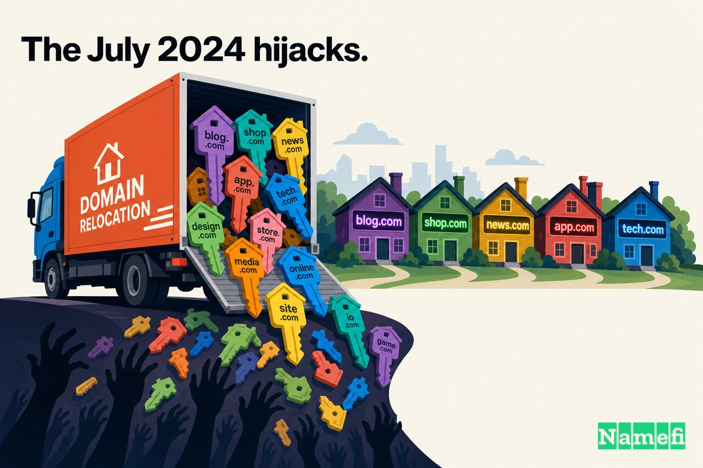
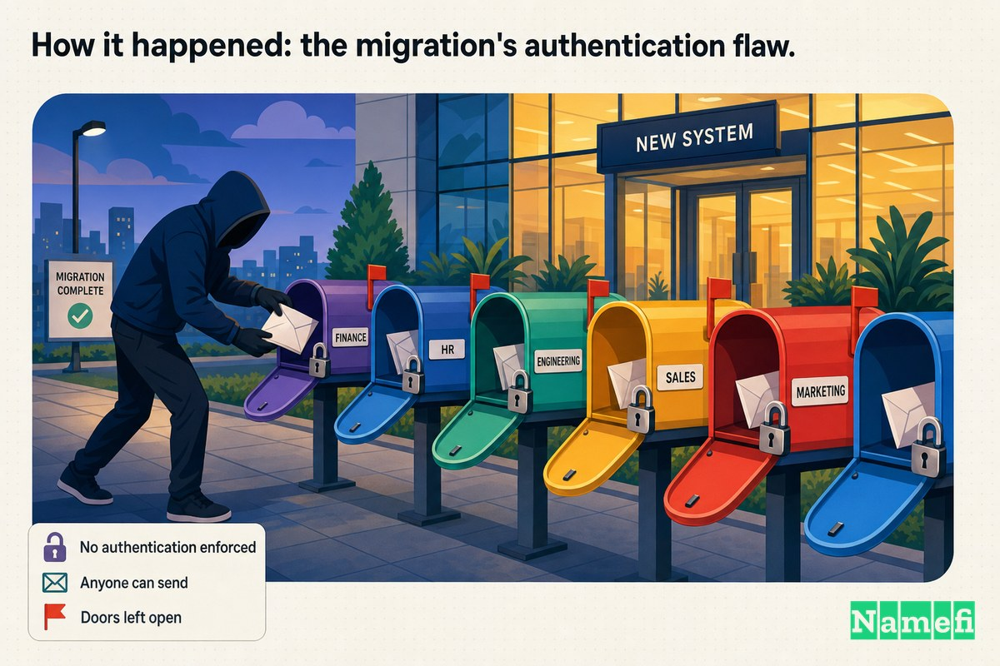
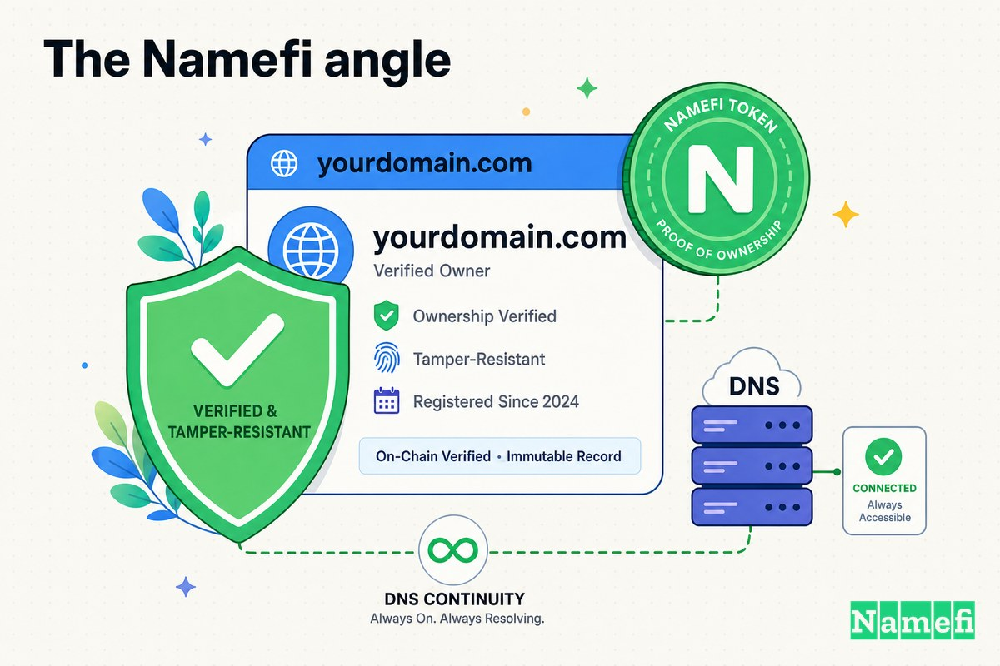

2024年7月，对于加密货币项目网站而言，最危险的事情并非[智能合约](/zh/glossary/smart-contract/)漏洞，也不是泄露的私钥，而是持有其域名的注册商。

在那个月的数天时间里，用户在浏览器中输入一个熟悉的地址——他们信赖的[借贷协议](/zh/glossary/lending-protocol/)官方网站，或者他们用过无数次的跨链桥——登陆的页面看上去与往常一模一样，然后眼睁睁看着自己的钱包被清空。这并非通常意义上的黑客攻击，没有人破解密码，也没有人钓鱼获取助记词。攻击者只是直接从*域名*本身的前门走了进来，因为那扇门在一次大多数项目方从未察觉的企业搬迁中被遗忘地敞开着。

这次搬迁正是 Google Domains 迁移至 Squarespace 的过程。敞开的大门是 Squarespace 的默认身份验证设置。结果是针对加密货币和 [DeFi](/zh/glossary/defi/) 项目的大规模 [DNS 劫持](/zh/glossary/dns-hijacking/)浪潮——据研究人员称，这些项目掌控着数十亿美元的资产。

## 注册商迁移如何创造了大规模攻击面

域名通常不被当作一支"舰队"来看待。每个域名都感觉像是一件私密的事物——你的地址、你的控制面板、你的 DNS 记录。但注册商批量持有这些域名，当一家注册商的整个客户群迁移到另一家时，基础中的每个账户都以*相同的迁移逻辑*、*相同的默认设置*、在*同一时间*完成迁移。这一逻辑中存在的任何弱点都不是偶发性漏洞，而是整支"舰队"共有的属性。

正是这一点，使得2024年的事件成为*大规模*事件，而非一系列不幸的个人遭遇。

2023年6月，在 Google 宣布关闭其注册商服务后，[Squarespace 从 Google Domains 收购了约1000万个域名](https://krebsonsecurity.com/2024/07/researchers-weak-security-defaults-enabled-squarespace-domains-hijacks/#:~:text=Squarespace%20purchased%20roughly%2010%20million%20domain%20names%20from%20Google%20Domains%20in%20June%202023)。在随后一年里，[Squarespace 一直在为这笔交易中收购的约1000万个域名进行用户迁移](https://www.securityweek.com/hackers-exploit-flaw-in-squarespace-migration-to-hijack-domains/#:~:text=Squarespace%20has%20been%20migrating%20users%20for%20roughly%2010%20million%20domain%20names%20purchased%20in%20the%20transaction)。为了让过渡显得"无缝"，Squarespace 为每个迁移域名的关联人员预先创建了账户，使用的是 Google 存档的电子邮件地址。

"无缝"恰恰是问题所在。一次对用户毫无要求的迁移，意味着用户根本无需证明任何事情——既无需证明密码，也无需证明身份，更无需证明对该邮箱的掌控权。账户已经存在，域名已然绑定，而在域名与任何先到者之间唯一的屏障，是一个对这些迁移账户几乎不作任何验证的登录页面。

## 2024年7月的劫持事件

[攻击于7月9日开始](https://www.securityweek.com/hackers-exploit-flaw-in-squarespace-migration-to-hijack-domains/#:~:text=The%20attacks%20started%20on%20July%209)，并持续了数天。这些攻击毫不掩饰。正如 BleepingComputer 所报道的，[一波协调一致的 DNS 劫持攻击针对使用 Squarespace 注册商的去中心化金融（DeFi）加密货币域名，将访问者重定向至托管钱包耗尽程序的钓鱼网站](https://www.bleepingcomputer.com/news/security/dns-hijacks-target-crypto-platforms-registered-with-squarespace/#:~:text=A%20wave%20of%20coordinated%20DNS%20hijacking%20attacks%20targets%20decentralized%20finance%20%28DeFi%29%20cryptocurrency%20domains%20using%20the%20Squarespace%20registrar%2C%20redirecting%20visitors%20to%20phishing%20sites%20hosting%20wallet%20drainers)。

首先引发轩然大波的是 DeFi 借贷领域中最响亮的名字之一。调查此次事件的安全公司 Blockaid 发现，[访问这些网站的用户被重定向至恶意页面，这些页面专门设计用于耗尽已连接钱包中的资金](https://www.blockaid.io/blog/squarespace-defi-domain-hijack-incident#:~:text=Visitors%20to%20these%20sites%20were%20being%20redirected%20to%20malicious%20pages%20designed%20to%20drain%20funds%20from%20connected%20wallets)。仿冒网站并非粗制滥造的山寨品。据 Blockaid 称，[这些虚假 dApp 运行着最新版本的 Inferno 耗尽工具套件，专门诱骗用户签署能够清空其钱包的交易](https://www.blockaid.io/blog/squarespace-defi-domain-hijack-incident#:~:text=These%20fake%20dApps%20were%20running%20the%20latest%20iteration%20of%20the%20Inferno%20draining%20kit%2C%20designed%20to%20trick%20users%20into%20signing%20transactions%20that%20would%20empty%20their%20wallets)。

已确认的受害者名单宛如生态系统的点名册。被劫持的实体包括 [Celer Network、Compound Finance、Pendle Finance 和 Unstoppable Domains](https://krebsonsecurity.com/2024/07/researchers-weak-security-defaults-enabled-squarespace-domains-hijacks/#:~:text=Celer%20Network%2C%20Compound%20Finance%2C%20Pendle%20Finance%2C%20and%20Unstoppable%20Domains)。Compound 的[主域名已被接管，显示钓鱼页面](https://www.bleepingcomputer.com/news/security/dns-hijacks-target-crypto-platforms-registered-with-squarespace/#:~:text=its%20main%20domain%20had%20been%20taken%20over%20to%20display%20a%20phishing%20page)。Celer 发现攻击后[迅速恢复了其 DNS 记录](https://www.bleepingcomputer.com/news/security/dns-hijacks-target-crypto-platforms-registered-with-squarespace/#:~:text=swiftly%20recovered%20its%20DNS%20records)；Pendle [遭遇了类似问题](https://www.bleepingcomputer.com/news/security/dns-hijacks-target-crypto-platforms-registered-with-squarespace/#:~:text=experienced%20similar%20issues)，并警告用户撤销钱包授权。

## 损失有多大——用户究竟遭受了什么

[域名劫持](/zh/glossary/domain-hijacking/)的残酷之处在于，它瓦解了用户被反复教导要依赖的所有习惯：检查 URL，确认是真实网站，查看锁形图标。所有这些建议都默认域名仍然指向它应该指向的地方。当攻击者控制了域名的 DNS 时，URL *确实*是真实的——那是项目的正规地址——却解析到攻击者的服务器。锁形图标是绿色的，地址栏诚实无欺，页面却是个陷阱。

这就是为什么像 Inferno 这样的钱包耗尽工具套件与 DNS 劫持如此天然地配合。耗尽程序不需要窃取密码，它需要的是受害者*连接钱包并签名*。而一个通过真实域名抵达借贷协议网站的用户，没有任何理由在批准交易前迟疑。钓鱼网站继承了合法域名多年积累的全部信任。

损失有多严重？能够体现事件规模的数字不是已确认盗窃的数量，而是*暴露*项目的数量。Blockaid 的分析经 Decrypt 报道后措辞直白：[约228个 DeFi 协议前端仍处于风险之中](https://decrypt.co/239524/220-defi-protocols-risk-squarespace-dns-hijack#:~:text=roughly%20228%20DeFi%20protocol%20front%20ends%20are%20still%20at%20risk)，因为它们全部处于同样的迁移账户漏洞之下。已发生的劫持只是冰山一角，而整个经历了 Google 到 Squarespace 迁移的加密货币群体都是潜在攻击面。

## 事件经过：迁移的身份验证缺陷

一旦研究人员重建了攻击机制，发现它几乎简单到令人尴尬——这也是它在规模层面如此危险的原因。

从两个设计选择说起。第一，Squarespace 未验证登录者是否真正掌控账户邮箱。正如研究人员所描述的，[Squarespace 对使用密码创建的新账户不要求邮箱验证](https://socket.dev/blog/squarespace-domain-hijacks-enabled-by-email-address-exploit-on-migrated-accounts#:~:text=Squarespace%20doesn%27t%20require%20email%20verification%20for%20new%20accounts%20created%20with%20a%20password)。第二，迁移账户已预先创建但尚未被认领——没有设置密码。因此，当有人用正确的邮箱登录时，[由于账户没有密码，系统直接将其引导至"为新账户创建密码"的流程](https://krebsonsecurity.com/2024/07/researchers-weak-security-defaults-enabled-squarespace-domains-hijacks/#:~:text=since%20there%27s%20no%20password%20on%20the%20account%2C%20it%20just%20shoots%20them%20to%20the)。

将两者结合，攻击路径便自然而然地写就了。与迁移域名绑定的电子邮件地址并非秘密——管理员和注册人联系方式通常是公开的或可猜测的。攻击者只需在真正的主人登录之前，使用一个已知的迁移邮箱抢先注册账户，便能轻松取得域名控制权。MetaMask 首席产品经理 Taylor Monahan 是解剖此次事件的研究人员之一，她精准地描述了这一盲区：[Squarespace 从未考虑到这样一种可能性——威胁行为者可能在合法邮箱持有人自己创建账户之前，使用与近期迁移域名关联的邮箱注册账户](https://krebsonsecurity.com/2024/07/researchers-weak-security-defaults-enabled-squarespace-domains-hijacks/#:~:text=Squarespace%20never%20accounted%20for%20the%20possibility%20that%20a%20threat%20actor%20might%20sign%20up%20for%20an%20account%20using%20an%20email%20associated%20with%20a%20recently%2Dmigrated%20domain%20before%20the%20legitimate%20email%20holder%20created%20the%20account%20themselves)。

这种预先关联为何存在？只为方便。研究人员得出结论：[Squarespace 默认所有从 Google Domains 迁移的用户都会选择社交登录方式](https://krebsonsecurity.com/2024/07/researchers-weak-security-defaults-enabled-squarespace-domains-hijacks/#:~:text=Squarespace%20assumed%20all%20users%20migrating%20from%20Google%20Domains%20would%20select%20the%20social%20login%20options)——即 Google OAuth——而非邮箱加密码。正如研究人员向 The Register 解释的，该系统[将所有邮箱预先关联至域名，无论账户是否已存在，很可能是因为他们希望用户能够通过 Google OAuth 登录后立即访问其所有域名](https://www.theregister.com/2024/07/15/squarespace_fingered_for_dns_hijackings/#:~:text=pre%2Dlinking%20all%20emails%20to%20domains%2C%20regardless%20of%20whether%20the%20account%20already%20exists%2C%20likely%20because%20they%20wanted%20users%20to%20be%20able%20to%20OAuth%20with%20Google%20and%20immediately%20have%20access%20to%20all%20their%20domains)。但邮箱加密码的登录路径始终未被关闭，而在这条路径上，没有任何方式能够证明对收件箱的实际控制权。

还有一个火上浇油的因素。在迁移过程中，本应拦截此类攻击的保护措施被悄然关闭：[作为向 Squarespace 过渡的一部分，账户上的多因素认证被关闭了](https://www.bleepingcomputer.com/news/security/dns-hijacks-target-crypto-platforms-registered-with-squarespace/#:~:text=as%20part%20of%20the%20transition%20to%20Squarespace%2C%20multi%2Dfactor%20authentication%20was%20turned%20off%20on%20accounts)。即使是在 Google Domains 上谨慎启用了 MFA 的域名持有人，到了 Squarespace 时也发现 MFA 已被剥离。无需破解密码，无需绕过第二因素，无需拦截邮件——对于一个已迁移、尚未认领的账户而言，持有一个可猜测的邮箱地址就是整个身份验证的全部。

## 应对与缓解措施

加密安全社区的响应速度比注册商更快。研究人员——其中包括 [Samczsun、Taylor Monahan 和 Andrew Mohawk](https://www.bleepingcomputer.com/news/security/dns-hijacks-target-crypto-platforms-registered-with-squarespace/#:~:text=Samczsun%2C%20Taylor%20Monahan%2C%20and%20Andrew%20Mohawk)——公开了攻击机制，Blockaid 也传阅了仍然脆弱的前端列表，以便项目方检查自身是否暴露在风险中。受影响的项目争分夺秒地重新认领账户、重置 DNS 记录，并警告用户撤销授予恶意网站的代币许可。

对所有仍在迁移账户上的用户，即时补救建议是相同的：在攻击者之前登录并认领账户，设置强密码且不重复使用，最重要的是，重新启用迁移过程中被悄然移除的多因素认证。Squarespace 方面也着手锁定迁移账户和账户创建流程。但从结构层面得到的教训比补丁本身更为持久：供应商在迁移期间关闭的安全控制措施，在迁移持续的整个期间内，实际上等同于不存在。

## 对注册商安全与 MFA 的启示

Squarespace 劫持事件并不只是某一家公司错误配置的故事，它是一个关于域名控制权究竟存在于何处、以及区块链之上那一层仍有多脆弱的故事。

以下几条教训远超2024年7月的范畴，具有普遍意义：

1. **注册商账户才是真正的信任根——而非智能合约。** 受影响的协议没有一个存在合约漏洞，其链上代码完好无损。攻击者夺取的是*域名*，而域名正是用户输入、信任并连接钱包的对象。一个链上无懈可击的项目，若其 DNS 控制层薄弱，照样会将用户拱手送给攻击者。

2. **MFA 只有在经历迁移后依然存在，才能真正发挥保护作用。** 这里令人痛苦的细节在于，MFA 并非在攻击中失效——它是*在攻击发生之前*作为迁移便利措施被移除的。应将 MFA 状态视为每次账户迁移、转让或供应商更换后必须重新核实的事项，而非一次设置、永久有效。

3. **"无缝"是一种安全权衡。** 迁移为了用户便利而省略的每一个步骤，都是身份认证未被验证的环节。预先创建的账户、自动关联的邮箱、无需验证的登录——这些都是用户未曾感受到的摩擦，而摩擦，往往正是将攻击者阻挡在外的那道屏障。

4. **可猜测的标识符本质上就是凭证。** 解锁这些域名的"秘密"，只是一个从未真正保密的电子邮件地址。任何系统只要知道公开标识符就能获得控制权，就只需一次冒充即可被攻破。

5. **注册商的爆炸半径等于其整个客户群。** 如果注册商的默认行为本身就薄弱，单个域名的安全措施便无济于事，因为这一默认设置同时适用于所有人。你的域名托管在何处，以及该托管方如何处理身份验证，是一项与任何链上决策同等重要的安全抉择。

## Namefi 的视角

2024年的劫持事件发生在"谁真正拥有这个域名"与"谁能登录控制它的账户"之间的缝隙之中。在传统模式下，这两件事只是松散地关联在一起：所有权是注册商数据库中的一条记录，而访问权则由注册商当时碰巧执行的任何身份验证方式来把关——包括在一次迁移1000万个域名、大门一度洞开的过程中。

[Namefi](https://namefi.io) 的构建目标正是填补这道裂缝。通过将[域名所有权](/zh/glossary/domain-ownership/)表示为一种与 DNS 保持兼容的代币化链上资产，控制权变成了可以*以密码学方式验证*的事物，而非依赖于可猜测的邮箱和供应商的默认登录设置。所有权存储在你掌控的钱包中，转让过程可审计，"谁有权更改这个域名的记录"这一问题有了防篡改的答案，而非依赖客服支持的答案。

这并不意味着 Squarespace 的迁移会因此无懈可击。但它从根本上改变了故障模式。一个用已知邮箱注册账户的攻击者，并不因此拥有[代币化域名](/zh/glossary/tokenized-domain/)——所有权不是一个半初始化账户可以悄然认领的数据行。一个名称的控制层面，应当与它所守护的资产同等难以伪造。2024年7月，对于数百个加密货币项目而言，事实并非如此。而那道裂缝，正是值得用工程手段来消除的。

## 参考来源与延伸阅读

- Krebs on Security — [Researchers: Weak Security Defaults Enabled Squarespace Domains Hijacks](https://krebsonsecurity.com/2024/07/researchers-weak-security-defaults-enabled-squarespace-domains-hijacks/)
- BleepingComputer — [DNS hijacks target crypto platforms registered with Squarespace](https://www.bleepingcomputer.com/news/security/dns-hijacks-target-crypto-platforms-registered-with-squarespace/)
- Blockaid — [Squarespace Domain Hijacking Incident: Attack Report](https://www.blockaid.io/blog/squarespace-defi-domain-hijack-incident)
- SecurityWeek — [Hackers Exploit Flaw in Squarespace Migration to Hijack Domains](https://www.securityweek.com/hackers-exploit-flaw-in-squarespace-migration-to-hijack-domains/)
- Decrypt — [More Than 220 DeFi Protocols Still 'at Risk' From Squarespace DNS Hijack](https://decrypt.co/239524/220-defi-protocols-risk-squarespace-dns-hijack)
- The Register — [Infoseccers claim Squarespace migration linked to DNS hijackings at Web3 firms](https://www.theregister.com/2024/07/15/squarespace_fingered_for_dns_hijackings/)
- Socket — [Squarespace Domain Hijacks Enabled by Email Address Exploit on Migrated Accounts](https://socket.dev/blog/squarespace-domain-hijacks-enabled-by-email-address-exploit-on-migrated-accounts)
- SiliconANGLE — [Multiple crypto domains hijacked from Squarespace due to Google Domains migration flaw](https://siliconangle.com/2024/07/15/multiple-crypto-domains-hijacked-squarespace-due-google-domains-migration-flaw/)
- Cybernews — [Squarespace crypto domains under DNS attack, lack of MFA to blame](https://cybernews.com/security/squarespace-dns-hijack-attack-crypto-domains-mfa/)
- Hackread — [DeFi Hack Alert: Squarespace Domains Vulnerable to DNS Hijacking](https://hackread.com/defi-hack-alert-squarespace-domains-dns-hijacking/)
- CircleID — [Security Lapses Lead to Squarespace Domain Hijacks](https://circleid.com/posts/20240716-security-lapses-lead-to-squarespace-domain-hijacks)
