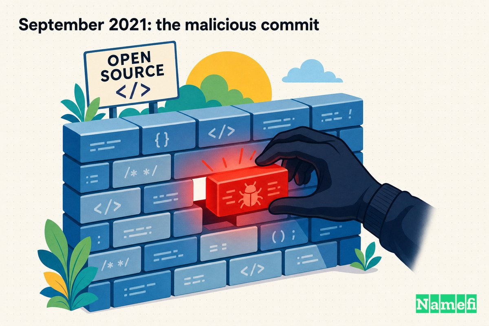
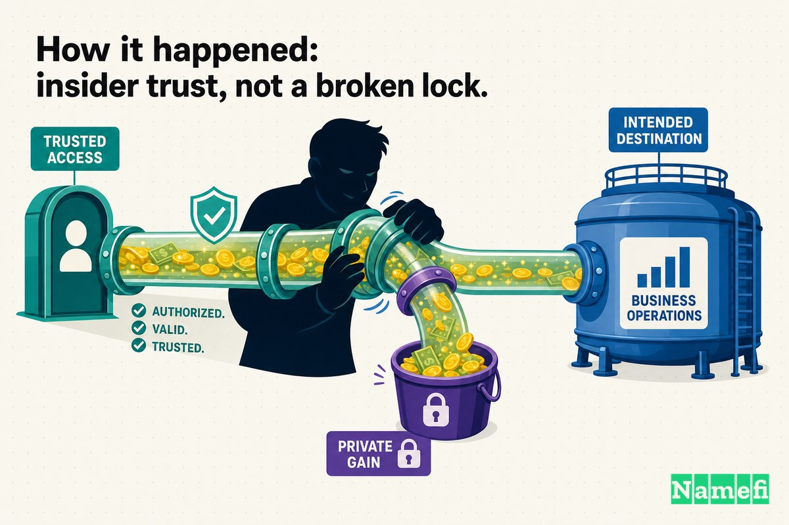
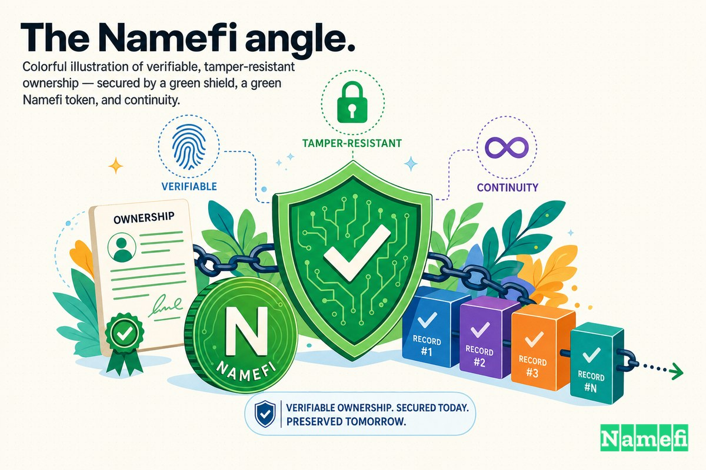

大多数攻击需要破门而入。这一次，攻击者从正门走了进来。

2021 年 9 月，运营 SushiSwap MISO 发射台的团队既没有遭到网络钓鱼，也没有丢失[私钥](/zh/glossary/private-key/)，更没有部署存在漏洞的[智能合约](/zh/glossary/smart-contract/)。他们做的事情平常得多：信任了一位贡献者。一名拥有代码提交权限的匿名承包商将自己的[钱包](/zh/glossary/wallet/)地址植入[拍卖](/zh/glossary/auction/)前端，推送后让部署流水线完成了剩余的工作。当一场 NFT 拍卖结算时，大约 **864.8 ETH——约 300 万美元**——非但没有流向组织此次销售的项目方，反而流进了那位悄悄改写资金去向的开发者口袋。

没有利用漏洞。没有零日攻击。只有一行没人仔细核查的代码，由一个本应属于团队成员的人签出。

这是 Domain Mayday 第 15 集。这个故事仅在边缘涉及智能合约，其核心是关于大多数人从不审计的那部分 Web：代码供应链、前端，以及一个令人不安的事实——"谁有权修改这里？"这个问题，与"谁持有密钥？"同等重要。

## 你对发射台代码所寄予的信任

像 MISO（Minimal Initial SushiSwap Offering，最小化初始 SushiSwap 发行）这样的 [DeFi](/zh/glossary/defi/) 发射台，存在的目的只有一个：将来自陌生人群体的资金，路由到发起代币或 NFT 销售的项目方。为此，它将[链上](/zh/glossary/on-chain/)经过审计的智能合约与链下的 Web 前端缝合在一起。用户与前端交互，前端告诉他们的钱包要签署什么交易。

这道接缝正是软肋所在。人们对智能合约层痴迷，因为审计、漏洞赏金和新闻头条都在那里。但前端——那段决定*拍卖款项打到哪个地址*的 JavaScript 代码——不过是仓库里的代码，由流水线部署，由任何拥有写权限的人编辑。随意审计保险库，但如果内部人员能更换"在此存款"的指示牌，保险库根本就用不上。

MISO 的代码是开放且协作的，这是加密基础设施惯有的风格。这种开放性是一个特性：它吸引贡献者、加速交付，让一支小核心团队实现远超自身体量的产出。但这也正是供应链攻击者所需要的攻击面。如果能直接受邀成为贡献者，就根本不必费力闯入。

## 2021 年 9 月：那次恶意提交

2021 年 9 月 17 日（周五），SushiSwap 时任首席技术官 Joseph Delong 在 Twitter 上公开说明了事件经过。CoinDesk 的报道言简意赅：Delong 表示，[一名使用 GitHub 账号"AristoK3"的匿名承包商，在一次供应链攻击中向 Miso 前端注入了恶意代码](https://www.coindesk.com/business/2021/09/17/3m-in-ether-stolen-from-sushiswaps-miso-launchpad#:~:text=an%20anonymous%20contractor%20using%20the%20Github%20handle)。

攻击手法简单得令人咋舌。据 Delong 描述，攻击者[将拍卖的钱包地址替换为自己的地址](https://www.coindesk.com/business/2021/09/17/3m-in-ether-stolen-from-sushiswaps-miso-launchpad#:~:text=replaced%20the%20auction%27s%20wallet%20address%20with%20their%20own)。PYMNTS 以供应链的视角精准描述了这一行为：该承包商[推送了一个恶意代码提交，并通过平台前端分发](https://www.pymnts.com/news/security-and-risk/2021/sushiswap-crypto-platform-victimized-by-3m-hack/#:~:text=pushed%20a%20malicious%20code%20commit%20that%20was%20distributed%20on%20the%20platform%27s%20front%20end)。

一份事后分析报告用一句话概括了这一事件的本质：一名受雇参与拍卖工作的开发者，[将自己的钱包地址插入合约，替代了 auctionWallet](https://www.quadrigainitiative.com/casestudy/sushiswapmisojaypegsautomart.php#:~:text=inserted%20his%20own%20wallet%20address%20into%20the%20contract%20instead%20of%20the)——手段是编辑前端在部署时传入的参数值，而非破解经过审计的链上逻辑本身。就是一个变量。`auctionWallet` 本应指向发起销售的项目方，结果指向了承包商。每一位出价者以为打给拍卖受益方的每一美元，都流向了别处，而代码看起来一切正常。

## 被转走的资产：约 864.8 ETH，约 300 万美元

攻击目标是一场单一的、近乎荒诞的拍卖。据 CryptoSlate 报道，MISO 遭遇供应链攻击，[从"Jay Pegs Auto Mart"代币拍卖合约中抽走了 864.8 ETH](https://cryptoslate.com/hacker-returns-865-eth-stolen-from-sushis-token-launch-platform-miso/#:~:text=drained%20864.8%20ETH%20from%20the)。Jay Pegs Auto Mart 是一个将自己定位为二手车经销商的 NFT 艺术项目——玩味的加密文化包装之下，是一场货真价实的代币销售。

各平台报道的数字一致。PYMNTS 报道称[黑客将 864.8 枚以太坊代币（约 300 万美元）转入了自己的钱包](https://www.pymnts.com/news/security-and-risk/2021/sushiswap-crypto-platform-victimized-by-3m-hack/#:~:text=transferred%20864.8%20Ethereum%20coins)。The Crypto Times 证实攻击者[抽走了 864.8 ETH](https://www.cryptotimes.io/2021/09/17/sushiswaps-miso-launchpad-loses-3-million-in-an-attack/#:~:text=drained%20864.8%20ETH)，并指出[迄今为止唯一遭受黑客入侵和利用的拍卖项目是 Jay Pegs Auto Mart](https://www.cryptotimes.io/2021/09/17/sushiswaps-miso-launchpad-loses-3-million-in-an-attack/#:~:text=The%20only%20auction%20project%20that%20has%20been%20hacked%20and%20exploited)。

最后这个细节至关重要。被污染的代码通过前端分发，这意味着理论上它可以将*任何*受其影响的拍卖资金改道。但实际上，在团队发现问题之前，只有 Jay Pegs Auto Mart 的结算资金流入了攻击者的地址。其他受影响的拍卖在被清空之前已完成修补——几小时之差，将一条糟糕的新闻标题与一场灾难区隔开来。

## 攻击是如何发生的：内部信任，而非锁门被撬

剥去加密术语，这是一次经典的软件供应链攻击——与投毒的 npm 包或被篡改的构建服务器属于同一类别，只是收益以 ETH 计价。

信任链条是这样的：一名贡献者获得了用于管理线上拍卖的代码的写权限；他们利用这一权限提交了一个修改，将目标地址换成了自己的；部署流水线做了流水线该做的事——将最新代码发布到真实用户在浏览器中加载的前端。这些用户连接钱包，签署前端指示他们签署的内容，为一场受益方已被悄悄改写的拍卖提供资金。Coinspeaker 的报道与其他来源一致：[一名 GitHub 账号为 AristoK3 的匿名承包商，向 Miso 前端注入了恶意代码](https://www.coinspeaker.com/sushiswap-miso-attack-nft/#:~:text=an%20anonymous%20contractor%20with%20the%20GH%20handle%20AristoK3%20injected%20malicious%20code%20into%20the%20Miso%20front%20end)。

请注意，攻击者*不需要*什么。他们不需要找到智能合约漏洞，不需要窃取密钥，也不需要从外部攻陷服务器。他们只需要一件事：获得足够的信任以修改代码。事后分析报告的措辞十分精准——[Miso 前端成为了供应链攻击的受害者](https://www.quadrigainitiative.com/casestudy/sushiswapmisojaypegsautomart.php#:~:text=The%20Miso%20front%20end%20has%20become%20the%20victim%20of%20a%20supply%20chain%20attack)——由一名使用 GitHub 账号 AristoK3 的匿名承包商实施，他[向 Miso 前端注入了恶意代码](https://www.quadrigainitiative.com/casestudy/sushiswapmisojaypegsautomart.php#:~:text=injected%20malicious%20code%20into%20the%20Miso%20front%20end)。

这正是内部供应链攻击如此危险的原因。所有外部防御——防火墙、审计、国库多签——都假设威胁来自外部，正试图进入系统。拥有提交权限的内部人员已经绕过了这一切。那次恶意修改乘着项目自身受信任、合法的部署流程直达生产环境。流水线没有被颠覆，而是被*利用*了。

## 应对与恢复：被发现、被点名、被退款

SushiSwap 的应对迅速、公开且咄咄逼人。Delong 没有悄悄调查；他公开了 GitHub 账号，点名了疑似真实身份，并设下了最后期限。据 CoinDesk 报道，警告措辞明确：如果资金不被归还，这家 DeFi 交易所将[向 FBI 提出投诉](https://www.coindesk.com/business/2021/09/17/3m-in-ether-stolen-from-sushiswaps-miso-launchpad#:~:text=file%20a%20complaint%20with%20the%20FBI)。

奏效了。攻击者改变了主意。CryptoSlate 报道，在团队公开发声后短短几小时内，[黑客将 865 ETH 退回了原始 MISO 合约](https://cryptoslate.com/hacker-returns-865-eth-stolen-from-sushis-token-launch-platform-miso/#:~:text=the%20hacker%20returned%20865%20ETH%20to%20the%20original%20MISO%20contract)——比转走的 864.8 ETH *略多*。The Crypto Times 证实了退款目的地：[SushiSwap 的多签地址收到了归还的 865 ETH](https://www.cryptotimes.io/2021/09/17/sushiswaps-miso-launchpad-loses-3-million-in-an-attack/#:~:text=the%20multisign%20address%20of%20Sushiswap%20got%20865%20ETH%20back)。Delong 本人的后续更新和最初的警告一样简短。Decrypt 记录了他的确认：大约一天内，[所有资金已归还](https://decrypt.co/81120/sushiswaps-token-launchpad-hacked-over-3m-ethereum#:~:text=All%20funds%20returned)。

这个圆满结局需要打上星号。资金之所以归还，不是因为架构层面捕获了盗窃行为，而是因为攻击者在公众曝光的聚光灯和可信执法威胁下选择了主动归还。公共账本上的假名机制是把双刃剑：它让承包商得以匿名行事，但也意味着被转移资金的链上踪迹对所有人可见——正是这种可见性，使归还资金成为阻力最小的选择。此次的恢复是一场谈判，而非一种保证。下一个内部人员或许不会退缩。

## 关于代码供应链和前端信任的启示

MISO 事件以 DeFi 的标准来看损失不大，但教训意义深远。以下几点值得铭记：

1. **前端是安全边界的一部分。** 用户签署界面指示他们签署的内容。如果攻击者能控制界面显示的地址，他们根本不需要动智能合约。只审计链上代码，等于只审计了一半系统。
2. **写权限才是真正的攻击面。** 如果拥有编辑代码权限的人决意为之，世界上最强的密码学也无济于事。"谁能修改这里，谁在上线前审查？"是一个安全控制问题，而不仅仅是流程细节。
3. **强制代码审查不是官僚主义，而是防御。** 对那次换掉 `auctionWallet` 的提交，只需一双强制要求的第二双眼睛，就可能让攻击戛然而止。供应链攻击恰恰在没有人在部署前独立核查的变更中滋生。
4. **匿名贡献者提高了风险赌注。** 开放贡献是一种优势，但向匿名身份授予影响部署的权限，意味着你在信任无法完全追溯的代码。信任应与核验程度成正比，而非与热情成正比。
5. **恢复靠的是运气，不是架构。** 资金归还依赖公众压力和可追溯的账本。设计一个*依赖*攻击者善意的系统，根本算不上安全设计。

贯穿始终的主线是：*谁被允许做出变更*的完整性，以及*已发布的变更就是经过审核的变更*的可验证性，其重要程度不亚于任何密码学密钥。供应链信任不是一种软性的、文化层面的关切，而是系统的硬边界。

## Namefi 的视角

MISO 之所以蒙受损失，是因为*价值的去向*可以被系统所信任的人悄悄改写，而没有任何人在上线前核实这一变更。这种失效模式并非 DeFi 发射台所独有。它与域名的处境如出一辙——域名的所有权或 DNS 记录，可能被任何恰好持有相关访问权限的人悄悄更改：[注册商](/zh/glossary/registrar/)账户、内部管理面板、持有凭证的承包商。

域名是互联网上最重要的"目标地址"设置之一。它的 DNS 记录决定了你的流量、电子邮件和用户实际去往何处。如果这些设置能被内部人员或遭入侵的账户修改，且没有留下防篡改、可独立核查的"谁改了什么"记录，你就遇上了换了一身衣服的 MISO 问题：锁没有问题，但门上的指示牌可以被替换。

[Namefi](https://namefi.io) 的应对方式，是将[域名所有权](/zh/glossary/domain-ownership/)视为可验证、防篡改的资产，而非某个私人账户中的条目。代币化所有权使控制权可在链上被审计和转移，同时保持与 DNS 的兼容——"谁拥有这个，谁被允许修改它"由此成为一个可以核验的事实，而非需要盲目延伸的信任。MISO 那名承包商之所以能改写收款地址，恰恰是因为系统没有一个强制执行的、可独立检查的"此变更是否已授权？"的答案。Namefi 从供应链攻击中汲取的教训是：所有权和控制权应在设计上就是可证明的，从而让*受信任*与*已核验*之间的危险缺口永远不会出现。

## 来源与延伸阅读

- CoinDesk — [$3M in Ether Stolen From SushiSwap's MISO Launchpad](https://www.coindesk.com/business/2021/09/17/3m-in-ether-stolen-from-sushiswaps-miso-launchpad)
- Decrypt — [SushiSwap's Token Launchpad Hacked for Over $3M in Ethereum](https://decrypt.co/81120/sushiswaps-token-launchpad-hacked-over-3m-ethereum)
- CryptoSlate — [Hacker returns 865 ETH stolen from Sushi's token launch platform MISO](https://cryptoslate.com/hacker-returns-865-eth-stolen-from-sushis-token-launch-platform-miso/)
- PYMNTS — [SushiSwap Crypto Platform Victimized by $3M Hack](https://www.pymnts.com/news/security-and-risk/2021/sushiswap-crypto-platform-victimized-by-3m-hack/)
- The Crypto Times — [Sushiswap's Miso Launchpad Loses $3 Million In An Attack](https://www.cryptotimes.io/2021/09/17/sushiswaps-miso-launchpad-loses-3-million-in-an-attack/)
- Coinspeaker — [SushiSwap Launchpad Miso Suffers Attack with 864.8 ETH NFT Project Fund Carted Away](https://www.coinspeaker.com/sushiswap-miso-attack-nft/)
- CryptoBriefing — [Sushi's Initial Offering Launchpad Suffers $3M Exploit](https://cryptobriefing.com/sushiswaps-miso-token-launchpad-suffers-3m-exploit/)
- CryptoPotato — [Another DeFi Hack: $3M in ETH Stolen From SushiSwap's Token Platform](https://cryptopotato.com/another-defi-hack-3m-in-eth-stolen-from-sushiswaps-token-platform/)
- Quadriga Initiative — [SushiSwap MISO Jaypegs Automart case study](https://www.quadrigainitiative.com/casestudy/sushiswapmisojaypegsautomart.php)
