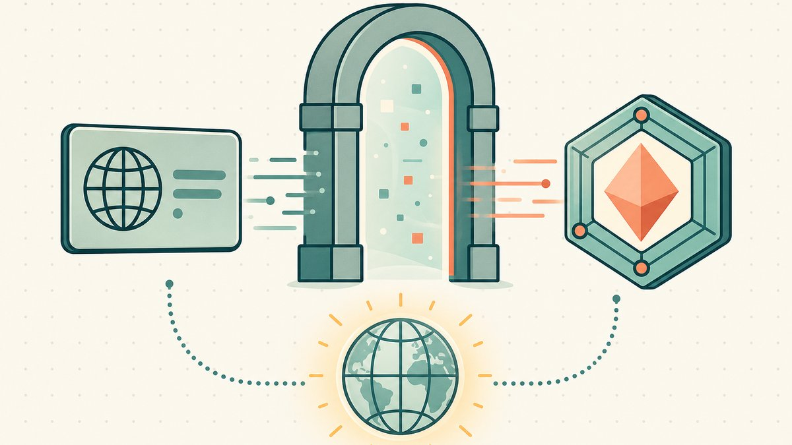

大多数 `.com` 的倒卖最后都以同样紧张的方式收场：买家不想在域名转移前付款，卖家不想在收到钱之前转移域名，于是一个[托管](/zh/glossary/escrow/)代理夹在中间替双方保管资金，而注册商之间的转移要花好几天才能完成。这个僵局就是每一笔高价交易都要缴的"摩擦税"。先把 `.com` 代币化会彻底改变整笔交易的形态：域名变成你持有在[钱包](/zh/glossary/wallet/)里的一枚代币，出售也从一场跨越数天、涉及多方的交接，变成一次链上的单笔互换。

这是一篇关于这条路径的实操指南，平台是 [Namefi](https://namefi.io)——把一个你已经拥有的 `.com` 上链，让它在任何地方都能继续解析，然后以 [NFT](/zh/glossary/nft/) 的形式上架并完成结算。它属于更大的[域名倒卖](/zh/blog/domain-flipping/)体系，也是[链上域名翻转](/zh/blog/onchain-domain-flipping/)这一支柱主题的一部分。如果你想在了解"怎么做"之前先弄清"为什么"，请从[为什么要把域名代币化上链](/zh/blog/why-tokenize-domains/)读起。

## 为什么倒卖代币化的 .com 而不是普通的 .com

一个传统的 `.com` 是真实存在的，但你从未真正"持有"它——你持有的是在某个[注册商](/zh/glossary/registrar/)处的一个账户，它的数据库写着你控制着这个域名。出售意味着一次账户对账户、或注册商对注册商的转移，由注册商居中协调，而托管则在中间架起信任的桥梁。

代币化把那个账户变成一枚由你自己保管的[代币](/zh/glossary/tokenize/)。域名以 [ERC-721](/zh/glossary/erc-721/) 标准下的 NFT 来表示，以太坊规范称之为[智能合约内 NFT 的标准 API](https://eips.ethereum.org/EIPS/eip-721#:~:text=standard%20API%20for%20NFTs)——而该标准自身的摘要把它描述为[非同质化代币（又称"契据"）](https://eips.ethereum.org/EIPS/eip-721#:~:text=non%2Dfungible%20tokens%2C%20also%20known%20as%20deeds)的标准接口。"契据"这个词正是关键所在：这枚代币就是域名的产权凭证，在你的钱包里，而不是别人替你保管的某条记录的收据。对一个倒卖者来说，这带来三个实实在在的优势：

- **结算坍缩为单笔交易。** 付款与转移要么一起执行、要么都不执行，所以没有哪一方必须先动手。
- **流动性更广。** 一个代币化的 `.com` 可以和其他所有 ERC-721 资产一起，在通用的 [NFT 市场](/zh/glossary/marketplace/)上架，而不只是局限于域名专属的二级市场。
- **来源公开可查。** 每一次过往转移都[链上](/zh/glossary/on-chain/)可审计，所以买家无需轻信市场平台的一面之词就能核验历史。

关键在于，这一切都没有牺牲买家在一个 `.com` 上真正付钱购买的东西。与 [ENS](/zh/glossary/ens/) `.eth` 这类 Web3 原生名称不同——后者存在于 [ICANN](/zh/glossary/icann/) 根之外，需要解析器或桥才能在普通浏览器里加载——一个代币化的 `.com` 仍然是一个能在任何地方解析的真实 [DNS](/zh/glossary/dns/) 域名，邮件和证书都照常工作。这个区别正是本指南存在的全部理由；我们在[什么是代币化域名](/zh/blog/what-are-tokenized-domains/)和[代币化域名 vs Web3 域名](/zh/blog/tokenized-domain-vs-web3-domain/)里把它讲得更透。别把两者混为一谈：一个代币化的 ICANN `.com` 和一个 `.eth` 名称跑在同一套轨道上倒卖，但卖的完全是两样东西。

## 第 1 步：把 .com 上链

逐屏的完整流程在[如何代币化你的 .com](/zh/blog/how-to-tokenize-your-com/)里；这里讲讲它对一个倒卖者来说的大致形态。

你在 [namefi.io](https://namefi.io) 连接一个自托管钱包——这个钱包随即成为[代币化域名](/zh/glossary/tokenized-domain/)的所有者，所以谁持有它谁就持有这个域名。你添加自己已经拥有的 `.com`，Namefi 会对照 ICANN 转移规则以及它当前所在的注册商核验资格，然后你选择一条路径。常见的一条是"先转入再代币化"：你用当前注册商提供的[授权码](/zh/glossary/auth-code/)把域名转移到 Namefi 的认证注册商合作伙伴，然后铸造代币。某些注册商集成支持一条"就地"路径，域名留在原处，链上层叠加在其之上。

有两点时间安排在你赶着截止日期倒卖时格外重要。第一，慢的环节是注册商转移，而非任何与区块链相关的步骤——由于 ICANN 的跨注册商流程，请预留好几天，别在你指望成交的那一周才开始代币化。第二，最近刚转移过的名称可能处在 ICANN 的转移锁定窗口内，暂时就是没法移动，所以在你向买家承诺任何事之前先核验资格。铸造本身——一次支付 [Gas](/zh/glossary/gas/) 并把 NFT 落到钱包里的钱包确认——是*最后*也是最快的一步。

完成后，你将持有两个同步的层：传统的 DNS / 注册商记录，以及钱包里一枚代表所有权的 ERC-721 代币。转移代币，域名随之跟着走。

## 第 2 步：像对待一项你打算出售的资产那样保管它

这一步在注册商倒卖里没有对应物，也是链上倒卖新手最容易低估的一步：一旦域名成了 NFT，*你*就是那个托管系统。一个你打算持有数月、慢慢找买家的名称，不该放在一个你日常交易也在用的热钱包里。

硬件钱包是底线。对于更高价值的名称，[多重签名](/zh/glossary/multi-sig/)安排用一些便利换取对单一私钥失陷远为更好的防护——不过它对你是否值得是个真问题，我们在[多签钱包真的能提升安全性吗](/zh/blog/do-multisig-wallets-actually-improve-security/)里做了权衡。自持[托管私钥](/zh/glossary/custodial-ownership/)的另一面是：一把丢失的私钥可能意味着一个丢失的名称，所以要*在*需要之前*就*备好恢复方案——[钱包丢失后如何找回代币化域名](/zh/blog/recovering-a-tokenized-domain-after-wallet-loss/)讲清了哪些可行、哪些不可行。稳妥的保管本身也是向买家推销的一部分：一个所有权链条清晰、可审计的名称，比一个你无法证明其来源的名称更好卖。

## 第 3 步：在整笔交易期间保持 DNS 持续解析

这里就是把代币化 `.com` 与 `.eth` 名称区分开来的那个优势，值得你刻意去守护。代币化不改变域名的解析方式——域名服务器、A 记录、MX、[DNSSEC](/zh/glossary/dnssec/) 全都照常工作，既可以在 Namefi 控制台里管理，也可以委托给你现有的 DNS 提供商。我们在 [代币化域名上的 DNS](/zh/blog/dns-on-tokenized-domains/) 里准确说明了哪些会变、哪些不会变。

对一个倒卖者来说，**DNS 连续性就是"一笔干净的成交"与"买家眼睁睁看着一个上线的站点在交易途中变黑"之间的区别。** 一个构建良好的代币化域名能在整个交接过程中保持干净解析，所以当代币的所有权转移时，网站、邮件和证书都不会眨一下眼。这种连续性本身就是一个卖点：一个能看到名称全程持续解析的买家，远没那么多理由拿转移风险来压价。

## 第 4 步：以 NFT 形式上架

上架一个代币化的 `.com` 是一次市场操作，而不是在一个停放域名上挂一个"出售中"的落地页。你在一个 NFT 市场上直接设定一口价的"立即购买"价格，或开启一场[拍卖](/zh/glossary/auction/)，而这个挂单本身就是一份任何买家都能成交的已签名订单。因为资产是一枚标准的 ERC-721 代币，你的曝光不再局限于那些常逛域名专属二级市场的人——这个名称和其他所有 NFT 处在相同的场所。我们在[将域名作为 NFT 出售](/zh/blog/selling-domains-as-nfts/)里逐一讲解上架选项，并在[链上域名市场对比](/zh/blog/onchain-domain-marketplaces-compared/)里比较该在哪里上架。

你也保留为一个代币化名称走传统销售页漏斗的选项。区别纯粹在收尾环节：交易通过一次代币互换结算，而不是一次托管交接——这就把我们带到了最终的回报。

## 第 5 步：无需托管僵局即可结算

这里就是链上"管道"发挥价值的地方。为 NFT 打造的市场协议让付款与转移原子化发生——要么一起、要么都不。OpenSea 的订单协议 Seaport 自我描述为一个[安全高效地买卖 NFT 的市场协议](https://github.com/ProjectOpenSea/seaport#:~:text=marketplace%20protocol%20for%20safely%20and%20efficiently%20buying%20and%20selling%20NFTs)，其实际效果是买家的付款与你的代币转移在一个结算步骤里互换完成。没有第三方代理在交易途中持有资产；合约强制执行这次互换。

对你那个代币化的 `.com` 而言，代币的转移*就是*契据的交接，而 Namefi 让底层的 DNS 注册保持同步，于是买家最终控制的是一个真实、可解析的域名——而不仅仅是一枚指向虚无的 NFT。这一个机制正是我们说代币化市场[取代托管](/zh/blog/how-tokenized-marketplaces-replace-escrow/)时的含义；那篇文章把其中的信任算式讲得很清楚。没有哪一方先动手，没有代理保管资金，而过去要花上数天托管的整个结算，如今只需一笔已确认的交易。

## 务实地看一看经济账

代币化并不改变倒卖背后的根本算式：它依然是一场组合游戏，而不是一张彩票。你持有的大多数名称卖不出去，而少数几笔好的成交养着其余名称的持有成本。把一个名称上链拓宽了你的买家池、消除了结算摩擦，但它制造不出对一个没人想要的名称的需求。冷静的估价依然决定一笔倒卖是否[行得通](/zh/blog/onchain-domain-flipping/)。

还有一笔成本账要算明白。无论是否代币化，你都在支付普通的注册商续费；铸造要花几美元 Gas（Base 比[以太坊](/zh/glossary/ethereum/) L1 便宜）；以及 Namefi 为代币化服务收取的协议费——这些都在你确认前显示在确认页上。如果你的入手价与现实的售出价之间的差额无法宽裕地覆盖这些成本，那么代币化一个边缘名称只是徒增步骤。代币化那些值得倒卖的名称，而不是你持有的每一个名称。

有一个值得放在视野里的背景：好 `.com` 的上行空间真实存在，但极其罕见。纪录保持者依然是 `Voice.com`，据 `.nl` 注册局 SIDN 称，[区块链厂商 Block.one 为这个名称支付了 3000 万美元](https://www.sidn.nl/en/news-and-blogs/voice-com-sold-for-usd-30-million#:~:text=Block.one%20paid)——SIDN 指出，这仍是[有史以来公开披露的最高域名成交价](https://www.sidn.nl/en/news-and-blogs/voice-com-sold-for-usd-30-million#:~:text=the%20highest%20publicly%20disclosed%20sum)。那是个能登上头条的异常值，恰恰因为它罕见，而不是一份商业计划。

## Namefi 在其中的位置

这套倒卖的干净版本——钱包持有的产权、原子结算、没有托管僵局，以及一个全程持续解析的名称——正是 [Namefi](https://namefi.io) 为*真实*的 ICANN 域名打造来交付的工作流。代币化所有权让对一个 `.com` 的控制权像 NFT 一样可审计、可转移，而 DNS 连续性则保留了买家真正在付钱购买的那种通用可解析性。要把一个你已经拥有的名称纳入这套模式，分步指引见[如何代币化你的 .com](/zh/blog/how-to-tokenize-your-com/)；要先权衡各家提供商，见[如何选择域名代币化平台](/zh/blog/choosing-a-domain-tokenization-platform/)。

## 友情免责声明（请读我！）

> 我们不是律师、会计师、理财顾问，也不是医生，而且**本文中的任何内容都不构成法律、财务、税务、会计、医疗或任何其他门类的专业建议。** 我们写这些文章是为了教育我们自己，也是为方便我们的客户。这里的信息可能已经过时、只适用于特定地区，或干脆就是错的。我们也会犯错。

> 对任何重要决定，**请咨询一位真正的专业人士（说真的！）**。或者如果那不是你的风格，那就问朋友、问 Twitter、问 Reddit、问 AI，或者问个算命的。一句话：**DOYR——自己做研究（Do Your Own Research）**。让我们一起学习、一起找乐子。

## 来源与延伸阅读

- 以太坊改进提案——[ERC-721 非同质化代币标准（"NFT 的标准 API"；NFT"又称契据"）](https://eips.ethereum.org/EIPS/eip-721#:~:text=non%2Dfungible%20tokens%2C%20also%20known%20as%20deeds)
- ProjectOpenSea——[Seaport（安全高效地买卖 NFT 的市场协议）](https://github.com/ProjectOpenSea/seaport#:~:text=marketplace%20protocol%20for%20safely%20and%20efficiently%20buying%20and%20selling%20NFTs)
- SIDN——[Voice.com 以 3000 万美元成交（Block.one，2019 年；公开披露的最高域名成交价）](https://www.sidn.nl/en/news-and-blogs/voice-com-sold-for-usd-30-million#:~:text=Block.one%20paid)
