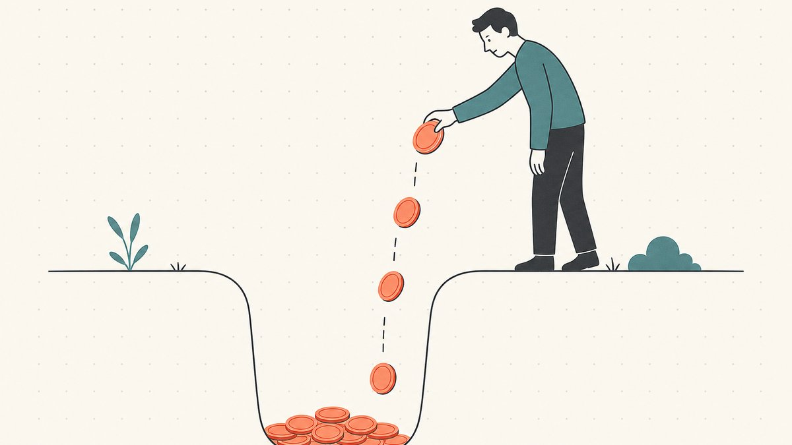
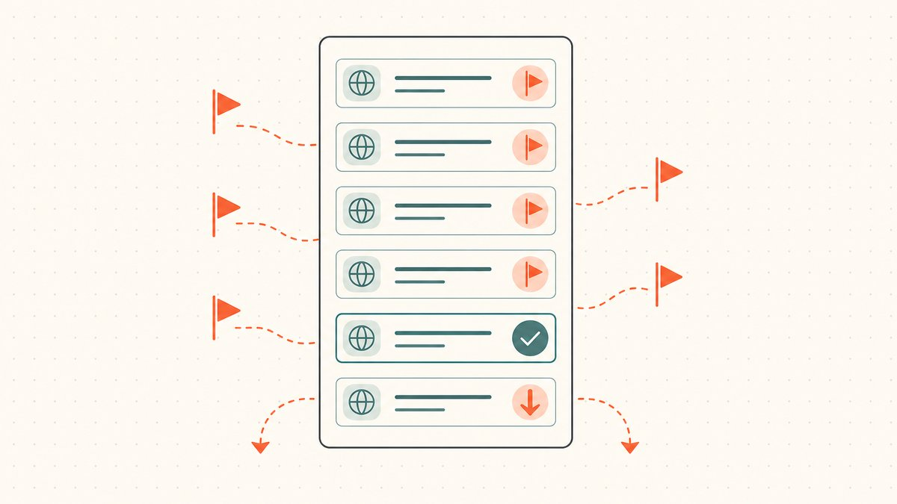

您拥有的每个域名每年都会给您发来同样一封信：续费，否则就失去它。对于您手中的优质域名，这很容易回答“是”。困难的决定在于您投资组合中处于中下水平的那些域名——那些您基于某个设想注册但尚未得到回报的、冲动购买的、以及那些经历了三个续费周期仍未售出的“差一点”域名。决定放弃哪些域名是[域名交易](/zh/glossary/domain-trading/)中最不起眼但利润最高的技能之一，因为从呆滞库存中节省下来的钱会直接增加您的利润。

本指南旨在探讨放弃决策：权衡续费费用与现实的转售几率、识别让不良域名得以续命的沉没成本陷阱，以及一个域名永远卖不出去的信号。这与“优质收购”相辅相成——这一准则在[域名交易](/zh/blog/domain-flipping/)系列以及在投资组合层面的[域名组合管理](/zh/blog/domain-portfolio-management/)中都有涉及。

## 续费账单就是整个游戏的核心

让我们从您真正需要决定的数字开始。域名不是一次性购买的，而是按期租用的，根据维基百科，一个 [gTLD](/zh/glossary/gtld/) 注册[gTLD 域名的最长注册期为 10 年](https://en.wikipedia.org/wiki/Domain_name_registrar#:~:text=The%20maximum%20period%20of%20registration%20for%20a%20gTLD%20domain%20name%20is%2010%20years)。无论您选择哪个期限，续费总会到期，对于一个普通的[`.com`](/zh/tld/com/) 域名来说，费用并不高——维基百科指出，截至 2023 年，[零售成本通常在每年约 9.70 美元到 35 美元之间](https://en.wikipedia.org/wiki/Domain_name_registrar#:~:text=the%20retail%20cost%20generally%20ranges%20from%20a%20low%20of%20about%20%249.70%20per%20year)，这只是一个简单的注册费用。

十或二十美元感觉微不足道，而这恰恰是陷阱所在。单个域名的费用很小，但整个投资组合的费用就不是了。一个持有三百个域名的投资者每年要开出一张四位数美元的支票，仅仅是为了维持运营，而其中大部分钱都花在了永远不会卖出的域名上。对于优质后缀来说，情况更为严峻——一个[`.io`](/zh/tld/io/) 或 [`.ai`](/zh/tld/ai/) 域名的续费成本可能是 `.com` 的好几倍，因此一个闲置的 `.ai` 域名的续费负担就相当于十几个 `.com` 域名。续费账单是您库存的[持有成本](/zh/glossary/holding-cost/)，而放弃决策则是投资组合层面的成本控制。我们在[域名续费成本和售出率](/zh/blog/domain-renewal-costs-and-sell-through-rate/)一文中详细分析了其中的数学计算。

值得内化的心智模型是：每一次续费都不是在保护一项沉没成本，而是您选择进行的一次*全新*购买。每年续费，您都以续费价格再次购买了这个域名。所以，问问自己那个在进行任何新购买时都会问的问题：今天，我是否愿意以这个价格收购这个域名？如果答案是否定的，那么关于续费的答案也就有了。

## 续费成本与现实的转售几率

续费还是放弃，这是一个期望值问题。一个域名值得保留，当且仅当其预期转售价值（考虑了出售可能性和等待时间的折扣后）能够轻松超过在此期间的续费成本。

问题在于这个等式的后半部分。大多数[域名投资](/zh/glossary/domaining/)者高估了他们的转售几率，因为他们锚定于头条新闻中的成功案例——比如 Voice.com 和 Sex.com 这样被媒体报道的大规模销售——而不是基础概率。行业内的经验法则（这确实只是一个经验法则而非精确统计）是，一个手工注册的域名组合的年**售出率**（在某一年中售出的域名所占的份额）在百分之几的低位。请将此视为一个估计，但要认真对待：如果您今年出售一个平庸域名的几率只有几个百分点，而您的预期价格是几百美元，那么预期的年回报也只有几美元。一旦续费费用接近这个数字，这个域名就不再是一项投资了，而是您出于希望而持续支付的一项订阅服务。

这就是为什么估值纪律不止于收购。那些告诉您应该付多少钱的因素——可比销售案例、[后缀](/zh/glossary/tld/)的流动性、是否存在真实的买家用例——同样能告诉您是否应该继续支付续费。一个基于可靠设想购买的域名，如果两年后依然无人问津，那它已经不是您当初收购的那个资产了。市场已经给出了它的投票。重新进行一次您在购买新域名时会做的评估（方法见[如何评估域名价值](/zh/blog/how-to-value-a-domain-name/)），如果今天诚实的估值低于您剩余的持有成本，那就放弃它。

## 沉没成本陷阱

域名投资者保留亏损域名的最大原因在于心理学，而且它有一个名字。沉没成本的标准定义是，[已经发生且无法收回的成本](https://en.wikipedia.org/wiki/Sunk_cost#:~:text=a%20cost%20that%20has%20already%20been%20incurred%20and%20cannot%20be%20recovered)。您为域名支付的收购价格，加上您已经支付的每一次续费，在您花掉的那一刻就已经消失了。您是否再次续费对收回这些钱没有任何影响。现在，这些钱唯一的作用就是影响您的决策。

这种谬误有据可查：人们表现出[一旦在金钱、精力或时间上进行了投资，就更倾向于继续一项事业](https://en.wikipedia.org/wiki/Sunk_cost#:~:text=a%20greater%20tendency%20to%20continue%20an%20endeavor%20once%20an%20investment%20in%20money%2C%20effort%2C%20or%20time%20has%20been%20made)。对于域名投资者来说，这表现为一个具体且可预测的错误。您三年前花了 2,000 美元买了一个域名，但一直没卖出去。现在续费是 30 美元。您续费了，因为放弃它就意味着“浪费”了那 2,000 美元——尽管那 2,000 美元在几年前就已经浪费了，而这次续费是您现在选择扔进去的另外一个全新的 30 美元。这正是[用好钱去追坏钱](https://en.wikipedia.org/wiki/Sunk_cost#:~:text=throwing%20good%20money%20after%20bad)的字面定义。

解药是一条规则，而非意志力。当收到续费通知时，忽略您当初付了多少钱以及已经花了多少续费。这些数字不是今天决策的输入项。只问一个问题：以这个续费价格，我今天会收购这个域名吗？如果您不会重新购买它，您就不应该再次购买它——而续费正是如此。在您的投资组合表格中跟踪收购成本和累计持有成本以备报税之用，但在做续费决定时，要有意地不去看那些列。会计核算和决策是两件不同的事（税务方面在[域名投资者的税务与会计](/zh/blog/taxes-and-accounting-for-domain-investors/)中有单独讨论）；将它们混为一谈是亏损域名得以续存的原因。

## 一个域名永远卖不出去的信号

期望值是决策框架，但在实践中，您需要快速浏览域名列表，而一些具体的信号能够可靠地标记出应该放弃的域名。任何一个信号单独来看都不是致命的，但两三个信号同时出现，就明确表示应该放弃了。

- **从未有过主动询价。** 如果一个域名已经挂牌并可被发现两年或更久，却从未收到任何报价、任何询问，甚至连垃圾低价报价都没有，那么市场在告诉您一些事情。一个无人问津的域名并非“未被发现”——挂牌销售在很大程度上解决了发现问题。它只是没人要。这是最强烈的单一信号。
- **没有可识别的买家。** 好的交易通常有一个明确的目标买家：一个类别、一个行业、一种需要这个字符串的初创公司。如果您连一个可能为这个域名付费的具体公司都说不出来，那您买的就是一个没有买家的域名，而这样的域名无论什么价格都卖不出去。
- **您无法解释当初为何购买它。** 投资组合中会累积一些冲动注册的域名，它们在凌晨 1 点时看起来很巧妙。如果您无法重构当初的投资理论，那通常是因为根本就没有。这些是最容易、最没有负罪感可以放弃的域名。
- **它需要解释才能被理解。** 那些需要拼写出来、混合了数字或连字符、或者读起来像一个巧妙但没人听一次就能记住的构造的域名，都通不过“大声说出来”的测试。[什么让域名更有价值](/zh/blog/what-makes-a-domain-valuable/)中的基本原则就是检查清单；一个在多项上不及格的域名，再续费一年也不会有改善。
- **投资理论随潮流而过时。** 一个基于某个已经过去的炒作周期创造的域名——去年的流行词、一个没有持续下去的时尚——其买家群体每个季度都在缩小。如果潮流已过而域名仍未售出，那它就是一个正在贬值的持有资产。
- **注册时错过的商标问题。** 偶尔您会意识到一个域名依赖于他人的商标。根据 [UDRP](/zh/glossary/udrp/)，这是一种负债，而不是资产，正确的做法通常是放弃它，而不是冒险卷入争议。域名投资和域名[抢注](/zh/glossary/backorder/)之间的界线在[什么是 UDRP](/zh/blog/what-is-udrp/) 中有介绍。

一个域名只符合一个信号可能值得继续观察。一个符合多个信号的域名，其续费资金应该被重新投向更好的收购目标。

## 如何真正放弃一个域名（以及何时不应放弃）

放弃一个域名通常是一个“不作为”的动作：您不续费，域名就会自行走完过期生命周期。它不会在失效当天就消失——它会经过一个宽限期，然后是赎回期，再到等待删除期，最后注册局才会将其释放回公共池。整个流程，以及被放弃的域名在何处重新出现供其他投资者抢注，在[过期域名和删除周期](/zh/blog/expired-domains-and-the-drop-cycle/)中有详细说明。这个周期在这里有一个实际意义：一旦您决定放弃，**什么都不要做**。不要在一时动摇时支付赎回费——在一个域名被删除进入赎回期后恢复它，通常需要支付一笔费用，维基百科称这个费用水平是所有者[可能需要支付一笔费用（通常约为 100 美元）来重新激活和重新注册该域名](https://en.wikipedia.org/wiki/Domain_drop_catching#:~:text=may%20be%20required%20to%20pay%20a%20fee%20%28typically%20around%20US%24100%29)，并且这个窗口期[通常在 30 到 90 天左右](https://en.wikipedia.org/wiki/Domain_drop_catching#:~:text=usually%20around%2030%20to%2090%20days)，具体取决于顶级域名（TLD）。如果您连正常的续费都不愿意支付，那您肯定不应该支付 100 美元的赎回费来逆转一个您自己选择放弃的决定。

有几种情况下，您*不应*简单地放弃域名，了解这些情况很重要：

- **它有哪怕一点转售价值——先尝试卖掉它。** 一个亏损的持有资产在过期前仍然是资产。在放弃一个有任何合理需求的域名之前，低价挂牌或在市场上推广它；即使只能收回您的成本基础，也比让它免费掉落要好。具体操作方法在[如何出售您拥有的域名](/zh/blog/how-to-sell-a-domain-name-you-own/)中有介绍，如果出现买家，一个中立的[第三方托管](/zh/glossary/escrow/)交接（或代币化的等效方式）可以使交易干净利落。
- **有人正在就它进行沟通。** 永远不要在有询价未决时让域名过期。续一个短期，让它在谈判期间保持有效。
- **它是一套域名或防御性持有的一部分。** 如果该域名是为了保护您正在积极使用的品牌，或者是为了凑成一对（例如，一个域名 hack 及其对应的`.com`），它的价值在于整体，而不在于其独立的销售几率。

对于其他所有情况，最干净的纪律是每年进行一次精简。每年一次，在续费潮来临之前，审视列表，应用上述信号，让那些呆滞的库存过期。您节省下来的续费资金就是明年进行更好收购的预算。

## Namefi 的视角

精简投资组合是运营域名组合中不那么光鲜的一半；另一半则是将那些*确实*找到买家的域名无摩擦地转移出去。当您持有的某个域名终于收到报价时，交易仍然取决于那个老问题——谁先转移，谁先付款——而这种摩擦在那些值得多续费几年持有的高价值域名上最为尖锐。[Namefi](https://namefi.io) 缩小了这一差距：代币化的所有权使得一个真实的 [ICANN](/zh/glossary/icann/) 域名的控制权更易于验证和转移，并具有 DNS 连续性，因此域名在交接过程中能够保持正常解析。更少的交割麻烦意味着您选择保留的域名，在时机成熟时，是您能够真正变现的域名。

## 友情免责声明（请阅读！）

> 我们不是律师、会计师、财务顾问或医生，**本文中的任何内容均不构成法律、财务、税务、会计、医疗或任何其他形式的专业建议。** 我们撰写这些文章是为了自我教育，并为我们的客户提供便利。此处的信息可能已过时、具有地域特殊性或完全错误。我们也会犯错。
>
> 对于任何重要决定，**请咨询真正的专业人士（说真的！）**。或者如果那不是您的风格，可以问问朋友、问问 Twitter、问问 Reddit、问问 AI，或者问问灵媒。简而言之：**DOYR - Do Your Own Research（请自行研究）**。让我们一起学习，享受过程。

## 来源和进一步阅读

- 维基百科 — [域名注册商（gTLD 域名最长 10 年注册期；.com 零售续费价格）](https://en.wikipedia.org/wiki/Domain_name_registrar#:~:text=The%20maximum%20period%20of%20registration%20for%20a%20gTLD%20domain%20name%20is%2010%20years)
- 维基百科 — [沉没成本（定义；“用好钱去追坏钱”；投资后继续投入的倾向）](https://en.wikipedia.org/wiki/Sunk_cost#:~:text=a%20cost%20that%20has%20already%20been%20incurred%20and%20cannot%20be%20recovered)
- 维基百科 — [域名抢注（赎回费约 100 美元；赎回窗口期 30 至 90 天）](https://en.wikipedia.org/wiki/Domain_drop_catching#:~:text=may%20be%20required%20to%20pay%20a%20fee%20%28typically%20around%20US%24100%29)