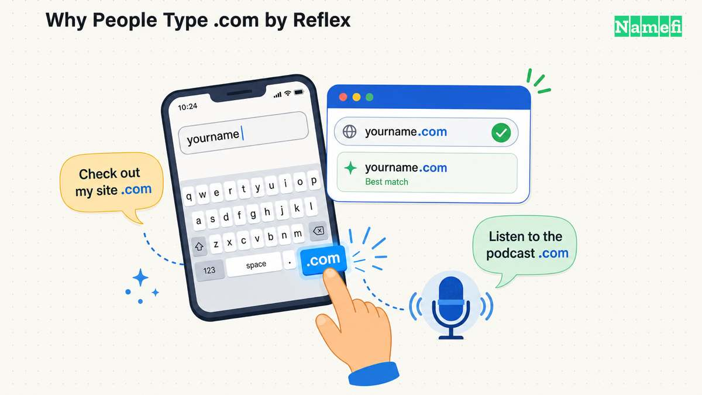
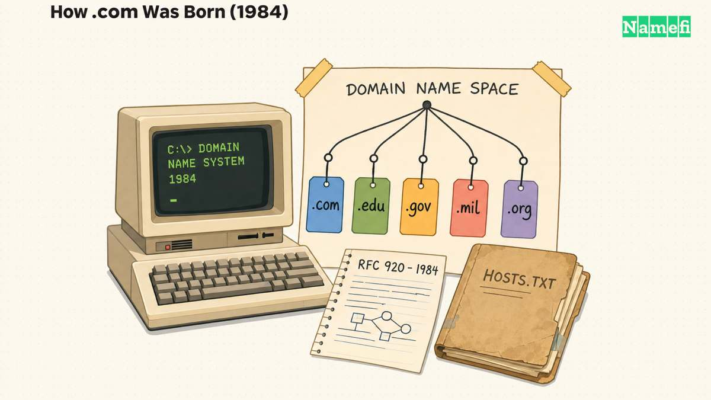
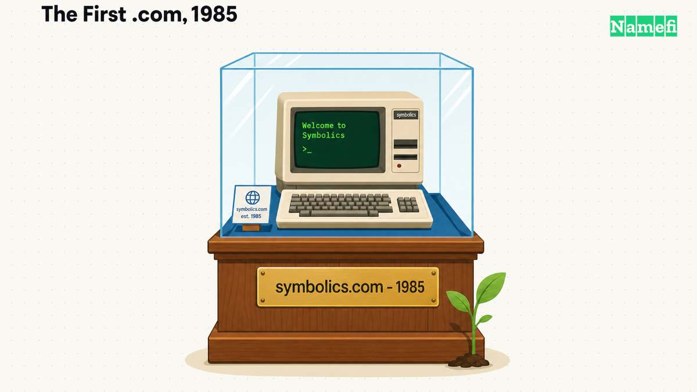
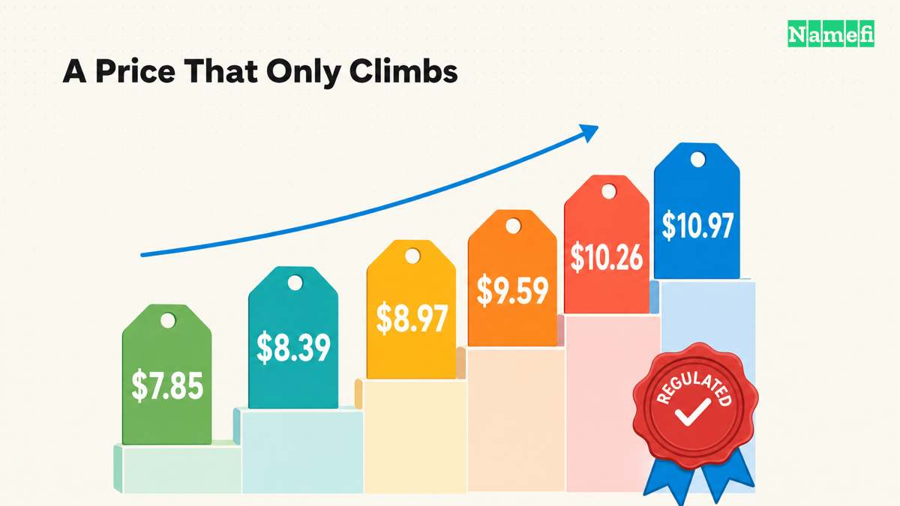
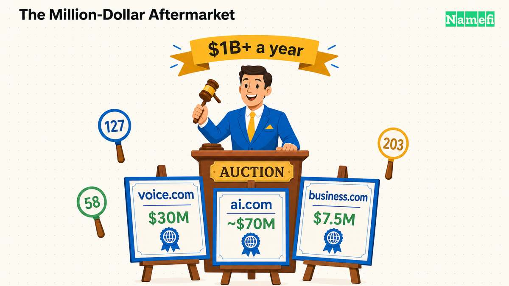

In 2019, a single domain name — **voice.com** — [sold for $30 million](https://domaininvesting.com/voice-com-domain-name-acquired-for-30-million/). In 1995, the most valuable address on the early web, **sex.com**, was [stolen with a forged fax](/en/blog/the-sex-com-heist-the-forged-letter/) and fought over in court for a decade. And one night in 2015, an ex-Googler briefly [bought google.com for $12](/en/blog/the-12-dollar-minute-someone-owned-google-com/) before the company's own systems clawed it back. Every one of those stories turns on the same three letters.

That is the strange thing about the **.com domain**: it is so ordinary we forget it is the most valuable real estate of the digital age. Short for "commercial," it is the original [generic top-level domain](/en/glossary/gtld/) — and through forty years of accident, ambition, and ubiquity it became the suffix people assume when they hear a website name. This page is the long version of how that happened, and what it means if you are thinking about buying one.

## .com at a glance

| Fact | Detail |
| --- | --- |
| TLD type | Generic TLD (gTLD), treated as generic by Google |
| Registry operator | Verisign (VeriSign Global Registry Services) |
| Year delegated | 1985 |
| Registrations | 161+ million — the largest TLD on the internet |
| Wholesale price | Regulated; raised from $7.85 (2012) to $10.97 (2026) |
| IDN support | Yes |
| DNSSEC | Yes |
| Registration restrictions | Open to all — no local presence, credential, or business requirement |
| Best for | Businesses, global brands, e-commerce, anyone wanting the default extension |

## The accidental default: how .com was born

The internet's address book very nearly never existed. In the early 1980s, every machine on the ARPANET found every other machine through a single [text file named `HOSTS.TXT` that mapped host names to numerical addresses](https://en.wikipedia.org/wiki/Domain_Name_System#:~:text=maintained%20a%20text%20file%20named%20HOSTS.TXT%20that%20mapped%20host%20names%20to%20the%20numerical%20addresses%20of%20computers%20on%20the%20ARPANET), hand-maintained at Stanford Research Institute and downloaded by everyone. By 1983 it was buckling under its own success.

The fix came from a researcher at USC's Information Sciences Institute named **[Paul Mockapetris](https://en.wikipedia.org/wiki/Paul_Mockapetris#:~:text=invented%20the%20Internet%20Domain%20Name%20System)**, who in November 1983 authored the two foundational specifications of the [Domain Name System](/en/glossary/dns/) — the hierarchical, distributed design that still routes the internet today. Working alongside him was the bearded, sandal-wearing engineer who, more than anyone, *was* the early internet's administration: **[Jon Postel](https://en.wikipedia.org/wiki/Jon_Postel)**, keeper of the [IANA](/en/glossary/iana/) functions, the man who for decades decided what became an internet standard largely from his own desk.

In **October 1984**, Postel and Joyce Reynolds published [RFC 920](https://datatracker.ietf.org/doc/html/rfc920), which created the first generic top-level domains: `.com`, `.edu`, `.gov`, `.mil`, `.org`, and the transitional `.arpa`. (`.net` was added a few months later when the root zone was first populated.) The choice of six short, generic buckets was deliberate, and the definition of `.com` was almost comically loose — it was simply for "commercial" entities, with no verification, no payment, and no gatekeeping beyond emailing a form to a NIC. Postel ran the whole apparatus by a famous engineering maxim, "be conservative in what you send, be liberal in what you accept," and that liberality is exactly how he ran .com. He later tried to tighten the language in [RFC 1591](https://www.ietf.org/rfc/rfc1591.txt), but it never mattered. The door was open, and it has stayed open ever since.

That looseness is the whole personality of .com. It was never reserved for a club. It belonged to whoever asked first — which is exactly why it ate the internet.

## symbolics.com: the first .com, and a warning about hype

On **March 15, 1985**, a Massachusetts computer-maker became the first entity ever to register a .com. The company was **Symbolics**, [a spinoff from the MIT AI Lab … founded … for the purpose of manufacturing Lisp machines](https://en.wikipedia.org/wiki/Symbolics#:~:text=Symbolics%20was%20a%20spinoff%20from%20the%20MIT%20AI%20Lab) — the hardware of the *first* artificial-intelligence boom. Its domain, [symbolics.com, is recognized as the first registered .com on the internet](https://www.stackscale.com/blog/symbolics-com-domain-name/#:~:text=Symbolics.com%20is%20the%20first%20registered%20.com%20domain%20name%20on%20the%20Internet), and it has never lapsed.

For perspective on how empty the new namespace was: in the entire rest of 1985, [only a handful more .com domains followed](https://en.wikipedia.org/wiki/List_of_the_oldest_currently_registered_Internet_domain_names) — names like BBN, Thinking Machines, DEC, and Northrop. A few commercial domains in the whole first year.

There is a quiet lesson in Symbolics for anyone buying an AI-flavored name in 2026. The company rode the 1980s AI wave, was briefly one of America's fastest-growing tech firms — and then the "AI winter" arrived, cheap general-purpose workstations destroyed its niche, and it collapsed into a skeleton operation. The domain outlived the company by decades. In **2009**, symbolics.com was finally sold to domain investor [Aron Meystedt, who "obtained symbolics.com, the first .com ever registered"](https://snapshot.internetx.com/en/blogpost/its-all-about-domains-interview-with-aron-meystedt-symbolics-com/#:~:text=this%20is%20how%20I%20obtained%20symbolics.com%2C%20the%20first%20.com%20ever%20registered) — the first ownership change in nearly twenty-five years — for an undisclosed sum. The first .com is now preserved as a piece of internet history. The technology fad that created it did not last; the address did.

## From free to a fortune: the Network Solutions monopoly

For its first decade, registering a .com was free. The U.S. National Science Foundation subsidized the system, and from 1991 a contractor called **Network Solutions** ran registrations on the government's behalf — [the only bidder on the $5.9 million annual contract to administer it](https://en.wikipedia.org/wiki/Network_Solutions#:~:text=Network%20Solutions%20was%20the%20only%20bidder%20on%20the%20%245.9%20million%20annual%20contract%20to%20administer%20it).

Then, on **September 14, 1995**, the money started. [Network Solutions imposed a charge of $100 for two years' registration](https://en.wikipedia.org/wiki/Network_Solutions#:~:text=Network%20Solutions%20imposed%20a%20charge%20of%20%24100%20for%20two%20years%27%20registration) — and, as the sole registrar for .com, .net, and .org, it had a monopoly on the act of getting online. Thirty percent of every fee was skimmed into a government "Internet Intellectual Infrastructure Fund," a surcharge a federal court would later call an unconstitutional tax before Congress retroactively blessed it. Network Solutions' owner, the defense contractor SAIC, had bought the company months earlier for a mere $4.7 million; it had, without quite realizing it, purchased a license to print money as the web went mainstream.

The monopoly bred a backlash, and the backlash reshaped how the internet is governed. In **1998** the U.S. government moved to privatize naming and numbering, leading to the creation of [ICANN](/en/glossary/icann/) — [officially incorporated in California on September 30, 1998](https://en.wikipedia.org/wiki/ICANN#:~:text=officially%20incorporated%20in%20the%20state%20of%20California%20on%20September%2030%2C%201998) — the nonprofit that still oversees the domain system. That same year produced one of the internet's most remarkable acts of quiet authority: in January 1998, Jon Postel [emailed eight of the twelve operators of the internet's regional root nameservers on his own authority and instructed them to reconfigure their servers](https://en.wikipedia.org/wiki/Jon_Postel#:~:text=emailed%20eight%20of%20the%20twelve%20operators%20of%20Internet%27s%20regional%20root%20nameservers%20on%20his%20own%20authority%20and%20instructed%20them%20to%20reconfigure%20their%20servers) to point at his machine instead of the government's. They complied. For a few days, one researcher effectively held the keys to the internet's address book — before Washington persuaded him to reverse it. Postel died that October, sixteen days after ICANN was incorporated, never seeing the institution he had midwifed begin to operate.

The commercial endgame came in **2000**, when **Verisign** [agreed to acquire Network Solutions in an all-stock transaction valued at $21 billion](https://www.computerworld.com/article/1368800/verisign-to-buy-network-solutions-for-21b.html#:~:text=acquire%20Network%20Solutions%20Inc.%20in%20an%20all-stock%20transaction%20valued%20at%20%2421%20billion). Verisign later sold off the retail registrar business but kept the prize: the .com **registry** itself — the wholesale layer that collects a fee on every single .com name, from every competing [registrar](/en/glossary/registrar/), forever. It still runs it today.

## How .com became a synonym for the economy

You cannot explain .com's grip without the bubble. Between 1995 and 2000, the number of registered domains exploded from tens of thousands to more than 20 million — a land grab unlike anything before it. Just *appending* ".com" to a company name could move a stock: the booksellers, the pet-supply sites, the grocery-delivery startups all wore the suffix like a badge of the future.

The mania has clean numbers. Venture money poured into anything with a ".com" plan. On its first day of trading in December 1999, the Linux company VA Linux [closed 698% above the IPO price](https://en.wikipedia.org/wiki/VA_Linux#:~:text=698%25%20above%20the%20IPO%20price) — the largest first-day gain on record at the time. Then the [NASDAQ Composite … peaked at 5,048.62](https://en.wikipedia.org/wiki/Dot-com_bubble#:~:text=NASDAQ%20Composite%20stock%20market%20index%20peaked%20at%205%2C048.62) on March 10, 2000, and over the next two and a half years gave nearly all of it back — a roughly 78% fall that erased on the order of $5 trillion in market value.

The bubble burst, but the word survived. If anything, the mania welded ".com" to the very idea of being online: at the height of it, companies saw their share prices jump simply by announcing a website, and the suffix became a kind of collective shorthand for "this is part of the future." "Dot-com" came to mean the entire internet economy — and .com became the default a brand reaches for without thinking.

That cultural muscle memory is the real asset. It's why, decades later, [holding the period key in a browser on iOS brings up a list of common domain suffixes like .com](https://www.macobserver.com/news/a-hidden-ios-shortcut-holding-the-period-key-reveals-domain-extensions/#:~:text=holding%20the%20period%20key%20in%20a%20browser%20brings%20up%20a%20list%20of%20common%20domain%20suffixes), why people still mentally append ".com" to any name they half-remember, and why a customer who hears your brand on a podcast types yours-name-dot-com first. Marketers call it the "radio test," and .com wins it every time. No amount of marketing money can manufacture that reflex in a new extension; .com got it for free, by being first and being everywhere when the web went mainstream.

## Who controls the price of the internet's default

Here is the part most buyers never see — and the part that most affects what you will pay for a .com over a lifetime.

.com's wholesale price is not set by a market. Verisign runs the registry under a [contract with ICANN](https://www.icann.org/en/registry-agreements/details/com) and a parallel ["Cooperative Agreement" with the U.S. Commerce Department](https://www.ntia.gov/program/verisign-cooperative-agreement), and for years that contract *froze* the price. In 2012, the Obama administration locked the wholesale fee at **$7.85** and stripped Verisign's automatic-increase rights.

That changed in **2018**. The Trump-era NTIA signed [Amendment 35](https://www.ntia.gov/program/verisign-cooperative-agreement), which it said would "repeal Obama-era price controls" and restore Verisign's right to raise the wholesale price by **up to 7% in four of every six years**. Verisign's stock jumped roughly 18% in the days that followed. In 2020, [ICANN agreed to let Verisign increase the price of .com domains by 7% per year in the last four years of each six-year extension](https://domainnamewire.com/2020/03/27/breaking-icann-and-verisign-agree-to-com-extension-with-7-price-hikes/#:~:text=increase%20the%20price%20of%20.com%20domains%20by%207%25%20per%20year%20in%20the%20last%20four%20years%20of%20each%20six-year%20extension) — alongside a payment from Verisign to ICANN of $4 million a year for five years for "DNS security." The public comment period drew roughly 9,000 submissions, the overwhelming majority opposed. ICANN approved it the day after publishing its analysis of those comments.

The result is a steady, contractually-guaranteed climb. The wholesale price has gone $7.85 → $8.39 → $8.97 → $9.59 → $10.26, and it is [rising from $10.26 to $10.97](https://domainnamewire.com/2025/11/19/verisign-can-increase-com-prices-in-2026/#:~:text=increase%20from%20%2410.26%20to%20%2410.97) in 2026.

Why this is so contested comes down to economics that are hard to find anywhere else in business. Verisign runs .com under a contract that was never put out for competitive bid — and when other countries *have* bid out their registries, the prices came in a fraction as high (a bid to run India's `.in` came in from [Neustar at just 70 cents per domain name per year](https://circleid.com/posts/20181112_verisigns_attempt_to_increase_fees_unjustified_despite#:~:text=Neustar%20at%20just%2070%20cents%20per%20domain%20name%20per%20year), against Verisign's near-$11). Industry analysts peg Verisign's true cost to operate a .com name at a few dollars at most, and the company's operating margins sit around two-thirds of revenue. The American Economic Liberties Project estimated the post-2018 increases alone [represent an additional $383 million annual windfall for Verisign's shareholders](https://www.economicliberties.us/our-work/a-call-for-com-petition-reining-in-verisigns-monopoly-over-the-internets-most-popular-top-level-domain/#:~:text=represents%20an%20additional%20%24383%20million%20annual%20windfall), and in 2024 [Senator Elizabeth Warren and Rep. Jerry Nadler wrote to the National Telecommunications and Information Administration and Department of Justice](https://www.warren.senate.gov/newsroom/press-releases/warren-nadler-urge-regulators-to-take-action-on-verisigns-monopoly-over-com-website-prices#:~:text=wrote%20to%20the%20National%20Telecommunications%20and%20Information%20Administration) urging action on Verisign's pricing.

Verisign's reply is that it operates irreplaceable infrastructure with near-perfect uptime, and that the price of a single domain is trivial next to the cost of running a business online. Both sides have a point. For you, the buyer, the conclusion is the same either way, and it is unsentimental: **a .com is a subscription with a built-in escalator. Budget for the renewal, not the signup price.**

## What a .com is actually worth

If the wholesale price tells you what .com costs to *rent* from the registry, the aftermarket tells you what a *good* one is worth on the open market — and the numbers are staggering, because a memorable, exact-match .com is the one asset a competitor cannot simply recreate.

The public record runs from the merely large to the historic:

| Domain | Reported price | Year |
| --- | --- | --- |
| ai.com | [~$70 million](https://domainnamewire.com/2026/02/06/ai-com-domain-name-sold-70-million/#:~:text=the%20sales%20price%20was%20%2470%20million%2C%20paid%20in%20equivalent%20cryptocurrency) | 2026 |
| voice.com | [$30 million](https://domaininvesting.com/voice-com-domain-name-acquired-for-30-million/#:~:text=Voice.com%20was%20sold%20for%20%2430%20million) | 2019 |
| carinsurance.com | [$49.7 million](https://domainnamewire.com/2010/11/08/quinstreet-buys-carinsurance-com-for-49-7-million-says-its-done-for-now/#:~:text=Quinstreet%20has%20paid%20%2449.7%20million%20cash%20for%20CarInsurance.com) | 2010 |
| insurance.com | [$35.6 million](https://domaininvesting.com/quinstreet-paid-356-million-for-insurance-com/#:~:text=it%20paid%20%2435%2C600%2C000%20for%20Insurance.com) | 2010 |
| business.com | [$7.5 million](https://en.wikipedia.org/wiki/Business.com#:~:text=for%20%247.5%20million) | 1999 |

**voice.com** went to the blockchain company Block.one; **ai.com** reportedly set the all-time record in February 2026 — fittingly, the most expensive domain ever sold was a .com, not a .ai. (Beware the headline figures that aren't clean sales: cars.com's oft-cited ~$872 million was a valuation booked inside a corporate acquisition, not a domain price.)

Then there are the stories that show how *much* a .com can matter — and how fragile possession once was.

**The sex.com heist.** [Gary Kremen (who later founded Match.com)](https://en.wikipedia.org/wiki/Kremen_v._Cohen#:~:text=Gary%20Kremen) registered sex.com in 1994. In 1995 a con man named Stephen [Cohen sent a letter to Network Solutions … falsely stating that Kremen had been fired](https://en.wikipedia.org/wiki/Kremen_v._Cohen#:~:text=Cohen%20sent%20a%20letter%20to%20Network%20Solutions) — and Network Solutions simply handed the name over, no verification. (Our own [account of the forged-letter heist](/en/blog/the-sex-com-heist-the-forged-letter/) tells the full story.) Cohen ran it as a fortune-generating porn portal for five years. Kremen sued, and in 2003 the Ninth Circuit issued a landmark ruling that **a domain name is property** you can sue to recover; [he was again ordered to pay Kremen the grand total of $65 million](https://en.wikipedia.org/wiki/Kremen_v._Cohen#:~:text=he%20was%20again%20ordered%20to%20pay%20Kremen%20the%20grand%20total%20of%20%2465%20million), which he fled the country rather than pay. The case rewrote the legal status of every domain you can own today.

**The $12 minute.** In September 2015, former Google employee Sanmay Ved was poking around Google's own domain service when google.com showed as available. He clicked buy. His card was charged $12, and for about a minute he owned the world's most-visited website — until Google's systems caught the error and refunded him. Google's security team paid him a bug bounty of $6,006.13 (it spells "Google" in leetspeak); when Ved said he'd donate it, [Google doubled it to $12,012.26](/en/blog/the-12-dollar-minute-someone-owned-google-com/).

These are not just trivia. They are why the .com [aftermarket](/en/glossary/aftermarket/) is the most liquid, most fought-over secondary market in the domain world. By Verisign's own account, [over $1 billion in annual secondary-market sales of .com domain names can be documented](https://circleid.com/posts/20181102_how_much_could_businesses_and_consumers_save_if_dot_com_price_cap#:~:text=over%20%241%20billion%20in%20annual%20secondary-market%20sales) — an entire economy layered on top of names that cost a few dollars to register. The catch for a newcomer is the flip side of that liquidity: most genuinely good one-word .com names left registration availability long ago, which is why finding a strong .com today usually means coining a brand or buying on the aftermarket.

## The competition that never came

If .com is so scarce and its price only climbs, why hasn't something replaced it? Not for lack of trying. Starting in 2012, ICANN opened the floodgates to a wave of new generic extensions — [.xyz](/en/tld/xyz/), [.online](/en/tld/online/), [.shop](/en/tld/shop/), [.app](/en/tld/app/), and on and on; [the number of gTLDs exceeded 1,200](https://en.wikipedia.org/wiki/Generic_top-level_domain#:~:text=The%20number%20of%20gTLDs%20as%20of%20March%202018%20exceeds%201%2C200) — the single biggest expansion of the namespace in the internet's history. Some have found real audiences. None has dethroned .com, and the reason is a textbook network effect: .com is valuable because everyone expects it, and everyone expects it because it's valuable. A generation has been trained to type ".com" by reflex, to trust it at checkout, and to assume it when they only half-remember a name. That habit is the moat.

It's also why "get the .com" remains the reflexive advice even in 2026. The alternatives are no longer fringe — a tech startup on [.io](/en/tld/io/) or [.ai](/en/tld/ai/) reads as perfectly legitimate — but they're chosen *for a reason* (a signal, a short available name), whereas .com is the default you fall back to when you have no reason to do anything else. Being the default, in a system with 160-million-plus names and decades of muscle memory, is the most durable position in the entire domain world.

## So, should you buy a .com?

Strip away the history and the buyer's question is concrete: with 160-million-plus names taken and a price that only rises, is .com still the right call? For most serious brands, yes — and here is the honest case on both sides.

**The case for:**

- **Unmatched recognition.** .com is the suffix people assume by default. Owning the exact-match captures traffic that would otherwise leak elsewhere.
- **Trust at the moment of decision.** Decades of ubiquity make .com read as legitimate — especially valuable for e-commerce and anything that asks for payment details.
- **Global, neutral SEO.** Google [treats .com as a generic gTLD](https://developers.google.com/search/docs/specialty/international/managing-multi-regional-sites#:~:text=Unless%20ICANN%20lists%20a%20top%2Dlevel%20domain), with no ranking penalty and no geographic boxing-in. The advantage is human — higher click-through from trust — not algorithmic.
- **Resale value.** Premium .com names hold value more reliably than any other extension and anchor the deepest aftermarket in the industry.

**The case against (or at least, eyes open):**

- **Scarcity.** The short, brandable, exact-match names are largely gone. You may face a compromise spelling, a longer name, or an aftermarket purchase.
- **A rising rent.** The wholesale escalator means renewals creep up for as long as you own the name.
- **No niche signal.** .com says "everything," which is a strength for mainstream brands but offers none of the built-in meaning a category suffix like [.ai](/en/tld/ai/) or [.io](/en/tld/io/) provides.
- **Copycat exposure.** Building on .com without securing the closest lookalikes invites typo-squatters.

On **reputation and email**, .com carries the most neutral, trusted profile of any TLD — the opposite of the bargain new gTLDs some spam filters treat with suspicion. But deliverability still depends far more on your own SPF, DKIM, and DMARC setup than on the suffix. And on **naming**, because the dictionary words are taken, modern .com branding usually means coining a name — invented but pronounceable, or a short compound — that survives the radio test and isn't a confusing near-match to an existing [trademark](/en/glossary/trademark/).

For any brand that can afford it, the disciplined move is to treat the exact-match .com as the **highest-priority defensive registration you can make** — even if you launch on another extension — and redirect the closest variants back to it, rather than fighting a copycat later through the [UDRP](/en/blog/what-is-udrp/). In practice that usually means the exact-match .com first, then the obvious typo and plural variants, then a small set of the highest-risk lookalikes (the one-character-off names and high-intent commercial strings). You don't need hundreds of registrations — you need the handful a determined impersonator would actually target, pointed back at your canonical site so the traffic and trust flow to one place.

## How .com works today (the practical bits)

**Anyone can register one.** There is no local-presence requirement, no business check, no credential gate. Names run 1–63 characters; letters, digits, and hyphens (not at the start or end); and [internationalized domain names](/en/glossary/idn/) are supported for non-Latin scripts. A few standard policies are worth knowing before you buy:

- **DNSSEC.** Verisign [deployed DNSSEC in the .com and .net zones](https://www.verisign.com/en_US/domain-names/dnssec/index.xhtml#:~:text=we%20deployed%20DNSSEC%20in%20the%20.net%20and%20.com%20zones), so you can cryptographically sign your domain against DNS spoofing.
- **Transfers** between registrars use an authorization code under ICANN's [Transfer Policy](https://www.icann.org/en/contracted-parties/accredited-registrars/transfer-policy-01-06-2016-en), with a 60-day lock after registration or a change of registrant.
- **Expiration** is recoverable: ICANN's [Redemption Grace Period](https://www.icann.org/resources/pages/grace-2013-05-03-en) gives the registrant a window to restore a lapsed name before it's released.
- **Disputes** over names that infringe a mark run through the [UDRP](/en/blog/what-is-udrp/) — relevant if you're buying something close to an existing brand.

One quirk worth understanding as a buyer: while the *wholesale* price is a single regulated number, the *retail* price you pay swings widely between registrars. Since 1999, .com has used a shared-registration model in which hundreds of [registrars](/en/glossary/registrar/) compete to sell the same names, which is why first-year promo rates can sit far below the true renewal price. Always check the renewal, not the teaser — the registry escalator applies to every registrar equally.

The scale is its own fact: Verisign's [Domain Name Industry Brief](https://blog.verisign.com/domain-names/q4-2025-domain-name-industry-brief-quarterly-report/) put .com and .net at a [combined 173.5 million registrations](https://blog.verisign.com/domain-names/q4-2025-domain-name-industry-brief-quarterly-report/) at the end of 2025, with **.com alone above 161 million** — roughly four in ten of all domain names on earth.

## Why the first .com still resolves

Here is the detail that ties the whole story together. **symbolics.com**, registered in March 1985, still loads today — outliving the company that created it, the AI boom that made that company famous, the AI winter that killed it, the dial-up era, the dot-com bubble, and four decades of technological churn. The address proved more durable than almost everything around it.

That is the quiet argument for .com as a long-term asset. Brands, technologies, and even whole business models come and go; a well-chosen .com tends to stay put, accrue trust, and remain the one thing a competitor cannot copy. It is the rare digital purchase that behaves less like a subscription and more like land. The escalating renewal is the price of holding that land — and for a name that anchors a serious brand, it is usually a price worth paying.

## Holding a .com for the long term

A .com is a decades-long asset, and how you *hold* it matters as much as which one you buy. Beyond conventional [DNS](/en/glossary/dns/) registration, a .com can also be held as a [tokenized domain](/en/blog/what-are-tokenized-domains/) — an [on-chain](/en/glossary/on-chain/) record that makes [ownership](/en/glossary/domain-ownership/) verifiable and transfers as simple as moving an [NFT](/en/glossary/nft/), without giving up standard resolution. As an [ICANN-accredited](/en/glossary/icann/) [registrar](/en/glossary/registrar/) that bridges Web2 and [Web3](/en/glossary/web3/), [Namefi](https://namefi.io) lets you register a .com, manage its DNS, and optionally tokenize it in one place. You can search a name and get started at [Namefi](https://namefi.io).

## Frequently asked questions

### Can anyone register a .com domain?

Yes. The .com namespace is open to everyone worldwide with no local-presence, business, credential, or community requirement. The original commercial intent has never been enforced, so individuals, nonprofits, and companies alike can register one, subject only to availability.

### Does a .com domain affect SEO?

Google treats .com as a generic top-level domain with no inherent ranking advantage or penalty. The practical benefit is human rather than algorithmic: users trust and click .com results more readily, which can lift real-world click-through rates.

### Why are good .com domains so hard to find?

With more than 161 million .com names registered, the supply of short, dictionary, and exact-match brand names is largely exhausted. Most premium names are already owned, so they are typically available only on the secondary market rather than at standard registration price.

### How much does a .com cost, and does the price keep rising?

Registrars set their own retail prices, but the registry wholesale price is regulated. Since a 2018 U.S. government amendment, Verisign may raise it by up to 7% in four of every six years — it has climbed from $7.85 to $10.97 — so plan around the renewal, not just the first-year signup rate.

### Who should register a .com domain?

Almost any business, brand, or project that wants the most universally recognized and trusted address. It is especially worthwhile for companies serving a global or mainstream audience and for anyone protecting a brand over the long term.

### Does .com support WHOIS privacy and DNSSEC?

DNSSEC is supported by the .com registry. [WHOIS privacy](/en/glossary/whois-privacy/) availability depends on your registrar; most modern registrars, including Namefi, offer privacy protection on eligible registrations.

## Sources

- [IANA root-zone entry for .com](https://www.iana.org/domains/root/db/com.html) — registry operator and 1985 delegation
- [RFC 920 (Postel & Reynolds, 1984)](https://datatracker.ietf.org/doc/html/rfc920) — creation of the original gTLDs
- [Verisign Domain Name Industry Brief, Q4 2025](https://blog.verisign.com/domain-names/q4-2025-domain-name-industry-brief-quarterly-report/) — .com / .net registration totals
- [ICANN .com Registry Agreement](https://www.icann.org/en/registry-agreements/details/com) and [NTIA Verisign Cooperative Agreement](https://www.ntia.gov/program/verisign-cooperative-agreement) — pricing authority
- [ICANN–Verisign 2020 amendment with 7% price hikes](https://domainnamewire.com/2020/03/27/breaking-icann-and-verisign-agree-to-com-extension-with-7-price-hikes/) and the [2026 increase to $10.97](https://domainnamewire.com/2025/11/19/verisign-can-increase-com-prices-in-2026/)
- [Google Search Central — managing multi-regional sites](https://developers.google.com/search/docs/specialty/international/managing-multi-regional-sites) — .com treated as generic
- [voice.com $30M sale](https://domaininvesting.com/voice-com-domain-name-acquired-for-30-million/) and [the symbolics.com story](https://www.stackscale.com/blog/symbolics-com-domain-name/)

## Related resources

- [The $12 minute someone owned Google.com](/en/blog/the-12-dollar-minute-someone-owned-google-com/)
- [The sex.com heist: a forged letter](/en/blog/the-sex-com-heist-the-forged-letter/)
- [From TeslaMotors.com to Tesla.com](/en/blog/from-teslamotors-com-to-tesla-com/)
- [What makes a domain valuable?](/en/blog/what-makes-a-domain-valuable/)
- [How to sell a domain name you own](/en/blog/how-to-sell-a-domain-name-you-own/)
- TLD guides: [.net](/en/tld/net/), [.org](/en/tld/org/), [.io](/en/tld/io/), [.ai](/en/tld/ai/), [.xyz](/en/tld/xyz/)
- Glossary: [ICANN](/en/glossary/icann/), [registrar](/en/glossary/registrar/), [DNS](/en/glossary/dns/), [DNSSEC](/en/glossary/dnssec/)
