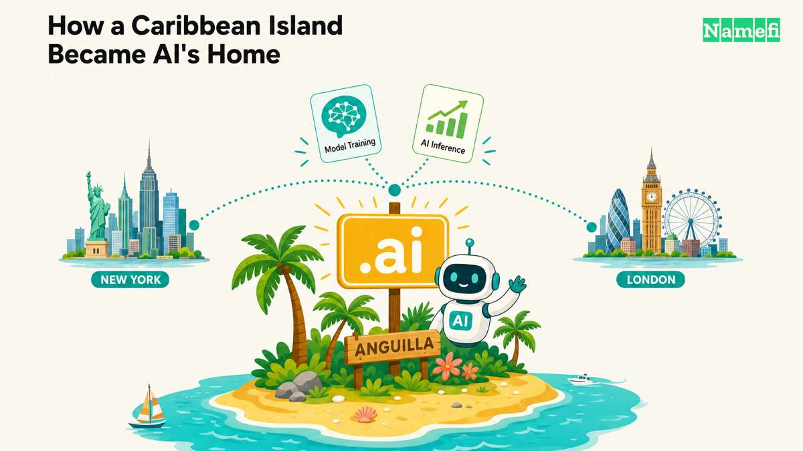
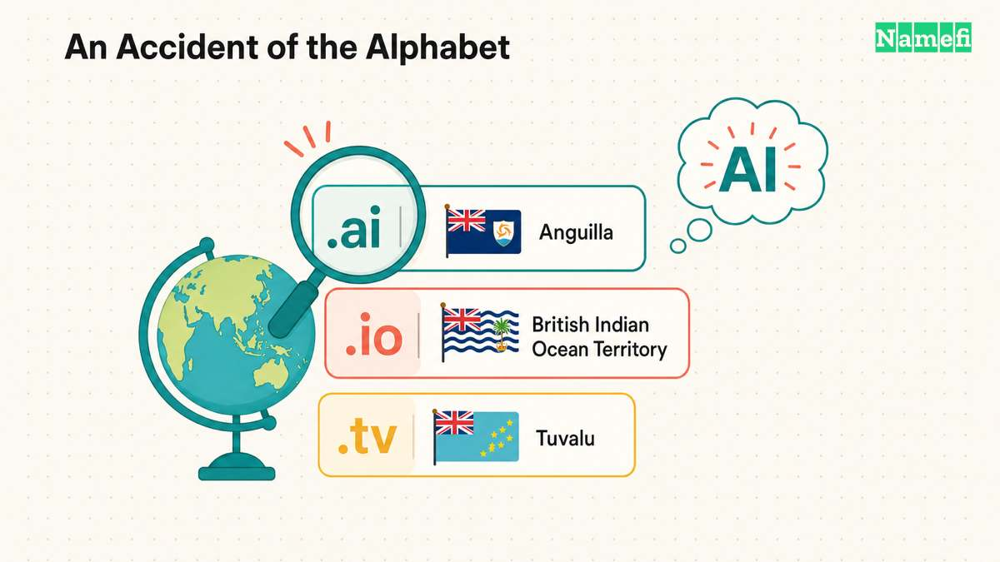
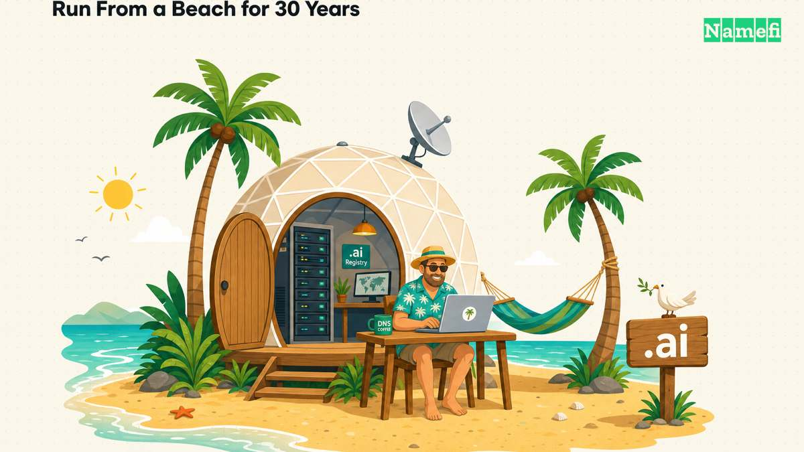
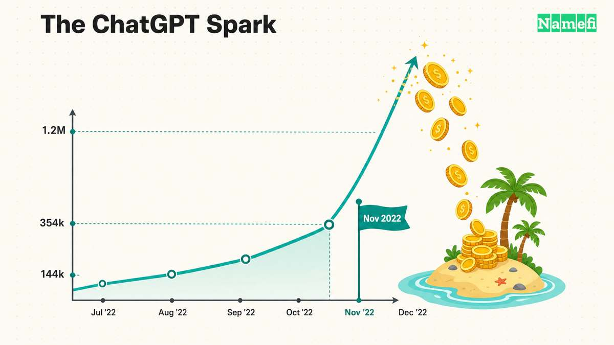
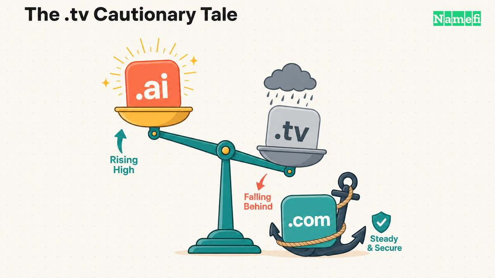

2023 年，加勒比海最小领地之一的政府靠出售域名赚了[约 3200 万美元——超过其整体 GDP 的 10%](https://en.wikipedia.org/wiki/.ai#:~:text=In%202023%2C%20Anguilla%27s%20government%20made%20about%20US%2432%20million)。到 2025 年，一位部长告诉 BBC，域名收入将[占国家财政收入的约 47%](https://en.wikipedia.org/wiki/.ai#:~:text=by%202025%20it%20will%20be%20around%2047%25)。这个领地是安圭拉，人口约一万六千人。它没有训练出一个 AI 模型。它只是碰巧拥有了正确的两个字母：**.ai**。

这是一个罕见的后缀——它的字母同时也是科技界最有价值的缩写之一。从技术层面而言，.ai 是安圭拉（东加勒比海英国海外领地）的[国家代码顶级域名（ccTLD）](/zh/glossary/cctld/)。而在实践中，它已成为整个人工智能行业的默认地址。本文讲述完整的故事——那个从海滩上运营注册局长达三十年的密码朋克、点燃一切的 ChatGPT 时刻，以及当你决定是否把品牌落在 .ai 上时，这一切意味着什么。

## .ai 速览

| 信息 | 详情 |
| --- | --- |
| TLD 类型 | ccTLD（安圭拉国家代码）；Google 将其视为通用域名 |
| 注册局运营方 | 安圭拉政府；技术后端由 Identity Digital 运营（自 2025 年 1 月起） |
| 授权年份 | 1995 年 |
| 注册期限 | 最短两年；可选 2–10 年 |
| IDN 支持 | 否——历史上仅支持 ASCII 字符 a–z、0–9 和连字符 |
| DNSSEC | 注册局层面支持 |
| 注册限制 | 向所有人开放；无本地存在要求 |
| 适用场景 | AI/ML 初创公司、智能体产品、开发者工具、优质科技品牌 |

## 最不可思议的科技之都

安圭拉约有 35 平方英里的低矮珊瑚礁——东北加勒比海上的一块礁石，长约 16 英里，最宽处 3.5 英里，人口约一万六千。它的经济长期依赖两件事：洁白沙滩上的奢华旅游，以及规模有限的离岸金融。它风景绝美，地处偏远，且季节性地暴露在飓风之下。从任何明显的标准来看，你都不会想到这里会成为全球 AI 经济的一根支柱。

这正是 .ai 故事的不可思议之处。这座岛屿既没有写出一行算法，也没有招募来一家初创公司；它全部的功劳只是在某项技术恰好共享其首字母缩写时，存在于字母表的正确位置。它的横财是纯粹的字母表意外——更耐人寻味的问题是：这个意外为何沉睡了近三十年才有人来兑现？答案是一个关于一个倔强的个体、一款产品发布，以及谁真正掌控着互联网构建模块的故事。

## 两个字母，出于偶然

字母"AI"不是一个营销选择。它们只是安圭拉的 [ISO 3166-1](/zh/glossary/cctld/) 国家代码——和让 `.io`（英属印度洋领地）和 [.tv](/zh/tld/tv/)（图瓦卢）成为科技宠儿的那种字母巧合如出一辙。国家代码是 1990 年代由 Jon Postel 和 [IANA](/zh/glossary/iana/) 职能依据他在 [RFC 1591](https://www.ietf.org/rfc/rfc1591.txt) 中写下的理念分配的：ccTLD 的管理者是为社区服务的*受托人*，而"关于域名'权利'和'所有权'的担忧是不恰当的"。没有人料到这些两字母的意外会成为每年价值数千万美元的资产。

.ai [于 1995 年授权给安圭拉](https://www.iana.org/domains/root/db/ai.html)，此后将近二十年基本上什么都没做。它只是一个安静的小岛 ccTLD——而它是如何苏醒的，这个故事绕过了早期互联网上一个颇为特别的人物。

## 那个从海滩上运营一国域名的密码朋克

1994 年 11 月，一位名叫 **[Vince Cate](https://en.wikipedia.org/wiki/Vince_Cate)** 的美国计算机科学家[移居安圭拉](https://spectrum.ieee.org/ai-domains#:~:text=I%20came%20to%20Anguilla%20in%201994)。伯克利本科、卡内基梅隆博士肄业（他曾在研究一个网络文件系统，后来被互联网拉走了），Cate 是一个坚定的密码朋克——1990 年代那个相信强加密是个人自由工具的运动的成员。他选择安圭拉部分原因是他负担不起更知名的避税天堂，而他想建立科幻作家 Bruce Sterling 所称的"数据避风港"：在任何单一政府审查之手之外的离岸基础设施。

Cate 不是一个安静的观察者。以极低的成本抵达，他创立了安圭拉的第一家互联网服务商，最终在[Shoal Bay 附近的一个"巴克敏斯特·富勒"风格穹顶里](https://news.ai/vince-cate-in-search-of-bees/#:~:text=style%20dome%20out%20by%20Shoal%20Bay)架起服务器，这里实际上就是一个名副其实的数据避风港。他主持岛上的密码朋克聚会，并共同组织了[1997 年在安圭拉举办的第一届**金融密码学会议**](https://ifca.ai/fc97/#:~:text=Financial%20Cryptography%2097%20will%20be%20held%20in%20Anguilla)。他最著名的壮举是一个网页，邀请任何访客["一键成为国际军火商"](https://en.wikipedia.org/wiki/Vince_Cate#:~:text=become%20an%20international%20arms%20trafficker%20in%20one%20click)——通过邮件发送几行加密代码，这在当时的美国密码学出口法律下可能构成违法出口。这场抗议还有续集：1998 年，Cate 甚至走到了[花费 5000 美元归化为莫桑比克公民、随后放弃美国国籍](https://en.wikipedia.org/wiki/Vince_Cate#:~:text=paying%20%245%2C000%20to%20naturalise%20as%20a%20citizen%20of%20Mozambique%20and%20then%20giving%20up%20his%20U.S.%20citizenship)这一步。

他还想要一个域名。于是他给 [Jon Postel](https://en.wikipedia.org/wiki/Jon_Postel) 发了封邮件——那个亲自管理全球顶级域名的人——开口要。Postel 的回复，[据 Cate 复述](https://spectrum.ieee.org/ai-domains#:~:text=do%20you%20want%20to%20run%20.ai)是：*"没有人在运营 .ai，你想运营吗？"* Cate 说愿意。他把官方管理联系人转给了安圭拉政府（他觉得不应该以私人名义持有），但自己继续运营，搭建了自己的注册局软件（取名 **Zenaida**，以安圭拉的国鸟命名），并基本上一个人独撑了将近三十年。他[将 75% 的收入交给政府](https://domainnamewire.com/2025/02/28/former-ai-administrator-discloses-identity-digital-rev-share-other-details/#:~:text=he%20gave%2075%25%20to%20the%20government%20when%20he%20ran%20the%20domain)，自己通过电话和邮件提供支持。

那些年里，.ai 赚得极少。早期，注册[存在于下一级目录](https://en.wikipedia.org/wiki/.ai)——`company.com.ai`、`org.ai`——发给为数不多想要它们的安圭拉企业。甚至还发生过一次险些酿成灾难的事故，[控制权短暂落入一家海外公司](https://spectrum.ieee.org/ai-domains)，对方失联难联，不得不设法解套——这种意外已让其他小国痛失 ccTLD。

两个安静的技术决定后来证明意义重大。[2017 年 12 月](https://en.wikipedia.org/wiki/.ai#:~:text=On%2016%20December%202017%2C%20the%20.ai%20registry%20started%20supporting%20the%20Extensible%20Provisioning%20Protocol)，.ai 注册局开始支持现代 [EPP](/zh/glossary/registrar/) 协议，这让全球各地的注册商首次可以直接销售该域名，而非强迫买家直接找 Cate。[2021 年，Google 将".ai"加入其通用国家代码顶级域名列表](https://en.wikipedia.org/wiki/.ai#:~:text=In%202021%2C%20Google%20Search%20analyst%20Gary%20Illyes%20announced%20that)——意味着 .ai 网站可以在全球排名，而非被锁定在安圭拉。这两步联手消除了让 .ai 一直处于小众的阻力和 SEO 惩罚。引线已经铺好，只等一个火花。

## 火花：2022 年 11 月 30 日

火花就是 **ChatGPT**，于 2022 年 11 月 30 日上线。几乎一夜之间，"AI"从一个研究术语变成了定义技术时代的标签——每个创始人都想要那个匹配的域名。Cate 自己的描述是对所发生之事最简洁的总结：[*"在那之后的五个月里，我们的销售量几乎翻了四倍。"*](https://spectrum.ieee.org/ai-domains#:~:text=In%20the%20five%20months%20after%20that%2C%20our%20sales%20went%20up%20by%20almost%20a%20factor%20of%20four)

注册数字讲述了这个故事：2022 年底约 **144,000** 个 .ai 域名，2023 年底达到 **354,000**（[两组数据均来自 IMF](https://www.imf.org/en/news/articles/2024/05/15/cf-an-ai-powered-boost-to-anguillas-revenues)），[2026 年已突破 **120 万**](https://en.wikipedia.org/wiki/.ai)，新域名每天以数千的速度涌入。对安圭拉而言，财务影响是变革性的。国际货币基金组织（IMF）在 2024 年的国家报告["AI 助力安圭拉财政腾飞"](https://www.imf.org/en/news/articles/2024/05/15/cf-an-ai-powered-boost-to-anguillas-revenues)中记录了这笔意外之财：注册收入从 2018 年的约 $2.9M 攀升至 2023 年的约 $32 million——超过 GDP 的 10%——而约 90% 的域名续费，这将一次性激增转化为持续收入流。

到 2025 年，这笔意外之财估计达到 $85 million，而安圭拉已将其用在了日常生活中肉眼可见的地方：[扩建 Clayton J Lloyd 国际机场](https://anguillafocus.com/ai-to-generate-nearly-half-of-anguillas-revenue-this-year-tech-minister-tells-bbc/#:~:text=the%20expansion%20of%20the%20Clayton%20J%20Lloyd%20International%20Airport)、修缮道路、减免商品和服务税、扩展医疗服务，以及大幅削减公共债务。安圭拉还[开始讨论设立主权财富基金或国家发展基金](https://theanguillian.com/2025/10/government-leaders-address-high-living-costs-renewable-energy-and-where-the-ai-money-flows/#:~:text=conversations%20are%20ongoing%20about%20establishing%20a%20sovereign%20wealth%20or%20national%20development%20fund)，为子孙后代保留 .ai 收入。对于一场风暴就能抹掉一整年旅游收入的地方而言，把两个字母变成基础设施和雨季基金，是实实在在的治国之道。

这场繁荣的轮廓在一张表里看得最清楚：

| 年份 | .ai 注册数量 | 安圭拉收入 | 占政府收入比例 |
| --- | --- | --- | --- |
| 2018 年 | 约 48,000 | 约 $2.9M | 约 1% |
| 2022 年（ChatGPT 前） | 约 144,000 | 约 $16M | 约 5% |
| 2023 年 | 约 354,000 | 约 $32M | 约 20% |
| 2024 年 | 约 530,000+ | 约 $39M | 约 25% |
| 2025 年 | 约 880,000+ | 约 $85M | 约 47% |
| 2026 年 | 1,200,000+ | — | — |

官员们对自己有多幸运心知肚明。安圭拉的科技部长称之为["上帝赐予我们的礼物"](https://anguillafocus.com/ai-to-generate-nearly-half-of-anguillas-revenue-this-year-tech-minister-tells-bbc/#:~:text=this%20is%20as%20a%20gift%2C%20as%20we%20can%20only%20say%2C%20was%20given%20to%20us%20by%20God)。但岛上最清醒的声音也在警惕这件事。正如前总理 Ellis Webster 所说：["你无法预测这会持续多久"](https://gizmodo.com/anguilla-ai-2000652757#:~:text=predict%20how%20long%20this%20is%20going%20to%20last)——他不想让国家的整体经济"就建立在这个上面"。这种张力——一笔没有人能保证会持续的横财——是买家最应该牢记的一件事。

## 从海滩走向大联盟：Identity Digital

一个单人注册局无法管理百万级域名空间。2024 年 10 月，[安圭拉与 **Identity Digital** 签署了一份为期五年的协议](https://domainnamewire.com/2024/10/15/identity-digital-inks-ai-domain-deal-with-anguilla/)——Identity Digital 是全球最大的注册局运营商之一，管理着数百个 TLD 和数千万个域名——[技术迁移于 **2025 年 1 月 15 日**完成](https://domainnamewire.com/2025/01/23/identity-digital-is-now-managing-ai-domains-heres-what-this-means-for-registrants/#:~:text=extension%20of%20the%20domain%20by%202%20years%20on%20Jan.%2015%2C%202025%2C%20upon%20completion%20of%20the%20migration)。变化可谓天壤之别：注册局从 Cate 的自研系统迁移到一个现代化、响应更快、弹性更强的云平台，获得认证的注册商数量大幅扩展，现代 [WHOIS](/zh/glossary/whois/)/RDAP 和创建/到期日期恢复可用，到期域名也开始通过频繁的公开拍卖流转，而非每月涓涓细流。作为移交的一部分，每个现有域名甚至获得了两年的延期。

关键是，安圭拉的收入分成*提高了*：[Identity Digital 将 .ai 收入的 90% 交给政府](https://domainnamewire.com/2025/02/28/former-ai-administrator-discloses-identity-digital-rev-share-other-details/#:~:text=Identity%20Digital%20is%20giving%2090%25%20of%20.ai%20revenues%20to%20the%20government%20of%20Anguilla)（自留约 10%）——优于 Cate 过去 75/25 的分法。而 Cate 在交出钥匙之际，也向安圭拉发出了一个警告：千万不要卖掉这只下金蛋的鹅，也不要签那种让其他小国吃了大亏的固定价格协议。（下面会详述这一点。）

## .ai 上的真实用户

.ai 如今被视为可信赖的主域名而非新奇玩物，部分原因在于与它为伍的是哪些公司：

- **perplexity.ai** — AI 问答引擎
- **character.ai** — 消费级 AI 角色平台
- **x.ai** — Elon Musk 的 xAI，Grok 的母公司
- **stability.ai** — Stable Diffusion 背后的团队
- **scale.ai** — AI 数据基础设施公司（同时运营 scale.com）

不只是这些头牌名字，到 2026 年，[约 28% 的新成立科技初创公司正在 .ai 域名上发布产品](https://www.pymnts.com/artificial-intelligence-2/2026/the-ai-boom-is-funding-a-caribbean-island-two-letters-at-a-time/#:~:text=28%25%20of%20all%20newly%20founded%20tech%20startups%20now%20use%20a%20.ai%20domain)，[该命名空间已突破 1.2 million 个注册](https://en.wikipedia.org/wiki/.ai)——证明这个后缀已从新奇越过了整个品类的默认。

有一个诚实的注意事项值得知晓：最大的实验室仍然锚定在 .com 上——**openai.com** 和 **anthropic.com** 均如此。所以 .ai 能出色地传递行业属性，但它并非放之四海皆准的规律。它是一种声明，你应该言出肺腑。

## 费用是多少，好名字能卖出什么价

.ai 是一个蓄意的溢价后缀，几个机制驱动着价格：

- **两年最短注册期。** 你无法按一年注册或续费；注册期从两年到十年，因此前期成本在结构上就高于一年期的 [.com](/zh/tld/com/)。好的一面是真实存在的：你更不容易因错过一次续费而丢失域名。
- **上涨的基础价格。** 多年来注册局为必须的两年期收取约 $140；2026 年初，在 Identity Digital 管理下，[批发价再次上涨——每年涨了 $10](https://domainnamewire.com/2026/02/02/ai-domain-name-prices-going-up-20/#:~:text=the%20wholesale%20cost%20will%20increase%20by%20%2410%20per%20year)（两年约 $160）。它是溢价后缀，定价也如此。
- **溢价分层。** 简短、词典词和类别定义性的域名被归为溢价，定价远高于标准注册费。
- **活跃的二级市场。** 二级市场已产生真实的头条成交：[**you.ai** 于 2023 年以 $700,000 售出](https://domaininvesting.com/dharmesh-shah-comments-on-you-ai-acquisition/#:~:text=Sedo%20announced%20the%20%24700%2C000%20sale%20of%20You.ai)（买家是 HubSpot 联合创始人 Dharmesh Shah），[**bot.ai** 据报于 2026 年以 $1.2 million 成交](https://cognitive.ai/dotaisales.html)，[**fin.ai** 据报于 2025 年 3 月以约 $1 million 成交](https://en.wikipedia.org/wiki/.ai#:~:text=was%20sold%20for%20%241%2C000%2C000%20in%20March%202025)（广泛报道，但未经当事方官方确认）。作为背景参照，[.ai 是 2025 年上半年按报告成交额排名第二活跃的后缀](https://www.namepros.com/threads/domain-name-sales-reported-at-namebio-during-first-six-months-of-2025-strength-for-legacy-extensions-ai.1356803/#:~:text=second%20highest%20performer%20in%20the%20first%20half%20of%202025%20was%20.ai)——仅次于 .com。

本页不提供实时零售价格——注册时请查询最新费率。对买家而言，关键是：.ai 是对行业定位信号的主动投资，而非普通商品注册。

## .ai 与替代方案的对比

| | **.ai** | **.io** | **.com** |
| --- | --- | --- | --- |
| 来源 | 安圭拉 ccTLD | 印度洋 ccTLD | 原始通用 gTLD |
| 含义联想 | 人工智能 | 输入/输出、开发/SaaS | 通用、默认 |
| Google 处理方式 | 通用（gccTLD） | 通用（gccTLD） | 通用 |
| 典型价格 | 高，溢价 | 中高 | 低，但短名称稀缺 |
| 最短注册期 | 两年 | 一年 | 一年 |

当人工智能*本身就是*你的产品且你希望把含义烙入名称时，选择 **.ai**。选择 [.io](/zh/tld/io/) 适用于更广泛的开发者或 SaaS 场景，那里"输入/输出"的含义更合适，价格也往往更低——参见[为什么 .io 域名这么贵](/zh/blog/why-are-io-domains-expensive/)。将 [.com](/zh/tld/com/) 作为通用默认选项也不应忘记；很多团队会在持有 .ai 的同时防御性地注册 .com。深入的对比请阅读[.ai 与 .io：哪个域名更适合你的初创公司？](/zh/blog/ai-vs-io-domain/)

## 那么，你该把品牌建在 .ai 上吗？

剥去故事，买家的问题是具体的。以下是两面都诚实的分析。

**支持的理由：**

- **即时传递行业信号。** 任何人看到你的 URL 就知道你的产品与 AI 相关。价值主张就在名称里——没有其他后缀能为 AI 公司做到这一点。
- **简短名称仍然可得。** 与被挖掘殆尽的 [.com](/zh/tld/com/) 市场不同，简洁、有品牌感的 .ai 名称仍然可以注册或以合理价格购入。
- **全球、通用 SEO。** 由于 Google 将 .ai 视为通用域名，你可以在全球排名，不受地理惩罚。
- **因关联而获得可信度。** 随着 Perplexity、xAI、Character.AI 和 Stability 在 .ai 上扎根，这个后缀现在读起来是认真的，而非边缘的。

**反对的理由（睁眼看清楚）：**

- **溢价定价和两年最低注册期**使 .ai 成为一种主动消费，而非随意之举。
- **不支持 IDN**，因此非拉丁字符的域名不是选项。
- **趋势风险。** 把身份焊接到"AI"上，意味着把品牌绑定在一个快速演变的周期上（详见下一节）。
- **它是细分，而非默认。** 如果你的产品与 AI 关系不大，.ai 可能读起来像是牵强——很多团队无论如何都会防御性地注册匹配的 .com。

在**声誉和邮件**方面，.ai 被视为溢价且具有科技前瞻性——在声誉上接近 .io，且对于 AI 品牌而言甚至有所超越——它不带廉价新 gTLD 的垃圾邮件色彩。一如既往，收件箱送达率更多取决于你自己的 SPF、DKIM 和 DMARC 设置，而非后缀。经过正确认证的 .ai 与 .com 一样可靠地进入收件箱。

## 每个买家都应理解的隐忧

.ai 最大的优势——它的含义被焊接到一个特定的、蓬勃发展的行业上——同时也是它的风险。前车之鉴是 **.tv**，值得完整了解，因为安圭拉官员自己也引用它。

[图瓦卢是太平洋上约一万一千人的岛国](https://en.wikipedia.org/wiki/.tv#:~:text=Tuvalu%20is%20a%20tiny%20island%20nation%20of%2011%2C000%20people)，持有国家代码"TV"。1998 年它开始商业授权该域名；在一次早期协议破裂后，孵化器 Idealab 重组了这项业务，第一张百万美元支票让图瓦卢终于缴清了使它一直无法加入联合国的会费。Verisign 后来运营了 .tv，2021 年 [GoDaddy 赢得了运营图瓦卢 .tv 的合同](https://domainnamewire.com/2021/12/14/godaddy-wins-contract-to-run-tv-verisign-didnt-bid-for-renewal/#:~:text=has%20won%20the%20contract%20to%20operate)，据报每年约 1000 万美元。真金白银——但请注意其形态。.tv 在约五十万个注册时触顶并*停滞*。流媒体时代本该是它的黄金年代，结果却流向了平台——YouTube、Netflix、Twitch 本身——一个独立的 .tv 域名反而越来越无关紧要，即便被它命名的那件事已经爆炸式增长。品牌信号褪色了，哪怕它所标记的事物仍在蓬勃发展。

这就是悬在 .ai 上方的开放问题：等 AI 炒作周期成熟、这个品类变成普普通通的"软件"之后，这两个字母还能保持分量吗？就连为 you.ai 支付了 $700,000 的 Dharmesh Shah 也说，他相信[".com 域名的价值保持会更好、持续时间也会更长"](https://gizmodo.com/anguilla-ai-2000652757#:~:text=.com%20domains%20will%20maintain%20their%20value%20better%20and%20for%20longer)。安圭拉设计了与 Identity Digital 的合同，使自己获得了比图瓦卢多得多的收益——但没有哪份合同能立法规定"AI"永远时髦。

还有一个更令人警惕的前车之鉴。纽埃，另一个太平洋小国，声称一个瑞典[基金会"在 2013 年未经同意夺取了纽埃的 .nu 域名"](https://en.wikipedia.org/wiki/.nu#:~:text=.nu%20domain%20without%20consent%20in%202013)，并在法庭上缠斗多年试图夺回，据估计损失了一亿美元以上的收益。域名行业从这些案例中得出的教训是一致的：一个小领地的 ccTLD 是真正的国家资产，如何管理、交给谁管理，至关重要。安圭拉看到了这些前例，把控制权保留在本地长达数十年，然后选择收入分成而非固定价格出售——这正是它的横财远超同类的原因。

还有更深层的结构性问题。[ICANN 已向美国法院声明，ccTLD **不是财产**](https://domainnamewire.com/2014/07/30/icann-court-cctlds/)——没有人"拥有"它们。实际上，安圭拉的控制权极为稳定：ccTLD 只在其 ISO 国家代码消失时才会被注销，即便是[苏联本身已经解体……`.su` 顶级域名至今仍在使用](https://en.wikipedia.org/wiki/.su#:~:text=the%20Soviet%20Union%20itself%20was%20dissolved%2015%20months%20later%2C%20the%20.su%20top%2Dlevel%20domain%20remains%20in%20use%20to%20the%20present%20day)。作为拥有独立 ISO 条目的公认领地，安圭拉哪儿也不会去。但这个哲学点位很重要：当你购买 .ai 时，你买的是在一个小政府管理的命名空间内某个名称的长期、安全的租赁——而非这两个字母的永久产权。

这并非纯粹学术——从 .ai 的姊妹后缀 **.io** 上可以清楚地看到。赋予 .io 字母的英属印度洋领地[最近被移交给毛里求斯，而后者已有自己的 ccTLD](https://www.afnic.fr/en/observatory-and-resources/expert-papers/ai-io-and-tv-and-their-surprising-stories/#:~:text=territory%20was%20recently%20transferred%20to%20Mauritius%20which%20already%20has%20its%20own%20ccTLD)——使 .io 的长期前途出现了开放性疑问，令建立在它上面的开发者品牌人心惶惶。安圭拉的情况远比这稳定（它没有改变主权），但 .io 事件提醒我们：两字母 ccTLD 骑在注册人无法掌控的地缘政治之上。对于买家，实际的对冲策略与大品牌已在采用的一样：同时持有匹配的 [.com](/zh/tld/com/)，让你的 .ai 成为前门，而不是唯一的门。

这一切都不是回避 .ai 的理由。这是出于正确理由购买它的理由：因为你的产品真的*就是* AI，你想让全世界一眼便知——而不是因为这个后缀正时髦。

## .ai 今天的实际运作

**任何人都可以注册。** 注册 .ai 域名无需本地存在、国籍或资质要求——通过认证的[注册商](/zh/glossary/registrar/)即可注册。核心规则是**两年最短注册期**（续费和注册均以两年至十年为单位）。域名使用标准 ASCII 字符；注册局历史上**不支持国际化域名**，因此非拉丁字符的脚本不是选项。它支持 [DNSSEC](/zh/glossary/dnssec/)，现代 WHOIS/RDAP 查询通过 Identity Digital 的基础设施运行。权威政策由安圭拉注册局在 [nic.ai](https://nic.ai/) 发布。由于 .ai 是 ccTLD，它处于 [ICANN](/zh/glossary/icann/) 的 gTLD 注册局协议框架之外——安圭拉自行制定政策。

在 **SEO** 方面，关键事实是：Google [将部分 ccTLD（包括 .ai）视为通用域名](https://developers.google.com/search/docs/specialty/international/managing-multi-regional-sites#:~:text=Google%20treats%20some%20ccTLDs)，而非将其地理定向到本国。.ai 网站可以全球排名；这个后缀既不加分也不减分。

在**品牌命名**方面，最有力的模式是[域名创意拼接](/zh/glossary/domain-hack/)，让后缀完成一个词组——`scale.ai`、`fin.ai`，任何读起来自然流畅的"名词.ai"——意义存在于名称与后缀的组合之中。.ai 的全部吸引力在于它让你拥有一个简短、有意义的名字，而对应的 [.com](/zh/tld/com/) 早已不见踪影，所以不要浪费它：避免连字符和数字替代，保持易于发音，口头表达时请逐字母说"dot A-I"，而非让人误听成某个词。把两年注册期的费用提前算好，而非在结账时被打一个措手不及——这是第一次购买 .ai 的人最容易踩的那个坑。

## 长期持有 .ai

和任何域名一样，.ai 可以通过传统 [DNS](/zh/glossary/dns/) 持有，也可以作为[代币化域名](/zh/blog/what-are-tokenized-domains/)持有——一枚[链上](/zh/glossary/on-chain/) [NFT](/zh/glossary/nft/)，使[所有权](/zh/glossary/domain-ownership/)可验证、转让简单，同时保持正常解析。作为连接 Web2 与 [Web3](/zh/glossary/web3/) 的 [ICANN 认证注册商](/zh/glossary/accredited-registrar/)，[Namefi](https://namefi.io) 让你注册 .ai（记住两年最低注册期）、管理它，并可选择在一个平台上代币化。在 [Namefi](https://namefi.io) 搜索域名开始。

## 常见问题

### 任何人都可以注册 .ai 域名吗？

可以。.ai 注册局向全球所有人开放，无需本地存在或资质要求。与大多数 TLD 的主要区别在于，.ai 最短注册期为两年（而非一年），这会提高前期成本。

### .ai 域名会影响 SEO 吗？

不会。Google 将 .ai 视为通用顶级域名，而非将其地理定位到安圭拉，因此 .ai 网站可以在全球范围内排名。该后缀本身既不会提升排名，也不会造成降权；内容、链接和用户体验仍然决定排名。

### 谁适合注册 .ai 域名？

它适合希望将"AI"含义融入名称的人工智能初创公司、机器学习产品、AI 智能体和开发者工具。对于预算有限的项目或本地非科技企业而言，考虑到较高的价格和两年最短注册期，.ai 并不是理想选择。

### 谁拥有并运营 .ai 注册局？

安圭拉政府持有 .ai 的 [IANA](/zh/glossary/iana/) 授权。自 2025 年 1 月起，技术注册后端由 Identity Digital 运营。但你注册的每个 .ai 域名归你（[注册人](/zh/glossary/registrant/)）所有。

### 为什么 .ai 最短注册期为两年？

安圭拉注册局制定了这一政策：.ai 域名以两年至十年为期注册和续期，而非 .com 等常见的一年周期。这提高了前期成本，但降低了因错过一次续期而丢失域名的风险。

## 来源

- [IANA 根区 .ai 条目](https://www.iana.org/domains/root/db/ai.html) — 安圭拉授权，1995 年
- [RFC 1591（Postel，1994 年）](https://www.ietf.org/rfc/rfc1591.txt) — ccTLD 受托人理念
- [IMF——《AI 助力安圭拉财政腾飞》（2024 年）](https://www.imf.org/en/news/articles/2024/05/15/cf-an-ai-powered-boost-to-anguillas-revenues) — 收入、GDP 占比、续费率
- [IEEE Spectrum——Vince Cate / 安圭拉故事](https://spectrum.ieee.org/ai-domains)及 [Wikipedia: .ai](https://en.wikipedia.org/wiki/.ai)
- [Gizmodo——前总理 Ellis Webster 谈可持续性](https://gizmodo.com/anguilla-ai-2000652757)
- [Domain Name Wire——Identity Digital 接管 .ai（2025 年）](https://domainnamewire.com/2025/01/23/identity-digital-is-now-managing-ai-domains-heres-what-this-means-for-registrants/)
- [Google 搜索中心——视为通用域名的 ccTLD](https://developers.google.com/search/docs/specialty/international/managing-multi-regional-sites)

## 相关资源

- [什么是 TLD？](/zh/blog/what-is-a-tld/)
- [.ai 与 .io：哪个域名更适合你的初创公司？](/zh/blog/ai-vs-io-domain/)
- [为什么 .io 域名这么贵？](/zh/blog/why-are-io-domains-expensive/)
- [什么是代币化域名？](/zh/blog/what-are-tokenized-domains/)
- [.io 域名](/zh/tld/io/) · [.com 域名](/zh/tld/com/) · [.dev 域名](/zh/tld/dev/)
- 术语表：[注册商](/zh/glossary/registrar/) · [ICANN](/zh/glossary/icann/) · [DNSSEC](/zh/glossary/dnssec/) · [域名创意拼接](/zh/glossary/domain-hack/)
