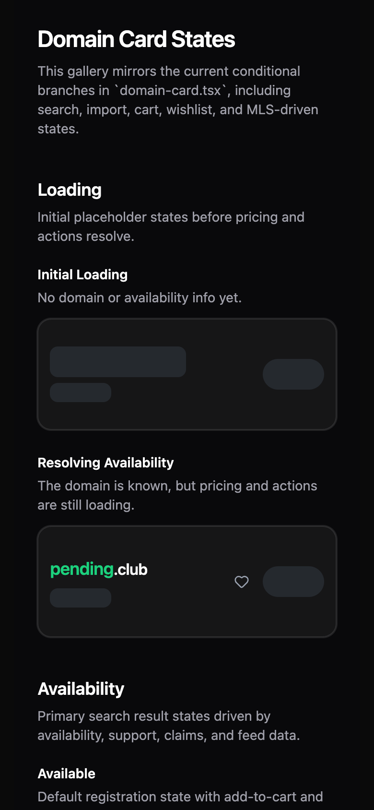
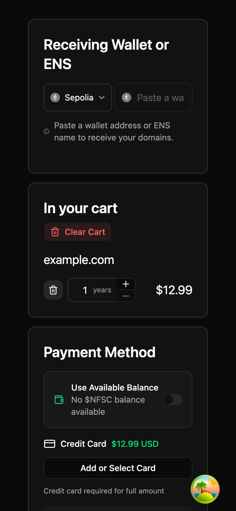
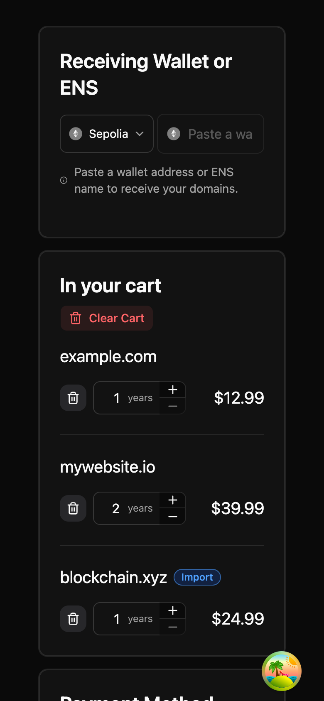
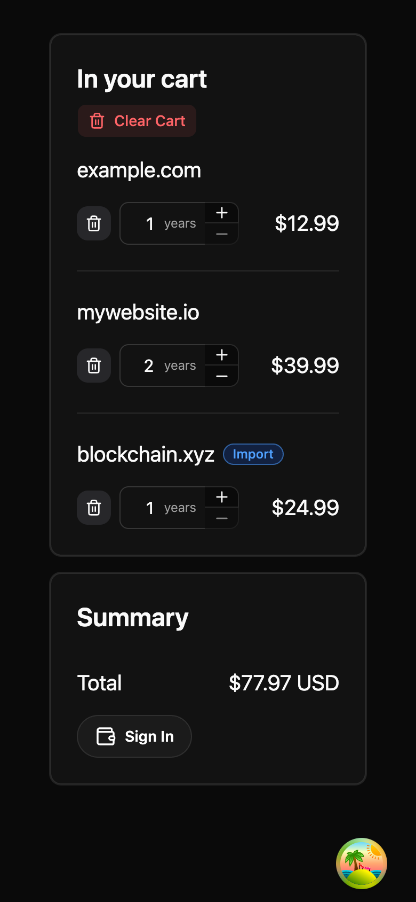
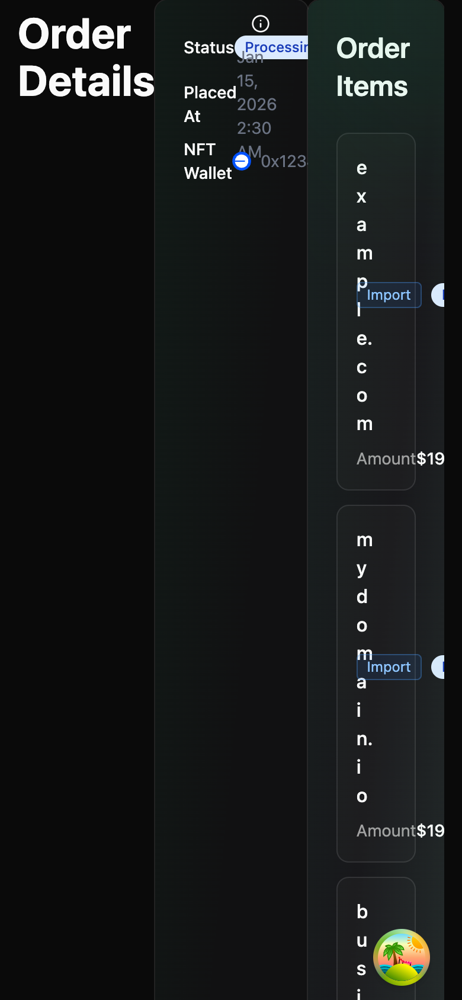
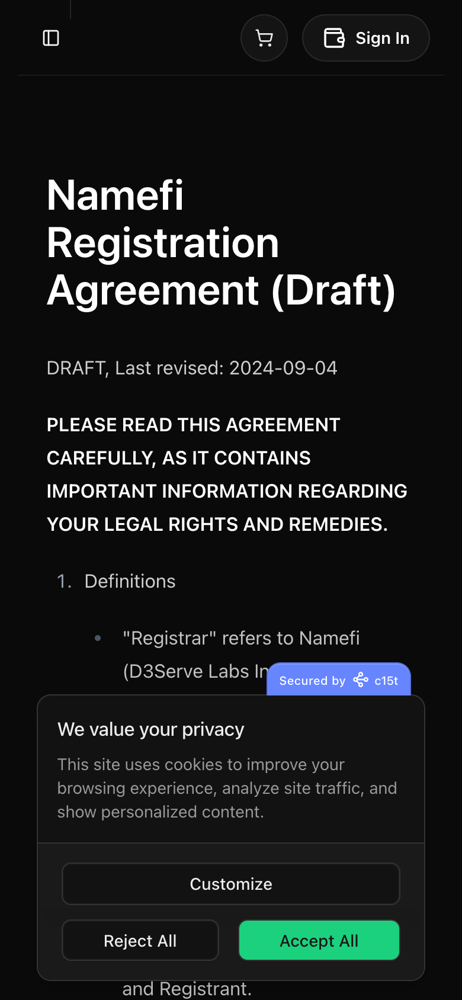
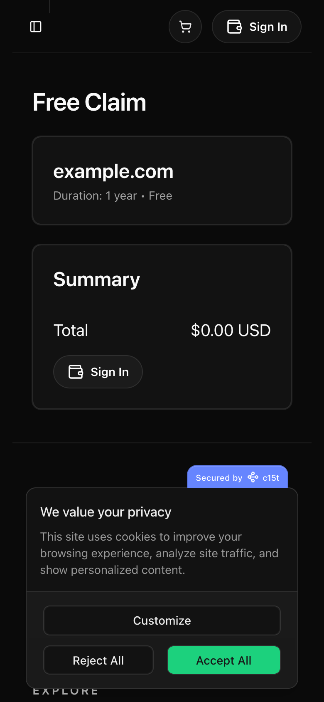

# Mobile UI Audit — Landing, Registration & Import flows

**Date:** 2026-06-17 · **Viewport:** 390 × 844 @2x (mainstream iPhone) · **Method:** Storybook static build screenshotted at mobile width via agent-browser; the two storyless pages captured from the live deploy (`namefi-astra-d3servelabs.vercel.app`).

> Context (GA4, Namefi Astra Production, last 90d): **mobile = 33% of sessions** and bounces **+13pp worse** than desktop (52% vs 39%). Top mobile entry pages: `/`, `/registration-agreement`, `/feed`. See `docs/mobile-compatibility-plan.md`.

## Verdict

The **front of the funnel is in good shape** on mobile — landing, search, results cards, cart, claim, and the unauthenticated checkout all render well. The damage is concentrated **after** the cart, in two specific, fixable defects, plus one cross-cutting obstruction.

## Findings

| # | Severity | Screen | Issue |
|---|----------|--------|-------|
| 1 | 🔴 **Critical** | Order Details (`/orders/[id]/details`) | Desktop 3-column grid does **not** collapse on mobile. Columns crushed into strips; domain names wrap **one letter per line** ("e-x-a-m-p-l-e-.-c-o-m"); horizontal overflow. This is the **import/registration order-tracking page** — effectively unusable on a phone. |
| 2 | 🔴 **High** | Cart — "Receiving Wallet or ENS" | Chain selector + wallet/ENS input are forced **side-by-side** at 390px, so the address input is too narrow to use (placeholder truncates to "Paste a wa…"). You **must** set a receiving wallet to buy → this blocks purchase completion on mobile. Should stack vertically. |
| 3 | 🟡 Medium | Domain result card (search) | Price truncates with an ellipsis: shows **"$18.0…"** instead of the full price. Affects the purchase decision at the top of the funnel. |
| 4 | 🟡 Medium | All live pages (first visit) | The **c15t cookie-consent banner covers the bottom ~third** of the screen, including primary CTAs, until dismissed. On entry pages this harms first impression and likely contributes to mobile bounce. |
| 5 | 🟢 Info / myth-bust | `/registration-agreement` | **Renders fine on mobile** — text reflows, readable. The 84.7% mobile bounce is **behavioral** (people land on a wall of legal text from a link and leave), **not** a layout defect. Recommendation: do **not** invest in mobile-layout work here; treat the bounce as a content/flow concern. (Revises the earlier "P0 broken page" assumption.) |

## What works well (no action needed)

- **Landing** — hero, REGISTER/IMPORT tabs, and search input are centered, legible, well-sized.
- **Search results** — render as stacked cards with wishlist + cart actions (aside from the price truncation in #3).
- **Cart items** — domain rows, year steppers, per-item price, "Import" badge, and the unauthenticated Summary/Sign-In all lay out cleanly.
- **Free Claim** (`/claim/[domain]`) — domain card + summary + Sign-In CTA render well.
- **Order History** header (filters/sort) is fine.

## Screenshots

### Landing

### Registration / Import — cart & checkout

### Order tracking (import flow)

### Storyless pages (captured live)

## Recommended fix order

1. **Finding #1** — make `order-details-content` stack to a single column below `md:`; let domain names wrap on word/character boundaries with `break-all`/`min-w-0`. (Highest impact: it's the import + registration status page and it's outright broken.)
2. **Finding #2** — stack the Receiving Wallet chain selector + address input vertically on mobile so the input gets full width.
3. **Finding #4** — make the cookie banner a compact bottom bar on mobile (aligns with the team's minimal-chrome preference).
4. **Finding #3** — let the result-card price show in full (allow wrap / widen the price column on mobile).

## Coverage gaps (for next round)

- No Storybook stories for `/registration-agreement` or `/claim/[domain]` — captured live here. Consider adding stories so these are covered by Chromatic's mobile mode going forward.
- Stories use the `iphone-17` (402px) Chromatic mode; this audit used 390px. Both are representative; 375px (iPhone SE) is the stricter worst case worth a future pass.
