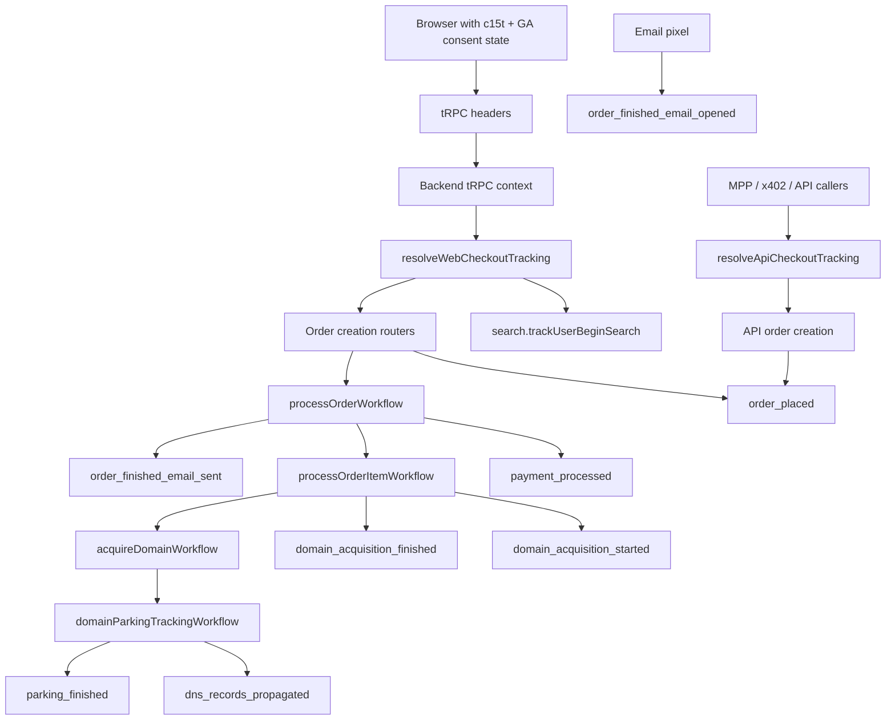

# Analytics Setup

This guide documents the analytics setup in this repo.

It covers browser Google Analytics, c15t consent handling, backend GA4 Measurement Protocol events, checkout flow reporting, DNS analytics, and email analytics.

## Scope

This repo has four analytics surfaces:

1. Browser-side GA events in the frontend and resources apps.
2. Backend GA4 Measurement Protocol events for checkout, search, and completed ecommerce purchases.
3. Admin analytics reports that read GA4 through the GA Data API.
4. Email open/click counters and selected email-open GA events.

The checkout funnel analytics path is intentionally separate from ecommerce revenue reporting. Browser events such as `add_to_cart` and `begin_checkout` are interaction telemetry emitted by the frontend. The standard GA4 ecommerce `purchase` event is emitted by the backend after order processing has at least one succeeded item. The admin checkout dashboard reads the backend checkout event sequence described below and does not include `purchase` in that funnel.

## Configuration

Browser and Measurement Protocol:

- `GA_MEASUREMENT_ID`: GA4 measurement id used by frontend/resources browser tagging and backend Measurement Protocol.
- `GA_MEASUREMENT_API_SECRET`: backend secret required by GA4 Measurement Protocol.

Admin GA Data API:

- `GA4_DNS_PROPERTY_ID`: GA4 property id used for DNS analytics reports.
- `GA4_APP_PROPERTY_ID`: GA4 property id used for app checkout analytics reports.
- `GA4_KEY_FILE_PATH`: service account key file path used by the GA Data API and GA Admin API clients.

Email analytics:

- `EMAIL_ANALYTICS_URL`: absolute backend tracking-pixel URL used in generated emails.
- `EMAIL_TRACKING_JWT_SECRET`: secret used to sign and verify email analytics JWT payloads.

Consent and origins:

- `NAMEFI_FIRST_PARTY_HOSTNAMES`: first-party hosts accepted by CORS and origin checks.
- Powered-by-Namefi hostnames are loaded from the registry and used as trusted third-party origins.
- c15t stores consent records in the database through `@c15t/backend` with the Drizzle adapter.

## Shared GA And Consent Helpers

The shared GA helper module centralizes the browser/backend contract for GA identity and consent.

Headers:

- `X-GA-Client-Id`: normalized GA browser client id.
- `X-GA-Session-Id`: normalized GA4 session id.
- `X-C15T-Measurement-Consent`: frontend signal with `granted` or `denied`.
- `X-Browser-Fingerprint`: existing security recognition signal, not a GA identity.

Cookie and id helpers:

- `_ga` cookie values are normalized into the GA client id format `number.number`.
- `_ga_<measurement-id-suffix>` cookie values are parsed for both GS2 and legacy GA4 session cookie formats.
- Invalid, empty, zero, unsafe, or malformed client/session ids are ignored.

c15t helpers:

- The `c15t` cookie is parsed from compact entries such as `c.measurement:1`.
- A missing c15t measurement entry resolves to `unknown`.
- A present measurement entry resolves to `granted` or `denied`.
- Multiple consent signals are merged so `denied` wins over `granted`, and `granted` wins over `unknown`.

Google Consent Mode helpers:

- `measurement` maps to `analytics_storage`.
- `ad_storage`, `ad_user_data`, and `ad_personalization` are always denied.
- The default consent payload includes `wait_for_update: 500`.
- GA config disables Google signals and ad personalization signals.
- GA config includes `origin_type`, `origin_domain`, and `debug_mode`.

Geo bootstrap helpers:

- Server-rendered apps forward relevant geo, language, user-agent, host, and forwarded-for headers to `/c15t/show-consent-banner`.
- c15t returns whether a consent banner is required and which jurisdiction applies.
- Initial measurement consent is granted when stored cookie consent grants it, or when c15t reports no banner with jurisdiction `NONE`.
- Stored cookie consent takes precedence over geo defaults.

## Frontend Browser Analytics

### Bootstrap

`GoogleAnalyticsBootstrap` in the frontend app runs on the server and emits two scripts before hydration:

1. `ga-consent-bootstrap`, which initializes `dataLayer`, defines `gtag`, sets default Consent Mode, configures GA, and exposes `window.namefiMeasurementConsent`.
2. `ga-loader`, which loads `https://www.googletagmanager.com/gtag/js`.

The frontend app marks `window.namefiMeasurementConsent` so non-React code in the tRPC client can decide whether to send GA ids to the backend. The resources app uses the same shared bootstrap helpers but does not need the tRPC tracking-header path.

### Consent Updates

`GoogleAnalyticsCookieConsentGated` listens to c15t consent state in the client.

When consent information finishes loading, it:

- updates `window.namefiMeasurementConsent`;
- sends `gtag('consent', 'update', ...)`;
- sends a GA config update with the current origin metadata;
- sets `user_id` only when measurement consent is granted, auth is loaded, and the user is authenticated.

Login and logout callbacks no longer directly set or clear GA `user_id`. The GA component owns this state so it can always apply the current consent state.

### tRPC Tracking Headers

The frontend tRPC provider builds tracking headers for all tRPC links.

Every request may include:

- `Authorization`, when a Privy access token is available outside cookie auth
  and skip-auth is not active.
- `X-Skip-Auth`, in local/development/preview skip-auth mode.
- `X-Browser-Fingerprint`, when FingerprintJS resolves a visitor id.
- `X-C15T-Measurement-Consent`, when `window.namefiMeasurementConsent` is known.
- `X-GA-Client-Id`, only when measurement consent is currently granted.
- `X-GA-Session-Id`, only when measurement consent is currently granted.

The GA client id and session id are resolved from cookies first, then from `gtag('get', ...)` with a short fallback timeout. If measurement consent changes away from granted, cached GA ids are cleared and not sent.

### Search Tracking

Search tracking is explicit. `useSearch` calls `search.trackUserBeginSearch` instead of relying on availability or suggestion endpoints to emit search events.

Frontend behavior:

- It only attempts tracking when `window.namefiMeasurementConsent === true`.
- It deduplicates by `parentDomain:searchTerm`.
- It tracks when a search is run and when debounced search results resolve to a non-empty domain set.
- Failures are swallowed so search UX is not blocked by analytics.

Backend behavior:

- `trackUserBeginSearch` resolves web checkout tracking from the tRPC context.
- It emits `user_begin_search` only when the backend also confirms tracking is allowed.
- The event includes the browser GA client id and optional session id.
- Search terms and parent domains are trimmed and capped to GA-safe string length.

### Browser Interaction Events

`useGoogleAnalyticsInteractionLogger` still emits browser-side GA events through `window.gtag('event', ...)`.

Important examples:

- `add_to_cart`
- `remove_from_cart`
- `begin_checkout`
- `submit_order_failure`
- hunt voting and sharing events
- marketplace/list-for-sale clicks

Local anonymous cart adds now emit `add_to_cart` browser events, matching authenticated cart adds. These browser interaction events are useful for GA browser reporting, but they are not the source of truth for the admin checkout funnel or completed purchase reporting.

## Backend Request Context

Backend CORS allows the tracking headers required by consented browser requests:

- `x-browser-fingerprint`
- `x-c15t-measurement-consent`
- `x-ga-client-id`
- `x-ga-session-id`

The backend request context resolves analytics data once per request:

- normalized `gaClientId`;
- numeric positive `gaSessionId`;
- request measurement consent state from the c15t cookie and frontend consent header;
- `consentDomainName` from the request origin hostname;
- a lazy `getMeasurementConsentAutoGranted` function that calls c15t's show-banner logic using request headers.

This context is used by search and order routers to decide whether web-originated backend events can be sent to GA.

## c15t Consent Resolution

There are two backend consent paths:

1. `getUserCookieConsentState` checks persisted c15t consent records for a user, domain, and purpose.
2. `isC15tMeasurementConsentAutoGranted` asks c15t whether the current request's geography would require a banner.

`getUserCookieConsentState` returns:

- `granted`: latest active consent row includes the measurement purpose.
- `denied`: latest active consent row exists but excludes measurement.
- `unknown`: no relevant purpose, subject, domain, or active consent row exists.

`resolveWebCheckoutTracking` combines:

- internal-user filtering;
- browser GA client id presence;
- request c15t cookie consent;
- frontend consent header;
- persisted c15t user/domain consent;
- c15t geo auto-grant.

The practical result:

- A browser GA client id is required for web checkout/search backend events.
- Any explicit denied signal disables tracking.
- Authenticated users with persisted denied measurement consent are not tracked.
- Unknown consent requires either a granted request signal or geo auto-grant.
- Missing GA client id disables web tracking even if consent is granted.
- Internal team users are excluded with reason `INTERNAL`.

## API-Originated Tracking

Some checkout paths do not come from a browser session:

- MPP instant registration.
- x402 order creation.
- Other API-originated checkout flows that do not have a GA browser client id.

These use `resolveApiCheckoutTracking`.

API tracking behavior:

- It preserves the internal-team exclusion.
- It marks emitted events with `event_source: api`.
- It does not require a browser GA client id.
- The current Measurement Protocol sender still generates a legacy fallback client id when none is passed. This exists for API continuity only and must not be used as a no-consent web tracking workaround.

The admin checkout report can include or exclude these API-originated events with the source filter.

## Checkout Event Model

The typed backend event registry defines the supported Measurement Protocol events and parameters.

Primary checkout event sequence:

| Event | Main source | Purpose |
| --- | --- | --- |
| `user_begin_search` | `search.trackUserBeginSearch` | Search entry into checkout intent. |
| `order_placed` | Order routers, MPP, x402 | Order was accepted and workflow was started. This is not a completed purchase. |
| `payment_processed` | `processOrderWorkflow` | Payment succeeded or failed. |
| `domain_acquisition_started` | `processOrderItemWorkflow` | Domain registration/import started. |
| `domain_acquisition_finished` | `processOrderItemWorkflow` | Domain registration/import succeeded or failed. |
| `dns_records_propagated` | `domainParkingTrackingWorkflow` | DNS propagation checkpoint finished. |
| `parking_finished` | `domainParkingTrackingWorkflow` | Parking setup or opt-out checkpoint finished. |
| `payment_refunded` | `processOrderWorkflow` / `multiChargeWorkflow` after `multiRefundWorkflow` | Partial or full refund was processed. |
| `order_finished_email_sent` | `processOrderWorkflow` notification stage | Processed order email was sent. |
| `order_finished_email_opened` | Email analytics router | Processed order email pixel was opened. |

Additional diagnostic events:

- `order_processing_started`
- `order_items_processing_started`
- `order_items_processing_finished`
- `order_processing_finished`
- `order_item_processing_started`
- `order_item_processing_finished`

Standard ecommerce events:

- `purchase`: emitted by `processOrderWorkflow` only after processing finishes with one or more succeeded domain or NFSC top-up items. The event uses the order id as `transaction_id`, includes only succeeded items, and is excluded from the admin checkout funnel sequence.

Order item handling:

- Send one `purchase` event per completed order, not one event per domain.
- Include only order items that actually succeeded. Failed or cancelled items are represented by backend checkout diagnostics such as `domain_acquisition_finished` or `order_item_processing_finished`, not by ecommerce `purchase.items`.
- `purchase.value` must equal the sum of the purchased item prices. For domains, each item uses `quantity: 1` and `price` equal to the item's USD amount.
- NFSC top-up orders emit the same backend lifecycle events as domain orders (`order_processing_started`, `payment_processed`, `order_items_processing_started`, `order_items_processing_finished`, `order_processing_finished`, `purchase`, and `payment_refunded` when applicable). Their initial `order_placed` event uses `order_source: nfsc_topup`.
- If the business wants GA ecommerce refund reports to mirror gross payment collection, the alternative model is to send `purchase` for all charged items and then a standard `refund` for failed/refunded items. This repo instead reports net fulfilled purchases in GA ecommerce and keeps refund/failure detail in the backend checkout funnel.
- Actual refund completions emit the custom `payment_refunded` funnel event with the amount actually refunded. This includes item-failure refunds after order processing and charge rollback refunds when a multi-payment charge partially succeeds before failing. They do not emit GA4's standard ecommerce `refund` event for failed items because those failed items were never included in the GA4 ecommerce `purchase`.

Common event params:

- `user_id`
- `order_id`
- `normalized_domain_name`
- `order_item_id`
- `event_source`
- `session_id`
- `engagement_time_msec`

Order params:

- `amount_usd_cents`
- `item_count`
- `payment_count`
- `order_source`

Payment params:

- `payment_provider`
- `payment_providers`
- `status`
- `failure_reason`
- `refund_type`
- `refund_needed`
- `refund_amount_usd_cents`

Domain params:

- `registrar_key`
- `operation_type`
- `duration_years`
- `chain_id`
- `dns_provider`
- `opt_out`
- `item_type`
- `domain_name`
- `item_status`

Email params:

- `order_status`
- `email_distinct_id`

Custom dimensions and metrics are defined in the same registry. If new dimensions or metrics are added, they must be created in the GA4 property before they are reliably queryable. GA may take 24 to 48 hours before newly created custom definitions start collecting data.

## Event Emission Flow



## Temporal Propagation

Order routers compute a `CheckoutTrackingContext` before starting Temporal.

The workflow input receives the compact `GaEventTracking` shape:

- `trackGaEvents`
- `reason`
- `clientId`
- `sessionId`
- `eventSource`

`resolveWorkflowCheckoutTracking` reconstructs deterministic workflow tracking state.

Patch behavior:

- `toggle-tracking` controls replay-safe tracking disable behavior.
- `ga-client-id-propagation-v1` gates GA client/session identity propagation for workflows.
- `domainParkingTrackingWorkflow` uses active toggle behavior because it starts as a child workflow after domain acquisition.

When tracking is disabled, workflows log a skip message with the event name and reason instead of emitting GA events.

## Email Analytics

Email analytics has two independent responsibilities:

1. GA checkout email-open events.
2. Database counters for campaign opens and clicks.

Processed order emails:

- Processed-order email generation builds a pixel URL with `order_ready_count_only`.
- That default payload has only a nonce and does not carry order or user metadata.
- The router emits `order_finished_email_opened` with `event_source: email` and `email_distinct_id`.
- Email-only opens do not set top-level GA `user_id` and do not claim browser session continuity.

Signed order-ready payload:

- The `order_ready` payload shape still exists.
- When used, it carries signed `orderId`, `userId`, `emailAddress`, and `nonce`.
- The router maps it into `order_finished_email_opened`.

Campaign payloads:

- `campaign_email_open` increments `email_campaign_opens.open_count`.
- `campaign_link_click` increments `email_campaign_clicks.click_count` and redirects to the signed destination URL.
- Counter failures are isolated so pixels still return and links still redirect where safe.

## Admin Analytics

The admin analytics page has DNS and checkout tabs.

DNS analytics:

- Uses `GA4_DNS_PROPERTY_ID`.
- Reads existing `dns_query` events.
- Supports date range, public suffix, and public suffix plus one filters.
- Parses RCODE and DNSSEC values into frontend-friendly labels.

Checkout analytics:

- Uses `GA4_APP_PROPERTY_ID`.
- Reads backend checkout events by `eventName`.
- Uses `eventCount`, not sessions, as the additive metric.
- Reads status and order status breakdowns.
- Supports source filters:
  - `all`
  - `api`
  - `non_api`

`non_api` means events where `customEvent:event_source` is not `api`. That includes web, email, and legacy events without `event_source`.

Backend report pipeline:

1. `CheckoutFlowGA4AnalyticsClient` queries GA4 event counts and breakdowns.
2. `parseCheckoutFlowRawReportData` normalizes rows into an explicit per-event model.
3. `parseCheckoutFlowReportData` derives summary KPIs, step conversion rows, funnel points, and Sankey graphs.
4. `analytics.getCheckoutFlowOverview` returns the parsed payload to the frontend.

Frontend report UI:

- Shows summary cards for search, orders, completion, refunds, and rates.
- Shows a checkout funnel.
- Shows a step-by-step conversion table.
- Shows three Sankey variants:
  - full journey;
  - domain acquisition;
  - checkout plus email.
- The Sankey chart label is "Events" because values are event counts, not sessions.

## Checkout Parser Rules

Raw GA data is normalized before reporting.

Status handling:

- Empty values and common not-set variants normalize to `(NOT SET)`.
- `SUCCESS` and `SUCCEEDED` are success-equivalent.
- `order_finished_email_sent` derives outcome from `order_status` when available.
- Missing explicit `(NOT SET)` rows are inferred so breakdown totals still match event totals.

Summary metrics:

- `beginSearchCount`: `user_begin_search`.
- `orderPlacedCount`: `order_placed` accepted orders, not completed purchases.
- `domainAcquisitionFinishedSuccessCount`: success-equivalent `domain_acquisition_finished`.
- `refundedCount`: `payment_refunded`.
- `conversionRatePercent`: `order_placed / user_begin_search`; this is an order-start rate, not purchase conversion.
- `completionRatePercent`: successful domain acquisition / `order_placed`.

Primary funnel:

1. Begin Search
2. Order Accepted
3. Payment Processed (Success)
4. Order Email Sent
5. Order Email Opened

Sankey behavior:

- Nodes split by meaningful outcomes when GA provides status/order-status data.
- If an event has no meaningful outcome rows, the event total is used as a single node.
- Failure or timeout domain acquisition can flow toward refunds.
- Successful domain acquisition can flow toward DNS propagation and parking.
- Checkout/email Sankey focuses on search, order, payment, refunds, email sent, and email opened.

## Consent Behavior Matrix

| Case | Backend GA behavior |
| --- | --- |
| Logged out, measurement granted | Web backend events can be sent with browser `client_id`; no `user_id`. |
| Logged out, geo auto-granted by c15t | Web backend events can be sent with browser `client_id`; no `user_id`. |
| Logged out, measurement denied | Web backend events are skipped with reason `PRIVACY`. |
| Logged out, consent unknown and no auto-grant | Web backend events are skipped with reason `PRIVACY`. |
| Logged in, measurement granted | Web backend events can be sent with browser `client_id`, optional `session_id`, and `user_id`. |
| Logged in, persisted c15t denied | Web backend events are skipped with reason `PRIVACY`. |
| Logged in, request cookie/header denied | Web backend events are skipped with reason `PRIVACY`. |
| Logged in, consent unknown and no auto-grant | Web backend events are skipped with reason `PRIVACY`. |
| Internal team user | Tracking is skipped with reason `INTERNAL`. |
| API-originated checkout | Events can be sent with `event_source: api` unless internal-user filtering disables them. |
| Email-only open pixel | Event can be sent with `event_source: email` and no top-level GA `user_id`. |

## Operational Notes

- Register all custom dimensions and metrics in the app GA4 property before expecting them in reports.
- Source filtering depends on the `event_source` custom dimension.
- The checkout dashboard uses GA Data API data, so GA ingestion and custom-definition delays apply.
- Measurement Protocol errors are logged and swallowed by checkout event helpers so checkout workflows are not blocked by analytics.
- The legacy Measurement Protocol fallback client id still exists inside `sendGA4Events`. Treat it as API/email continuity only.
- Do not use IP address, browser fingerprint, request id, or a generated stable id as a replacement for browser GA client id in web tracking.

## Test Coverage

The branch adds or updates focused tests for:

- GA client/session cookie parsing and c15t consent helpers.
- c15t persisted consent state lookup.
- checkout tracking consent decisions.
- checkout event payload identity and source tagging.
- checkout GA Data API filters.
- checkout parser and Sankey behavior.
- workflow tracking identity propagation.
- email analytics open-pixel behavior.
- admin analytics router parsed output.

Useful targeted commands:

```sh
bun --cwd packages/common test src/google-analytics.test.ts
bun --cwd apps/backend test src/lib/consent.test.ts
bun --cwd apps/backend test src/lib/tracking/checkout/context.test.ts
bun --cwd apps/backend test src/lib/tracking/checkout/events.test.ts
bun --cwd apps/backend test src/lib/tracking/checkout/analytics-client.test.ts
bun --cwd apps/backend test src/lib/tracking/checkout/checkout-sankey.test.ts
bun --cwd apps/backend test src/routers/email-analytics.test.ts
bun --cwd apps/backend test src/temporal/shared/workflow-helpers/checkout-tracking.test.ts
bun --cwd apps/backend test src/trpc/routers/__tests__/analyticsRouter.e2e.test.ts
```

For broader validation, use:

```sh
bun run typecheck:affected
bun run check:staged
```

## Safe Extension Checklist

When adding a new backend checkout analytics event:

1. Add the event and params to `BackendAnalyticsEventMap`.
2. Add any new dimensions or metrics to the custom definitions list.
3. Register new custom definitions in GA4.
4. Emit through `sendGA4Event` or an existing checkout event helper.
5. Use `CheckoutTrackingContext` for web checkout/search events.
6. Require browser GA client id for web-originated events.
7. Use `event_source: api` for API-originated checkout events.
8. Use `event_source: email` for email-only open events.
9. Add parser/report support if the event should appear in the admin checkout dashboard.
10. Add tests for consent behavior, payload shape, and reporting behavior.

When adding a new frontend browser event:

1. Emit through `useInteractionLoggers` if it is an interaction event.
2. Avoid sending backend GA events just to record browser UI interaction.
3. Keep browser ecommerce events separate from backend checkout funnel events.
4. Respect c15t measurement consent and Consent Mode.

When adding a new analytics report:

1. Identify the GA4 property: DNS or app.
2. Query `eventCount` when event totals must be additive.
3. Add contract input/output shape in `packages/common`.
4. Keep parser output stable and frontend-friendly.
5. Add tests with representative GA Data API rows.
