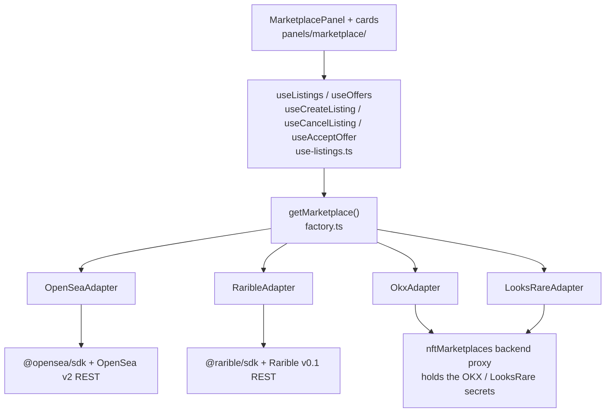

# Marketplaces Development Guide

How the frontend lists Namefi domain NFTs for sale on Web3 marketplaces (OpenSea, Rarible, OKX, LooksRare) — the architecture, how to use it, and how to add a new marketplace.

## TL;DR

- The **marketplace module** (`apps/frontend/src/lib/marketplaces/`) is a **facade**: one `MarketPlace` interface, one per-marketplace **adapter** behind it, one `getMarketplace()` factory in front of it.
- The **Marketplace tab** on the domain detail page is driven entirely by **five React hooks** (`use-listings.ts`) that fan out over **every** adapter supported on the chain. Read results are merged + deduped; one adapter failing doesn't break the others.
- **Reads** (listings / offers) need no wallet. **Writes** (create / cancel / accept) need a connected wallet on the NFT's chain.
- Four adapters ship today: **OpenSea** and **Rarible** run client-side; **OKX** and **LooksRare** route their API calls through a backend tRPC proxy (their vendor APIs need server-held secrets).
- **Adding a marketplace** = write one adapter that implements `MarketPlace`, then three small wiring edits. The panel UI and hooks need **zero changes**.

## The Mental Model

Every layer talks only to the one below it. The UI never imports a vendor SDK; an
adapter never imports a React hook. The `MarketPlace` interface is the seam — it
is the one contract every layer agrees on.

## Golden Rules (Strict)

1. **The UI never talks to a marketplace directly.** All marketplace access goes through `getMarketplace()` (or, in React, through the hooks in `use-listings.ts`). No component imports `@opensea/sdk`, `@rarible/sdk`, or a vendor REST URL.
2. **An adapter implements the *whole* `MarketPlace` interface.** Every method. If an operation is genuinely impossible on that marketplace, the method throws `MarketplaceUnsupportedOperationError` — it is never silently absent.
3. **Reads must work without a wallet.** `getExistingListings` / `getOffersForListing` are called with a `publicClient` only. Never require `walletClient` for a read.
4. **Writes go through the hooks.** `useCreateListing` / `useCancelListing` / `useAcceptOffer` fetch a fresh wallet + public client inside the mutation, so a just-completed chain switch is reflected. Don't call `adapter.createListing()` from render code.
5. **Throw the typed errors.** Use `MarketplaceUnsupportedChainError`, `MarketplaceNotConfiguredError`, `MarketplaceUnsupportedOperationError`, `MarketplaceNotImplementedError` — not bare `Error` — so the UI can react to the *kind* of failure.
6. **Heavy vendor SDKs are dynamic-imported.** `getMarketplace()` `import()`s the adapter module; an adapter `import()`s its vendor SDK inside the *write* methods. Nothing marketplace-related is in the app-shell bundle.

## Which Doc Do I Want?

| You want to… | Read |
|---|---|
| Understand how it all fits together | [architecture.md](./architecture.md) |
| Show listings/offers, or wire a "list for sale" feature | [using-marketplaces.md](./using-marketplaces.md) |
| Add support for a new marketplace (Magic Eden, Blur, …) | [creating-an-adapter.md](./creating-an-adapter.md) |
| Just the interface + types reference | [architecture.md#the-contract](./architecture.md#the-contract) |

External vendor API references (OKX, LooksRare request/response specs) live
separately under `docs/marketplaces/` — those are *not* this module.

## Glossary

| Term | Meaning |
|---|---|
| **Listing** | A *sell* order: the domain owner offers the NFT for sale at a price. Internal type: `Listing`. |
| **Offer** (bid) | A *buy* order: a buyer offers to pay for the NFT. Internal type: `Offer`. The seller "accepts" it. |
| **Order** | Umbrella term for a listing or an offer — a signed entry in a marketplace orderbook. |
| **Adapter** | A class implementing `MarketPlace` for one marketplace (`OpenSeaAdapter`, `RaribleAdapter`). |
| **Facade** | The `MarketPlace` interface + `getMarketplace()` factory — the uniform surface over all adapters. |
| **Hybrid adapter** | An adapter that uses a vendor SDK for signing-heavy writes and raw REST + `zod` for reads. |
| **Proxied adapter** | An adapter whose vendor API needs a server-held secret, so its API calls route through the `nftMarketplaces` backend tRPC proxy (OKX, LooksRare). |
| **`raw`** | An opaque, adapter-owned blob carried on every `Listing`/`Offer`. The adapter stashes whatever it needs to cancel/accept later. No other layer reads it. |
| **Seaport** | OpenSea's on-chain exchange protocol. The OpenSea adapter's orders are Seaport orders. |
| **Item id** | Rarible's NFT identifier: `BLOCKCHAIN:CONTRACT:TOKEN_ID` (e.g. `BASE:0xabc…:123`). |

## Status & Scope

- **Marketplaces:** OpenSea + Rarible (client-side); OKX + LooksRare (backend-proxied — see [creating-an-adapter.md](./creating-an-adapter.md#proxied-adapters-server-held-secrets)).
- **Chains:** Ethereum mainnet (`1`), Base (`8453`), Base Sepolia (`84532`) — see `MARKETPLACE_SUPPORTED_CHAINS` in `apps/frontend/src/lib/marketplaces/chains.ts`. Per-marketplace coverage varies: OpenSea + Rarible on all three; OKX on Ethereum + Base; LooksRare on Ethereum mainnet only.
- **v1 limits:** fixed-price listings only (no Dutch/English auctions); the chain's **native asset** only (ETH) — no ERC-20-denominated listings yet.
- **Gating:** the Marketplace tab is behind the `marketplace_listing` admin feature flag.
- **Source of truth:** this guide. The in-code `apps/frontend/src/lib/marketplaces/README.md` is a short pointer here.
