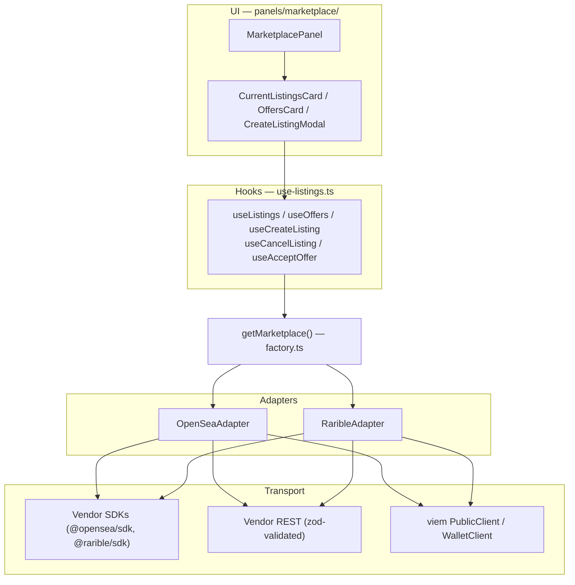
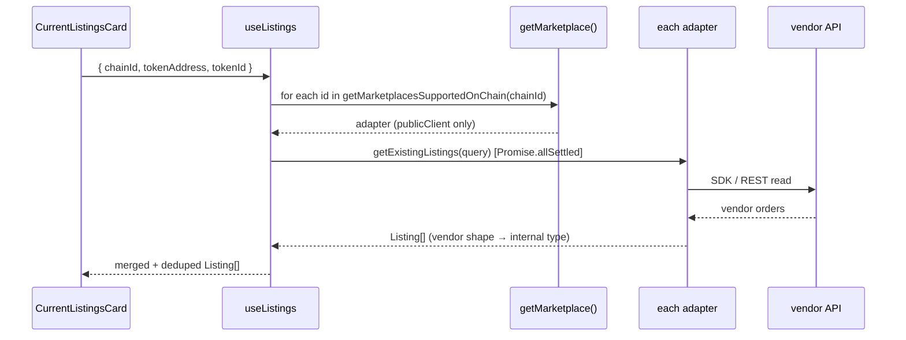
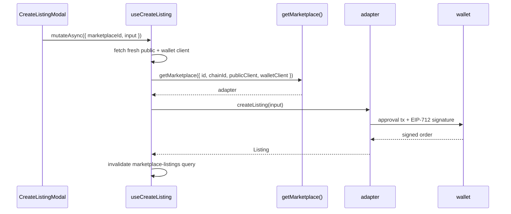

# Marketplaces Architecture Reference

The full reference for the marketplace module — the interface contract, the domain types, the factory, the hooks, and how data flows end to end. Source lives in `apps/frontend/src/lib/marketplaces/` and `apps/frontend/src/components/domain-and-dns-managment/panels/marketplace/`.

## TL;DR

- **`MarketPlace`** (`marketplace.interface.ts`) is the contract. Every adapter implements all of it.
- **`getMarketplace()`** (`factory.ts`) builds an adapter for an `(id, chainId)` pair, dynamic-importing the adapter module and resolving its API key.
- **The hooks** (`use-listings.ts`) are the only thing the UI calls. They fan out over every adapter on the chain, merge + dedupe, and tolerate partial failure.
- **Domain types** (`types.ts`) — `Listing`, `Offer`, `ListingInput`, etc. — are vendor-neutral. Adapters translate vendor shapes into these.
- Two adapters today: `OpenSeaAdapter` (SDK-centric) and `RaribleAdapter` (REST reads + SDK writes + a viem→ethers bridge).

## Layers



Each layer depends only on the layer directly below. The `MarketPlace` interface
is the seam between the hooks and the adapters — swap an adapter, nothing above
changes.

## The Contract

**`MarketPlace` (`marketplace.interface.ts`) is the single interface every adapter implements.**

```ts
export interface MarketPlace {
  readonly id: MarketplaceId;
  readonly displayName: string;
  readonly chainId: number;

  // -------- discovery --------
  getAvailableListingTypes(): readonly ListingType[];
  getAvailableListingCurrency(): readonly ListingCurrency[];
  calculateListingFees(input: {
    priceWei: bigint;
    currency: ListingCurrency;
    listingType: ListingType;
  }): Promise<ListingFees>;

  // -------- listings (seller side) --------
  createListing(input: ListingInput): Promise<Listing>;
  getExistingListings(query: ListingsQuery): Promise<Listing[]>;
  cancelListing(listing: Listing): Promise<{ txHash?: `0x${string}` }>;
  updateListing(listing: Listing, input: ListingInput): Promise<Listing>;

  // -------- offers (buyer side, seller-accepts) --------
  getOffersForListing(query: OffersQuery): Promise<Offer[]>;
  approveOffer(offer: Offer): Promise<{ txHash?: `0x${string}` }>;
  rejectOffer(offer: Offer): Promise<never>;
}
```

| Member | Purpose | Wallet? |
|---|---|---|
| `id` / `displayName` / `chainId` | Identity. `id` is the stable key; `displayName` is shown in UI; `chainId` is the chain this instance is bound to. | — |
| `getAvailableListingTypes()` | Which listing types this marketplace+adapter supports right now. Both adapters return `['fixed-price']`. | no |
| `getAvailableListingCurrency()` | Which currencies a seller may list in. Both adapters return the chain's native asset only. | no |
| `calculateListingFees(input)` | Estimate marketplace fee + royalty + seller take-home for a hypothetical price. `isEstimate: true` means non-authoritative. | no |
| `createListing(input)` | Build, sign, and post a sell order. Returns the created `Listing`. | **yes** |
| `getExistingListings(query)` | All active listings for one NFT. | no |
| `cancelListing(listing)` | Cancel a listing. May be off-chain (gasless) or on-chain. | **yes** |
| `updateListing(listing, input)` | Re-list with new terms. Implemented as cancel + create (two wallet prompts). | **yes** |
| `getOffersForListing(query)` | All active offers/bids on one NFT. | no |
| `approveOffer(offer)` | Accept an offer — transfers the NFT, credits the seller. | **yes** |
| `rejectOffer(offer)` | "Reject" an offer. Seaport-style orderbooks have no rejection primitive, so adapters throw `MarketplaceUnsupportedOperationError`. | — |

### Error classes

All four are exported from `marketplace.interface.ts`. Throw these — never a bare `Error` — so callers can branch on the failure kind.

| Error | Thrown when |
|---|---|
| `MarketplaceUnsupportedChainError(id, chainId)` | The `(id, chainId)` pair isn't in `ADAPTER_CHAIN_SUPPORT`. The factory throws this before constructing an adapter. |
| `MarketplaceNotConfiguredError(id, missingKey)` | A required key/secret is absent (e.g. Rarible with no `NEXT_PUBLIC_RARIBLE_API_KEY`). |
| `MarketplaceUnsupportedOperationError(id, operation, reason)` | The marketplace genuinely can't do this operation (e.g. `rejectOffer`, a Dutch auction). |
| `MarketplaceNotImplementedError(method)` | A method isn't implemented yet (placeholder; avoid in shipped adapters). |

## Domain Types

**Vendor-neutral shapes in `types.ts`. Adapters translate vendor responses into these — no vendor type ever escapes an adapter.**

```ts
export type MarketplaceId = 'opensea' | 'rarible';
export type ListingType = 'fixed-price' | 'english-auction' | 'dutch-auction';
export type OrderStatus = 'active' | 'filled' | 'cancelled' | 'expired';
```

`Listing` and `Offer` share most of their shape:

```ts
interface Listing {
  id: string;            // order hash — stable identifier
  marketplace: MarketplaceId;
  source: string;        // human-readable name shown in UI ("OpenSea")
  tokenAddress: Address;
  tokenId: string;
  seller: Address;       // Offer has `bidder` instead
  price: ListingPrice;
  createdAt: string;     // ISO 8601
  expirationTime: string;// ISO 8601
  status: OrderStatus;
  externalUrl: string;   // link to view/manage on the marketplace
  raw: unknown;          // adapter-owned opaque blob — see below
}
```

`ListingInput` (what `createListing` takes), `ListingPrice`, `ListingCurrency`,
`ListingFees`, and `ListingsQuery` (`= OffersQuery`) round out the file.

**Three conventions to internalize:**

- **Prices are wei.** `ListingInput.priceWei` is a `bigint`; `ListingPrice.raw` is a wei amount as a **decimal string** (avoids JSON `BigInt` issues). `ListingPrice.decimal` is a `number` **for display only — never do math on it.**
- **Timestamps are ISO 8601 strings.** `createdAt` / `expirationTime`. For "no expiration", adapters use a far-future sentinel, not epoch 0 (which reads as "already expired" — see [creating-an-adapter.md#common-pitfalls](./creating-an-adapter.md#common-pitfalls)).
- **`raw` is opaque and adapter-owned.** The adapter stashes whatever it needs to later `cancelListing`/`approveOffer` (the vendor order object, a protocol address, …). The hooks and UI carry `raw` around but **never inspect it**. Only the *same adapter* reads its own `raw`.

## The Factory

**`getMarketplace(args)` (`factory.ts`) is the only constructor.** Nothing else `new`s an adapter.

```ts
interface GetMarketplaceArgs {
  id: MarketplaceId;
  chainId: number;
  publicClient: PublicClient;
  walletClient?: WalletClient; // required for writes; reads omit it
}

async function getMarketplace(args: GetMarketplaceArgs): Promise<MarketPlace>;
```

It does three things:

1. **Validates** the `(id, chainId)` pair via `isMarketplaceSupportedOnChain` — throws `MarketplaceUnsupportedChainError` if unsupported.
2. **Resolves the API key** per marketplace:
   - `rarible` → reads `clientSideEnv.NEXT_PUBLIC_RARIBLE_API_KEY`; throws `MarketplaceNotConfiguredError` if missing.
   - `opensea` → `await getOrRequestApiKey(...)` — auto-requests a free instant key, no env var needed.
3. **Dynamic-imports** the adapter module and returns `new XyzAdapter({ ...args, apiKey })`.

The dynamic `import()` is deliberate: the vendor SDKs are large (`@rarible/sdk`
is a multichain SDK; `@opensea/sdk` pulls ethers v6). Keeping them behind
`import()` means **nothing marketplace-related is in the app-shell bundle** — the
chunks load only when the Marketplace tab is opened, and the write-only SDK code
loads only when a write actually happens.

`MARKETPLACE_OPTIONS` (also exported from `factory.ts`) is the `{ id, label,
description }[]` list the create-listing modal renders as the marketplace picker.

## Chains & Currencies

**`chains.ts`** defines where marketplaces work:

```ts
export const ETHEREUM_MAINNET_CHAIN_ID = 1;
export const BASE_MAINNET_CHAIN_ID = 8453;
export const BASE_SEPOLIA_CHAIN_ID = 84532;

export const MARKETPLACE_SUPPORTED_CHAINS = [
  ETHEREUM_MAINNET_CHAIN_ID, BASE_MAINNET_CHAIN_ID, BASE_SEPOLIA_CHAIN_ID,
] as const;

const ADAPTER_CHAIN_SUPPORT: Record<MarketplaceId, readonly number[]> = {
  opensea: MARKETPLACE_SUPPORTED_CHAINS,
  rarible: MARKETPLACE_SUPPORTED_CHAINS,
};
```

- `isMarketplaceSupportedOnChain(id, chainId)` — is this one adapter usable here?
- `isChainSupportedByAnyMarketplace(chainId)` — should the Marketplace tab render at all?
- `getMarketplacesSupportedOnChain(chainId)` — the list of adapter ids to fan out over. **This is what the hooks iterate.** Add a marketplace to `ADAPTER_CHAIN_SUPPORT` and the hooks pick it up automatically.

**`currencies.ts`** holds `CHAIN_CURRENCIES` — a hardcoded `chainId → ListingCurrency[]` matrix (ETH + WETH/USDC/… per chain). `NATIVE_TOKEN_ADDRESS` (`0x0000…0000`) marks the native asset. Helpers: `getListingCurrenciesForChain`, `getDefaultListingCurrencyForChain`, `findCurrencyByAddress`. v1 adapters filter this to native-only.

## The Hooks

**`use-listings.ts` exposes five hooks — the entire surface the UI consumes.** Full usage is in [using-marketplaces.md](./using-marketplaces.md); here is how they work.

**Reads — `useListings` / `useOffers`** — `useQuery` wrappers, signature `{ chainId, tokenAddress, tokenId, enabled? }`:

- Fan out: `getMarketplacesSupportedOnChain(chainId).map(adapter → adapter.getExistingListings(...))`, run under `Promise.allSettled`.
- **Partial-failure tolerant:** fulfilled results are merged; if *every* adapter rejects, the first rejection is thrown. So Rarible failing (e.g. no API key) still shows OpenSea results.
- Results are deduped by order `id` (`dedupeAndSort` / `dedupeOffers`). Listings sort by `expirationTime`; offers sort by price descending (top bid first).

**Writes — `useCreateListing` / `useCancelListing` / `useAcceptOffer`** — `useMutation` wrappers, signature `{ chainId, tokenAddress, tokenId, onSuccess? }`:

- The mutation fetches the **public + wallet client fresh** via `getPublicClient` / `getWalletClient` from `wagmi/actions` — *inside* `mutationFn`, not from a render-time hook. This guarantees a chain switch the user just performed is already reflected (no stale client bound to the old chain).
- `useCreateListing` is routed by an explicit `marketplaceId` in the mutation arg (`{ marketplaceId, input }`). `useCancelListing` / `useAcceptOffer` route by `listing.marketplace` / `offer.marketplace` — the order already knows which marketplace it came from.
- On success they invalidate the relevant query keys (`marketplace-listings`, `marketplace-offers`) so the panel refetches.

## Data Flow

**Read path** (panel mount → rendered listings):



**Write path** (create listing):



## The Panel

`MarketplacePanel` (`panels/marketplace/marketplace-panel.tsx`) renders the
Marketplace tab. It is rendered from `domain-management.tsx` behind the
`marketplace_listing` admin feature flag, and chooses one of four states:

| Condition | Renders |
|---|---|
| chain not in `MARKETPLACE_SUPPORTED_CHAINS` | `UnsupportedChainEmptyState` |
| export status still loading (`isExportStatusLoading`) | a `Skeleton` |
| domain is exportable to another registrar (`isReadyForExport`) | `ExportBlockedCard` |
| otherwise | `CurrentListingsCard` + `OffersCard` |

`isReadyForExport` / `isExportStatusLoading` are **props**, fed by
`domain-management.tsx` from `trpc.domainConfig.getDomainExportDetails`
(`readyToExport`). The panel deliberately does not call tRPC itself — see
[using-marketplaces.md#testing--storybook](./using-marketplaces.md#testing--storybook).

`CurrentListingsCard` hosts the `CreateListingModal` (the marketplace picker +
price form). `OffersCard` lists incoming bids with an "Accept" action.

## Adapters in Practice

Both adapters are **hybrid** — vendor SDK for signing-heavy writes, raw REST +
`zod` for reads — but they differ instructively.

### OpenSeaAdapter (`opensea-adapter.ts`)

- **SDK-centric.** `@opensea/sdk/viem` builds, EIP-712-signs, and posts orders (`createListing`), reads (`sdk.api.getBestListing`, `sdk.api.getOffersByNFT`), and does the gasless off-chain cancel (`sdk.offchainCancelOrder`).
- **REST for one gap.** `OpenSeaRestClient` covers the single endpoint the SDK doesn't wrap — `POST /api/v2/offers/fulfillment_data` — which returns ready-to-send accept-offer calldata, submitted via `walletClient.sendTransaction`.
- **On-chain fallback.** If the off-chain cancel can't apply, it falls back to an on-chain `Seaport.cancel` via `walletClient.writeContract` (the `seaport/` dir holds that minimal ABI + address).
- **API key:** auto-requested (`opensea/api-key.ts` → `OpenSeaSDK.requestInstantApiKey`), cached in `localStorage`. No env var.

### RaribleAdapter (`rarible-adapter.ts`)

- **REST for all reads.** `RaribleRestClient` hits Rarible v0.1 (`/orders/sell/byItem`, `/orders/bids/byItem`, `/orders/{id}`), filtered to `platform=RARIBLE` so OpenSea orders that Rarible's API aggregates aren't double-counted. Each request has an `AbortSignal.timeout`.
- **SDK for writes**, dynamic-imported *inside* the write methods (`getWriteSdk`) so the multichain `@rarible/sdk` never touches the read path.
- **viem→ethers bridge.** The Rarible SDK is ethers-only; `rarible/viem-ethers-signer.ts` (`clientToSigner`) wraps the viem wallet as an ethers v5 signer.
- **Rate-limit handling.** Rarible's free tier 429s easily, and one SDK call bursts several API calls. Two defenses: a `apiClientParams.middleware` `post` hook that paces every SDK response by 2 s, and `withRaribleRetry` (`rarible/retry.ts`) — exponential backoff on 429, surfacing `RaribleHttpError`.
- **API key:** required, from `NEXT_PUBLIC_RARIBLE_API_KEY`.

The takeaway for a new adapter: **a vendor SDK is optional and chosen per
operation.** Use it where it removes signing/EIP-712 risk; use plain REST + `zod`
everywhere else. See [creating-an-adapter.md](./creating-an-adapter.md).
