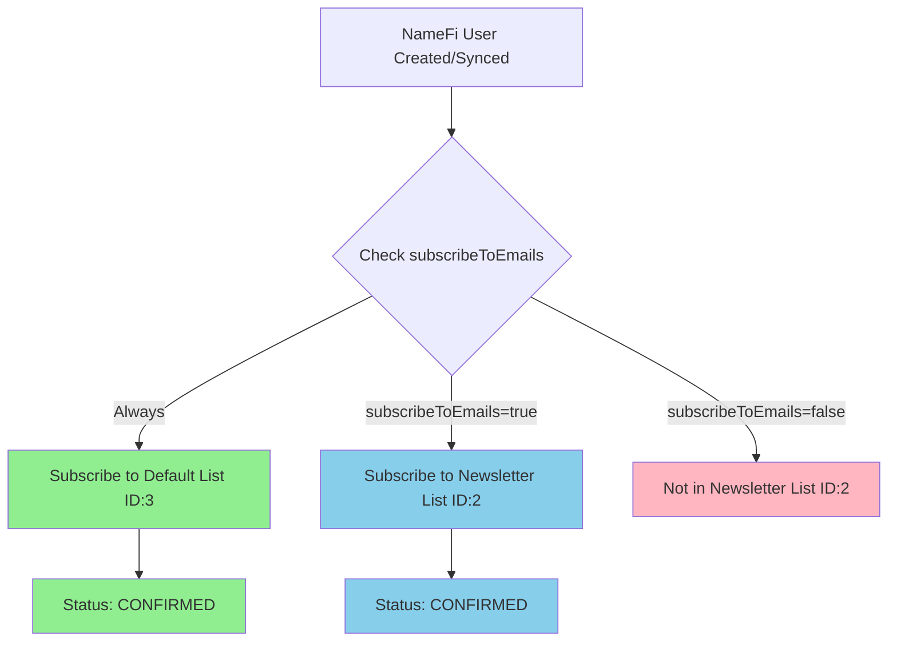
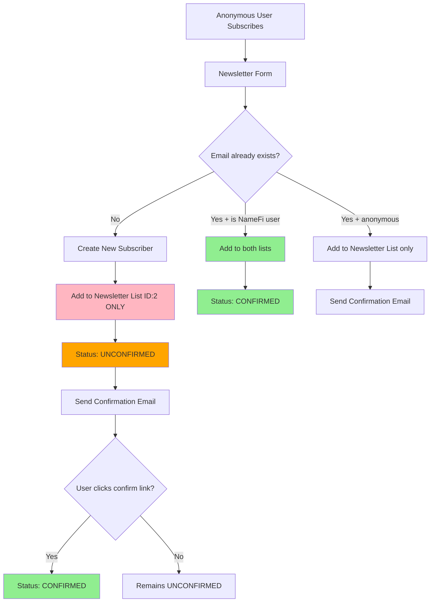
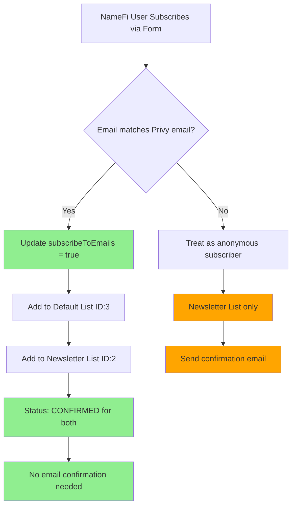
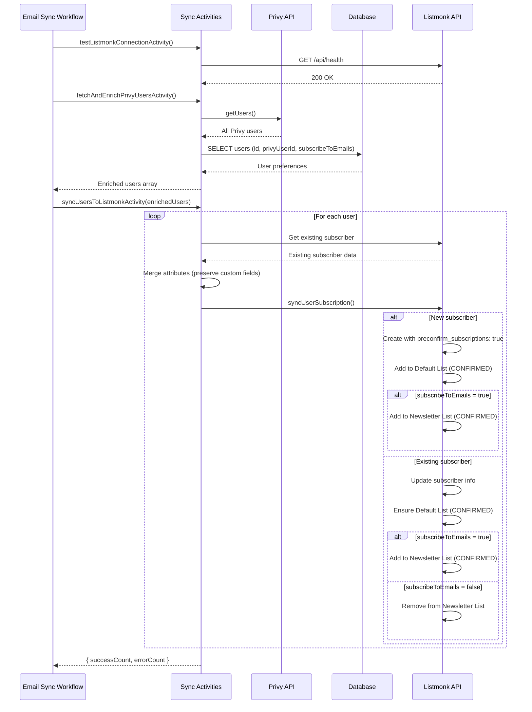
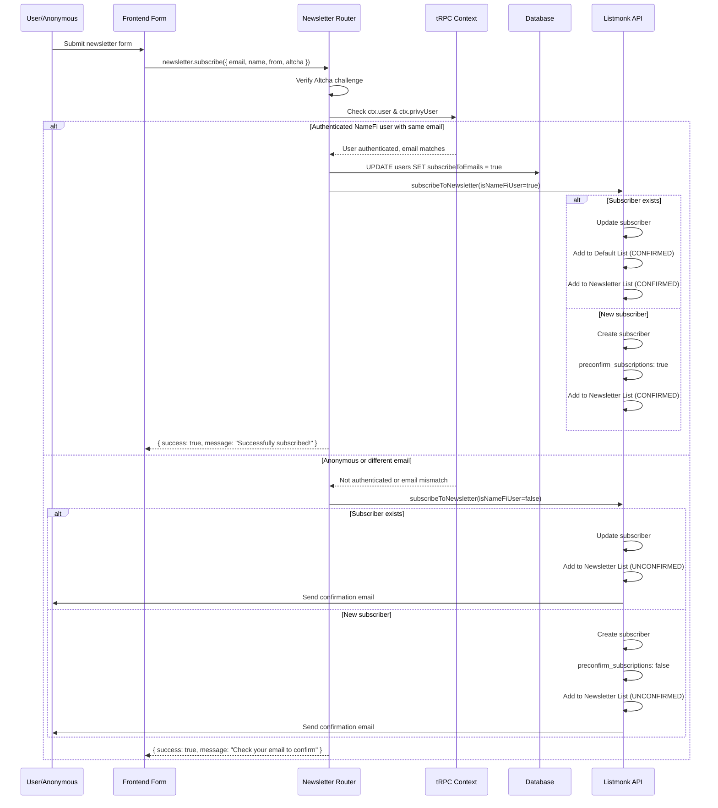
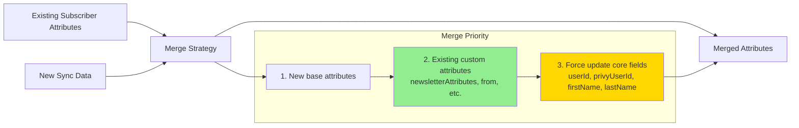

# Email Subscription System

## Overview

The NameFi Astra email subscription system uses Listmonk to manage two distinct mailing lists with different subscription rules and confirmation workflows.

## List Configuration

| List ID | Name | Purpose | Subscriber Requirements |
|---------|------|---------|------------------------|
| 3 | Default/NameFi List | System communications, important updates | All authenticated NameFi users |
| 2 | Newsletter List | Marketing, newsletters, optional content | NameFi users who opt-in OR anonymous subscribers |

## Environment Variables

```typescript
LISTMONK_NAMEFI_LIST_ID=3        // Default list for all NameFi users
LISTMONK_NEWSLETTER_LIST_ID=2    // Newsletter list for opt-in subscribers
LISTMONK_BASE_URL                // Listmonk server URL
LISTMONK_USERNAME                // Listmonk admin username
LISTMONK_PASSWORD                // Listmonk admin password
```

## Database Schema

```typescript
// users table
{
  id: string;                    // User UUID
  privyUserId: string;           // Privy authentication ID
  subscribeToEmails: boolean;    // Newsletter opt-in flag (default: true)
  // ... other fields
}
```

## Subscription Rules

### Rule 1: NameFi Users (Authenticated)



**Key Points:**
- ✅ Always subscribed to Default List (ID: 3)
- ✅ Subscription status: **CONFIRMED** (no email verification needed)
- ✅ Newsletter List (ID: 2) subscription based on `subscribeToEmails` flag
- ✅ Pre-confirmed subscriptions (`preconfirm_subscriptions: true`)

### Rule 2: Anonymous Newsletter Subscribers



**Key Points:**
- ⚠️ Only added to Newsletter List (ID: 2)
- ⚠️ NOT added to Default List (ID: 3)
- ⚠️ Subscription status: **UNCONFIRMED** until email verified
- ⚠️ Requires email confirmation (`preconfirm_subscriptions: false`)

### Rule 3: NameFi User Subscribing via Newsletter Form



**Key Points:**
- ✅ Checks if email matches authenticated user's email
- ✅ Updates `subscribeToEmails` to `true` in database
- ✅ Adds to both lists with **CONFIRMED** status
- ✅ No email confirmation required

## Sync Workflow (Temporal)

### Bulk User Sync



### Single User Sync

Triggered when:
- User updates their email preferences
- User's subscription status changes
- Manual sync requested

Flow is similar to bulk sync but processes a single user.

## Newsletter Subscription Flow



## Attribute Preservation

When syncing users, the system preserves custom attributes added by other flows:



**Implementation:**
```typescript
if (existingSubscriber?.attribs) {
  subscriber.attribs = {
    ...subscriber.attribs,              // New attributes from sync
    ...existingSubscriber.attribs,      // Preserve existing custom attributes
    // Force update core NameFi attributes
    privyUserId: subscriber.attribs.privyUserId,
    userId: subscriber.attribs.userId,
    firstName: subscriber.attribs.firstName,
    lastName: subscriber.attribs.lastName,
  };
}
```

## Confirmation Status

### NameFi Users (Always Confirmed)

```typescript
// When creating/updating NameFi user subscriptions
{
  preconfirm_subscriptions: true,
  status: 'confirmed'
}
```

### Anonymous Users (Require Confirmation)

```typescript
// When creating anonymous newsletter subscriptions
{
  preconfirm_subscriptions: false,
  status: 'unconfirmed'  // Changes to 'confirmed' after email verification
}
```

## List Membership Decision Matrix

| User Type | Default List (3) | Newsletter List (2) | Status | Confirmation Required |
|-----------|------------------|---------------------|--------|----------------------|
| NameFi user, subscribeToEmails=true | ✅ Yes | ✅ Yes | CONFIRMED | ❌ No |
| NameFi user, subscribeToEmails=false | ✅ Yes | ❌ No | CONFIRMED | ❌ No |
| Anonymous newsletter subscriber | ❌ No | ✅ Yes | UNCONFIRMED | ✅ Yes |
| NameFi user via newsletter form (same email) | ✅ Yes | ✅ Yes | CONFIRMED | ❌ No |

## Code Structure

### Key Files

```
apps/backend/src/
├── lib/
│   ├── listmonk.ts                    # ListmonkClient with sync logic
│   └── env/schema.ts                  # Environment configuration
├── temporal/
│   ├── workflows/
│   │   └── email-subscription-sync.workflow.ts
│   ├── activities/default/
│   │   └── email-subscription-sync.activities.ts
│   └── schedules/
│       └── email-subscription-sync.ts
└── trpc/routers/
    └── newsletterRouter.ts            # Public newsletter subscription endpoint

packages/db/src/
└── schema.ts                          # users.subscribeToEmails field
```

### Key Methods

#### ListmonkClient

```typescript
class ListmonkClient {
  // High-level sync for NameFi users
  async syncUserSubscription(
    subscriber: ListmonkSubscriber,
    subscribeToEmails: boolean,
    userId: string,
  ): Promise<void>

  // Create or update subscriber
  async upsertSubscriber(subscriber: ListmonkSubscriber): Promise<void>

  // Update list memberships with status
  async $updateSubscriberLists(options: UpdateSubscriberListsOptions): Promise<void>
}
```

#### Activities

```typescript
// Test Listmonk connection
async function testListmonkConnectionActivity(): Promise<boolean>

// Fetch all Privy users enriched with DB data
async function fetchAndEnrichPrivyUsersActivity(): Promise<Array<EnrichedUser>>

// Sync all users to Listmonk
async function syncUsersToListmonkActivity(
  enrichedUsers: Array<EnrichedUser>
): Promise<{ successCount: number; errorCount: number }>

// Sync single user
async function syncSingleUserToListmonkActivity(userId: string): Promise<void>
```

## Testing Checklist

- [ ] NameFi user created → appears in Default List (confirmed)
- [ ] NameFi user with subscribeToEmails=true → appears in Newsletter List (confirmed)
- [ ] NameFi user with subscribeToEmails=false → not in Newsletter List
- [ ] NameFi user toggles subscribeToEmails → list membership updates accordingly
- [ ] Anonymous newsletter subscriber → receives confirmation email
- [ ] Anonymous newsletter subscriber → only in Newsletter List, not Default List
- [ ] NameFi user subscribing via form → subscribeToEmails set to true
- [ ] NameFi user subscribing via form → both lists with confirmed status
- [ ] Sync preserves custom attributes (newsletterAttributes, from, etc.)
- [ ] All NameFi user subscriptions have CONFIRMED status
- [ ] Anonymous subscriptions have UNCONFIRMED status until verified

## Monitoring & Logging

### Key Log Events

```typescript
// User sync events
logger.info({ userId, email, lists }, 'Created/updated subscriber with appropriate lists')
logger.info({ userId, email, listsAdded }, 'Added subscriber to lists')
logger.info({ userId, email, listsRemoved }, 'Removed subscriber from lists')
logger.info({ email, listsConfirmed }, 'Confirmed list subscriptions for existing subscriber')

// Newsletter subscription events
logger.info({ userId, email }, 'Updated NameFi user subscribeToEmails to true')
logger.info({ email, isNameFiUser, subscriptionStatus }, 'Updated existing subscriber with new attributes')
logger.info({ email, preconfirmed: isNameFiUser }, 'Successfully created new newsletter subscriber')

// Bulk sync results
logger.info({ totalUsers, successCount, errorCount }, 'Completed user sync to Listmonk')
```

### Metrics to Track

- Total subscribers in Default List
- Total subscribers in Newsletter List
- Confirmed vs unconfirmed subscribers
- Sync success rate
- Newsletter form conversion rate
- Email confirmation rate for anonymous subscribers

## Common Scenarios

### Scenario 1: New User Signs Up

1. User creates account via Privy
2. User record created in database with `subscribeToEmails=true` (default)
3. Next sync run (hourly) picks up the new user
4. User added to:
   - Default List (ID: 3) - CONFIRMED
   - Newsletter List (ID: 2) - CONFIRMED

### Scenario 2: User Opts Out of Newsletters

1. User updates preference: `subscribeToEmails=false`
2. Sync workflow triggered (or runs on schedule)
3. User membership updated:
   - Default List (ID: 3) - CONFIRMED (unchanged)
   - Newsletter List (ID: 2) - Removed

### Scenario 3: Anonymous Visitor Subscribes to Newsletter

1. Visitor fills out newsletter form
2. System checks: not authenticated
3. Creates subscriber:
   - Newsletter List (ID: 2) - UNCONFIRMED
4. Sends confirmation email
5. User clicks confirmation link
6. Status updated: CONFIRMED

### Scenario 4: Logged-in User Subscribes via Newsletter Form

1. Authenticated user fills out newsletter form with their email
2. System checks: email matches `ctx.privyUser.email.address`
3. Database updated: `subscribeToEmails=true`
4. Subscriber created/updated:
   - Default List (ID: 3) - CONFIRMED
   - Newsletter List (ID: 2) - CONFIRMED
5. No confirmation email needed

## Troubleshooting

### Issue: User not receiving emails

**Check:**
1. User in correct list? `SELECT * FROM listmonk subscribers WHERE email = 'user@example.com'`
2. Subscription status = CONFIRMED?
3. User status = ENABLED (not blocklisted)?
4. Check Listmonk bounce records

### Issue: Sync failing

**Check:**
1. Listmonk connection: `testListmonkConnectionActivity()`
2. Environment variables configured
3. Check logs for specific errors
4. Verify Privy API connectivity

### Issue: Duplicate subscribers

**Check:**
1. Subscriber lookup by userId vs email
2. Custom attributes (userId, privyUserId) correctly set
3. Run deduplication process in Listmonk admin

## Future Enhancements

- [ ] Add webhook for real-time Listmonk status updates
- [ ] Implement subscriber segmentation based on user behavior
- [ ] Add A/B testing support for email campaigns
- [ ] Create analytics dashboard for subscription metrics
- [ ] Support for additional custom lists
- [ ] Automated cleanup of unconfirmed subscribers after X days
