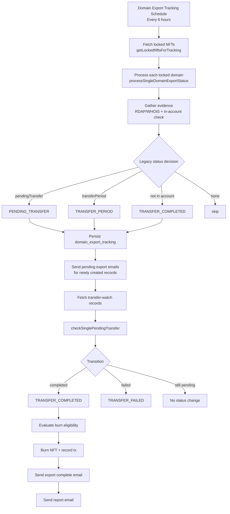
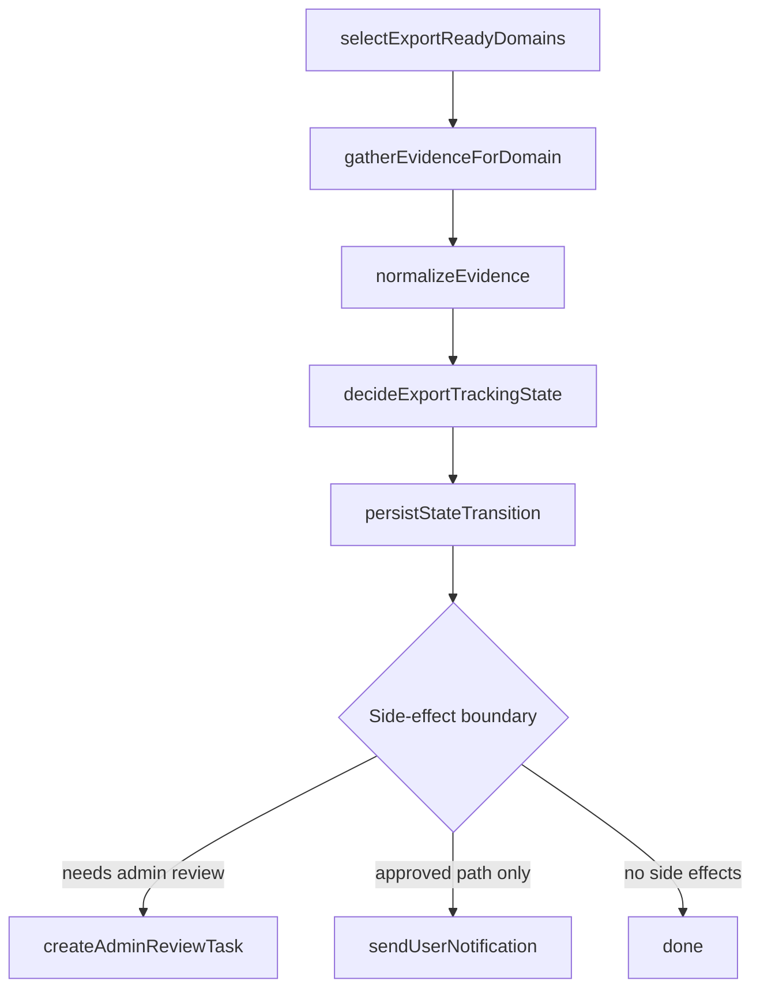
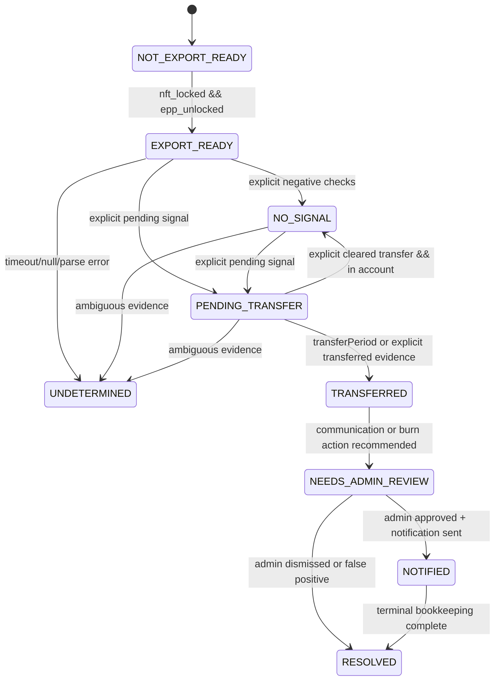

# Export Tracking Architecture

This document captures the current and target architecture for domain export tracking.

## Current Runtime Flow

## Refined Composable Pipeline

## Proposed State Machine

## Registrar Evidence Strategy

| Registrar capability | Primary signal | Secondary signal | Notes |
| --- | --- | --- | --- |
| Dynadot | `queryPendingTransfer` | RDAP/WHOIS status | direct transfer API available |
| CentralNic/EPP-direct | EPP transfer query (`op=query`) | RDAP/WHOIS status | explicit EPP semantics |
| Route53 | In-account + EPP/RDAP status | RDAP events when explicit | no direct pending-transfer API |

## Implementation Notes

- Evidence gathering, normalization, and decision logic are split into explicit functions in `apps/backend/src/temporal/activities/domain/export-tracking.activities.ts`.
- Transfer-watch polling now includes both `PENDING_TRANSFER` and `TRANSFER_PERIOD` records.
- Ambiguous evidence is treated as `undetermined` and does not trigger state transitions.
