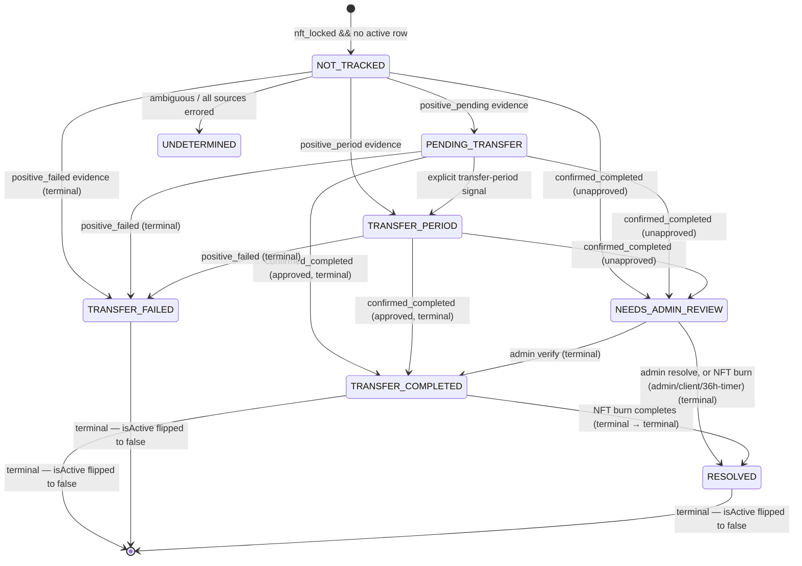

# Export Tracking Architecture

This document captures the architecture for domain export tracking — the
pipeline that detects when a Namefi-managed domain is being transferred out,
gates user notifications behind admin review, and burns the corresponding
NFT when the export is confirmed.

> **Current status (early release).** Two behaviors below differ from a naive
> reading of "admin gate" and "user notifications", and are intentional for now:
> 1. **User-facing emails are disabled.** `ENABLE_EXPORT_EMAILS = false` in
>    `export-tracking.activities.ts` routes every pending/failed/completed email
>    to the internal archive (`EMAIL_BCC`) only — no real user receives one. The
>    per-email columns and retry counters still record each attempt.
> 2. **The admin gate is a time-boxed review window, not a hard stop.** A
>    `NEEDS_ADMIN_REVIEW` row whose export is confirmed out of our account is
>    auto-burned 36 hours later even with no admin action (see *Burn Eligibility
>    & Approval*), and an **already-approved** export skips the gate entirely.

## Runtime Flow

```mermaid
flowchart TD
  A[Domain Export Tracking Schedule\nEvery 6 hours] --> B[Fetch locked NFTs\ngetLockedNftsForTracking]
  B --> C[For each locked domain\nprocessSingleDomainExportStatus]
  C --> D[gatherEvidenceForDomain\nparallel: AccountCheck, DomainIndex,\nRDAPStatus, RDAPEvents, WHOIS, DirectRegistrar]
  D --> E[decideExportTrackingState\npriority rules]
  E --> F{Persist transition}
  F -->|NO_SIGNAL + no row| G[Skip]
  F -->|NO_SIGNAL + active row| H[Touch lastCheckedAt only]
  F -->|UNDETERMINED| I[Create / update row]
  F -->|PENDING_TRANSFER / TRANSFER_PERIOD| J[Create / update row]
  F -->|TRANSFER_COMPLETED + approved| K2[Persist as TRANSFER_COMPLETED\nadmin gate bypassed]
  F -->|TRANSFER_COMPLETED + unapproved| K[Persist as NEEDS_ADMIN_REVIEW\nadmin gate]
  F -->|TRANSFER_FAILED| L[Persist + flip isActive=false]
  J --> M[Send pending email if trusted\nself-writes per-email-type columns]
  N[Fetch active PENDING/PERIOD rows] --> O[checkSinglePendingTransfer]
  O --> P{Re-evaluate}
  P -->|still in flight| J
  P -->|completed| K
  P -->|failed| L
  Q[Fetch burn-eligible rows\nstatus in (TRANSFER_COMPLETED, NEEDS_ADMIN_REVIEW)] --> R[shouldBurnNft]
  R --> S[Burn NFT via child workflow]
  S --> T[recordNftBurn\nstatus=RESOLVED, isActive=false]
  U[Admin verify] --> V[sendExportCompleteEmail\nself-writes column]
  V --> W[status=TRANSFER_COMPLETED\nisActive=false]
  X[Admin resolve] --> Y[status=RESOLVED\nisActive=false]
```

## Evidence Sources

`gatherEvidenceForDomain` queries every source independently and in
parallel (`Promise.all`; one RDAP call feeds both RDAP sources). Every source
returns a tagged `EvidenceSourceResult` even on failure, so the decision
function always sees a complete picture.

When the row is already approved (see *Burn Eligibility & Approval*),
`gatherEvidenceForDomain` is called with `approvedForCompletion: true`: a
registrar "domain not found" error from `AccountCheck` / `DirectRegistrar` is
then read as `positive_completed` rather than the more cautious downgrade, so an
approved export closes promptly once the domain leaves our account.

| Source | Backed by | Strongest signal |
| --- | --- | --- |
| `AccountCheck` | `sldRegistrar.getDomainDetails` | `positive_completed` when domain is confirmed not in any of our registrar accounts |
| `DomainIndex` | `indexed_domains` row (`isMissingFromRegistrar`) | `positive_completed` when missing from registrar, `negative` when present, `no_data` when unindexed |
| `RDAPStatus` | `RDAP.queryDomain` — `status[]` field | `positive_pending` on `pendingTransfer`, `positive_period` on `transferPeriod` |
| `RDAPEvents` | `RDAP.queryDomain` — `events[]` field (RFC 9083) | `positive_completed` when an event with `eventAction: 'transfer'` exists |
| `WHOIS` | `WhoisClient.queryDomain` (no longer a fallback — independently queried) | Same EPP-style signals as RDAPStatus |
| `DirectRegistrar` | `sldRegistrar.queryPendingTransfer` — routes to Dynadot / CentralNic EPP / Route 53 `ListOperationsCommand` | All four positives + `positive_failed` (registrar-confirmed cancellation/rejection) |

Each result carries `{ source, status, evidence?, error?, checkedAt }`. The
seven `status` values are:

- `positive_pending` — in-progress transfer.
- `positive_period` — post-transfer lock period.
- `positive_completed` — transfer finished; domain has left our account.
- `positive_failed` — transfer was cancelled or rejected.
- `negative` — source affirmatively said "no transfer signal".
- `no_data` — source responded but had no information.
- `error` — source threw; the `error` field carries the message.

### Registrar capabilities

| Registrar | `queryPendingTransfer` primitive |
| --- | --- |
| Dynadot | `get_transfer_status` (`transfer_type: 'away'`) |
| CentralNic / EPP-direct | EPP `op=query` |
| Route 53 | `ListOperationsCommand({ Type: ['TRANSFER_OUT_DOMAIN'] })` mapped to EPP transfer statuses |

## Decision Rules

`decideExportTrackingState` returns a decision **action** by applying these
rules in priority order (first match wins):

1. Any source reports `positive_pending` → `PENDING_TRANSFER`.
2. Any source reports `positive_period` → `TRANSFER_PERIOD`.
3. `DirectRegistrar` reports `positive_failed` → `TRANSFER_FAILED`.
4. `AccountCheck` confirms gone **or** `DomainIndex` reports missing, **with ≥2
   corroborating sources** from {`AccountCheck`, `DomainIndex`, `DirectRegistrar`,
   `RDAPEvents`} → `TRANSFER_COMPLETED`.
5. `AccountCheck` confirms gone alone (live registrar is authoritative) → `TRANSFER_COMPLETED`.
6. `DomainIndex` reports missing **and** `AccountCheck` does not contradict it
   (i.e. AccountCheck is not `negative`) → `TRANSFER_COMPLETED`.
7. Every source is `error` or `no_data` → `UNDETERMINED`.
8. Otherwise → `NO_SIGNAL` (with a per-source diagnostic reason).

Tie-breaking: in-progress beats completion (rules 1–2 win over 4–6) — we'd
rather wait a cycle than burn an NFT for a domain that's still ours. A single
source `error` does not block; `UNDETERMINED` only fires when no source produced
a usable verdict.

The `TRANSFER_COMPLETED` **action** is then mapped to a persisted **status** by
`mapDecisionToPersistedStatus(action, { adminApproved })`:

- **unapproved** → `NEEDS_ADMIN_REVIEW` (the admin gate).
- **already approved** (client or admin — see *Burn Eligibility & Approval*) →
  `TRANSFER_COMPLETED` directly (terminal, `isActive = false`); the gate is
  skipped because a human already authorized the export.

### Heuristic TRANSFER_FAILED path (re-check loop only)

`checkSinglePendingTransfer` re-evaluates rows already in `PENDING_TRANSFER`
or `TRANSFER_PERIOD`. In addition to rule 3 above, that activity treats a
`NO_SIGNAL` decision combined with `AccountCheck.status === 'negative'`
(domain is back in our account) as a failed transfer and transitions the
row to `TRANSFER_FAILED` (terminal, `isActive=false`). This heuristic path
fires only on re-checks of previously-pending rows; the main scan does
not synthesize `TRANSFER_FAILED` from NO_SIGNAL.

## State Machine



The `isActive` flag and the partial unique index
`(normalizedDomainName, chainId) WHERE isActive = true` together enforce
that every terminal status freezes its row. A subsequent tracking cycle
on the same `(domain, chainId)` creates a new row.

## Notification State

Notification state is **separate** from tracking state. Each row has three
independent notification slots — `pending`, `failed`, and `completed` —
covering the user-facing email types over the export lifecycle:

| Email type | Trigger | Auto-send gate |
| --- | --- | --- |
| `pending` | Transfer detected as in-progress (`PENDING_TRANSFER`) | Trusted evidence (DirectRegistrar `positive_pending`) OR admin/client approval |
| `failed` | Transfer detected as cancelled/rejected (`TRANSFER_FAILED`) | Auto-sends when the registrar-confirmed path triggers (`DirectRegistrar` `positive_failed`, in either the main scan or the re-check loop). The heuristic "domain back in our account" re-check path (see *Heuristic TRANSFER_FAILED path* above) does NOT auto-send — admin can send manually. |
| `completed` | Admin verifies the export (`NEEDS_ADMIN_REVIEW → TRANSFER_COMPLETED`) | Sent **only** on admin verify (or manual resend). See the gap note below. |

Each slot carries the same five columns (with the slot's prefix):

| Column suffix | Purpose |
| --- | --- |
| `_sent_at` | Set on successful send (cleared error) |
| `_last_attempt_at` | Set on every attempt (success or failure) |
| `_attempts` | Monotonically increasing attempt counter |
| `_last_error` | Most recent error message (null on success) |
| `_recipient` | Resolved recipient email address |

The email-send activities (`sendPendingExportEmail`,
`sendFailedExportEmail`, `sendExportCompleteEmail`) self-write these
columns on both success and failure, so retries and partial failures are
visible to admins. Admins can manually trigger or resend any of the three
emails via `admin.exportTracking.sendExportTrackingEmail` (driven by the
current `status`), including on terminal rows for support purposes.

> **Completed-email gap (follow-up).** `sendExportCompleteEmail` is wired only
> into the admin router (`verifyExportTracking` and the manual resend) — not the
> workflow. An export that auto-completes through the **approved** path (client
> or admin approval → direct `TRANSFER_COMPLETED`) therefore does not trigger a
> completion email. This is currently moot because user emails are disabled
> (see the status callout), but it should be revisited when emails are enabled.

## Burn Eligibility & Approval

`getDomainsEligibleForBurn` selects rows where `status ∈ {TRANSFER_COMPLETED,
NEEDS_ADMIN_REVIEW}` and `nftBurnedAt IS NULL`. It deliberately does **not**
filter by `isActive` — an admin-verified terminal `TRANSFER_COMPLETED` row may
still need its NFT burned.

For each eligible row `shouldBurnNft` returns `shouldBurn: true` on the first
matching approval path (priority order):

| Path | Condition | Set by |
| --- | --- | --- |
| `client_approved` | `clientApprovedAt` is set | Client `approveTransfer` mutation (see below) |
| `admin_approved` | `verifyingAdminId` is set | Admin **Verify** action |
| `time_confirmed` | `confirmedOutOfAccountAt` is ≥ `MIN_HOURS_FOR_TIME_BASED_BURN` (36h) old | The tracking workflow when it confirms the domain left our account |

The **`time_confirmed` path is what makes the admin gate time-boxed**: entering
`NEEDS_ADMIN_REVIEW` stamps `confirmedOutOfAccountAt`, so 36 hours later the row
becomes burn-eligible and is burned with no admin action. Burning is
irreversible — treat the 36h window as the review SLA, not an indefinite hold.

**Pre-burn re-verification.** Once an approval path qualifies a row, `shouldBurnNft`
**re-gathers evidence** (the same context-free `gatherEvidence`) before returning
`shouldBurn: true`. If the fresh evidence shows the domain is **back in our
account** (`AccountCheck` is `negative`) or a transfer is **in-flight again**
(any `positive_pending` / `positive_period`), it aborts the burn with reason
`domain_back_in_account`. Missing or errored evidence does **not** block — a prior
human approval or the 36h timer already authorized the burn; only positive
"it came back" evidence stops the irreversible action. (`shouldBurnNft` therefore
makes external calls and runs in the 5-minute activity group.)

The burn runs as the `ensureNftIsLockedAndBurnByNftName` child workflow
(deterministic workflow id → idempotent re-invocation). `recordNftBurn` writes
the outcome **to the specific eligible row by `trackingRecordId`**:

- success → `status = RESOLVED`, `isActive = false`, `nftBurnedAt`, `nftBurnTxHash`.
- failure → `nftBurnFailedAt`, `nftBurnLastError`, `nftBurnAttempts += 1`
  (status unchanged, so the row stays eligible and retries next tick); these
  surface in the admin table's default-hidden "Burn Failure" column.

### On-demand evidence re-gather (admin)

Admins can re-gather evidence for a single row on demand from the admin
export-tracking table (a per-row "Evidence" dialog, mirroring the decision-gates
decision-support panel). `admin.exportTracking.gatherExportEvidence` runs the
same context-free `gatherEvidence` + `decideExportTrackingState` and returns the
per-source verdicts and the decision it would produce **now** — **read-only**, it
does not write to the row. `admin.exportTracking.summarizeExportEvidence` then
produces an optional DeepSeek brief of that evidence (returns `summary: null`
when `DEEPSEEK_API_KEY` is unset). Both reuse the workflow's gather/decision
logic, so the on-demand view and the scheduled tick can't diverge.

### Client-initiated approval

For registrars that support it (CentralNic — the pending email exposes
`supportsApprovingExport`), the domain owner approves their own export via
`domainConfig.approveTransfer`. That mutation approves the transfer at the
registrar and **upserts** the tracking row with `clientApprovedAt` (an
`onConflictDoUpdate` scoped to the `WHERE is_active = true` partial unique
index), then triggers a tracking run. From then on the export completes without
the admin gate (`client_approved`).

## Implementation Notes

- Source-of-truth for evidence types: `EvidenceSourceResult`,
  `EvidenceSourceName`, and `EvidenceSourceStatus` exported from
  `apps/backend/src/temporal/activities/domain/export-tracking.activities.ts`.
- `mapDecisionToPersistedStatus(action, { adminApproved })` applies the admin
  gate: an **unapproved** `TRANSFER_COMPLETED` decision is persisted as
  `NEEDS_ADMIN_REVIEW` (the admin `verifyExportTracking` mutation later
  transitions it to terminal `TRANSFER_COMPLETED`), while an **already-approved**
  decision persists `TRANSFER_COMPLETED` directly (terminal, `isActive = false`).
- Burn eligibility uses status + `nftBurnedAt IS NULL`; it does **not**
  filter by `isActive`, because a terminal `TRANSFER_COMPLETED` row may
  legitimately still need its NFT burned.
- `getActiveTrackingRecord` filters `WHERE isActive = true` — the
  workflow's per-tick lookup never returns terminal rows.
- The schema removed the legacy `NOTIFIED` enum value. Migration
  `0127_export_tracking_terminal_rows_and_per_email_columns` adds `is_active` +
  the per-email columns, backfills legacy `NOTIFIED` / `notified_at` /
  `pending_notified_at` data into the new shape, and flips terminal rows to
  `isActive = false`. The burn-failure columns (`nft_burn_failed_at`,
  `nft_burn_last_error`, `nft_burn_attempts`) are a later additive migration.
- The schedule runs every 6 hours; per-domain checks run in parallel
  batches of 10 (configurable via `maxConcurrency`).

## Known Limitations / Follow-ups

These are accepted for now and tracked for a later pass:

- **No workflow execution timeout.** The schedule sets `overlapPolicy: SKIP`
  but no `workflowExecutionTimeout` / `workflowRunTimeout`, so a hung run would
  silently block every subsequent run until cleared.
- **No timeout on the burn child workflow.** The `executeChild` burn call has no
  `workflowExecutionTimeout`; a stuck burn blocks the parent (and, with the
  above, the schedule).
- **Unbounded burn-eligible set.** `getDomainsEligibleForBurn` has no `LIMIT`
  and the burn phase processes rows serially, so a large backlog lengthens a
  single tick.
- **Burn retries are uncapped.** A persistently-failing burn re-qualifies every
  6h with no attempt ceiling or backoff (the failure is now at least recorded —
  see *Burn Eligibility & Approval*).
- **Completed-email gap** on the approved auto-complete path (see Notification
  State).
