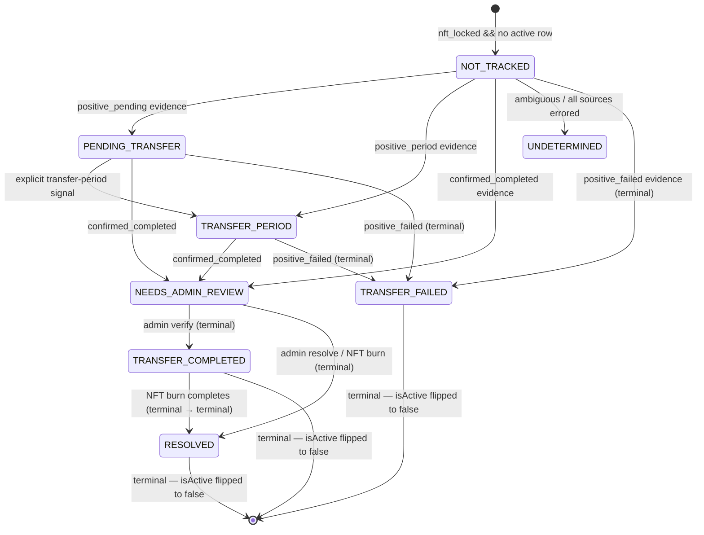

# Export Tracking Architecture

This document captures the architecture for domain export tracking — the
pipeline that detects when a Namefi-managed domain is being transferred out,
gates user notifications behind admin review, and burns the corresponding
NFT when the export is confirmed.

## Runtime Flow

```mermaid
flowchart TD
  A[Domain Export Tracking Schedule\nEvery 6 hours] --> B[Fetch locked NFTs\ngetLockedNftsForTracking]
  B --> C[For each locked domain\nprocessSingleDomainExportStatus]
  C --> D[gatherEvidenceForDomain\nparallel: AccountCheck, RDAPStatus,\nRDAPEvents, WHOIS, DirectRegistrar]
  D --> E[decideExportTrackingState\npriority rules]
  E --> F{Persist transition}
  F -->|NO_SIGNAL + no row| G[Skip]
  F -->|NO_SIGNAL + active row| H[Touch lastCheckedAt only]
  F -->|UNDETERMINED| I[Create / update row]
  F -->|PENDING_TRANSFER / TRANSFER_PERIOD| J[Create / update row]
  F -->|TRANSFER_COMPLETED| K[Persist as NEEDS_ADMIN_REVIEW\nadmin gate]
  F -->|TRANSFER_FAILED| L[Persist + flip isActive=false]
  J --> M[Send pending email if trusted\nself-writes per-email-type columns]
  N[Fetch active PENDING/PERIOD rows] --> O[checkSinglePendingTransfer]
  O --> P{Re-evaluate}
  P -->|still in flight| J
  P -->|completed| K
  P -->|failed| L
  Q[Fetch burn-eligible rows\nstatus in (TRANSFER_COMPLETED, NEEDS_ADMIN_REVIEW)] --> R[shouldBurnNft]
  R --> S[Burn NFT via child workflow]
  S --> T[recordNftBurn\nstatus=RESOLVED, isActive=false]
  U[Admin verify] --> V[sendExportCompleteEmail\nself-writes column]
  V --> W[status=TRANSFER_COMPLETED\nisActive=false]
  X[Admin resolve] --> Y[status=RESOLVED\nisActive=false]
```

## Evidence Sources

`gatherEvidenceForDomain` queries every source independently and in
parallel. Every source returns a tagged `EvidenceSourceResult` even on
failure, so the decision function always sees a complete picture.

| Source | Backed by | Strongest signal |
| --- | --- | --- |
| `AccountCheck` | `sldRegistrar.getDomainDetails` | `positive_completed` when domain is confirmed not in any of our registrar accounts |
| `RDAPStatus` | `RDAP.queryDomain` — `status[]` field | `positive_pending` on `pendingTransfer`, `positive_period` on `transferPeriod` |
| `RDAPEvents` | `RDAP.queryDomain` — `events[]` field (RFC 9083) | `positive_completed` when an event with `eventAction: 'transfer'` exists |
| `WHOIS` | `WhoisClient.queryDomain` (no longer a fallback — independently queried) | Same EPP-style signals as RDAPStatus |
| `DirectRegistrar` | `sldRegistrar.queryPendingTransfer` — routes to Dynadot / CentralNic EPP / Route 53 `ListOperationsCommand` | All four positives + `positive_failed` (registrar-confirmed cancellation/rejection) |

Each result carries `{ source, status, evidence?, error?, checkedAt }`. The
seven `status` values are:

- `positive_pending` — in-progress transfer.
- `positive_period` — post-transfer lock period.
- `positive_completed` — transfer finished; domain has left our account.
- `positive_failed` — transfer was cancelled or rejected.
- `negative` — source affirmatively said "no transfer signal".
- `no_data` — source responded but had no information.
- `error` — source threw; the `error` field carries the message.

### Registrar capabilities

| Registrar | `queryPendingTransfer` primitive |
| --- | --- |
| Dynadot | `get_transfer_status` (`transfer_type: 'away'`) |
| CentralNic / EPP-direct | EPP `op=query` |
| Route 53 | `ListOperationsCommand({ Type: ['TRANSFER_OUT_DOMAIN'] })` mapped to EPP transfer statuses |

## Decision Rules

`decideExportTrackingState` applies these rules in priority order
(first match wins):

1. Any source reports `positive_pending` → `PENDING_TRANSFER`.
2. Any source reports `positive_period` → `TRANSFER_PERIOD`.
3. `DirectRegistrar` reports `positive_failed` → `TRANSFER_FAILED`.
4. `AccountCheck` confirms domain is gone AND (`DirectRegistrar` or `RDAPEvents` corroborate) → `TRANSFER_COMPLETED`.
5. `AccountCheck` confirms domain is gone alone → `TRANSFER_COMPLETED`.
6. Every source is `error` or `no_data` → `UNDETERMINED`.
7. Otherwise → `NO_SIGNAL`.

Tie-breaking: in-progress beats completion (rule 1 wins over rule 4).
A single source `error` does not block — UNDETERMINED only fires when no
source produced a usable verdict.

### Heuristic TRANSFER_FAILED path (re-check loop only)

`checkSinglePendingTransfer` re-evaluates rows already in `PENDING_TRANSFER`
or `TRANSFER_PERIOD`. In addition to rule 3 above, that activity treats a
`NO_SIGNAL` decision combined with `AccountCheck.status === 'negative'`
(domain is back in our account) as a failed transfer and transitions the
row to `TRANSFER_FAILED` (terminal, `isActive=false`). This heuristic path
fires only on re-checks of previously-pending rows; the main scan does
not synthesize `TRANSFER_FAILED` from NO_SIGNAL.

## State Machine



The `isActive` flag and the partial unique index
`(normalizedDomainName, chainId) WHERE isActive = true` together enforce
that every terminal status freezes its row. A subsequent tracking cycle
on the same `(domain, chainId)` creates a new row.

## Notification State

Notification state is **separate** from tracking state. Each row has three
independent notification slots — `pending`, `failed`, and `completed` —
covering the user-facing email types over the export lifecycle:

| Email type | Trigger | Auto-send gate |
| --- | --- | --- |
| `pending` | Transfer detected as in-progress (`PENDING_TRANSFER`) | Trusted evidence (DirectRegistrar `positive_pending`) OR admin/client approval |
| `failed` | Transfer detected as cancelled/rejected (`TRANSFER_FAILED`) | Auto-sends when the registrar-confirmed path triggers (`DirectRegistrar` `positive_failed`, in either the main scan or the re-check loop). The heuristic "domain back in our account" re-check path (see *Heuristic TRANSFER_FAILED path* above) does NOT auto-send — admin can send manually. |
| `completed` | Admin verifies the export (`NEEDS_ADMIN_REVIEW → TRANSFER_COMPLETED`) | Always sent on admin verify |

Each slot carries the same five columns (with the slot's prefix):

| Column suffix | Purpose |
| --- | --- |
| `_sent_at` | Set on successful send (cleared error) |
| `_last_attempt_at` | Set on every attempt (success or failure) |
| `_attempts` | Monotonically increasing attempt counter |
| `_last_error` | Most recent error message (null on success) |
| `_recipient` | Resolved recipient email address |

The email-send activities (`sendPendingExportEmail`,
`sendFailedExportEmail`, `sendExportCompleteEmail`) self-write these
columns on both success and failure, so retries and partial failures are
visible to admins. Admins can manually trigger or resend any of the three
emails via `admin.exportTracking.sendExportTrackingEmail` (driven by the
current `status`), including on terminal rows for support purposes.

## Implementation Notes

- Source-of-truth for evidence types: `EvidenceSourceResult`,
  `EvidenceSourceName`, and `EvidenceSourceStatus` exported from
  `apps/backend/src/temporal/activities/domain/export-tracking.activities.ts`.
- `mapDecisionToPersistedStatus` enforces the admin gate: a decision of
  `TRANSFER_COMPLETED` is persisted as `NEEDS_ADMIN_REVIEW`. The admin
  `verifyExportTracking` mutation then transitions to `TRANSFER_COMPLETED`
  (terminal, `isActive = false`).
- Burn eligibility uses status + `nftBurnedAt IS NULL`; it does **not**
  filter by `isActive`, because a terminal `TRANSFER_COMPLETED` row may
  legitimately still need its NFT burned.
- `getActiveTrackingRecord` filters `WHERE isActive = true` — the
  workflow's per-tick lookup never returns terminal rows.
- The schema removed the legacy `NOTIFIED` enum value. Migration 0102
  backfills existing `NOTIFIED` rows to `TRANSFER_COMPLETED` + `isActive =
  false` and populates `completed_export_email_sent_at` from the legacy
  `notified_at` timestamp.
- The schedule runs every 6 hours; per-domain checks run in parallel
  batches of 10 (configurable via `maxConcurrency`).
