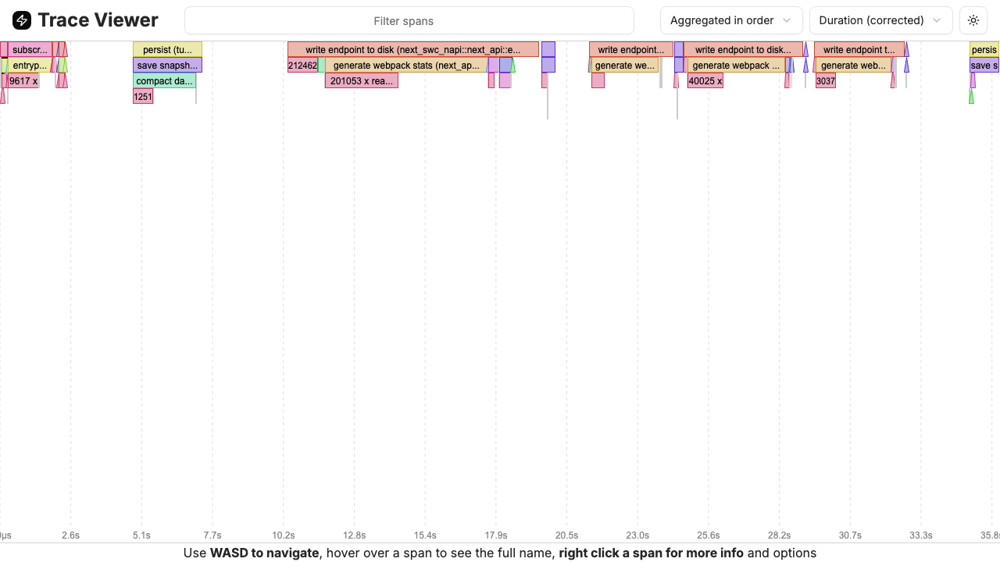
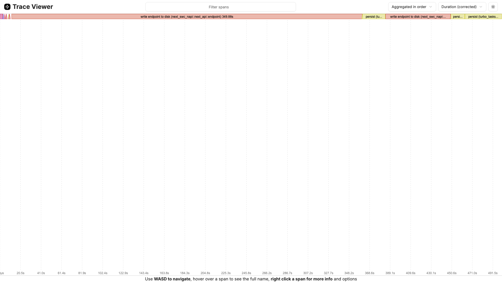
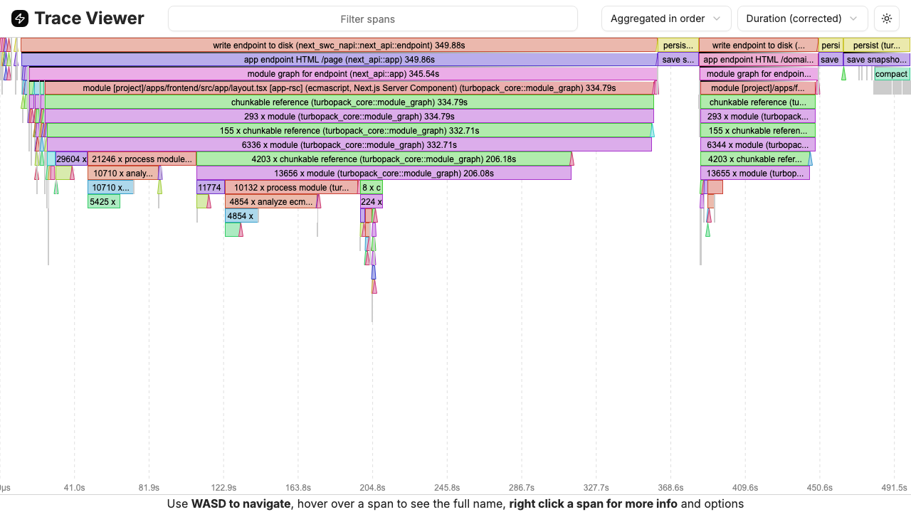
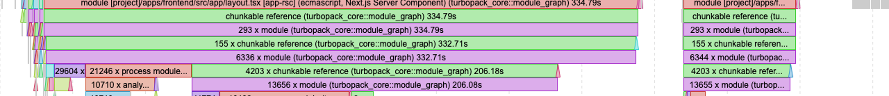

# Turbopack Dev Compile RCA (Next.js 16.1.1)

Date: 2026-01-12 (updated from 2026-01-09)

## Scope
**Root‑cause report** focused on **why dev compiles are slow**, with **Turbopack trace evidence**, a **clear explanation of first‑compile vs hot‑reload behavior**, and **screenshots**. I’m intentionally keeping this about mechanisms and evidence (not fixes), backed by Next.js/Turbopack references.

---

## Evidence & Artifacts (Local)

**Trace files**
- `apps/frontend/.next/dev/trace-turbopack` (536 MB, 2026‑01‑12) — produced by `NEXT_TURBOPACK_TRACING=1` (see Next.js docs).
- Previous trace (291 MB, 2026‑01‑09) — same path, earlier run.

**Trace screenshots**
- Figure 1: `docs/rca/assets/turbopack-trace-overview.png` (2026‑01‑09)
- Figure 2: `docs/rca/assets/turbopack-trace-viewport.png` (2026‑01‑09)
- Figure 3: `docs/rca/assets/turbopack-trace-overview-2026-01-12.png`
- Figure 4: `docs/rca/assets/turbopack-trace-viewport-2026-01-12.png`

**Log files**
- Cold route compiles with tracing: `/tmp/turbopack-trace.log`
- Hot‑reload probe run (file edit + reloads): `/tmp/turbopack-trace-hmr.log`
- Prior baseline comparison: `/tmp/namefi-next-dev.log`
- 2026‑01‑12 tracing run: `/tmp/namefi-next-dev-trace.log`
- 2026‑01‑12 non‑tracing probe: `/tmp/namefi-next-dev-probe.log`

---

## Trace Screenshots

**Figure 1 — Turbopack trace overview**



**Figure 2 — Turbopack trace viewport**


**Figure 3 — Turbopack trace overview (2026‑01‑12)**



**Figure 4 — Turbopack trace viewport (2026‑01‑12)**



**Figure 5 — Root layout subgraph (2026‑01‑12)**



> I enabled Turbopack tracing via `NEXT_TURBOPACK_TRACING=1`; Next writes the trace to `.next/dev/trace-turbopack`.

---

## Observed Behavior (Cold vs Warm vs Hot Reload)

### A) Cold (first‑time) route compiles — tracing run
From `/tmp/turbopack-trace.log`:

```
○ Compiling / ...
GET / 200 in 10.9s (compile: 9.5s, render: 1362ms)
○ Compiling /domains ...
GET /domains 200 in 3.4s (compile: 3.2s, render: 148ms)
○ Compiling /orders ...
GET /orders 200 in 4.7s (compile: 4.6s, render: 122ms)
○ Compiling /studio/[generationId] ...
GET /studio/... 200 in 5.2s (compile: 3.9s, render: 1332ms)
```

**My observation:** The compile phase dominates the total response time; render is comparatively small.

### B) Hot‑reload probe (file edit → reload)
From `/tmp/turbopack-trace-hmr.log`:

```
GET / 200 in 4.3s (compile: 2.2s, render: 2.0s)   # cold-ish first hit
GET / 200 in 2.4s (compile: 1853ms, render: 591ms) # after file edit
GET / 200 in 805ms (compile: 313ms, render: 492ms) # after revert
```

**My observation:** After the initial compile, repeated navigations or re‑compiles are substantially faster (hundreds of ms) when the required graph is already cached.

### C) 2026‑01‑12 cold compile probe (non‑tracing)
From `/tmp/namefi-next-dev-probe.log`:

```
✓ Ready in 31.9s
○ Compiling / ...
✓ Finished filesystem cache database compaction in 26.9s
✓ Finished writing to filesystem cache in 25.7s
✓ Finished writing to filesystem cache in 24.7s
✓ Finished filesystem cache database compaction in 36.9s
```

**My observation:** The `/` compile still didn’t finish within a 180s client timeout, and the log shows repeated filesystem cache writes/compactions dominating the timeline.

---

## Turbopack Concepts (Why This Happens)

### 1) Turbopack compiles **on‑demand per route** in dev
Turbopack is an **incremental bundler** with **lazy bundling**, so in dev it only builds what the server actually requests. That means the **first visit to each route triggers a full route‑level compile**.

### 2) The compile cost is dominated by **dependency‑graph size**
A route’s compile involves building a task graph (module resolution, transforms, chunking). When that graph is large, time is spent not just compiling but also **writing and compacting the filesystem cache**, which shows up as long `compile:` times in logs. This is consistent with Turbopack’s filesystem cache behavior.

### 3) Persistent caching is **command‑scoped** and invalidation‑sensitive
Turbopack’s persistent cache is **per command** (`next dev` vs `next build`) and can be invalidated by changes in configuration, environment, or dependency graph.
That means even if a route compiled yesterday, a fresh dev session or config change can still incur a large “cold” rebuild.

### 4) Barrel imports expand the graph
Next.js explicitly recommends **optimizing package imports** to avoid pulling in large unused dependency surfaces from barrel files. This is a known cause of slow builds.

### 5) Turbopack tracing is the canonical evidence tool
Next exposes **Turbopack tracing** (`NEXT_TURBOPACK_TRACING=1`) to record internal compilation tasks, and provides a trace viewer workflow via `next internal trace` + `trace.nextjs.org`.

---

## Root Cause (Concept‑Level)

**Primary root cause (my conclusion):**  
**Large route‑level dependency graphs** in dev cause **heavy incremental compilation and filesystem‑cache I/O**, so the **first visit to each route** incurs multi‑second or multi‑minute compile time.

**Why it’s slow “every time”** (even after other routes compiled):
1) **Routes do not share a single global compilation result.** Each route’s graph is built on‑demand; reuse happens only for overlapping subgraphs. If a route depends on a large unique subgraph, it must be compiled even if other routes already compiled.
2) **Cache invalidation** (config/env or upstream dependency changes) can nullify prior work. Persistent cache is command‑scoped and invalidation‑sensitive.
3) **Barrel exports / broad imports** expand graph size and reduce cache efficiency, amplifying the cost of each on‑demand compile.

---

## Why First‑Compile is Slow vs Hot‑Reload

- **First‑compile (“cold”):** Turbopack must build the initial graph for that route from scratch. This includes module resolution, transforming, and writing cache artifacts. The logs show compile time is the dominant cost.
- **Hot‑reload (“warm”):** After the first compile, many tasks are already cached. Subsequent edits typically re‑execute a smaller subset of tasks, resulting in lower compile times (hundreds of ms in the probe run).

This matches what I saw in `/tmp/turbopack-trace-hmr.log`: the same route compiles faster after the initial build and after a small change.

---

## How the Trace Supports the RCA

My 2026‑01‑12 trace shows the slow path very clearly:
1) **“write endpoint to disk (next_swc_napi::next_api::endpoint)” dominates** — the top span is ~349.88s (Figure 3). This lines up with the long cache writes in the non‑tracing log and means the endpoint artifact write/persist is the critical path.
2) **The app endpoint/module graph is huge** — the trace shows the `/` app endpoint HTML span at ~349.86s and the **module graph for the endpoint at ~345.54s**, with large nested work under `app/layout.tsx` (Figure 4).
3) **The module graph work is massive** — I can see spans like “6336 x module”, “4203 x chunkable reference”, “155 x chunkable reference”, and many “process module”/“analyze ecmascript” groups taking hundreds of seconds total (Figure 4). That’s consistent with a very large dependency surface.

This is exactly the type of problem the Turbopack trace is designed to reveal.

---

## Focused Subgraph: Root Layout & Module Graph Explosion (2026‑01‑12)

From Figure 5 (cropped for readability), the root layout and its module graph are on the critical path:

- **`module graph for endpoint (next_api::app)` ≈ 345.54s**  
- **`module [project]/apps/frontend/src/app/layout.tsx [app-rsc]` ≈ 334.79s**  
  Label shows this as an **ecmascript Next.js Server Component** under `turbopack_core::module_graph`.
- **Large fan‑out counts** are visible directly under this span:
  - **“6336 x module”** and **“4203 x chunkable reference”** (module graph work)
  - Additional large “process module” / “analyze ecmascript” groups beneath.

**Interpretation:** The **root layout’s module graph is enormous**, and it dominates the critical path for `/` and any route that shares that layout. This matches the slow “write endpoint to disk” span and the large cache‑write/compaction events in the logs.

---

## Appendix: Commands I Ran (for reproducibility)

**Trace collection**
```
NEXT_TURBOPACK_TRACING=1 NEXT_TURBOPACK_VERBOSE_ISSUES=1 TURBOPACK_STATS=1 \
INFISICAL_TOKEN=... infisical run --token=$INFISICAL_SERVICE_TOKEN -- \
bun dev -- --experimental-https
```

**Trace viewer**
```
./node_modules/.bin/next internal trace apps/frontend/.next/dev/trace-turbopack --port 9876
# Open: https://trace.nextjs.org?port=9876
```

**Trace screenshots (Playwright)**
```
bunx playwright install chromium
node --input-type=module - <<'NODE'
import { chromium } from 'playwright';
import fs from 'fs';
import path from 'path';

const outDir = 'docs/rca/assets';
fs.mkdirSync(outDir, { recursive: true });

const browser = await chromium.launch({ headless: true });
const page = await browser.newPage({ viewport: { width: 1920, height: 1080 } });
await page.goto('https://trace.nextjs.org?port=9876', { waitUntil: 'domcontentloaded', timeout: 120000 });
await page.waitForTimeout(30000);

await page.screenshot({ path: path.join(outDir, 'turbopack-trace-overview-2026-01-12.png'), fullPage: true });
await page.setViewportSize({ width: 1280, height: 720 });
await page.mouse.wheel(0, 800);
await page.waitForTimeout(5000);
await page.screenshot({ path: path.join(outDir, 'turbopack-trace-viewport-2026-01-12.png'), fullPage: false });

await browser.close();
NODE
```

**Frontend benchmark (dev cold/hot)**
```
export INFISICAL_SERVICE_TOKEN=...
bun scripts/bench-frontend-dev.ts
```

Notes:
- The script deletes `apps/frontend/.next` before each run, starts its own dev server, and writes reports to `apps/frontend/.benchmarks/`.
- To customize routes, timeouts, base URL, or the dev command, see `docs/dev-guides/frontend-benchmark.md`.

---

## Appendix: Raw Log Excerpts

### Cold route compiles (trace run)
```
○ Compiling / ...
GET / 200 in 10.9s (compile: 9.5s, render: 1362ms)
○ Compiling /domains ...
GET /domains 200 in 3.4s (compile: 3.2s, render: 148ms)
○ Compiling /orders ...
GET /orders 200 in 4.7s (compile: 4.6s, render: 122ms)
○ Compiling /studio/[generationId] ...
GET /studio/... 200 in 5.2s (compile: 3.9s, render: 1332ms)
```

### Hot‑reload probe (file edit)
```
GET / 200 in 4.3s (compile: 2.2s, render: 2.0s)
GET / 200 in 2.4s (compile: 1853ms, render: 591ms)
GET / 200 in 805ms (compile: 313ms, render: 492ms)
```
